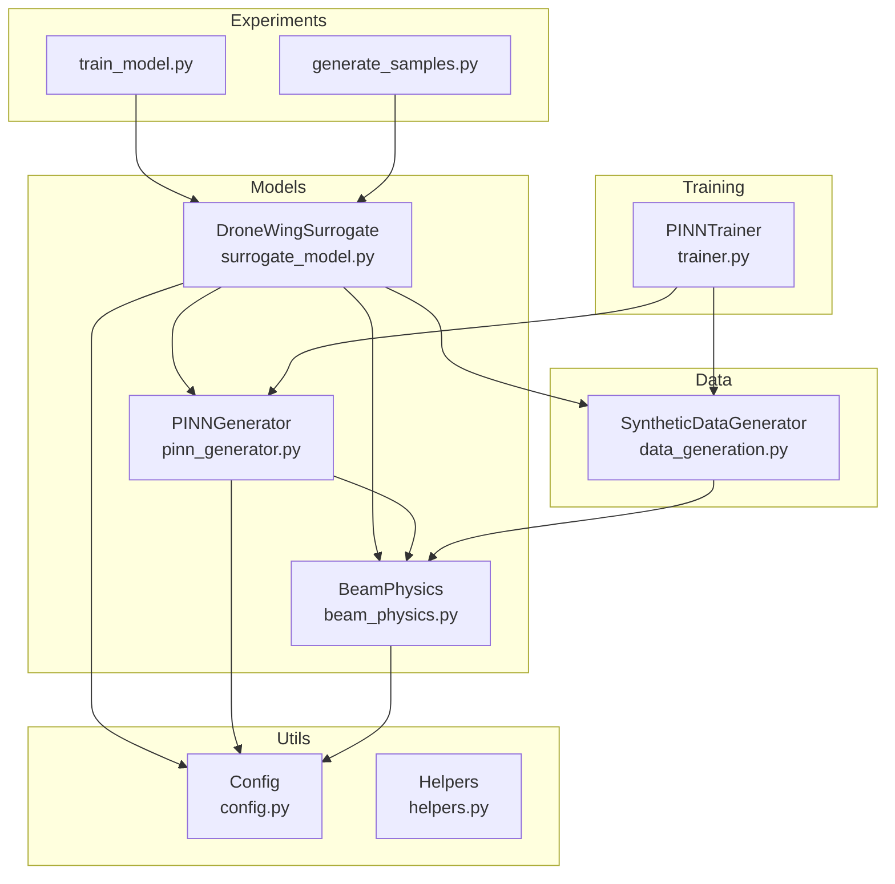
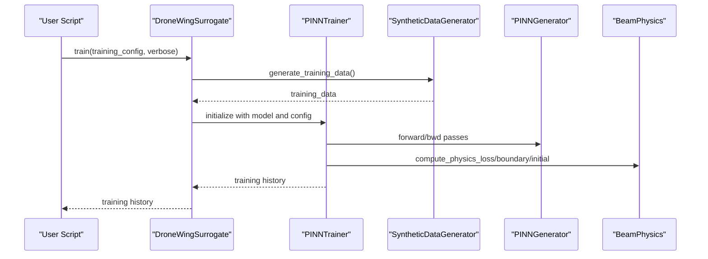
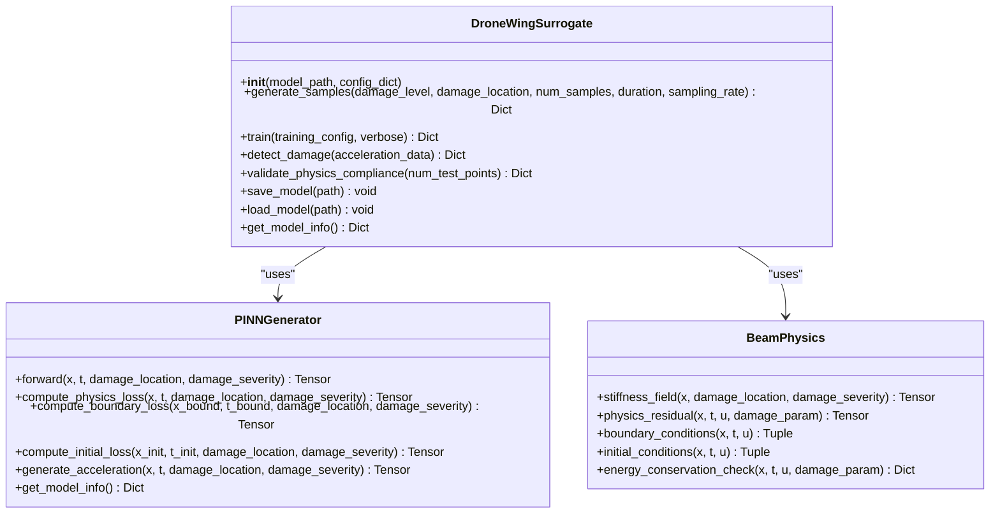
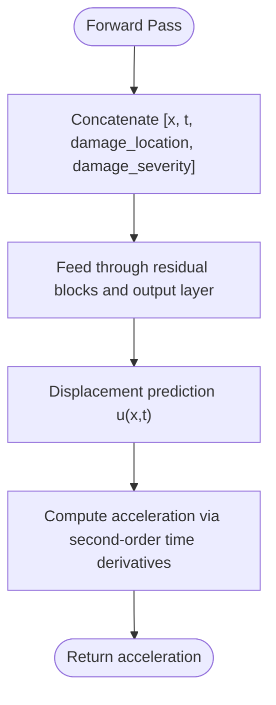
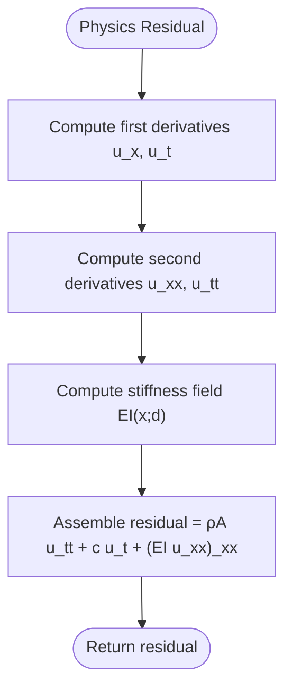
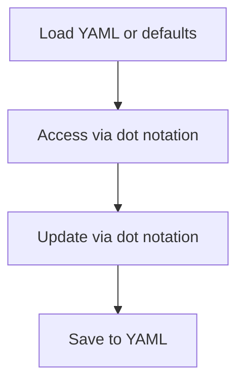
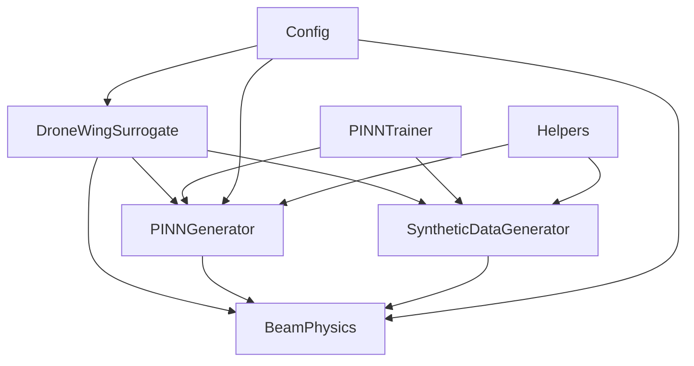

# API Reference

<cite>
**Referenced Files in This Document**
- [surrogate_model.py](file://gen-shm/src/models/surrogate_model.py)
- [pinn_generator.py](file://gen-shm/src/models/pinn_generator.py)
- [beam_physics.py](file://gen-shm/src/models/beam_physics.py)
- [config.py](file://gen-shm/src/utils/config.py)
- [trainer.py](file://gen-shm/src/training/trainer.py)
- [data_generation.py](file://gen-shm/src/data/data_generation.py)
- [helpers.py](file://gen-shm/src/utils/helpers.py)
- [default.yaml](file://gen-shm/configs/default.yaml)
- [README.md](file://gen-shm/README.md)
- [train_model.py](file://gen-shm/experiments/train_model.py)
- [generate_samples.py](file://gen-shm/experiments/generate_samples.py)
</cite>

## Table of Contents
1. [Introduction](#introduction)
2. [Project Structure](#project-structure)
3. [Core Components](#core-components)
4. [Architecture Overview](#architecture-overview)
5. [Detailed Component Analysis](#detailed-component-analysis)
6. [Dependency Analysis](#dependency-analysis)
7. [Performance Considerations](#performance-considerations)
8. [Troubleshooting Guide](#troubleshooting-guide)
9. [Conclusion](#conclusion)
10. [Appendices](#appendices)

## Introduction
This document provides a comprehensive API reference for the SciML Gen-SHM framework. It focuses on the public interfaces of the main classes and modules, including constructor parameters, training and inference APIs, configuration options, and error handling. It also documents configuration management, parameter validation, inheritance mechanisms, and dynamic updates. Practical examples, error scenarios, integration patterns, performance characteristics, and optimization recommendations are included for production deployments.

## Project Structure
The Gen-SHM project is organized into modular packages:
- models: Core machine learning and physics components (SurrogateModel, PINNGenerator, BeamPhysics)
- training: Training framework and loss functions
- data: Synthetic data generation utilities
- utils: Configuration, helpers, and logging
- experiments: End-to-end scripts for training and sample generation
- configs: Default configuration YAML

**Diagram sources**
- [surrogate_model.py:15-272](file://gen-shm/src/models/surrogate_model.py#L15-L272)
- [pinn_generator.py:39-288](file://gen-shm/src/models/pinn_generator.py#L39-L288)
- [beam_physics.py:12-259](file://gen-shm/src/models/beam_physics.py#L12-L259)
- [trainer.py:55-339](file://gen-shm/src/training/trainer.py#L55-L339)
- [data_generation.py:14-384](file://gen-shm/src/data/data_generation.py#L14-L384)
- [config.py:10-123](file://gen-shm/src/utils/config.py#L10-L123)
- [train_model.py:77-162](file://gen-shm/experiments/train_model.py#L77-L162)
- [generate_samples.py:73-213](file://gen-shm/experiments/generate_samples.py#L73-L213)

**Section sources**
- [README.md:41-55](file://gen-shm/README.md#L41-L55)

## Core Components
This section documents the primary public APIs for the main components.

### DroneWingSurrogate (SurrogateModel)
Public interface for high-level surrogate operations including training, sample generation, physics validation, and model persistence.

- Constructor
  - Parameters:
    - model_path: Optional[str] — Path to pretrained model weights
    - config_dict: Optional[dict] — Configuration dictionary; uses global config if None
  - Behavior:
    - Initializes internal components: PINNGenerator, BeamPhysics, SyntheticDataGenerator
    - Sets device and training status
    - Loads pretrained weights if provided

- Methods
  - generate_samples(damage_level, damage_location=0.5, num_samples=100, duration=1.0, sampling_rate=1000) -> Dict[str, np.ndarray]
    - Validates training status and input ranges
    - Generates synthetic acceleration data for specified damage scenario
    - Returns dictionary with acceleration, time, sensor_positions, and damage_info
    - Exceptions: RuntimeError if not trained; ValueError for invalid damage parameters
  - train(training_config=None, verbose=True) -> Dict[str, List[float]]
    - Merges training_config into default config if provided
    - Generates synthetic training data and trains via PINNTrainer
    - Returns training history dictionary
  - detect_damage(acceleration_data: np.ndarray) -> Dict[str, float]
    - Placeholder returning fixed structure; intended for future classification
  - validate_physics_compliance(num_test_points=1000) -> Dict[str, float]
    - Tests physics residual across damage scenarios
    - Requires trained model
  - save_model(path: str) -> None
    - Saves model state dict, config, and training status
  - load_model(path: str) -> None
    - Loads model weights and updates training status; optionally restores config
  - get_model_info() -> Dict[str, any]
    - Returns structured model and configuration information

- Exceptions
  - Raises RuntimeError when attempting operations before training
  - Raises ValueError for invalid parameter ranges

- Example usage
  - Training and sample generation: [train_model.py:106-118](file://gen-shm/experiments/train_model.py#L106-L118), [surrogate_model.py:131-166](file://gen-shm/src/models/surrogate_model.py#L131-L166)
  - Loading and generating samples: [generate_samples.py:86-104](file://gen-shm/experiments/generate_samples.py#L86-L104)

**Section sources**
- [surrogate_model.py:26-272](file://gen-shm/src/models/surrogate_model.py#L26-L272)
- [train_model.py:106-118](file://gen-shm/experiments/train_model.py#L106-L118)
- [generate_samples.py:86-104](file://gen-shm/experiments/generate_samples.py#L86-L104)

### PINNGenerator (PINNGenerator)
Neural network generator embedding physics constraints through automatic differentiation.

- Constructor
  - Parameters:
    - config_dict: Optional[dict] — Uses global config if None
  - Behavior:
    - Initializes physics engine, selects activation, builds network, initializes weights, moves to device

- Methods
  - forward(x, t, damage_location, damage_severity) -> torch.Tensor
    - Concatenates inputs and computes displacement prediction
  - predict_displacement(x, t, damage_location, damage_severity) -> torch.Tensor
    - Convenience wrapper around forward
  - compute_physics_loss(x, t, damage_location, damage_severity) -> torch.Tensor
    - Computes physics residual using BeamPhysics and mean squared residual
  - compute_boundary_loss(x_bound, t_bound, damage_location, damage_severity) -> torch.Tensor
    - Enforces boundary conditions via BeamPhysics
  - compute_initial_loss(x_init, t_init, damage_location, damage_severity) -> torch.Tensor
    - Enforces initial conditions via BeamPhysics
  - generate_acceleration(x, t, damage_location, damage_severity) -> torch.Tensor
    - Computes acceleration as second time derivative of displacement
  - get_model_info() -> Dict[str, Any]
    - Returns model metadata including parameters and device

- Exceptions
  - Raises ValueError for unsupported activation function

- Example usage
  - Training loss composition: [pinn_generator.py:295-352](file://gen-shm/src/models/pinn_generator.py#L295-L352)
  - Physics residual computation: [beam_physics.py:107-150](file://gen-shm/src/models/beam_physics.py#L107-L150)

**Section sources**
- [pinn_generator.py:39-288](file://gen-shm/src/models/pinn_generator.py#L39-L288)
- [beam_physics.py:107-150](file://gen-shm/src/models/beam_physics.py#L107-L150)

### BeamPhysics
Physics engine implementing Euler-Bernoulli beam theory with spatially varying stiffness and boundary/initial conditions.

- Constructor
  - Parameters:
    - config_dict: Optional[dict] — Uses global config if None
  - Behavior:
    - Loads physical constants and damage parameters from config

- Methods
  - stiffness_field(x, damage_location, damage_severity) -> torch.Tensor
    - Computes spatially varying stiffness EI(x;d)
  - physics_residual(x, t, u, damage_param) -> torch.Tensor
    - Computes residual of the beam equation using automatic differentiation
  - boundary_conditions(x, t, u) -> Tuple[torch.Tensor, torch.Tensor]
    - Returns residuals for left and right boundaries based on configured types
  - initial_conditions(x, t, u) -> Tuple[torch.Tensor, torch.Tensor]
    - Returns initial displacement and velocity residuals
  - energy_conservation_check(x, t, u, damage_param) -> dict
    - Computes kinetic and strain energy densities and totals

- Exceptions
  - Raises ValueError for unknown damage function type

- Example usage
  - Physics residual and boundary enforcement: [beam_physics.py:107-200](file://gen-shm/src/models/beam_physics.py#L107-L200)

**Section sources**
- [beam_physics.py:12-259](file://gen-shm/src/models/beam_physics.py#L12-L259)

### Configuration Management (Config)
Global configuration manager supporting YAML loading, defaults, dot-notation access, updates, and saving.

- Constructor
  - Parameters:
    - config_path: Optional[str] — Path to YAML configuration file
  - Behavior:
    - Loads YAML if present; otherwise returns default configuration

- Methods
  - get(key, default=None) -> Any
    - Retrieves nested configuration using dot notation
  - update(key, value) -> None
    - Updates nested configuration using dot notation
  - save(path) -> None
    - Writes configuration to YAML file

- Defaults
  - Physics, damage, model, training, data, and paths sections with sensible defaults
  - Advanced and visualization sections for training enhancements

- Example usage
  - Default configuration: [default.yaml:1-100](file://gen-shm/configs/default.yaml#L1-L100)
  - Programmatic updates: [train_model.py:96-99](file://gen-shm/experiments/train_model.py#L96-L99)

**Section sources**
- [config.py:10-123](file://gen-shm/src/utils/config.py#L10-L123)
- [default.yaml:1-100](file://gen-shm/configs/default.yaml#L1-L100)
- [train_model.py:96-99](file://gen-shm/experiments/train_model.py#L96-L99)

## Architecture Overview
The system integrates a physics-informed neural network (PINN) with synthetic data generation and training orchestration.

**Diagram sources**
- [surrogate_model.py:131-166](file://gen-shm/src/models/surrogate_model.py#L131-L166)
- [trainer.py:207-297](file://gen-shm/src/training/trainer.py#L207-L297)
- [data_generation.py:211-263](file://gen-shm/src/data/data_generation.py#L211-L263)
- [pinn_generator.py:155-239](file://gen-shm/src/models/pinn_generator.py#L155-L239)
- [beam_physics.py:107-200](file://gen-shm/src/models/beam_physics.py#L107-L200)

## Detailed Component Analysis

### DroneWingSurrogate API
- Constructor
  - model_path: Optional[str] — Pretrained model path
  - config_dict: Optional[dict] — Overrides global config
- Methods
  - generate_samples: Validates inputs, constructs time/sensor grids, iterates samples, and returns structured dictionary
  - train: Merges training_config, generates data, initializes trainer, and returns history
  - detect_damage: Placeholder returning fixed structure
  - validate_physics_compliance: Tests residual across scenarios
  - save_model/load_model: Persist and restore model state and config
  - get_model_info: Returns structured model metadata

**Diagram sources**
- [surrogate_model.py:26-272](file://gen-shm/src/models/surrogate_model.py#L26-L272)
- [pinn_generator.py:39-288](file://gen-shm/src/models/pinn_generator.py#L39-L288)
- [beam_physics.py:12-259](file://gen-shm/src/models/beam_physics.py#L12-L259)

**Section sources**
- [surrogate_model.py:26-272](file://gen-shm/src/models/surrogate_model.py#L26-L272)

### PINNGenerator API
- Constructor
  - config_dict: Optional[dict] — Uses global config if None
- Methods
  - forward/predict_displacement: Prediction API
  - compute_physics_loss: Physics-informed residual loss
  - compute_boundary_loss/compute_initial_loss: Boundary and initial condition enforcement
  - generate_acceleration: Acceleration computation via second-order time derivatives
  - get_model_info: Model metadata

**Diagram sources**
- [pinn_generator.py:117-137](file://gen-shm/src/models/pinn_generator.py#L117-L137)
- [pinn_generator.py:241-272](file://gen-shm/src/models/pinn_generator.py#L241-L272)

**Section sources**
- [pinn_generator.py:39-288](file://gen-shm/src/models/pinn_generator.py#L39-L288)

### BeamPhysics API
- Constructor
  - config_dict: Optional[dict] — Uses global config if None
- Methods
  - stiffness_field: Computes spatially varying stiffness based on damage function
  - physics_residual: Assembles residual using automatic differentiation
  - boundary_conditions: Enforces configured boundary types
  - initial_conditions: Enforces initial displacement and velocity
  - energy_conservation_check: Computes energy densities and totals

**Diagram sources**
- [beam_physics.py:107-150](file://gen-shm/src/models/beam_physics.py#L107-L150)

**Section sources**
- [beam_physics.py:12-259](file://gen-shm/src/models/beam_physics.py#L12-L259)

### Configuration API
- Constructor
  - config_path: Optional[str] — Path to YAML configuration file
- Methods
  - get(key, default=None): Dot-notation access
  - update(key, value): Dot-notation update
  - save(path): Write YAML

- Defaults
  - Comprehensive sections for physics, damage, model, training, data, paths, advanced, visualization, and logging

**Diagram sources**
- [config.py:17-123](file://gen-shm/src/utils/config.py#L17-L123)
- [default.yaml:1-100](file://gen-shm/configs/default.yaml#L1-L100)

**Section sources**
- [config.py:10-123](file://gen-shm/src/utils/config.py#L10-L123)
- [default.yaml:1-100](file://gen-shm/configs/default.yaml#L1-L100)

## Dependency Analysis
Key dependencies and relationships:
- DroneWingSurrogate depends on PINNGenerator, BeamPhysics, and SyntheticDataGenerator
- PINNGenerator depends on BeamPhysics and configuration
- SyntheticDataGenerator depends on configuration and analytical solutions
- Training pipeline orchestrates PINNTrainer, data loaders, and loss functions
- Utilities provide device selection, seeding, and numerical differentiation

**Diagram sources**
- [surrogate_model.py:38-40](file://gen-shm/src/models/surrogate_model.py#L38-L40)
- [pinn_generator.py:57-85](file://gen-shm/src/models/pinn_generator.py#L57-L85)
- [beam_physics.py:33-56](file://gen-shm/src/models/beam_physics.py#L33-L56)
- [trainer.py:67-82](file://gen-shm/src/training/trainer.py#L67-L82)
- [data_generation.py:25-28](file://gen-shm/src/data/data_generation.py#L25-L28)
- [config.py:15-15](file://gen-shm/src/utils/config.py#L15-L15)
- [helpers.py:21-23](file://gen-shm/src/utils/helpers.py#L21-L23)

**Section sources**
- [surrogate_model.py:38-40](file://gen-shm/src/models/surrogate_model.py#L38-L40)
- [pinn_generator.py:57-85](file://gen-shm/src/models/pinn_generator.py#L57-L85)
- [beam_physics.py:33-56](file://gen-shm/src/models/beam_physics.py#L33-L56)
- [trainer.py:67-82](file://gen-shm/src/training/trainer.py#L67-L82)
- [data_generation.py:25-28](file://gen-shm/src/data/data_generation.py#L25-L28)
- [config.py:15-15](file://gen-shm/src/utils/config.py#L15-L15)
- [helpers.py:21-23](file://gen-shm/src/utils/helpers.py#L21-L23)

## Performance Considerations
- Device selection: Automatic CUDA/CPU detection via helpers; ensure deterministic behavior for reproducibility
- Memory usage patterns:
  - Training batches: Controlled by batch_size in configuration; gradient clipping prevents exploding gradients
  - Data generation: Meshgrids and stacked tensors; consider reducing spatial/temporal points for constrained environments
- Optimization recommendations:
  - Use cosine annealing or plateau reduction for learning rate scheduling
  - Adjust loss weights to balance data fidelity, physics, and boundary enforcement
  - Enable early stopping to prevent overfitting
  - Use residual blocks and layer normalization for stable training
- Production deployment:
  - Prefer CPU for edge devices; ensure deterministic seeding for reproducibility
  - Monitor training history and validation metrics to tune hyperparameters

[No sources needed since this section provides general guidance]

## Troubleshooting Guide
Common errors and resolutions:
- Model not trained before generation/validation:
  - Symptom: RuntimeError indicating model must be trained
  - Resolution: Call train() before generate_samples() or validate_physics_compliance()
- Invalid damage parameters:
  - Symptom: ValueError for damage_level or damage_location out of range
  - Resolution: Ensure values are within [0.0, 1.0]
- Unsupported activation function:
  - Symptom: ValueError for activation name
  - Resolution: Choose among supported activations in configuration
- Unknown damage function:
  - Symptom: ValueError for damage function type
  - Resolution: Use supported types in configuration
- Configuration updates:
  - Symptom: Changes not taking effect
  - Resolution: Use Config.update() with dot notation and save() to persist

**Section sources**
- [surrogate_model.py:71-79](file://gen-shm/src/models/surrogate_model.py#L71-L79)
- [surrogate_model.py:202-203](file://gen-shm/src/models/surrogate_model.py#L202-L203)
- [pinn_generator.py:76-77](file://gen-shm/src/models/pinn_generator.py#L76-L77)
- [beam_physics.py:78-79](file://gen-shm/src/models/beam_physics.py#L78-L79)
- [config.py:106-119](file://gen-shm/src/utils/config.py#L106-L119)

## Conclusion
The Gen-SHM framework provides a robust, physics-informed surrogate modeling system with clear public APIs for training, inference, and validation. The configuration system enables flexible customization, while the training pipeline offers adaptive weighting and scheduling. The documented APIs, exceptions, and examples facilitate reliable integration and production deployment.

[No sources needed since this section summarizes without analyzing specific files]

## Appendices

### API Examples and Integration Patterns
- Training workflow
  - Initialize surrogate, configure epochs, train, save model, and generate validation samples
  - See: [train_model.py:106-153](file://gen-shm/experiments/train_model.py#L106-L153)
- Sample generation
  - Load trained model, validate training status, generate samples, and save outputs
  - See: [generate_samples.py:86-140](file://gen-shm/experiments/generate_samples.py#L86-L140)
- Configuration updates
  - Override training epochs and save configuration
  - See: [train_model.py:96-104](file://gen-shm/experiments/train_model.py#L96-L104)

**Section sources**
- [train_model.py:77-162](file://gen-shm/experiments/train_model.py#L77-L162)
- [generate_samples.py:73-213](file://gen-shm/experiments/generate_samples.py#L73-L213)

### Version Compatibility, Deprecations, and Migration
- Version compatibility
  - Framework targets modern Python and PyTorch ecosystem; ensure compatible versions for CUDA support
- Deprecations
  - No explicit deprecations observed in the referenced files
- Migration guidelines
  - Replace direct config modifications with Config.update() for dynamic updates
  - Use dot notation consistently for nested keys
  - Prefer trained models for inference; handle RuntimeError gracefully

[No sources needed since this section provides general guidance]