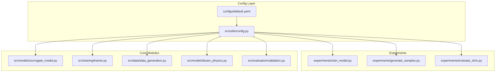
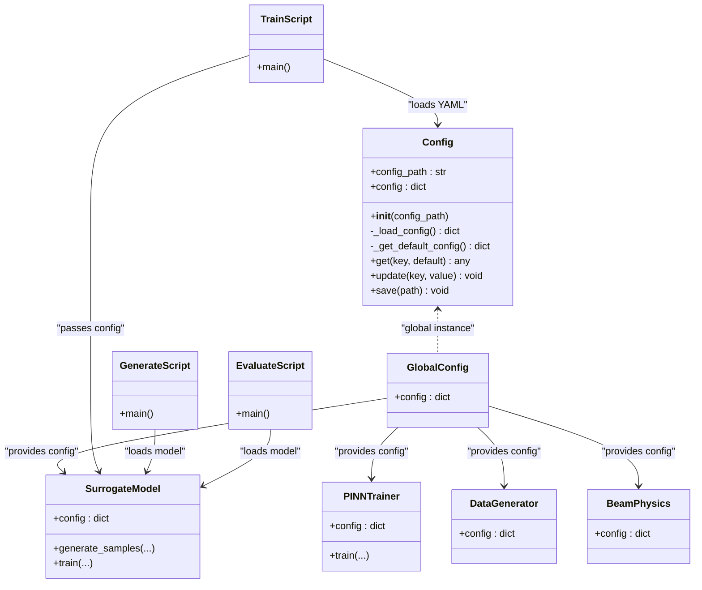
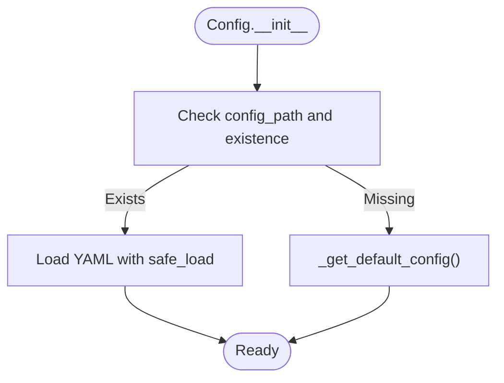
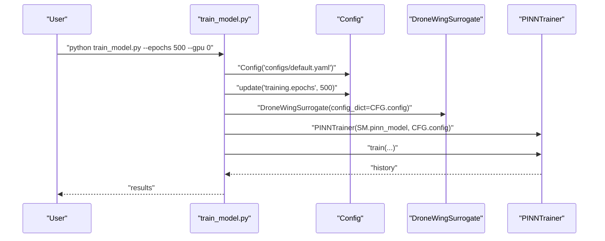
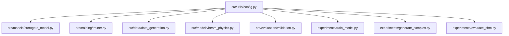

# Configuration Management

<cite>
**Referenced Files in This Document**
- [config.py](file://gen-shm/src/utils/config.py)
- [default.yaml](file://gen-shm/configs/default.yaml)
- [train_model.py](file://gen-shm/experiments/train_model.py)
- [generate_samples.py](file://gen-shm/experiments/generate_samples.py)
- [evaluate_shm.py](file://gen-shm/experiments/evaluate_shm.py)
- [surrogate_model.py](file://gen-shm/src/models/surrogate_model.py)
- [trainer.py](file://gen-shm/src/training/trainer.py)
- [data_generation.py](file://gen-shm/src/data/data_generation.py)
- [beam_physics.py](file://gen-shm/src/models/beam_physics.py)
- [validation.py](file://gen-shm/src/evaluation/validation.py)
- [GETTING_STARTED.md](file://gen-shm/GETTING_STARTED.md)
- [README.md](file://gen-shm/README.md)
</cite>

## Table of Contents
1. [Introduction](#introduction)
2. [Project Structure](#project-structure)
3. [Core Components](#core-components)
4. [Architecture Overview](#architecture-overview)
5. [Detailed Component Analysis](#detailed-component-analysis)
6. [Dependency Analysis](#dependency-analysis)
7. [Performance Considerations](#performance-considerations)
8. [Troubleshooting Guide](#troubleshooting-guide)
9. [Conclusion](#conclusion)
10. [Appendices](#appendices)

## Introduction
This document explains the configuration management system used by the Gen-SHM project. It focuses on centralized parameter control via a YAML-based configuration, the Python utility that loads, validates, and exposes parameters, and the default configuration structure. It also covers how configuration parameters influence system behavior (model complexity, training duration, output quality), advanced features like parameter ranges and dynamic updates, and practical examples for environment-specific settings and parameter overrides.

## Project Structure
The configuration system spans a small set of files:
- A YAML configuration file defines default parameters.
- A Python utility loads the YAML and exposes a simple API for parameter access and updates.
- Experiment scripts and core modules consume configuration parameters to drive behavior.

**Diagram sources**
- [default.yaml:1-100](file://gen-shm/configs/default.yaml#L1-L100)
- [config.py:10-123](file://gen-shm/src/utils/config.py#L10-L123)
- [train_model.py:26-165](file://gen-shm/experiments/train_model.py#L26-L165)
- [generate_samples.py:26-216](file://gen-shm/experiments/generate_samples.py#L26-L216)
- [evaluate_shm.py:29-319](file://gen-shm/experiments/evaluate_shm.py#L29-L319)
- [surrogate_model.py:15-337](file://gen-shm/src/models/surrogate_model.py#L15-L337)
- [trainer.py:55-392](file://gen-shm/src/training/trainer.py#L55-L392)
- [data_generation.py:14-384](file://gen-shm/src/data/data_generation.py#L14-L384)
- [beam_physics.py:12-300](file://gen-shm/src/models/beam_physics.py#L12-L300)
- [validation.py:16-376](file://gen-shm/src/evaluation/validation.py#L16-L376)

**Section sources**
- [default.yaml:1-100](file://gen-shm/configs/default.yaml#L1-L100)
- [config.py:10-123](file://gen-shm/src/utils/config.py#L10-L123)

## Core Components
- Config loader: Loads YAML configuration or falls back to built-in defaults, supports dot-notation access and updates, and can save the current configuration.
- Default YAML: Defines all configurable parameters grouped by domains (physics, damage, model, training, data, paths, advanced, visualization, logging).
- Consumers: Experiment scripts and core modules read configuration parameters to control behavior.

Key responsibilities:
- Centralized parameter control: All modules access a single source of truth.
- Environment-specific overrides: Command-line arguments override configuration values.
- Dynamic updates: Runtime updates are supported via the update method.

**Section sources**
- [config.py:10-123](file://gen-shm/src/utils/config.py#L10-L123)
- [default.yaml:1-100](file://gen-shm/configs/default.yaml#L1-L100)

## Architecture Overview
The configuration architecture is a thin wrapper around YAML with a simple API. It integrates with experiments and core modules through a global instance and explicit config passing.

**Diagram sources**
- [config.py:10-123](file://gen-shm/src/utils/config.py#L10-L123)
- [surrogate_model.py:26-46](file://gen-shm/src/models/surrogate_model.py#L26-L46)
- [trainer.py:67-75](file://gen-shm/src/training/trainer.py#L67-L75)
- [data_generation.py:25-28](file://gen-shm/src/data/data_generation.py#L25-L28)
- [beam_physics.py:26-35](file://gen-shm/src/models/beam_physics.py#L26-L35)
- [train_model.py:93-108](file://gen-shm/experiments/train_model.py#L93-L108)
- [generate_samples.py:87-88](file://gen-shm/experiments/generate_samples.py#L87-L88)
- [evaluate_shm.py:126-127](file://gen-shm/experiments/evaluate_shm.py#L126-L127)

## Detailed Component Analysis

### Configuration Loading and Validation
- YAML loading: If a config path is provided and exists, it is loaded; otherwise, defaults are used.
- Dot-notation access: Nested parameters are accessed using dot-separated keys.
- Updates: Values can be updated dynamically using dot notation; missing intermediate keys are created automatically.
- Saving: The current configuration can be persisted to a file.

**Diagram sources**
- [config.py:13-23](file://gen-shm/src/utils/config.py#L13-L23)

**Section sources**
- [config.py:10-123](file://gen-shm/src/utils/config.py#L10-L123)

### Default YAML Structure
The default configuration organizes parameters into logical groups:

- Physics parameters: beam geometry, material properties, damping, and boundary conditions.
- Damage parameters: severity bounds, location range, and damage function type.
- Model architecture: input/output dimensions, hidden layers, width, activation, dropout.
- Training parameters: epochs, batch size, learning rate, optimizer, LR scheduler, loss weights, and collocation point counts.
- Data generation: spatial/temporal points, sensor locations, noise level, and frequency range.
- Paths: directories for data, checkpoints, logs, and results.
- Advanced: multi-scale training, adaptive weighting, regularization, gradient clipping, numerical tolerance.
- Visualization: toggles and styles for plots.
- Logging: level, format, and output destinations.

Examples of parameter usage across modules:
- Training uses epochs, batch size, optimizer, scheduler, and loss weights.
- Data generation uses sensor locations, noise level, frequency range, and point counts.
- Physics modeling uses beam length, width, height, Young’s modulus, density, damping, and boundary conditions.
- Evaluation uses sensor locations and beam length for validation.

**Section sources**
- [default.yaml:4-100](file://gen-shm/configs/default.yaml#L4-L100)
- [surrogate_model.py:48-129](file://gen-shm/src/models/surrogate_model.py#L48-L129)
- [trainer.py:207-297](file://gen-shm/src/training/trainer.py#L207-L297)
- [data_generation.py:134-182](file://gen-shm/src/data/data_generation.py#L134-L182)
- [beam_physics.py:12-56](file://gen-shm/src/models/beam_physics.py#L12-L56)
- [validation.py:34-78](file://gen-shm/src/evaluation/validation.py#L34-L78)

### Parameter Overrides and Environment-Specific Settings
- Command-line overrides: Experiments accept CLI arguments that override configuration values at runtime.
- Example: Training script accepts an epochs argument that overrides the configured number of training epochs.
- Practical usage: Users can run training with different epochs or GPUs without editing YAML.

**Diagram sources**
- [train_model.py:26-165](file://gen-shm/experiments/train_model.py#L26-L165)
- [config.py:106-114](file://gen-shm/src/utils/config.py#L106-L114)
- [surrogate_model.py:131-166](file://gen-shm/src/models/surrogate_model.py#L131-L166)
- [trainer.py:207-297](file://gen-shm/src/training/trainer.py#L207-L297)

**Section sources**
- [train_model.py:26-165](file://gen-shm/experiments/train_model.py#L26-L165)

### Relationship Between Parameters and System Behavior
- Model complexity: Hidden layers and hidden dimension directly affect model capacity and training cost.
- Training duration: Epochs control total training time; batch size affects memory usage and convergence speed.
- Output quality: Noise level influences data realism; loss weights balance data fidelity vs. physics compliance.
- Physics compliance: Boundary conditions and material properties define the governing equations; damage function type affects stiffness modeling.
- Data generation: Sensor locations and frequency range determine measurement coverage and spectral content.

Practical impacts:
- Increasing epochs improves compliance and accuracy but increases training time.
- Higher loss weights for physics improve adherence to governing equations.
- Larger batch sizes can improve stability but increase memory usage.
- Adjusting sensor locations changes the spatial resolution of generated data.

**Section sources**
- [default.yaml:25-86](file://gen-shm/configs/default.yaml#L25-L86)
- [surrogate_model.py:131-166](file://gen-shm/src/models/surrogate_model.py#L131-L166)
- [trainer.py:92-125](file://gen-shm/src/training/trainer.py#L92-L125)
- [data_generation.py:134-182](file://gen-shm/src/data/data_generation.py#L134-L182)
- [beam_physics.py:12-56](file://gen-shm/src/models/beam_physics.py#L12-L56)

### Advanced Configuration Features
- Parameter ranges: Damage severity and location ranges constrain feasible scenarios.
- Conditional settings: Boundary conditions and optimizer selection depend on configuration values.
- Dynamic updates: Runtime updates enable adapting training behavior without restarting.
- Multi-scale and adaptive training: Advanced options support progressive refinement and dynamic loss weighting.

Examples:
- Damage function type switches between Gaussian and step functions.
- Optimizer and scheduler selection based on configuration values.
- Adaptive loss weighting adjusts relative importance of data, physics, and boundary losses.

**Section sources**
- [default.yaml:18-86](file://gen-shm/configs/default.yaml#L18-L86)
- [beam_physics.py:58-79](file://gen-shm/src/models/beam_physics.py#L58-L79)
- [trainer.py:92-125](file://gen-shm/src/training/trainer.py#L92-L125)
- [trainer.py:261-267](file://gen-shm/src/training/trainer.py#L261-L267)

### Configuration Validation, Error Handling, and Debugging
- Validation: Consumers validate inputs (e.g., damage level and location ranges) before proceeding.
- Error handling: Exceptions are logged with context; experiments catch and log failures.
- Debugging techniques:
  - Save the effective configuration after overrides for reproducibility.
  - Use verbose flags to inspect training progress and loss breakdowns.
  - Validate physics compliance post-training to catch configuration-induced issues.

Practical tips:
- Reduce batch size or epochs if encountering out-of-memory errors.
- Increase physics loss weight or epochs if physics compliance is poor.
- Verify boundary conditions and material properties align with intended beam behavior.

**Section sources**
- [surrogate_model.py:75-79](file://gen-shm/src/models/surrogate_model.py#L75-L79)
- [train_model.py:159-161](file://gen-shm/experiments/train_model.py#L159-L161)
- [GETTING_STARTED.md:212-226](file://gen-shm/GETTING_STARTED.md#L212-L226)

## Dependency Analysis
Configuration dependencies are straightforward: modules depend on the configuration object for runtime behavior. There are no circular dependencies; the configuration is a passive data container.

**Diagram sources**
- [config.py:10-123](file://gen-shm/src/utils/config.py#L10-L123)
- [surrogate_model.py:10-40](file://gen-shm/src/models/surrogate_model.py#L10-L40)
- [trainer.py:14-18](file://gen-shm/src/training/trainer.py#L14-L18)
- [data_generation.py:9-11](file://gen-shm/src/data/data_generation.py#L9-L11)
- [beam_physics.py:8-9](file://gen-shm/src/models/beam_physics.py#L8-L9)
- [validation.py:11-13](file://gen-shm/src/evaluation/validation.py#L11-L13)
- [train_model.py:21-23](file://gen-shm/experiments/train_model.py#L21-L23)
- [generate_samples.py:21-23](file://gen-shm/experiments/generate_samples.py#L21-L23)
- [evaluate_shm.py:22-26](file://gen-shm/experiments/evaluate_shm.py#L22-L26)

**Section sources**
- [config.py:10-123](file://gen-shm/src/utils/config.py#L10-L123)
- [surrogate_model.py:10-40](file://gen-shm/src/models/surrogate_model.py#L10-L40)
- [trainer.py:14-18](file://gen-shm/src/training/trainer.py#L14-L18)
- [data_generation.py:9-11](file://gen-shm/src/data/data_generation.py#L9-L11)
- [beam_physics.py:8-9](file://gen-shm/src/models/beam_physics.py#L8-L9)
- [validation.py:11-13](file://gen-shm/src/evaluation/validation.py#L11-L13)
- [train_model.py:21-23](file://gen-shm/experiments/train_model.py#L21-L23)
- [generate_samples.py:21-23](file://gen-shm/experiments/generate_samples.py#L21-L23)
- [evaluate_shm.py:22-26](file://gen-shm/experiments/evaluate_shm.py#L22-L26)

## Performance Considerations
- Training cost scales with epochs, batch size, and model depth/width.
- Physics compliance improves with higher physics point counts and stronger physics loss weights.
- Memory usage depends on batch size and model complexity; adjust accordingly.
- Use GPU when available and reduce batch size if memory-limited.

[No sources needed since this section provides general guidance]

## Troubleshooting Guide
Common issues and resolutions:
- CUDA out of memory: Reduce batch size in configuration.
- Slow training: Decrease physics points or model depth; reduce epochs for testing.
- Poor physics compliance: Increase physics loss weight or training epochs.
- Import errors: Ensure working directory and dependencies are correct.

Diagnostic steps:
- Inspect saved configuration after overrides.
- Enable verbose training output to monitor loss breakdowns.
- Run physics validation to quantify residual violations.

**Section sources**
- [GETTING_STARTED.md:212-226](file://gen-shm/GETTING_STARTED.md#L212-L226)
- [train_model.py:96-104](file://gen-shm/experiments/train_model.py#L96-L104)
- [validation.py:266-281](file://gen-shm/src/evaluation/validation.py#L266-L281)

## Conclusion
The configuration management system provides a clean, centralized mechanism for controlling all aspects of the Gen-SHM pipeline. YAML-based defaults ensure reproducibility, while dot-notation access and runtime updates enable flexible experimentation. Parameter choices directly impact model complexity, training duration, and output quality, and the system offers robust validation and debugging hooks to maintain reliability.

[No sources needed since this section summarizes without analyzing specific files]

## Appendices

### Appendix A: Default YAML Parameter Reference
- Physics: beam_length, beam_width, beam_height, young_modulus, density, damping_coefficient, boundary_conditions.left/right
- Damage: min_severity, max_severity, location_range, damage_function
- Model: input_dim, output_dim, hidden_layers, hidden_dim, activation, dropout_rate
- Training: epochs, batch_size, learning_rate, optimizer, lr_scheduler, loss_weights.data/physics/boundary, physics_points, boundary_points, initial_condition_points
- Data: spatial_points, temporal_points, sensor_locations, noise_level, frequency_range
- Paths: data_dir, checkpoints_dir, logs_dir, results_dir
- Advanced: multiscale_training, scale_epochs, max_scales, adaptive_weighting, weight_adaptation_rate, l2_regularization, physics_regularization, gradient_clipping, numerical_tolerance
- Visualization: plot_training_progress, save_plots, plot_frequency, style
- Logging: level, format, save_to_file, console_output

**Section sources**
- [default.yaml:4-100](file://gen-shm/configs/default.yaml#L4-L100)

### Appendix B: Practical Configuration Modification Examples
- Override training epochs from CLI: pass an epochs argument to the training script to override the configured value.
- Switch optimizer: change the optimizer setting in the YAML or via runtime update to use AdamW or SGD.
- Adjust sensor locations: modify sensor_locations to focus on specific wing regions.
- Tune loss weights: increase physics or boundary weights to improve compliance.
- Environment-specific settings: set GPU ID via CLI and adjust batch size accordingly.

**Section sources**
- [train_model.py:26-47](file://gen-shm/experiments/train_model.py#L26-L47)
- [trainer.py:92-104](file://gen-shm/src/training/trainer.py#L92-L104)
- [data_generation.py:46-49](file://gen-shm/src/data/data_generation.py#L46-L49)