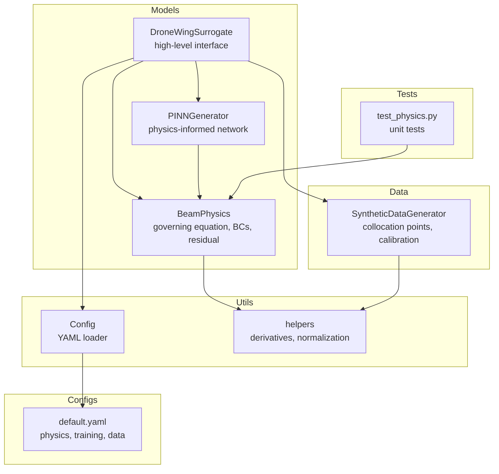
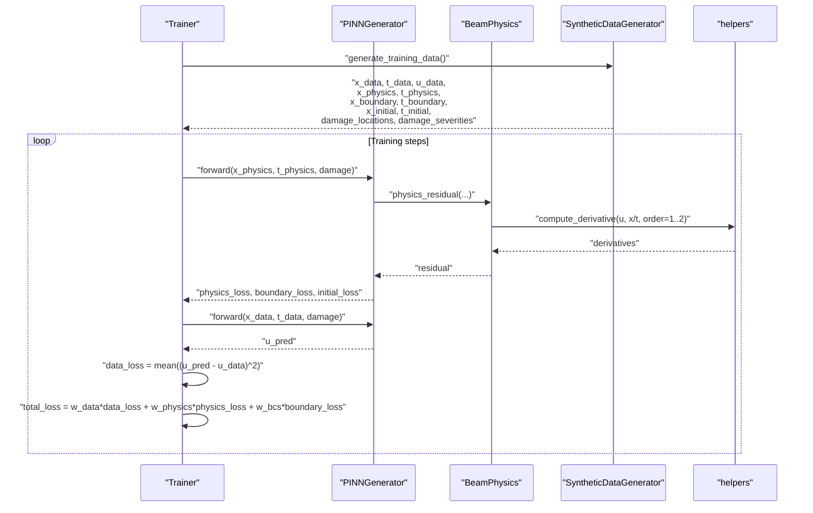
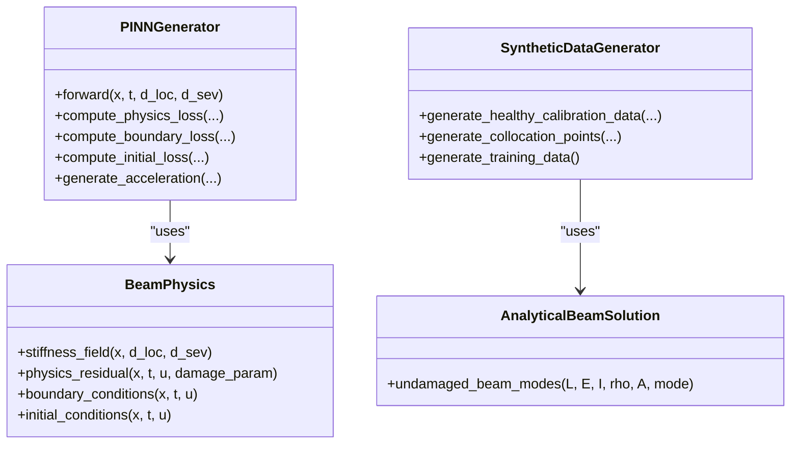
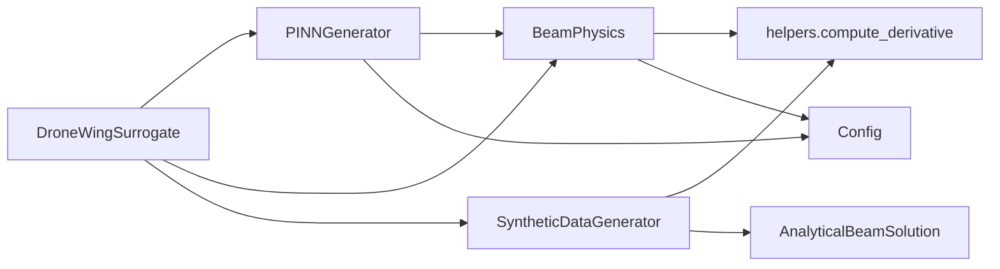

# Beam Physics Engine

<cite>
**Referenced Files in This Document**
- [beam_physics.py](file://gen-shm/src/models/beam_physics.py)
- [pinn_generator.py](file://gen-shm/src/models/pinn_generator.py)
- [surrogate_model.py](file://gen-shm/src/models/surrogate_model.py)
- [data_generation.py](file://gen-shm/src/data/data_generation.py)
- [helpers.py](file://gen-shm/src/utils/helpers.py)
- [config.py](file://gen-shm/src/utils/config.py)
- [default.yaml](file://gen-shm/configs/default.yaml)
- [test_physics.py](file://gen-shm/tests/test_physics.py)
- [README.md](file://gen-shm/README.md)
- [GETTING_STARTED.md](file://gen-shm/GETTING_STARTED.md)
</cite>

## Table of Contents
1. [Introduction](#introduction)
2. [Project Structure](#project-structure)
3. [Core Components](#core-components)
4. [Architecture Overview](#architecture-overview)
5. [Detailed Component Analysis](#detailed-component-analysis)
6. [Dependency Analysis](#dependency-analysis)
7. [Performance Considerations](#performance-considerations)
8. [Troubleshooting Guide](#troubleshooting-guide)
9. [Conclusion](#conclusion)
10. [Appendices](#appendices)

## Introduction
This document explains the Beam Physics Engine that implements Euler-Bernoulli beam theory for drone wing structural dynamics. It covers the governing partial differential equation, boundary conditions for cantilever beams, stiffness modeling with localized damage, residual computation, and integration with a physics-informed neural network (PINN) generator. It also documents numerical discretization, stability considerations, and computational efficiency optimizations.

## Project Structure
The Beam Physics Engine resides in the models package and integrates with the surrogate model, data generation utilities, and configuration system.

**Diagram sources**
- [beam_physics.py:12-300](file://gen-shm/src/models/beam_physics.py#L12-L300)
- [pinn_generator.py:39-352](file://gen-shm/src/models/pinn_generator.py#L39-L352)
- [surrogate_model.py:15-337](file://gen-shm/src/models/surrogate_model.py#L15-L337)
- [data_generation.py:14-384](file://gen-shm/src/data/data_generation.py#L14-L384)
- [helpers.py:76-104](file://gen-shm/src/utils/helpers.py#L76-L104)
- [config.py:10-123](file://gen-shm/src/utils/config.py#L10-L123)
- [default.yaml:1-100](file://gen-shm/configs/default.yaml#L1-L100)
- [test_physics.py:18-99](file://gen-shm/tests/test_physics.py#L18-L99)

**Section sources**
- [README.md:41-56](file://gen-shm/README.md#L41-L56)
- [GETTING_STARTED.md:104-122](file://gen-shm/GETTING_STARTED.md#L104-L122)

## Core Components
- BeamPhysics: Implements Euler-Bernoulli beam equation with spatially varying stiffness, boundary conditions, and residual computation.
- PINNGenerator: Physics-informed neural network that predicts displacement u(x,t) and computes physics losses.
- AnalyticalBeamSolution: Provides analytical natural frequency and mode shapes for validation.
- SyntheticDataGenerator: Generates healthy calibration data, collocation points, and validation datasets.
- Config and helpers: Provide configuration loading, normalization, and automatic differentiation utilities.

**Section sources**
- [beam_physics.py:12-300](file://gen-shm/src/models/beam_physics.py#L12-L300)
- [pinn_generator.py:39-352](file://gen-shm/src/models/pinn_generator.py#L39-L352)
- [surrogate_model.py:15-337](file://gen-shm/src/models/surrogate_model.py#L15-L337)
- [data_generation.py:14-384](file://gen-shm/src/data/data_generation.py#L14-L384)
- [config.py:10-123](file://gen-shm/src/utils/config.py#L10-L123)
- [helpers.py:76-104](file://gen-shm/src/utils/helpers.py#L76-L104)

## Architecture Overview
The system embeds the Euler-Bernoulli beam equation into a PINN. During training, the network minimizes:
- Data fidelity loss (matching sparse sensor measurements)
- Physics loss (enforcing the PDE residual)
- Boundary and initial condition losses

**Diagram sources**
- [pinn_generator.py:155-240](file://gen-shm/src/models/pinn_generator.py#L155-L240)
- [beam_physics.py:107-150](file://gen-shm/src/models/beam_physics.py#L107-L150)
- [data_generation.py:211-263](file://gen-shm/src/data/data_generation.py#L211-L263)
- [helpers.py:76-104](file://gen-shm/src/utils/helpers.py#L76-L104)

## Detailed Component Analysis

### Euler-Bernoulli Beam Equation and Boundary Conditions
The governing equation is:
$$
\rho A \frac{\partial^2 u}{\partial t^2} + c \frac{\partial u}{\partial t} + \frac{\partial^2}{\partial x^2}\left[E I(x; d) \frac{\partial^2 u}{\partial x^2}\right] = 0
$$
Where:
- $ u(x,t) $: transverse displacement
- $ \rho A $: mass per unit length
- $ c $: damping coefficient
- $ E I(x; d) $: spatially varying flexural rigidity with damage parameter $ d $

Boundary conditions for a cantilever beam (root clamped, tip free) are enforced:
- Left (root): $ u(0,t) = 0 $, $ \frac{\partial u}{\partial x}(0,t) = 0 $
- Right (tip): $ \frac{\partial^2 u}{\partial x^2}(L,t) = 0 $, $ \frac{\partial^3 u}{\partial x^3}(L,t) = 0 $

Initial conditions:
- $ u(x, 0) = 0 $
- $ \frac{\partial u}{\partial t}(x, 0) = 0 $

Implementation details:
- Stiffness field $ E I(x; d) $ is computed as $ E I_0 (1 - d \cdot \varphi(x)) $, where $ \varphi(x) $ is a damage influence function (gaussian or step).
- Physics residual and boundary/initial condition residuals are computed using automatic differentiation.

**Section sources**
- [beam_physics.py:16-24](file://gen-shm/src/models/beam_physics.py#L16-L24)
- [beam_physics.py:58-106](file://gen-shm/src/models/beam_physics.py#L58-L106)
- [beam_physics.py:107-200](file://gen-shm/src/models/beam_physics.py#L107-L200)
- [beam_physics.py:202-223](file://gen-shm/src/models/beam_physics.py#L202-L223)

### Damage Modeling and Stiffness Reduction
- Damage location and severity are parameters $ d_{loc} \in [0,1] $ and $ d_{sev} \in [0,1] $.
- Two damage influence functions are supported:
  - Gaussian: $ \varphi_{gauss}(x) = \sigma \exp\left(-\frac{(x - d_{loc})^2}{2 \sigma^2}\right) $
  - Step: $ \varphi_{step}(x) = \text{mask}(|x - d_{loc}| \leq \text{width}/2) $
- Stiffness reduction is $ E I(x; d) = E I_0 (1 - d_{sev} \cdot \varphi(x)) $.

Validation:
- Tests confirm stiffness is constant for healthy ($ d_{sev}=0 $) and reduced at the damage location for damaged cases.

**Section sources**
- [beam_physics.py:58-106](file://gen-shm/src/models/beam_physics.py#L58-L106)
- [test_physics.py:26-47](file://gen-shm/tests/test_physics.py#L26-L47)

### Physics Residual Computation
The residual is assembled from second-order time and space derivatives:
- $ u_t, u_{tt} $: time derivatives
- $ u_x, u_{xx} $: spatial derivatives
- $ E I(x; d) u_{xx} $, then $ \frac{\partial^2}{\partial x^2}(E I(x; d) u_{xx}) $
- Final residual: $ \rho A u_{tt} + c u_t + \frac{\partial^2}{\partial x^2}(E I(x; d) u_{xx}) $

Automatic differentiation is used to compute derivatives without explicit finite-difference stencils.

**Section sources**
- [beam_physics.py:107-150](file://gen-shm/src/models/beam_physics.py#L107-L150)
- [helpers.py:76-104](file://gen-shm/src/utils/helpers.py#L76-L104)

### Boundary and Initial Condition Enforcement
- Boundary residuals are computed at left and right ends using selected BC types.
- Initial condition residuals enforce zero displacement and velocity at $ t=0 $.

**Section sources**
- [beam_physics.py:152-200](file://gen-shm/src/models/beam_physics.py#L152-L200)
- [beam_physics.py:202-223](file://gen-shm/src/models/beam_physics.py#L202-L223)

### Analytical Validation
Analytical solutions for undamaged cantilever beams provide:
- Natural frequency $ \omega_n $ and mode shape $ \phi(x) $ for validation and synthetic data generation.

**Section sources**
- [beam_physics.py:261-300](file://gen-shm/src/models/beam_physics.py#L261-L300)
- [data_generation.py:72-114](file://gen-shm/src/data/data_generation.py#L72-L114)

### PINN Integration and Loss Composition
- PINNGenerator takes inputs $ [x, t, d_{loc}, d_{sev}] $ and outputs displacement $ u(x,t) $.
- Physics loss is mean squared residual over collocation points.
- Boundary and initial losses are mean squared residuals at boundary and initial points.
- Composite loss combines data fidelity, physics, and boundary terms with configurable weights.

**Diagram sources**
- [beam_physics.py:12-300](file://gen-shm/src/models/beam_physics.py#L12-L300)
- [pinn_generator.py:39-352](file://gen-shm/src/models/pinn_generator.py#L39-L352)
- [data_generation.py:14-384](file://gen-shm/src/data/data_generation.py#L14-L384)

**Section sources**
- [pinn_generator.py:155-240](file://gen-shm/src/models/pinn_generator.py#L155-L240)
- [pinn_generator.py:290-352](file://gen-shm/src/models/pinn_generator.py#L290-L352)
- [data_generation.py:211-263](file://gen-shm/src/data/data_generation.py#L211-L263)

### Frequency Domain Transformations and Mode Shape Analysis
- Synthetic calibration data uses a chirp excitation and modal response based on analytical mode shapes.
- Acceleration data is generated from displacement predictions and can be analyzed in the frequency domain for dominant modes.
- Mode shape validation compares predicted displacement profiles against analytical $ \phi(x) $.

**Section sources**
- [data_generation.py:63-132](file://gen-shm/src/data/data_generation.py#L63-L132)
- [beam_physics.py:267-300](file://gen-shm/src/models/beam_physics.py#L267-L300)

## Dependency Analysis
Key dependencies and relationships:
- BeamPhysics depends on helpers for automatic differentiation and on configuration for material and geometric properties.
- PINNGenerator composes BeamPhysics to compute physics losses and uses AnalyticalBeamSolution for validation.
- SyntheticDataGenerator produces training data and collocation points used by the PINN.

**Diagram sources**
- [beam_physics.py:5-10](file://gen-shm/src/models/beam_physics.py#L5-L10)
- [pinn_generator.py:9-11](file://gen-shm/src/models/pinn_generator.py#L9-L11)
- [data_generation.py:8-11](file://gen-shm/src/data/data_generation.py#L8-L11)
- [surrogate_model.py:8-12](file://gen-shm/src/models/surrogate_model.py#L8-L12)

**Section sources**
- [beam_physics.py:5-10](file://gen-shm/src/models/beam_physics.py#L5-L10)
- [pinn_generator.py:9-11](file://gen-shm/src/models/pinn_generator.py#L9-L11)
- [data_generation.py:8-11](file://gen-shm/src/data/data_generation.py#L8-L11)
- [surrogate_model.py:8-12](file://gen-shm/src/models/surrogate_model.py#L8-L12)

## Performance Considerations
- Automatic differentiation avoids finite-difference errors and simplifies implementation.
- LayerNorm and residual blocks improve gradient flow in the PINN.
- Efficient derivative computation via stacked autograd calls reduces overhead.
- Collocation point counts and loss weights balance training speed and accuracy.
- Device selection (CPU/GPU) impacts runtime; ensure tensors are moved appropriately.

[No sources needed since this section provides general guidance]

## Troubleshooting Guide
Common issues and remedies:
- CUDA out of memory: reduce batch size or number of collocation points.
- Slow training: decrease physics_points or hidden_layers; adjust learning rate scheduler.
- Poor physics compliance: increase physics loss weight or training epochs.
- Import errors: ensure working directory and dependencies are installed.

**Section sources**
- [GETTING_STARTED.md:212-227](file://gen-shm/GETTING_STARTED.md#L212-L227)

## Conclusion
The Beam Physics Engine integrates Euler-Bernoulli beam theory with a PINN to generate synthetic vibration data for drone wing structural health monitoring. It models stiffness reduction due to damage, enforces boundary and initial conditions, and validates against analytical solutions. The modular design enables efficient training and deployment for zero-shot damage detection scenarios.

[No sources needed since this section summarizes without analyzing specific files]

## Appendices

### Mathematical Foundation and Governing Equation
- Partial differential equation: see governing equation in BeamPhysics docstring.
- Boundary conditions: clamped-free beam conditions implemented.
- Initial conditions: zero displacement and velocity at t=0.

**Section sources**
- [beam_physics.py:16-24](file://gen-shm/src/models/beam_physics.py#L16-L24)
- [beam_physics.py:165-199](file://gen-shm/src/models/beam_physics.py#L165-L199)
- [beam_physics.py:215-221](file://gen-shm/src/models/beam_physics.py#L215-L221)

### Numerical Discretization and Stability
- Automatic differentiation replaces finite differences; ensures accuracy and stability.
- Collocation points are sampled uniformly across space-time domains.
- Gradient clipping and numerical tolerance in advanced training options help stabilize training.

**Section sources**
- [helpers.py:76-104](file://gen-shm/src/utils/helpers.py#L76-L104)
- [data_generation.py:134-182](file://gen-shm/src/data/data_generation.py#L134-L182)
- [default.yaml:84-87](file://gen-shm/configs/default.yaml#L84-L87)

### Computational Efficiency Optimizations
- Residual blocks and LayerNorm improve convergence.
- Normalization utilities support consistent scaling.
- Counting parameters helps monitor model complexity.

**Section sources**
- [pinn_generator.py:21-37](file://gen-shm/src/models/pinn_generator.py#L21-L37)
- [pinn_generator.py:87-107](file://gen-shm/src/models/pinn_generator.py#L87-L107)
- [helpers.py:106-139](file://gen-shm/src/utils/helpers.py#L106-L139)
- [helpers.py:159-161](file://gen-shm/src/utils/helpers.py#L159-L161)

### Configuration Reference
- Physics: beam_length, beam_width, beam_height, young_modulus, density, damping_coefficient, boundary_conditions.
- Damage: min/max severity, location_range, damage_function type.
- Model: input_dim, output_dim, hidden_layers, hidden_dim, activation, dropout_rate.
- Training: epochs, batch_size, learning_rate, optimizer, lr_scheduler, loss_weights, physics_points, boundary_points, initial_condition_points.
- Data: spatial_points, temporal_points, sensor_locations, noise_level, frequency_range.
- Advanced: multiscale_training, adaptive_weighting, l2_regularization, physics_regularization, gradient_clipping, numerical_tolerance.
- Visualization and logging settings.

**Section sources**
- [default.yaml:4-100](file://gen-shm/configs/default.yaml#L4-L100)
- [config.py:25-93](file://gen-shm/src/utils/config.py#L25-L93)

### Example Workflows
- Generate synthetic samples with a given damage scenario.
- Train the surrogate model and validate physics compliance.
- Analyze frequency content and mode shapes for validation.

**Section sources**
- [surrogate_model.py:48-129](file://gen-shm/src/models/surrogate_model.py#L48-L129)
- [surrogate_model.py:131-166](file://gen-shm/src/models/surrogate_model.py#L131-L166)
- [surrogate_model.py:192-234](file://gen-shm/src/models/surrogate_model.py#L192-L234)
- [data_generation.py:63-132](file://gen-shm/src/data/data_generation.py#L63-L132)