# Component Interactions and Data Flow

<cite>
**Referenced Files in This Document**
- [README.md](file://README.md)
- [default.yaml](file://configs/default.yaml)
- [surrogate_model.py](file://src/models/surrogate_model.py)
- [pinn_generator.py](file://src/models/pinn_generator.py)
- [beam_physics.py](file://src/models/beam_physics.py)
- [trainer.py](file://src/training/trainer.py)
- [loss_functions.py](file://src/training/loss_functions.py)
- [data_generation.py](file://src/data/data_generation.py)
- [validation.py](file://src/evaluation/validation.py)
- [config.py](file://src/utils/config.py)
- [helpers.py](file://src/utils/helpers.py)
- [train_model.py](file://experiments/train_model.py)
- [generate_samples.py](file://experiments/generate_samples.py)
- [evaluate_shm.py](file://experiments/evaluate_shm.py)
</cite>

## Table of Contents
1. [Introduction](#introduction)
2. [Project Structure](#project-structure)
3. [Core Components](#core-components)
4. [Architecture Overview](#architecture-overview)
5. [Detailed Component Analysis](#detailed-component-analysis)
6. [Dependency Analysis](#dependency-analysis)
7. [Performance Considerations](#performance-considerations)
8. [Troubleshooting Guide](#troubleshooting-guide)
9. [Conclusion](#conclusion)
10. [Appendices](#appendices)

## Introduction
This document explains the interaction patterns and data flow among core components of the Gen-SHM system, focusing on how DroneWingSurrogate orchestrates PINN generation, physics computation, and data synthesis. It details the transformation pipeline from configuration objects through tensor operations to model outputs, and documents the feedback loops in training where physics residuals influence network weights. Validation cycles ensuring physics compliance are described, along with shared configuration, device placement, and memory management strategies. Finally, sequence diagrams illustrate typical workflows: training data generation, model optimization, and sample synthesis.

## Project Structure
The repository is organized into modules supporting a physics-informed generative surrogate for drone wing structural health monitoring. Key areas include models (PINN generator and beam physics), data generation, training (trainer and loss functions), evaluation (validation and metrics), and utilities (configuration and helpers). Experiment scripts demonstrate end-to-end workflows for training, sample generation, and evaluation.

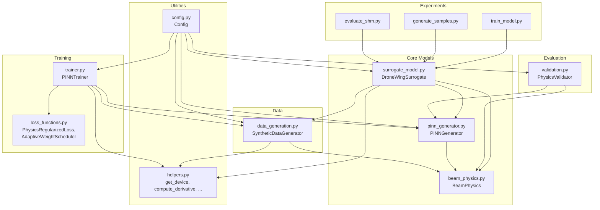

**Diagram sources**
- [train_model.py:1-165](file://experiments/train_model.py#L1-L165)
- [generate_samples.py:1-216](file://experiments/generate_samples.py#L1-L216)
- [evaluate_shm.py:1-319](file://experiments/evaluate_shm.py#L1-L319)
- [surrogate_model.py:1-337](file://src/models/surrogate_model.py#L1-L337)
- [pinn_generator.py:1-352](file://src/models/pinn_generator.py#L1-L352)
- [beam_physics.py:1-300](file://src/models/beam_physics.py#L1-L300)
- [trainer.py:1-392](file://src/training/trainer.py#L1-L392)
- [loss_functions.py:1-167](file://src/training/loss_functions.py#L1-L167)
- [data_generation.py:1-384](file://src/data/data_generation.py#L1-L384)
- [validation.py:1-376](file://src/evaluation/validation.py#L1-L376)
- [config.py:1-123](file://src/utils/config.py#L1-L123)
- [helpers.py:1-161](file://src/utils/helpers.py#L1-L161)

**Section sources**
- [README.md:41-55](file://README.md#L41-L55)
- [default.yaml:1-100](file://configs/default.yaml#L1-L100)

## Core Components
- DroneWingSurrogate: High-level orchestrator providing training, sample generation, and validation workflows. It initializes the PINN, physics engine, and data generator, manages device placement, and exposes APIs for training, inference, and compliance checks.
- PINNGenerator: Physics-informed neural network that predicts displacement u(x,t) conditioned on spatial, temporal, and damage parameters. It computes physics, boundary, and initial losses via automatic differentiation and supports acceleration synthesis.
- BeamPhysics: Implements Euler-Bernoulli beam dynamics with spatially varying stiffness influenced by damage parameters. Provides residual computation, boundary conditions, initial conditions, and energy checks.
- PINNTrainer: Training coordinator integrating data loaders, optimizer, schedulers, adaptive loss weighting, and monitoring. Handles multi-scale training and checkpointing.
- PhysicsRegularizedLoss and AdaptiveWeightScheduler: Composite loss combining data fidelity, physics compliance, and boundary enforcement with dynamic weight adaptation.
- SyntheticDataGenerator: Generates healthy calibration data, collocation points, and damage scenarios; packages training data into PyTorch DataLoader-compatible batches.
- PhysicsValidator: Validates governing equation satisfaction, boundary/initial conditions, energy conservation, and numerical stability.
- Config and helpers: Centralized configuration management and utility functions for device selection, derivative computation, normalization, and parameter counting.

**Section sources**
- [surrogate_model.py:15-272](file://src/models/surrogate_model.py#L15-L272)
- [pinn_generator.py:39-287](file://src/models/pinn_generator.py#L39-L287)
- [beam_physics.py:12-258](file://src/models/beam_physics.py#L12-L258)
- [trainer.py:55-339](file://src/training/trainer.py#L55-L339)
- [loss_functions.py:11-167](file://src/training/loss_functions.py#L11-L167)
- [data_generation.py:14-384](file://src/data/data_generation.py#L14-L384)
- [validation.py:16-354](file://src/evaluation/validation.py#L16-L354)
- [config.py:10-123](file://src/utils/config.py#L10-L123)
- [helpers.py:21-161](file://src/utils/helpers.py#L21-L161)

## Architecture Overview
The system follows a modular, data-driven architecture:
- Configuration drives all components via a centralized Config singleton.
- DroneWingSurrogate composes PINNGenerator, BeamPhysics, and SyntheticDataGenerator.
- Training uses PINNTrainer with PhysicsRegularizedLoss and AdaptiveWeightScheduler.
- Data generation produces tensors consumed by the trainer; validation evaluates model compliance.
- Device placement is unified through helpers to ensure tensors and models reside on the same device.

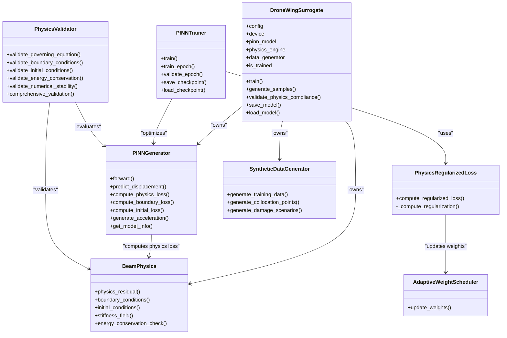

**Diagram sources**
- [surrogate_model.py:15-272](file://src/models/surrogate_model.py#L15-L272)
- [pinn_generator.py:39-287](file://src/models/pinn_generator.py#L39-L287)
- [beam_physics.py:12-258](file://src/models/beam_physics.py#L12-L258)
- [trainer.py:55-339](file://src/training/trainer.py#L55-L339)
- [loss_functions.py:63-167](file://src/training/loss_functions.py#L63-L167)
- [data_generation.py:14-384](file://src/data/data_generation.py#L14-L384)
- [validation.py:16-354](file://src/evaluation/validation.py#L16-L354)

## Detailed Component Analysis

### DroneWingSurrogate Orchestration Pattern
DroneWingSurrogate acts as a facade coordinating:
- Initialization: constructs PINNGenerator, BeamPhysics, and SyntheticDataGenerator using shared configuration and device.
- Training: merges optional training overrides, generates synthetic data, and delegates to PINNTrainer.
- Inference: validates training state and generates acceleration time histories at sensor locations.
- Compliance: evaluates physics residuals across damage scenarios.

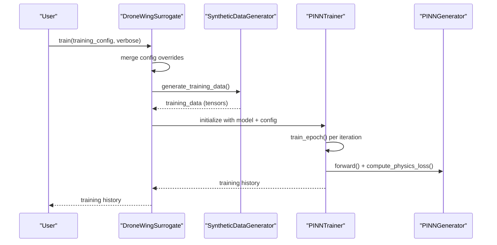

**Diagram sources**
- [surrogate_model.py:131-166](file://src/models/surrogate_model.py#L131-L166)
- [data_generation.py:211-263](file://src/data/data_generation.py#L211-L263)
- [trainer.py:207-297](file://src/training/trainer.py#L207-L297)

**Section sources**
- [surrogate_model.py:26-47](file://src/models/surrogate_model.py#L26-L47)
- [surrogate_model.py:131-166](file://src/models/surrogate_model.py#L131-L166)

### PINN Generation Pipeline
The PINNGenerator transforms inputs [x, t, damage_location, damage_severity] into displacement u(x,t). It computes physics residuals via BeamPhysics using automatic differentiation, and synthesizes acceleration by taking second-order time derivatives.

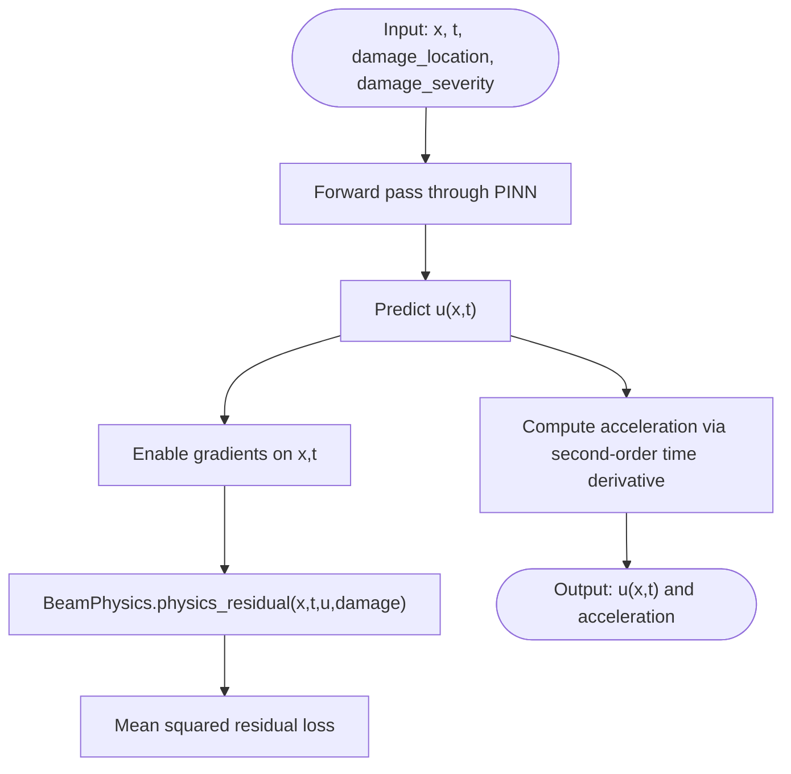

**Diagram sources**
- [pinn_generator.py:117-185](file://src/models/pinn_generator.py#L117-L185)
- [beam_physics.py:107-150](file://src/models/beam_physics.py#L107-L150)

**Section sources**
- [pinn_generator.py:117-273](file://src/models/pinn_generator.py#L117-L273)
- [beam_physics.py:107-150](file://src/models/beam_physics.py#L107-L150)

### Training Feedback Loops and Validation Cycles
Training alternates between data fidelity and physics compliance:
- PhysicsRegularizedLoss combines data loss, physics loss, and boundary loss with configurable weights.
- AdaptiveWeightScheduler dynamically adjusts weights based on recent loss magnitudes to balance contributions.
- Multi-scale training increases resolution gradually to improve convergence.
- Validation cycles periodically assess governing equation satisfaction, boundary/initial conditions, energy conservation, and numerical stability.

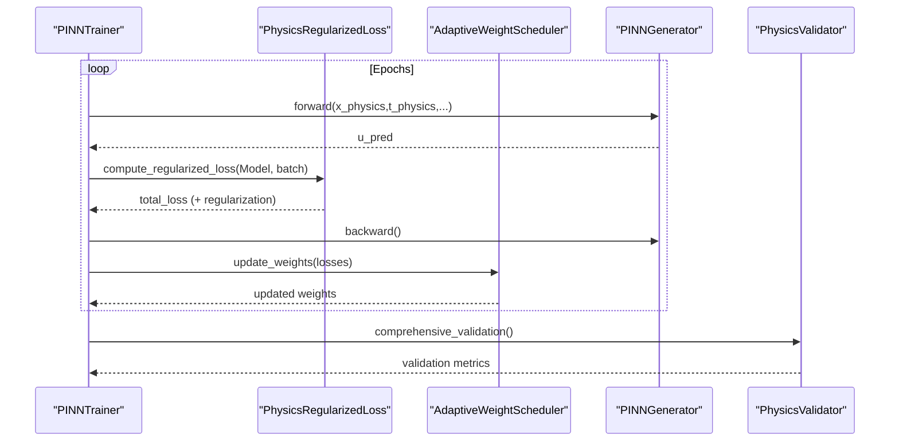

**Diagram sources**
- [trainer.py:127-297](file://src/training/trainer.py#L127-L297)
- [loss_functions.py:63-116](file://src/training/loss_functions.py#L63-L116)
- [loss_functions.py:11-61](file://src/training/loss_functions.py#L11-L61)
- [validation.py:250-281](file://src/evaluation/validation.py#L250-L281)

**Section sources**
- [trainer.py:55-339](file://src/training/trainer.py#L55-L339)
- [loss_functions.py:11-167](file://src/training/loss_functions.py#L11-L167)
- [validation.py:16-354](file://src/evaluation/validation.py#L16-L354)

### Data Generation Workflow
SyntheticDataGenerator creates:
- Healthy calibration data with modal responses and noise.
- Collocation points for physics, boundary, and initial conditions.
- Damage scenarios with randomized locations and severities.

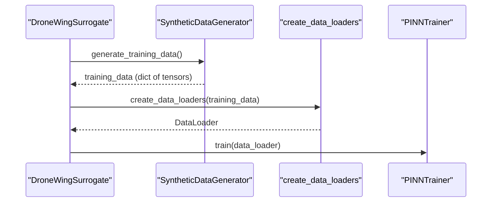

**Diagram sources**
- [surrogate_model.py:151-166](file://src/models/surrogate_model.py#L151-L166)
- [data_generation.py:211-263](file://src/data/data_generation.py#L211-L263)
- [data_generation.py:362-384](file://src/data/data_generation.py#L362-L384)
- [trainer.py:224-237](file://src/training/trainer.py#L224-L237)

**Section sources**
- [data_generation.py:14-384](file://src/data/data_generation.py#L14-L384)

### Sample Synthesis Workflow
After training, DroneWingSurrogate generates acceleration time histories at configured sensor locations for specified damage scenarios.

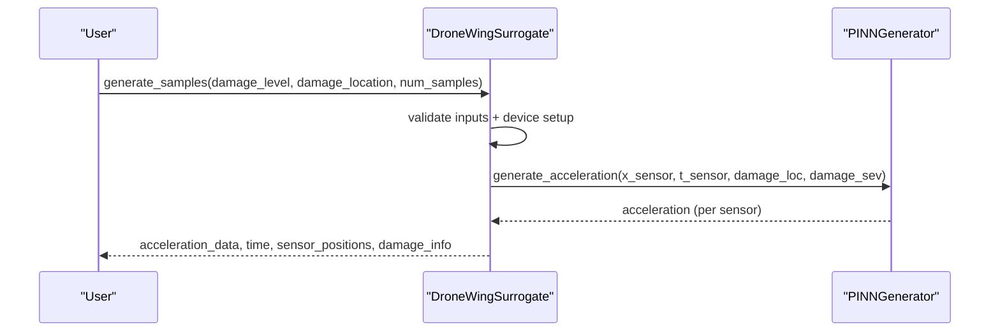

**Diagram sources**
- [surrogate_model.py:48-129](file://src/models/surrogate_model.py#L48-L129)
- [pinn_generator.py:241-272](file://src/models/pinn_generator.py#L241-L272)

**Section sources**
- [surrogate_model.py:48-129](file://src/models/surrogate_model.py#L48-L129)

### Shared Configuration System
Configuration is loaded from YAML and exposed via a Config singleton. It governs physics parameters, damage modeling, model architecture, training hyperparameters, data generation, and paths. Components access configuration through the global instance or via constructor injection.

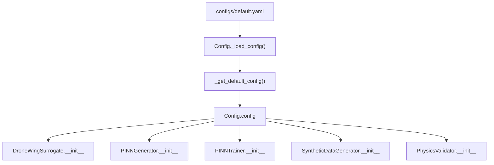

**Diagram sources**
- [default.yaml:1-100](file://configs/default.yaml#L1-L100)
- [config.py:17-120](file://src/utils/config.py#L17-L120)

**Section sources**
- [config.py:10-123](file://src/utils/config.py#L10-L123)
- [default.yaml:1-100](file://configs/default.yaml#L1-L100)

### Device Placement and Memory Management
Device selection is centralized: helpers select CUDA if available, otherwise CPU. All tensors and models are moved to the selected device. Automatic differentiation and gradient clipping are used to manage memory during training. Data loaders handle batching and minimize overhead.

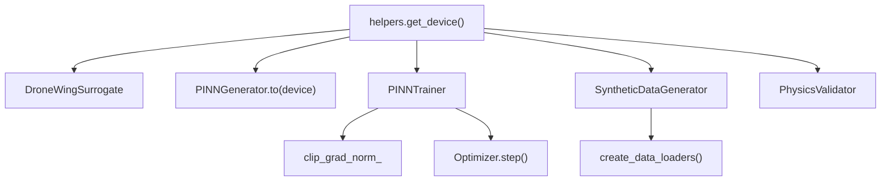

**Diagram sources**
- [helpers.py:21-23](file://src/utils/helpers.py#L21-L23)
- [pinn_generator.py:85](file://src/models/pinn_generator.py#L85)
- [trainer.py:162-166](file://src/training/trainer.py#L162-L166)
- [data_generation.py:362-384](file://src/data/data_generation.py#L362-L384)

**Section sources**
- [helpers.py:21-23](file://src/utils/helpers.py#L21-L23)
- [trainer.py:162-166](file://src/training/trainer.py#L162-L166)
- [data_generation.py:362-384](file://src/data/data_generation.py#L362-L384)

### Error Propagation and Graceful Degradation
- Input validation raises explicit errors for invalid damage parameters or untrained model usage.
- Training monitors support early stopping to prevent overfitting.
- Numerical stability checks catch NaN/infs and bound amplitudes.
- Logging captures failures and progress for diagnostics.

**Section sources**
- [surrogate_model.py:75-79](file://src/models/surrogate_model.py#L75-L79)
- [surrogate_model.py:202-203](file://src/models/surrogate_model.py#L202-L203)
- [validation.py:237-248](file://src/evaluation/validation.py#L237-L248)
- [trainer.py:292-296](file://src/training/trainer.py#L292-L296)

## Dependency Analysis
Key dependencies and coupling:
- DroneWingSurrogate depends on PINNGenerator, BeamPhysics, and SyntheticDataGenerator.
- PINNTrainer depends on PINNGenerator, PhysicsRegularizedLoss, and AdaptiveWeightScheduler.
- SyntheticDataGenerator depends on BeamPhysics and helpers for sampling and meshgrids.
- PhysicsValidator depends on PINNGenerator and BeamPhysics for evaluation.
- All components depend on Config and helpers for configuration and device management.

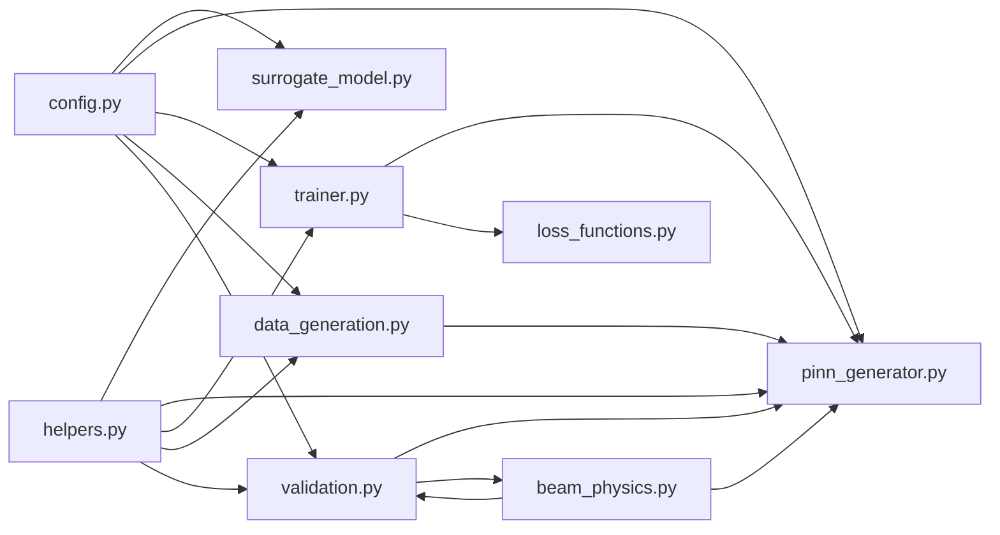

**Diagram sources**
- [surrogate_model.py:10-12](file://src/models/surrogate_model.py#L10-L12)
- [pinn_generator.py:9-11](file://src/models/pinn_generator.py#L9-L11)
- [trainer.py:13-18](file://src/training/trainer.py#L13-L18)
- [data_generation.py:9-11](file://src/data/data_generation.py#L9-L11)
- [validation.py:11-13](file://src/evaluation/validation.py#L11-L13)
- [config.py:10-123](file://src/utils/config.py#L10-L123)
- [helpers.py:1-161](file://src/utils/helpers.py#L1-L161)

**Section sources**
- [surrogate_model.py:10-12](file://src/models/surrogate_model.py#L10-L12)
- [pinn_generator.py:9-11](file://src/models/pinn_generator.py#L9-L11)
- [trainer.py:13-18](file://src/training/trainer.py#L13-L18)
- [data_generation.py:9-11](file://src/data/data_generation.py#L9-L11)
- [validation.py:11-13](file://src/evaluation/validation.py#L11-L13)

## Performance Considerations
- Automatic differentiation and residual computation dominate compute cost; ensure efficient batching and gradient clipping.
- Multi-scale training reduces initial collocation point counts to accelerate convergence.
- Device utilization: leverage CUDA when available; avoid unnecessary host-device transfers.
- Memory: limit batch sizes and use gradient norm clipping; consider mixed precision if extending to larger models.
- Data generation: pre-generate calibration and collocation sets to reduce runtime overhead.

[No sources needed since this section provides general guidance]

## Troubleshooting Guide
Common issues and remedies:
- Training diverges or oscillates: adjust learning rate, enable gradient clipping, and review adaptive weight updates.
- Poor physics compliance: increase physics loss weight, validate boundary/initial conditions, and inspect numerical stability.
- Out-of-memory errors: reduce batch size, use fewer collocation points, or switch to CPU.
- Untrained model errors: call train() before generate_samples() or load_model().
- Configuration mismatches: verify YAML paths and keys; use Config.get() for safe access.

**Section sources**
- [trainer.py:162-166](file://src/training/trainer.py#L162-L166)
- [validation.py:250-281](file://src/evaluation/validation.py#L250-L281)
- [surrogate_model.py:71-73](file://src/models/surrogate_model.py#L71-L73)
- [config.py:95-114](file://src/utils/config.py#L95-L114)

## Conclusion
The Gen-SHM system integrates a physics-informed PINN with synthetic data generation and robust training/validation workflows. DroneWingSurrogate orchestrates this pipeline, ensuring configuration-driven behavior, consistent device placement, and iterative validation. The feedback loops between physics residuals and model weights, combined with multi-scale training and adaptive weighting, yield a compliant and efficient surrogate for drone wing structural health monitoring.

[No sources needed since this section summarizes without analyzing specific files]

## Appendices

### Typical Workflows: Sequence Diagrams

#### Training Data Generation
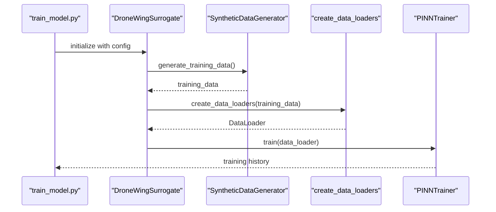

**Diagram sources**
- [train_model.py:106-117](file://experiments/train_model.py#L106-L117)
- [surrogate_model.py:151-166](file://src/models/surrogate_model.py#L151-L166)
- [data_generation.py:211-263](file://src/data/data_generation.py#L211-L263)
- [data_generation.py:362-384](file://src/data/data_generation.py#L362-L384)
- [trainer.py:224-237](file://src/training/trainer.py#L224-L237)

#### Model Optimization
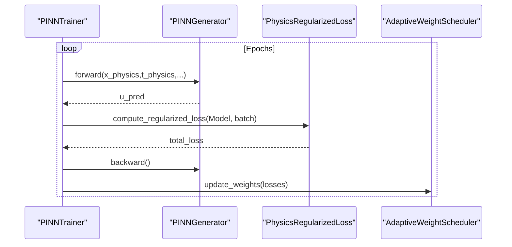

**Diagram sources**
- [trainer.py:127-180](file://src/training/trainer.py#L127-L180)
- [loss_functions.py:73-105](file://src/training/loss_functions.py#L73-L105)
- [loss_functions.py:23-60](file://src/training/loss_functions.py#L23-L60)

#### Sample Synthesis
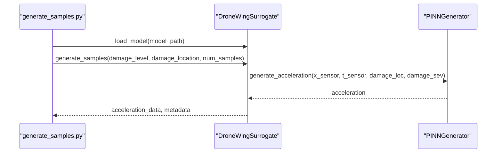

**Diagram sources**
- [generate_samples.py:86-104](file://experiments/generate_samples.py#L86-L104)
- [surrogate_model.py:48-129](file://src/models/surrogate_model.py#L48-L129)
- [pinn_generator.py:241-272](file://src/models/pinn_generator.py#L241-L272)