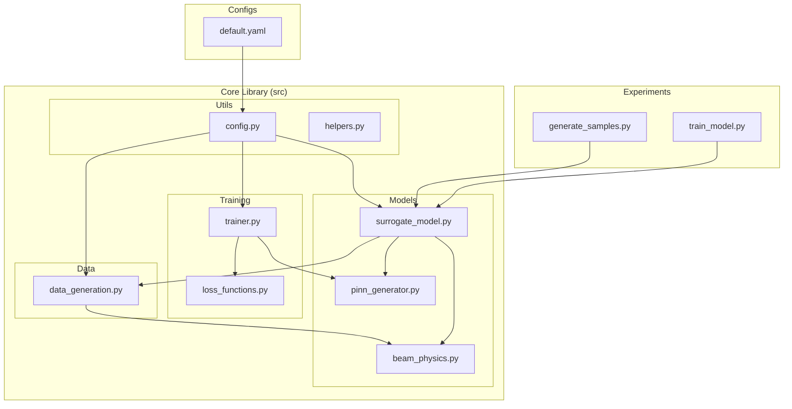
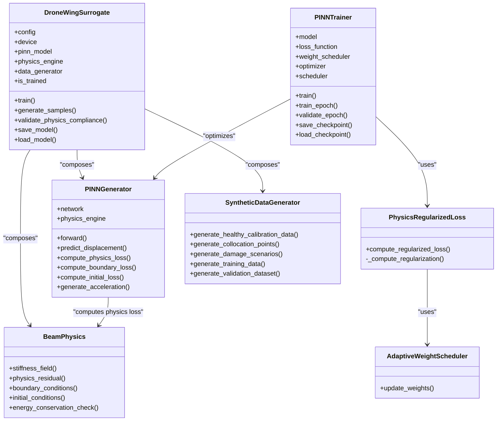
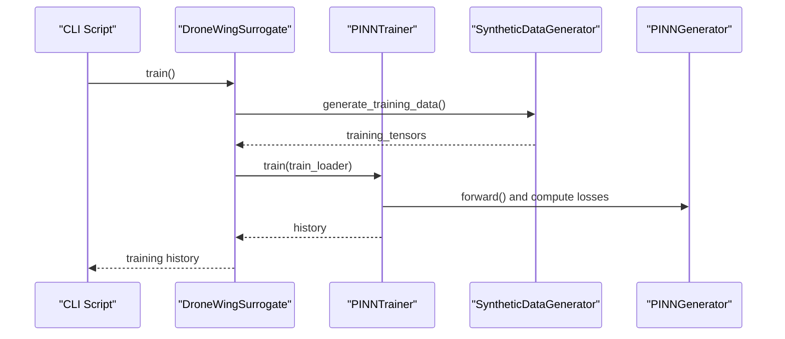
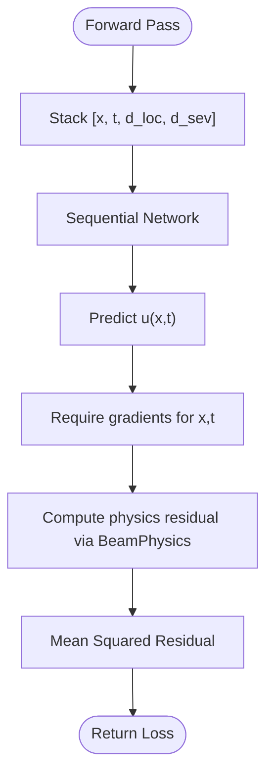
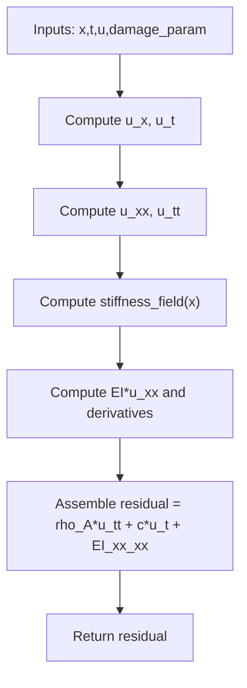
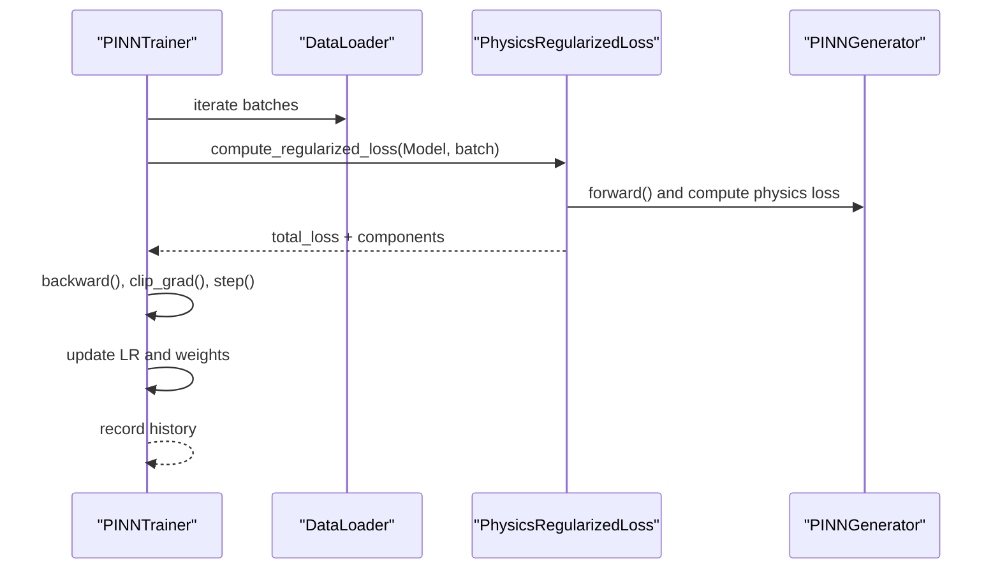
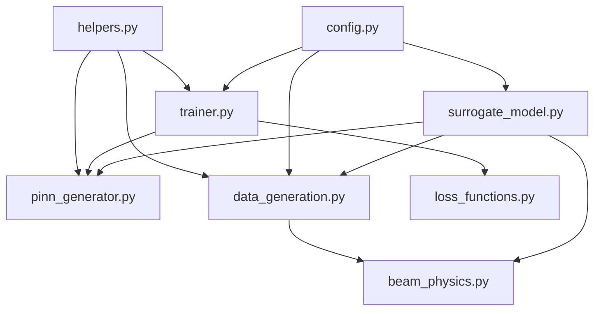
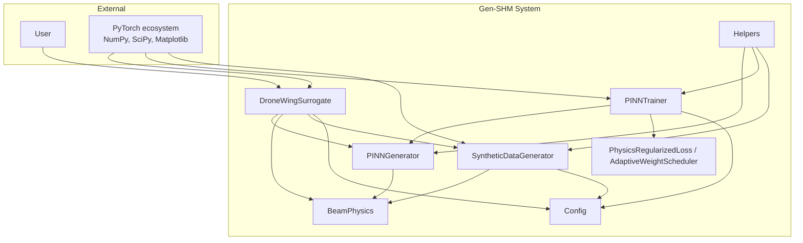

# Core Architecture

<cite>
**Referenced Files in This Document**
- [README.md](file://README.md)
- [GETTING_STARTED.md](file://GETTING_STARTED.md)
- [requirements.txt](file://requirements.txt)
- [default.yaml](file://configs/default.yaml)
- [surrogate_model.py](file://src/models/surrogate_model.py)
- [pinn_generator.py](file://src/models/pinn_generator.py)
- [beam_physics.py](file://src/models/beam_physics.py)
- [trainer.py](file://src/training/trainer.py)
- [loss_functions.py](file://src/training/loss_functions.py)
- [data_generation.py](file://src/data/data_generation.py)
- [config.py](file://src/utils/config.py)
- [helpers.py](file://src/utils/helpers.py)
- [train_model.py](file://experiments/train_model.py)
- [generate_samples.py](file://experiments/generate_samples.py)
</cite>

## Table of Contents
1. [Introduction](#introduction)
2. [Project Structure](#project-structure)
3. [Core Components](#core-components)
4. [Architecture Overview](#architecture-overview)
5. [Detailed Component Analysis](#detailed-component-analysis)
6. [Dependency Analysis](#dependency-analysis)
7. [Performance Considerations](#performance-considerations)
8. [Troubleshooting Guide](#troubleshooting-guide)
9. [Conclusion](#conclusion)
10. [Appendices](#appendices)

## Introduction
This document describes the core architecture of the SciML framework implemented in the repository, focusing on the surrogate model design centered around Physics-Informed Neural Networks (PINNs). It explains the high-level system boundaries between the physics engine, neural network generator, and training framework, and documents component interactions that orchestrate PINN generation and beam physics integration. It also covers technical decisions for GPU acceleration, automatic differentiation, and physics constraint embedding, along with infrastructure requirements, scalability considerations, and deployment topology for research and production environments.

## Project Structure
The project is organized into modular scientific computing components:
- src/models: Neural network architectures and physics engines
- src/data: Synthetic data generation and dataset utilities
- src/training: Training framework, loss functions, and schedulers
- src/utils: Configuration, helpers, and logging
- experiments: Orchestration scripts for training and sample generation
- configs: Default configuration in YAML
- notebooks/tests: Demonstrations and validation

**Diagram sources**
- [train_model.py:1-165](file://experiments/train_model.py#L1-L165)
- [generate_samples.py:1-216](file://experiments/generate_samples.py#L1-L216)
- [surrogate_model.py:1-337](file://src/models/surrogate_model.py#L1-L337)
- [pinn_generator.py:1-352](file://src/models/pinn_generator.py#L1-L352)
- [beam_physics.py:1-300](file://src/models/beam_physics.py#L1-L300)
- [trainer.py:1-392](file://src/training/trainer.py#L1-L392)
- [loss_functions.py:1-167](file://src/training/loss_functions.py#L1-L167)
- [data_generation.py:1-384](file://src/data/data_generation.py#L1-L384)
- [config.py:1-123](file://src/utils/config.py#L1-L123)
- [helpers.py:1-161](file://src/utils/helpers.py#L1-L161)
- [default.yaml:1-100](file://configs/default.yaml#L1-L100)

**Section sources**
- [README.md:41-55](file://README.md#L41-L55)
- [GETTING_STARTED.md:104-122](file://GETTING_STARTED.md#L104-L122)

## Core Components
- Surrogate orchestrator: Provides high-level APIs for training, sample generation, and validation.
- PINN generator: Physics-informed neural network with residual blocks and activation selection.
- Physics engine: Euler-Bernoulli beam with spatially varying stiffness and boundary/initial conditions.
- Training framework: Optimizer, schedulers, adaptive weighting, and checkpoint management.
- Data generation: Synthetic calibration data, collocation points, and dataset utilities.
- Configuration and helpers: Centralized config loading, device selection, and numerical utilities.

Key responsibilities:
- Surrogate orchestrator composes the PINN, physics engine, and data generator, and exposes training and inference APIs.
- PINN embeds physics via automatic differentiation and computes physics, boundary, and initial losses.
- Physics engine defines governing equations and boundary/initial conditions.
- Training framework balances data fidelity and physics compliance with adaptive strategies.
- Data generation synthesizes realistic training data and collocation sets.

**Section sources**
- [surrogate_model.py:15-272](file://src/models/surrogate_model.py#L15-L272)
- [pinn_generator.py:39-288](file://src/models/pinn_generator.py#L39-L288)
- [beam_physics.py:12-224](file://src/models/beam_physics.py#L12-L224)
- [trainer.py:55-339](file://src/training/trainer.py#L55-L339)
- [data_generation.py:14-318](file://src/data/data_generation.py#L14-L318)
- [config.py:10-123](file://src/utils/config.py#L10-L123)
- [helpers.py:21-104](file://src/utils/helpers.py#L21-L104)

## Architecture Overview
The system follows a modular scientific computing architecture:
- Factory pattern: Surrogate orchestrator constructs PINN, physics engine, and data generator instances.
- Strategy pattern: Configurable activation, optimizer, scheduler, and loss weighting strategies.
- Clear boundaries:
  - Physics engine encapsulates beam theory and boundary conditions.
  - Neural network generator encapsulates the PINN architecture and physics loss computation.
  - Training framework encapsulates optimization and adaptive strategies.
  - Data generation encapsulates synthetic data creation and batching.

**Diagram sources**
- [surrogate_model.py:15-272](file://src/models/surrogate_model.py#L15-L272)
- [pinn_generator.py:39-288](file://src/models/pinn_generator.py#L39-L288)
- [beam_physics.py:12-224](file://src/models/beam_physics.py#L12-L224)
- [trainer.py:55-339](file://src/training/trainer.py#L55-L339)
- [loss_functions.py:63-116](file://src/training/loss_functions.py#L63-L116)
- [data_generation.py:14-318](file://src/data/data_generation.py#L14-L318)

## Detailed Component Analysis

### Surrogate Orchestrator (DroneWingSurrogate)
Responsibilities:
- Compose and initialize PINN, physics engine, and data generator.
- Provide training, sample generation, and validation APIs.
- Manage model persistence and configuration.

Key interactions:
- Delegates training to the trainer after generating synthetic data.
- Generates acceleration traces by evaluating the PINN at sensor locations and computing second-order time derivatives.
- Validates physics compliance by computing residuals over random collocation points.

**Diagram sources**
- [surrogate_model.py:131-166](file://src/models/surrogate_model.py#L131-L166)
- [trainer.py:207-297](file://src/training/trainer.py#L207-L297)
- [data_generation.py:211-263](file://src/data/data_generation.py#L211-L263)

**Section sources**
- [surrogate_model.py:26-46](file://src/models/surrogate_model.py#L26-L46)
- [surrogate_model.py:131-166](file://src/models/surrogate_model.py#L131-L166)
- [surrogate_model.py:48-129](file://src/models/surrogate_model.py#L48-L129)
- [surrogate_model.py:192-234](file://src/models/surrogate_model.py#L192-L234)

### PINN Generator
Responsibilities:
- Parametric neural network that takes [x, t, damage_location, damage_severity] and predicts displacement.
- Implements physics-informed loss computation via automatic differentiation.
- Computes boundary and initial condition losses.

Design patterns:
- Strategy pattern for activation selection and residual block composition.
- Factory-like construction of network layers from configuration.

**Diagram sources**
- [pinn_generator.py:117-186](file://src/models/pinn_generator.py#L117-L186)
- [beam_physics.py:107-150](file://src/models/beam_physics.py#L107-L150)

**Section sources**
- [pinn_generator.py:39-108](file://src/models/pinn_generator.py#L39-L108)
- [pinn_generator.py:117-186](file://src/models/pinn_generator.py#L117-L186)
- [pinn_generator.py:187-239](file://src/models/pinn_generator.py#L187-L239)
- [pinn_generator.py:241-273](file://src/models/pinn_generator.py#L241-L273)

### Physics Engine (Beam Physics)
Responsibilities:
- Defines Euler-Bernoulli beam equation with spatially varying stiffness.
- Supports configurable boundary conditions and initial conditions.
- Provides analytical insights and energy checks.

Technical decisions:
- Damage function supports Gaussian or step profiles controlled by configuration.
- Automatic differentiation computes first and second derivatives for residual assembly.
- Boundary and initial conditions enforce kinematic and dynamic constraints.

**Diagram sources**
- [beam_physics.py:107-150](file://src/models/beam_physics.py#L107-L150)
- [beam_physics.py:152-200](file://src/models/beam_physics.py#L152-L200)
- [beam_physics.py:202-223](file://src/models/beam_physics.py#L202-L223)

**Section sources**
- [beam_physics.py:12-57](file://src/models/beam_physics.py#L12-L57)
- [beam_physics.py:81-106](file://src/models/beam_physics.py#L81-L106)
- [beam_physics.py:107-150](file://src/models/beam_physics.py#L107-L150)
- [beam_physics.py:152-200](file://src/models/beam_physics.py#L152-L200)
- [beam_physics.py:202-223](file://src/models/beam_physics.py#L202-L223)

### Training Framework
Responsibilities:
- Optimizer and scheduler selection from configuration.
- Adaptive loss weighting and multi-scale training progression.
- Checkpointing and early stopping.

Patterns:
- Strategy pattern for optimizer and scheduler selection.
- Factory-like creation of loss components.

**Diagram sources**
- [trainer.py:127-181](file://src/training/trainer.py#L127-L181)
- [trainer.py:182-206](file://src/training/trainer.py#L182-L206)
- [loss_functions.py:73-105](file://src/training/loss_functions.py#L73-L105)

**Section sources**
- [trainer.py:55-126](file://src/training/trainer.py#L55-L126)
- [trainer.py:127-181](file://src/training/trainer.py#L127-L181)
- [trainer.py:182-206](file://src/training/trainer.py#L182-L206)
- [loss_functions.py:11-61](file://src/training/loss_functions.py#L11-L61)
- [loss_functions.py:63-116](file://src/training/loss_functions.py#L63-L116)

### Data Generation
Responsibilities:
- Generate healthy calibration data with modal responses and noise.
- Produce collocation points for physics, boundary, and initial conditions.
- Create PyTorch datasets and data loaders.

Integration:
- Uses analytical beam modes for realistic synthetic data.
- Integrates with configuration for sensor placement and noise levels.

**Section sources**
- [data_generation.py:14-133](file://src/data/data_generation.py#L14-L133)
- [data_generation.py:134-182](file://src/data/data_generation.py#L134-L182)
- [data_generation.py:211-263](file://src/data/data_generation.py#L211-L263)
- [data_generation.py:321-384](file://src/data/data_generation.py#L321-L384)

### Configuration and Helpers
Responsibilities:
- Centralized YAML-based configuration with defaults and dot-access.
- Device selection, seeding, and numerical utilities for derivatives.

**Section sources**
- [config.py:10-123](file://src/utils/config.py#L10-L123)
- [helpers.py:21-104](file://src/utils/helpers.py#L21-L104)

## Dependency Analysis
The system exhibits low coupling and high cohesion:
- Surrogate orchestrator depends on models, training, and data modules.
- PINN generator depends on physics engine and configuration.
- Trainer depends on loss functions and configuration.
- Data generation depends on configuration and physics for analytical baselines.

**Diagram sources**
- [surrogate_model.py:1-13](file://src/models/surrogate_model.py#L1-L13)
- [pinn_generator.py:1-11](file://src/models/pinn_generator.py#L1-L11)
- [beam_physics.py:1-9](file://src/models/beam_physics.py#L1-L9)
- [trainer.py:13-18](file://src/training/trainer.py#L13-L18)
- [loss_functions.py:1-9](file://src/training/loss_functions.py#L1-L9)
- [data_generation.py:1-11](file://src/data/data_generation.py#L1-L11)
- [config.py:1-8](file://src/utils/config.py#L1-L8)
- [helpers.py:1-9](file://src/utils/helpers.py#L1-L9)

**Section sources**
- [surrogate_model.py:1-13](file://src/models/surrogate_model.py#L1-L13)
- [pinn_generator.py:1-11](file://src/models/pinn_generator.py#L1-L11)
- [trainer.py:13-18](file://src/training/trainer.py#L13-L18)
- [data_generation.py:1-11](file://src/data/data_generation.py#L1-L11)

## Performance Considerations
- GPU acceleration: Automatic device selection and training on CUDA if available; scripts support explicit GPU assignment.
- Automatic differentiation: Used for residual computation; ensure gradient retention for higher-order derivatives.
- Scalability:
  - Multi-scale training reduces computational cost initially and increases resolution progressively.
  - Adaptive loss weighting balances data and physics terms to stabilize training.
  - Gradient clipping prevents exploding gradients.
- Data efficiency: Synthetic calibration data reduces reliance on expensive real-world measurements; collocation points are sampled uniformly for coverage.

[No sources needed since this section provides general guidance]

## Troubleshooting Guide
Common issues and resolutions:
- CUDA out of memory: Reduce batch size or number of physics points; use fewer hidden layers.
- Slow training: Decrease physics points or training epochs; leverage multi-scale training.
- Poor physics compliance: Increase physics loss weight or training epochs; verify boundary conditions.
- Import errors: Ensure working directory and dependencies are installed.

**Section sources**
- [GETTING_STARTED.md:212-227](file://GETTING_STARTED.md#L212-L227)

## Conclusion
The Gen-SHM system demonstrates a clean, modular architecture that integrates a physics-informed neural network with a beam mechanics engine and a robust training framework. The surrogate orchestrator coordinates these components, enabling efficient synthetic data generation, training, and validation. The design leverages configuration-driven strategies, automatic differentiation, and adaptive training to achieve strong physics compliance while remaining scalable and deployable.

[No sources needed since this section summarizes without analyzing specific files]

## Appendices

### System Context Diagram

**Diagram sources**
- [surrogate_model.py:15-272](file://src/models/surrogate_model.py#L15-L272)
- [pinn_generator.py:39-288](file://src/models/pinn_generator.py#L39-L288)
- [beam_physics.py:12-224](file://src/models/beam_physics.py#L12-L224)
- [trainer.py:55-339](file://src/training/trainer.py#L55-L339)
- [loss_functions.py:63-116](file://src/training/loss_functions.py#L63-L116)
- [data_generation.py:14-318](file://src/data/data_generation.py#L14-L318)
- [config.py:10-123](file://src/utils/config.py#L10-L123)
- [helpers.py:21-104](file://src/utils/helpers.py#L21-L104)

### Infrastructure and Deployment Notes
- Python and PyTorch requirements are specified; ensure compatible versions.
- GPU-enabled training is supported; scripts expose GPU selection.
- Experiment scripts manage logging, checkpoints, and validation reports.
- Configuration drives model architecture, training hyperparameters, and data generation parameters.

**Section sources**
- [requirements.txt:1-14](file://requirements.txt#L1-L14)
- [default.yaml:1-100](file://configs/default.yaml#L1-L100)
- [train_model.py:50-74](file://experiments/train_model.py#L50-L74)
- [generate_samples.py:73-83](file://experiments/generate_samples.py#L73-L83)