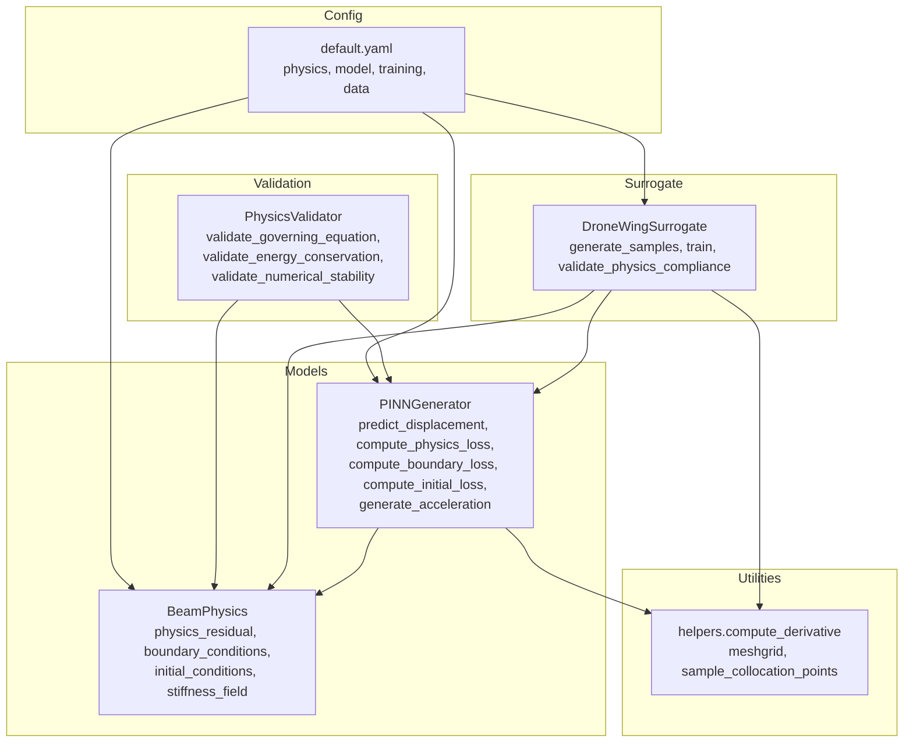
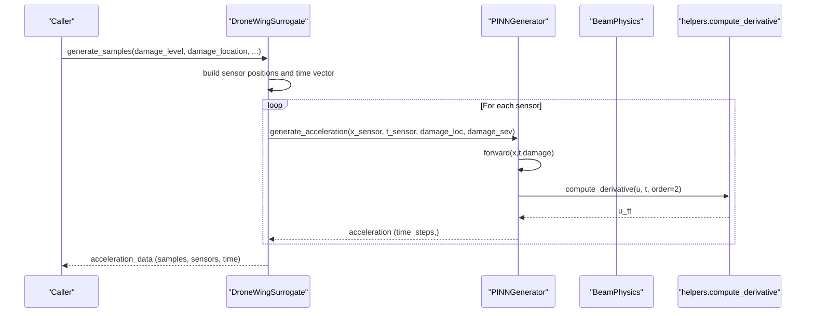
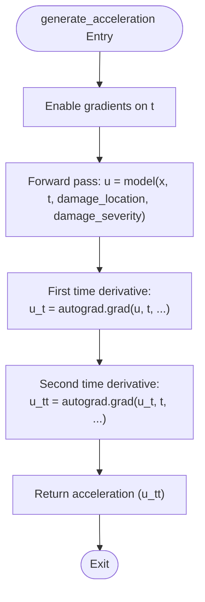
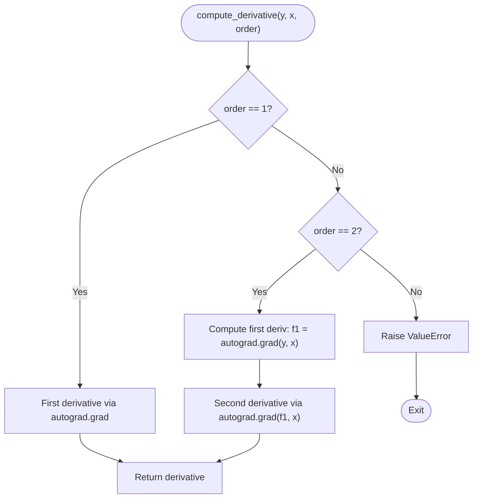
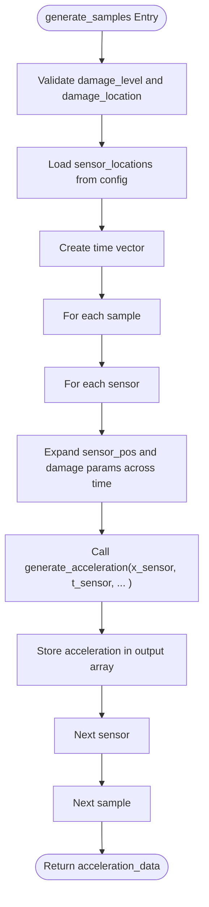
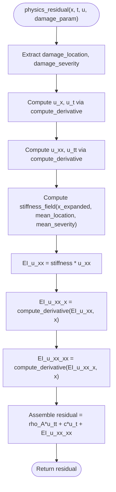
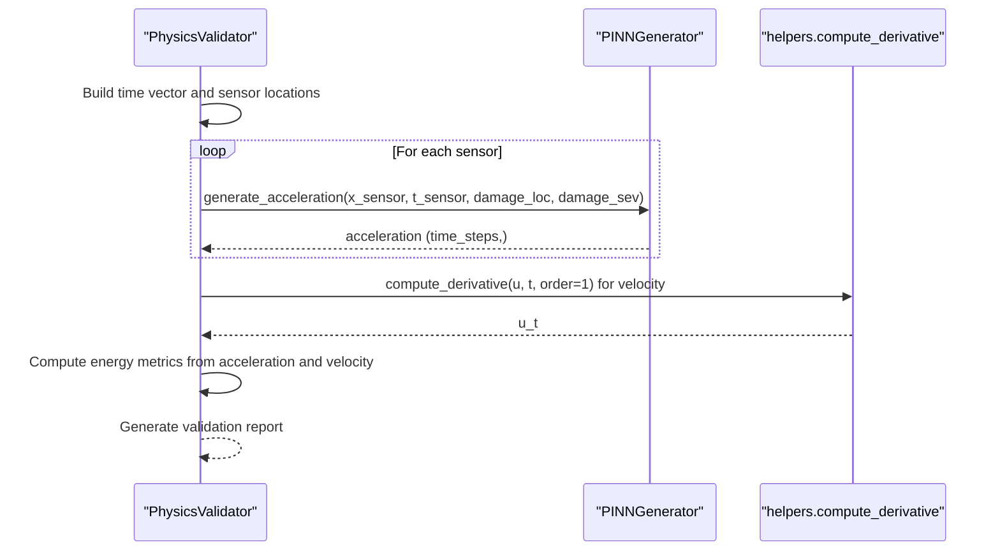
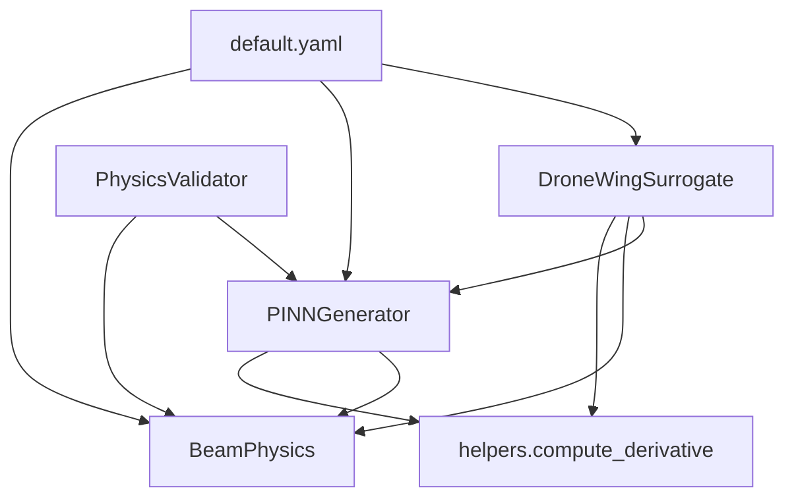

# Acceleration Generation

<cite>
**Referenced Files in This Document**
- [pinn_generator.py](file://gen-shm/src/models/pinn_generator.py)
- [beam_physics.py](file://gen-shm/src/models/beam_physics.py)
- [helpers.py](file://gen-shm/src/utils/helpers.py)
- [surrogate_model.py](file://gen-shm/src/models/surrogate_model.py)
- [validation.py](file://gen-shm/src/evaluation/validation.py)
- [default.yaml](file://gen-shm/configs/default.yaml)
- [demo.ipynb](file://gen-shm/notebooks/demo.ipynb)
- [generate_samples.py](file://gen-shm/experiments/generate_samples.py)
- [evaluate_shm.py](file://gen-shm/experiments/evaluate_shm.py)
</cite>

## Table of Contents
1. [Introduction](#introduction)
2. [Project Structure](#project-structure)
3. [Core Components](#core-components)
4. [Architecture Overview](#architecture-overview)
5. [Detailed Component Analysis](#detailed-component-analysis)
6. [Dependency Analysis](#dependency-analysis)
7. [Performance Considerations](#performance-considerations)
8. [Troubleshooting Guide](#troubleshooting-guide)
9. [Conclusion](#conclusion)
10. [Appendices](#appendices)

## Introduction
This document explains the acceleration generation capabilities in the PINN framework used for structural health monitoring (SHM) of drone wings. It focuses on:
- Automatic differentiation-based acceleration computation
- Second-order time derivative calculation
- Sensor location processing
- The generate_acceleration method implementation
- Gradient chain computation and acceleration time history generation
- Input tensor requirements, output formatting, and numerical differentiation accuracy
- Practical workflows, sensor placement strategies, and vibration analysis applications
- Computational efficiency, gradient memory management, and acceleration signal processing for SHM

## Project Structure
The acceleration generation pipeline spans several modules:
- PINN generator: neural network that predicts displacement and computes physics-informed losses
- Beam physics engine: Euler-Bernoulli beam with spatially varying stiffness and boundary/initial conditions
- Helpers: numerical differentiation utilities and mesh/grid sampling
- Surrogate model: high-level interface for training, sampling, and validation
- Validation: physics compliance checks including energy conservation and numerical stability
- Configuration: physics, model, training, and data parameters
- Experiments and notebooks: end-to-end workflows and demonstrations

**Diagram sources**
- [pinn_generator.py:39-287](file://gen-shm/src/models/pinn_generator.py#L39-L287)
- [beam_physics.py:12-300](file://gen-shm/src/models/beam_physics.py#L12-L300)
- [helpers.py:76-104](file://gen-shm/src/utils/helpers.py#L76-L104)
- [surrogate_model.py:15-337](file://gen-shm/src/models/surrogate_model.py#L15-L337)
- [validation.py:16-376](file://gen-shm/src/evaluation/validation.py#L16-L376)
- [default.yaml:1-100](file://gen-shm/configs/default.yaml#L1-L100)

**Section sources**
- [pinn_generator.py:1-352](file://gen-shm/src/models/pinn_generator.py#L1-L352)
- [beam_physics.py:1-300](file://gen-shm/src/models/beam_physics.py#L1-L300)
- [helpers.py:1-161](file://gen-shm/src/utils/helpers.py#L1-L161)
- [surrogate_model.py:1-337](file://gen-shm/src/models/surrogate_model.py#L1-L337)
- [validation.py:1-376](file://gen-shm/src/evaluation/validation.py#L1-L376)
- [default.yaml:1-100](file://gen-shm/configs/default.yaml#L1-L100)

## Core Components
- PINNGenerator: neural network that predicts displacement u(x,t) and exposes generate_acceleration for acceleration computation via automatic differentiation
- BeamPhysics: computes physics residual and boundary/initial conditions using numerical differentiation utilities
- helpers.compute_derivative: computes first and second derivatives using torch.autograd.grad with configurable graph retention
- DroneWingSurrogate: orchestrates training and sampling; generates acceleration time histories for multiple sensors and damage scenarios
- PhysicsValidator: validates governing equation satisfaction, boundary conditions, energy conservation, and numerical stability

Key implementation references:
- generate_acceleration method and its gradient chain
- compute_derivative for first and second time derivatives
- physics_residual for governing equation satisfaction
- validation workflows for acceleration-based energy metrics

**Section sources**
- [pinn_generator.py:241-272](file://gen-shm/src/models/pinn_generator.py#L241-L272)
- [beam_physics.py:107-150](file://gen-shm/src/models/beam_physics.py#L107-L150)
- [helpers.py:76-104](file://gen-shm/src/utils/helpers.py#L76-L104)
- [surrogate_model.py:48-129](file://gen-shm/src/models/surrogate_model.py#L48-L129)
- [validation.py:147-195](file://gen-shm/src/evaluation/validation.py#L147-L195)

## Architecture Overview
The acceleration generation pipeline follows a physics-informed neural network (PINN) architecture:
- Inputs: spatial coordinate x, temporal coordinate t, damage location, damage severity
- Displacement prediction: u(x,t) via PINN forward pass
- Acceleration computation: second-order time derivative using automatic differentiation
- Sensor processing: repeated sensor positions across time steps for acceleration time histories
- Validation: physics compliance checks and energy conservation metrics

**Diagram sources**
- [surrogate_model.py:48-129](file://gen-shm/src/models/surrogate_model.py#L48-L129)
- [pinn_generator.py:241-272](file://gen-shm/src/models/pinn_generator.py#L241-L272)
- [helpers.py:76-104](file://gen-shm/src/utils/helpers.py#L76-L104)

## Detailed Component Analysis

### Acceleration Generation Method
The generate_acceleration method performs automatic differentiation to compute acceleration as the second time derivative of displacement:
- Enables gradient tracking on t
- Calls forward to obtain displacement u
- Computes first time derivative u_t using autograd.grad with create_graph and retain_graph
- Computes second time derivative u_tt using autograd.grad again
- Returns acceleration time history

**Diagram sources**
- [pinn_generator.py:241-272](file://gen-shm/src/models/pinn_generator.py#L241-L272)

**Section sources**
- [pinn_generator.py:241-272](file://gen-shm/src/models/pinn_generator.py#L241-L272)

### Numerical Differentiation Accuracy and Utilities
The helpers module provides compute_derivative for first and second derivatives:
- Uses torch.autograd.grad with grad_outputs=torch.ones_like
- Supports create_graph and retain_graph for chaining higher-order derivatives
- Raises ValueError for unsupported orders

**Diagram sources**
- [helpers.py:76-104](file://gen-shm/src/utils/helpers.py#L76-L104)

**Section sources**
- [helpers.py:76-104](file://gen-shm/src/utils/helpers.py#L76-L104)

### Sensor Location Processing and Time History Generation
The surrogate model manages sensor placement and time histories:
- Reads sensor_locations from configuration
- Builds time vector with specified duration and sampling_rate
- For each sample and sensor:
  - Expands sensor position across time steps
  - Repeats damage parameters across time steps
  - Calls generate_acceleration to produce acceleration time history
  - Stores results in structured NumPy arrays

**Diagram sources**
- [surrogate_model.py:48-129](file://gen-shm/src/models/surrogate_model.py#L48-L129)
- [default.yaml:53-67](file://gen-shm/configs/default.yaml#L53-L67)

**Section sources**
- [surrogate_model.py:48-129](file://gen-shm/src/models/surrogate_model.py#L48-L129)
- [default.yaml:53-67](file://gen-shm/configs/default.yaml#L53-L67)

### Physics Engine and Governing Equation
The BeamPhysics engine computes the Euler-Bernoulli beam residual and boundary/initial conditions:
- Computes stiffness field EI(x;d) based on damage location and severity
- Uses compute_derivative for first and second spatial and temporal derivatives
- Assembles residual = ρA u_tt + c u_t + ∂²/∂x²[EI(x;d) ∂²u/∂x²]
- Implements boundary conditions for clamped, simply-supported, and free ends
- Implements initial conditions for zero displacement and velocity at t=0

**Diagram sources**
- [beam_physics.py:107-150](file://gen-shm/src/models/beam_physics.py#L107-L150)
- [helpers.py:76-104](file://gen-shm/src/utils/helpers.py#L76-L104)

**Section sources**
- [beam_physics.py:107-150](file://gen-shm/src/models/beam_physics.py#L107-L150)
- [beam_physics.py:152-223](file://gen-shm/src/models/beam_physics.py#L152-L223)

### Validation and Energy Conservation Metrics
The PhysicsValidator evaluates acceleration-based energy conservation:
- Generates acceleration signals at configured sensor locations
- Computes energy conservation metrics using acceleration time histories
- Provides numerical stability checks and comprehensive validation reports

**Diagram sources**
- [validation.py:147-195](file://gen-shm/src/evaluation/validation.py#L147-L195)
- [helpers.py:76-104](file://gen-shm/src/utils/helpers.py#L76-L104)

**Section sources**
- [validation.py:147-195](file://gen-shm/src/evaluation/validation.py#L147-L195)

## Dependency Analysis
The acceleration generation relies on:
- PINNGenerator depends on BeamPhysics for physics loss computation and on helpers.compute_derivative for numerical differentiation
- DroneWingSurrogate composes PINNGenerator and orchestrates sampling and validation
- PhysicsValidator composes PINNGenerator and BeamPhysics for compliance checks
- Configuration drives physics parameters, model architecture, and data generation

**Diagram sources**
- [pinn_generator.py:39-287](file://gen-shm/src/models/pinn_generator.py#L39-L287)
- [beam_physics.py:12-300](file://gen-shm/src/models/beam_physics.py#L12-L300)
- [helpers.py:76-104](file://gen-shm/src/utils/helpers.py#L76-L104)
- [surrogate_model.py:15-337](file://gen-shm/src/models/surrogate_model.py#L15-L337)
- [validation.py:16-376](file://gen-shm/src/evaluation/validation.py#L16-L376)
- [default.yaml:1-100](file://gen-shm/configs/default.yaml#L1-L100)

**Section sources**
- [pinn_generator.py:39-287](file://gen-shm/src/models/pinn_generator.py#L39-L287)
- [beam_physics.py:12-300](file://gen-shm/src/models/beam_physics.py#L12-L300)
- [helpers.py:76-104](file://gen-shm/src/utils/helpers.py#L76-L104)
- [surrogate_model.py:15-337](file://gen-shm/src/models/surrogate_model.py#L15-L337)
- [validation.py:16-376](file://gen-shm/src/evaluation/validation.py#L16-L376)
- [default.yaml:1-100](file://gen-shm/configs/default.yaml#L1-L100)

## Performance Considerations
- Automatic differentiation overhead: Using create_graph and retain_graph enables chained derivatives but increases memory usage; ensure gradients are disabled when not needed (e.g., during validation)
- Batched computation: Surrogate model iterates samples and sensors; batching can be achieved by expanding tensors to match time steps
- Numerical stability: Gradient clipping and early stopping prevent exploding gradients; monitor validation metrics
- Memory management: Disable gradients during inference (torch.no_grad) to reduce memory footprint
- Sensor placement: Sparse sensor configurations reduce computational cost; adjust sensor_locations in configuration for efficiency

[No sources needed since this section provides general guidance]

## Troubleshooting Guide
Common issues and resolutions:
- NaN or infinite values: Check numerical stability using PhysicsValidator.validate_numerical_stability; reduce learning rate or apply gradient clipping
- Poor acceleration accuracy: Verify second-order derivative computation via compute_derivative; ensure t.requires_grad_(True) before calling generate_acceleration
- Incorrect sensor placement: Confirm sensor_locations in configuration and that sensor positions are expanded across time steps
- Slow training/inference: Use torch.no_grad during evaluation; reduce batch size or sampling rate; enable CUDA if available

**Section sources**
- [validation.py:197-248](file://gen-shm/src/evaluation/validation.py#L197-L248)
- [pinn_generator.py:241-272](file://gen-shm/src/models/pinn_generator.py#L241-L272)
- [helpers.py:76-104](file://gen-shm/src/utils/helpers.py#L76-L104)
- [surrogate_model.py:96-118](file://gen-shm/src/models/surrogate_model.py#L96-L118)

## Conclusion
The PINN framework’s acceleration generation leverages automatic differentiation to compute second-order time derivatives efficiently and accurately. By integrating physics constraints through BeamPhysics and managing sensor placement via configuration, it enables robust structural health monitoring workflows. Proper gradient management, numerical stability checks, and validation ensure reliable acceleration time histories for vibration analysis and damage detection.

[No sources needed since this section summarizes without analyzing specific files]

## Appendices

### Input Tensor Requirements and Output Formatting
- Inputs to generate_acceleration:
  - x: spatial coordinates (sensor locations)
  - t: temporal coordinates
  - damage_location: scalar or repeated tensor across time steps
  - damage_severity: scalar or repeated tensor across time steps
- Output:
  - acceleration: tensor of shape (time_steps,) for a single sensor
  - Surrogate.generate_samples returns structured arrays of shape (samples, sensors, time_steps)

**Section sources**
- [pinn_generator.py:241-272](file://gen-shm/src/models/pinn_generator.py#L241-L272)
- [surrogate_model.py:48-129](file://gen-shm/src/models/surrogate_model.py#L48-L129)

### Example Workflows and Applications
- End-to-end sampling: quick_train_and_generate and generate_samples.py demonstrate training and acceleration generation
- Vibration analysis: notebooks and experiments showcase time-domain and frequency-domain analyses
- Damage detection: evaluation scripts demonstrate classification using acceleration features

**Section sources**
- [surrogate_model.py:275-307](file://gen-shm/src/models/surrogate_model.py#L275-L307)
- [generate_samples.py:73-109](file://gen-shm/experiments/generate_samples.py#L73-L109)
- [demo.ipynb:41-100](file://gen-shm/notebooks/demo.ipynb#L41-L100)
- [evaluate_shm.py:112-163](file://gen-shm/experiments/evaluate_shm.py#L112-L163)

### Sensor Placement Strategies
- Use configuration-defined sensor_locations for representative wing coverage
- Adjust sampling_rate and duration to balance resolution and computational cost
- Validate with PhysicsValidator.validate_energy_conservation for realistic responses

**Section sources**
- [default.yaml:53-67](file://gen-shm/configs/default.yaml#L53-L67)
- [validation.py:147-195](file://gen-shm/src/evaluation/validation.py#L147-L195)