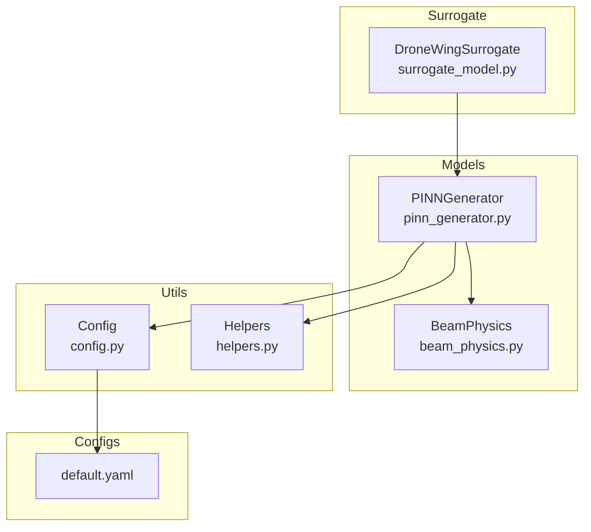
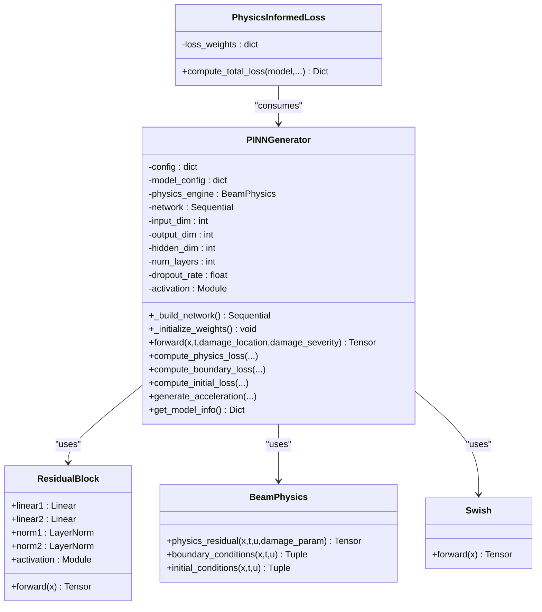
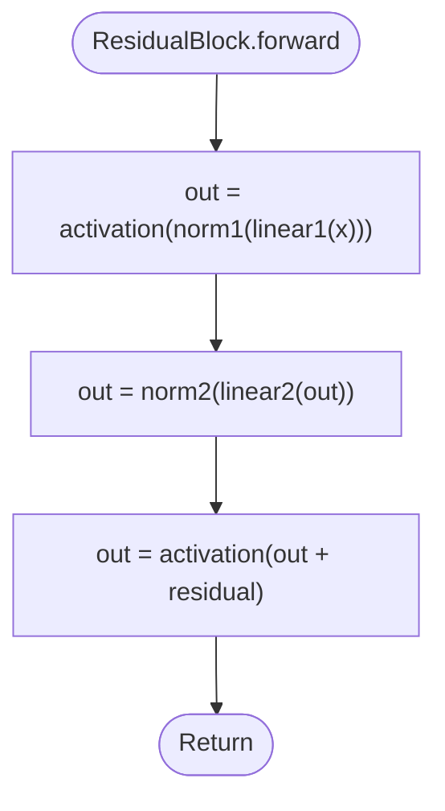
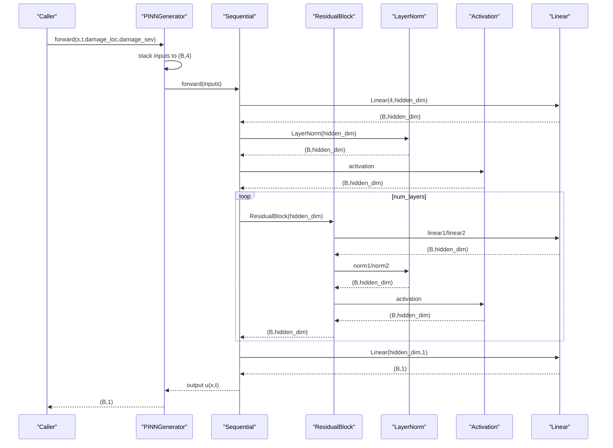
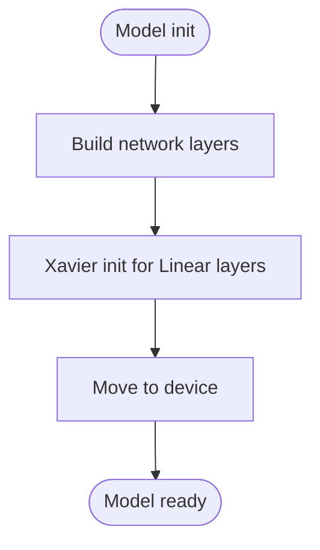
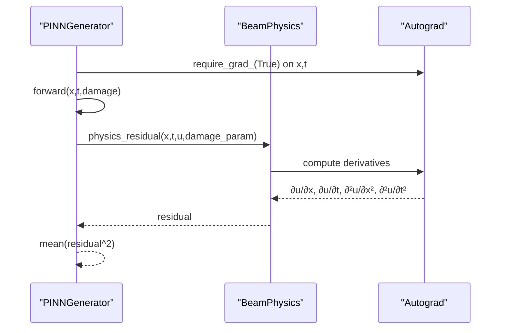
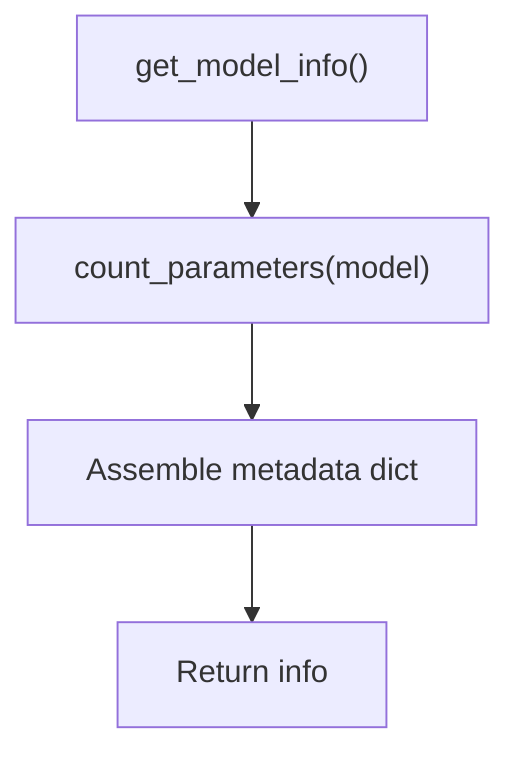
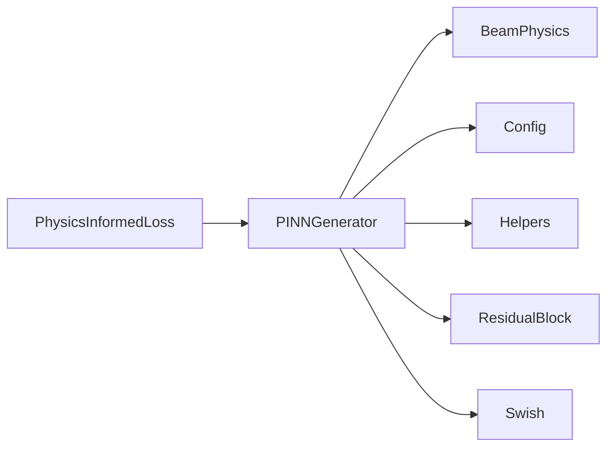

# Network Architecture

<cite>
**Referenced Files in This Document**
- [pinn_generator.py](file://gen-shm/src/models/pinn_generator.py)
- [beam_physics.py](file://gen-shm/src/models/beam_physics.py)
- [helpers.py](file://gen-shm/src/utils/helpers.py)
- [default.yaml](file://gen-shm/configs/default.yaml)
- [config.py](file://gen-shm/src/utils/config.py)
- [surrogate_model.py](file://gen-shm/src/models/surrogate_model.py)
</cite>

## Table of Contents
1. [Introduction](#introduction)
2. [Project Structure](#project-structure)
3. [Core Components](#core-components)
4. [Architecture Overview](#architecture-overview)
5. [Detailed Component Analysis](#detailed-component-analysis)
6. [Dependency Analysis](#dependency-analysis)
7. [Performance Considerations](#performance-considerations)
8. [Troubleshooting Guide](#troubleshooting-guide)
9. [Conclusion](#conclusion)
10. [Appendices](#appendices)

## Introduction
This document provides comprehensive documentation for the PINNGenerator network architecture used in the Gen-SHM project. It focuses on the residual block design with skip connections, layer normalization, and dropout mechanisms. It explains input/output tensor shapes, activation function selection (Swish, SiLU, ReLU, Tanh), network depth/width configuration, sequential layer construction, Xavier weight initialization, and GPU device allocation. It also includes examples of configuration parameters, parameter counting, model information retrieval, and discusses the impact of different activation functions on gradient flow and training stability.

## Project Structure
The PINNGenerator resides in the models package alongside the physics engine and is integrated into a high-level surrogate model. Configuration is centralized in YAML and Python configuration managers. Utility functions support device allocation, parameter counting, and numerical differentiation.

**Diagram sources**
- [pinn_generator.py:1-352](file://gen-shm/src/models/pinn_generator.py#L1-L352)
- [beam_physics.py:1-300](file://gen-shm/src/models/beam_physics.py#L1-L300)
- [config.py:1-123](file://gen-shm/src/utils/config.py#L1-L123)
- [default.yaml:1-100](file://gen-shm/configs/default.yaml#L1-L100)
- [surrogate_model.py:1-337](file://gen-shm/src/models/surrogate_model.py#L1-L337)

**Section sources**
- [pinn_generator.py:1-352](file://gen-shm/src/models/pinn_generator.py#L1-L352)
- [beam_physics.py:1-300](file://gen-shm/src/models/beam_physics.py#L1-L300)
- [config.py:1-123](file://gen-shm/src/utils/config.py#L1-L123)
- [default.yaml:1-100](file://gen-shm/configs/default.yaml#L1-L100)
- [surrogate_model.py:1-337](file://gen-shm/src/models/surrogate_model.py#L1-L337)

## Core Components
- Swish activation module: Implements f(x) = x * sigmoid(x).
- ResidualBlock: Two-layer residual block with layer normalization and skip connection.
- PINNGenerator: Main network with configurable depth, width, activation, and dropout; builds a sequential architecture; initializes weights with Xavier; allocates to device.
- PhysicsInformedLoss: Composite loss combining data fidelity, physics residual, and boundary/initial condition penalties.
- BeamPhysics: Implements Euler-Bernoulli beam equation with spatially varying stiffness and computes physics residuals and boundary/initial conditions.

Key configuration parameters:
- model.input_dim: 4 ([x, t, damage_location, damage_severity])
- model.output_dim: 1 (displacement u(x,t))
- model.hidden_layers: 6
- model.hidden_dim: 128
- model.activation: "swish" | "silu" | "relu" | "tanh"
- model.dropout_rate: 0.0 (disabled for physics problems)
- training.physics_points, boundary_points, initial_condition_points

**Section sources**
- [pinn_generator.py:14-120](file://gen-shm/src/models/pinn_generator.py#L14-L120)
- [pinn_generator.py:290-352](file://gen-shm/src/models/pinn_generator.py#L290-L352)
- [beam_physics.py:12-224](file://gen-shm/src/models/beam_physics.py#L12-L224)
- [default.yaml:25-51](file://gen-shm/configs/default.yaml#L25-L51)
- [config.py:50-75](file://gen-shm/src/utils/config.py#L50-L75)

## Architecture Overview
The PINNGenerator composes a sequential network with:
- Input layer: Linear(input_dim, hidden_dim)
- LayerNorm(hidden_dim)
- Activation (selected from Swish/SiLU/ReLU/Tanh)
- Optional Dropout (if dropout_rate > 0)
- Residual blocks: repeated ResidualBlock(hidden_dim, activation)
- Optional Dropout after each residual block (if dropout_rate > 0)
- Output layer: Linear(hidden_dim, output_dim)

The model embeds physics via automatic differentiation through the BeamPhysics engine, computing residuals and enforcing boundary/initial conditions.

**Diagram sources**
- [pinn_generator.py:14-120](file://gen-shm/src/models/pinn_generator.py#L14-L120)
- [pinn_generator.py:290-352](file://gen-shm/src/models/pinn_generator.py#L290-L352)
- [beam_physics.py:12-224](file://gen-shm/src/models/beam_physics.py#L12-L224)

## Detailed Component Analysis

### Residual Block Design with Skip Connections, Layer Normalization, and Dropout
- Structure: Two linear layers sandwiched between layer norms and activation; residual connection adds input to post-activation output.
- Purpose: Improves gradient flow and enables deeper networks by mitigating vanishing gradients.
- Dropout: Applied after norm/activation and after residual addition when configured.

**Diagram sources**
- [pinn_generator.py:21-36](file://gen-shm/src/models/pinn_generator.py#L21-L36)

**Section sources**
- [pinn_generator.py:21-36](file://gen-shm/src/models/pinn_generator.py#L21-L36)

### Sequential Layer Construction and Network Depth/Width
- Input: [x, t, damage_location, damage_severity] with shape (batch_size, 4)
- Hidden layers: num_layers copies of ResidualBlock with dimension hidden_dim
- Output: displacement u(x,t) with shape (batch_size, 1)
- Depth: 1 input + num_layers residual blocks + 1 output ≈ num_layers + 2 layers
- Width: hidden_dim controls internal representation capacity

**Diagram sources**
- [pinn_generator.py:87-107](file://gen-shm/src/models/pinn_generator.py#L87-L107)
- [pinn_generator.py:117-137](file://gen-shm/src/models/pinn_generator.py#L117-L137)

**Section sources**
- [pinn_generator.py:87-107](file://gen-shm/src/models/pinn_generator.py#L87-L107)
- [pinn_generator.py:117-137](file://gen-shm/src/models/pinn_generator.py#L117-L137)

### Activation Function Selection and Impact on Gradient Flow
Supported activations:
- Swish: f(x) = x * sigmoid(x)
- SiLU: Sigmoid-weighted linear unit
- ReLU: Rectified linear unit
- Tanh: Hyperbolic tangent

Impact on training stability and gradient flow:
- Swish/SiLU: Smooth, non-monotonic; often improves convergence and gradient flow compared to ReLU; can reduce dead neuron risk.
- ReLU: Fast, sparse representations; may cause dead neurons; sensitive to initialization and learning rate.
- Tanh: Symmetric around zero; bounded; can help with early training dynamics but may saturate.

The model selects activation via configuration and applies it consistently across residual blocks and initial layers.

**Section sources**
- [pinn_generator.py:66-77](file://gen-shm/src/models/pinn_generator.py#L66-L77)
- [default.yaml](file://gen-shm/configs/default.yaml#L31)

### Xavier Weight Initialization and Device Allocation
- Xavier (Glorot uniform) initialization is applied to all Linear layers; biases initialized to zeros when present.
- All model parameters are moved to the detected device (CUDA if available, otherwise CPU).

**Diagram sources**
- [pinn_generator.py:109-116](file://gen-shm/src/models/pinn_generator.py#L109-L116)
- [pinn_generator.py:82-85](file://gen-shm/src/models/pinn_generator.py#L82-L85)
- [helpers.py:21-23](file://gen-shm/src/utils/helpers.py#L21-L23)

**Section sources**
- [pinn_generator.py:109-116](file://gen-shm/src/models/pinn_generator.py#L109-L116)
- [pinn_generator.py:82-85](file://gen-shm/src/models/pinn_generator.py#L82-L85)
- [helpers.py:21-23](file://gen-shm/src/utils/helpers.py#L21-L23)

### Physics Embedding and Loss Composition
- Physics residual computed using automatic differentiation against x and t.
- Boundary and initial condition residuals enforced when provided.
- Composite loss weighted by training.loss_weights.

**Diagram sources**
- [pinn_generator.py:155-185](file://gen-shm/src/models/pinn_generator.py#L155-L185)
- [beam_physics.py:107-150](file://gen-shm/src/models/beam_physics.py#L107-L150)

**Section sources**
- [pinn_generator.py:155-185](file://gen-shm/src/models/pinn_generator.py#L155-L185)
- [beam_physics.py:107-150](file://gen-shm/src/models/beam_physics.py#L107-L150)

### Model Information Retrieval and Parameter Counting
- get_model_info returns model type, dimensions, hidden layers, width, total parameters, activation, and device.
- count_parameters utility sums trainable parameters across the model.

**Diagram sources**
- [pinn_generator.py:274-287](file://gen-shm/src/models/pinn_generator.py#L274-L287)
- [helpers.py:159-161](file://gen-shm/src/utils/helpers.py#L159-L161)

**Section sources**
- [pinn_generator.py:274-287](file://gen-shm/src/models/pinn_generator.py#L274-L287)
- [helpers.py:159-161](file://gen-shm/src/utils/helpers.py#L159-L161)

## Dependency Analysis
- PINNGenerator depends on:
  - BeamPhysics for physics computations
  - Config for model/training parameters
  - Helpers for device selection and parameter counting
- ResidualBlock depends on PyTorch Linear, LayerNorm, and activation modules.
- PhysicsInformedLoss composes multiple loss components and weights.

**Diagram sources**
- [pinn_generator.py:1-120](file://gen-shm/src/models/pinn_generator.py#L1-L120)
- [beam_physics.py:1-300](file://gen-shm/src/models/beam_physics.py#L1-L300)
- [config.py:1-123](file://gen-shm/src/utils/config.py#L1-L123)
- [helpers.py:1-161](file://gen-shm/src/utils/helpers.py#L1-L161)

**Section sources**
- [pinn_generator.py:1-120](file://gen-shm/src/models/pinn_generator.py#L1-L120)
- [beam_physics.py:1-300](file://gen-shm/src/models/beam_physics.py#L1-L300)
- [config.py:1-123](file://gen-shm/src/utils/config.py#L1-L123)
- [helpers.py:1-161](file://gen-shm/src/utils/helpers.py#L1-L161)

## Performance Considerations
- Depth vs. width trade-offs: Increasing hidden_layers increases representational capacity but also compute and memory; increasing hidden_dim increases parameter count and potential overfitting risk.
- Dropout disabled by default for physics-informed problems; enabling it may reduce overfitting but could also hinder physics learning.
- Activation choice affects convergence speed and stability; Swish/SiLU often improve training compared to ReLU.
- Device allocation automatically uses CUDA if available; ensure sufficient VRAM for training batch sizes and physics points.

[No sources needed since this section provides general guidance]

## Troubleshooting Guide
Common issues and remedies:
- CUDA out of memory: Reduce training.batch_size or hidden_layers; decrease training.physics_points.
- Slow training: Lower training.physics_points or hidden_layers; adjust learning rate scheduler.
- Poor physics compliance: Increase training.loss_weights.physics or training.epochs; verify boundary/initial conditions.
- Import errors: Ensure working directory is gen-shm and dependencies installed.

**Section sources**
- [default.yaml:34-51](file://gen-shm/configs/default.yaml#L34-L51)
- [GETTING_STARTED.md:212-226](file://gen-shm/GETTING_STARTED.md#L212-L226)

## Conclusion
The PINNGenerator integrates residual blocks, layer normalization, and configurable activations into a physics-informed architecture. Its modular design, Xavier initialization, and device-aware allocation enable robust training and deployment. Proper configuration of depth/width and activation selection are crucial for balancing representational power and training stability while maintaining strong physics compliance.

[No sources needed since this section summarizes without analyzing specific files]

## Appendices

### Configuration Parameters and Examples
- Example defaults:
  - model.input_dim: 4
  - model.output_dim: 1
  - model.hidden_layers: 6
  - model.hidden_dim: 128
  - model.activation: "swish"
  - model.dropout_rate: 0.0
  - training.physics_points: 10000
  - training.loss_weights.physics: 10.0

To change activation:
- Set model.activation to "silu", "relu", or "tanh".

To adjust depth/width:
- Modify model.hidden_layers and model.hidden_dim accordingly.

To enable dropout:
- Set model.dropout_rate > 0.

**Section sources**
- [default.yaml:25-51](file://gen-shm/configs/default.yaml#L25-L51)
- [pinn_generator.py:66-77](file://gen-shm/src/models/pinn_generator.py#L66-L77)

### Parameter Counting and Model Information
- Use get_model_info to retrieve total parameters, dimensions, activation, and device.
- count_parameters utility provides total trainable parameters.

Example usage:
- Retrieve model info via PINNGenerator.get_model_info().
- Access total parameters from the returned dictionary under "total_parameters".

**Section sources**
- [pinn_generator.py:274-287](file://gen-shm/src/models/pinn_generator.py#L274-L287)
- [helpers.py:159-161](file://gen-shm/src/utils/helpers.py#L159-L161)