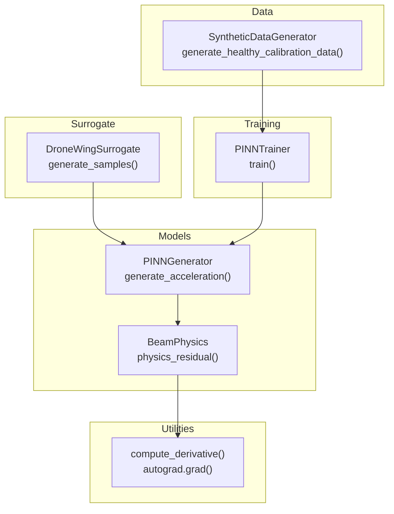
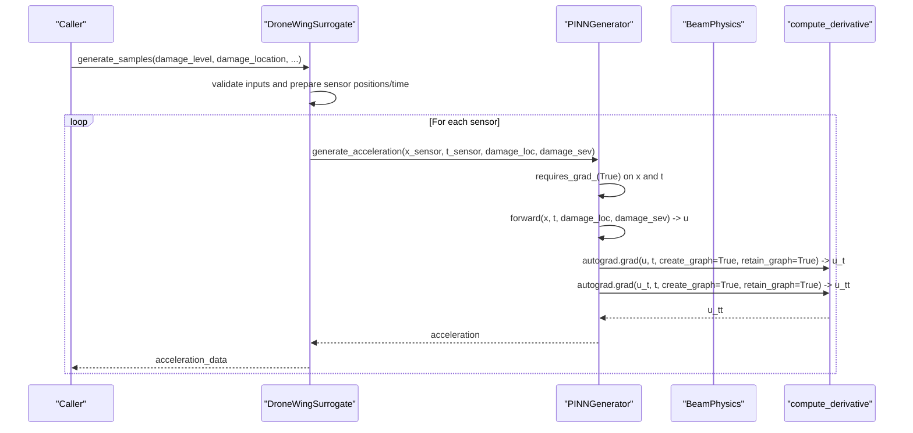
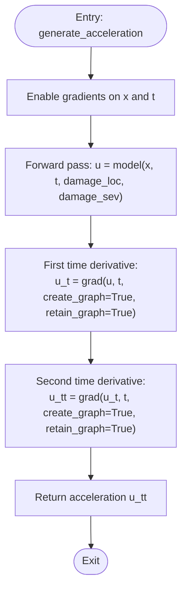
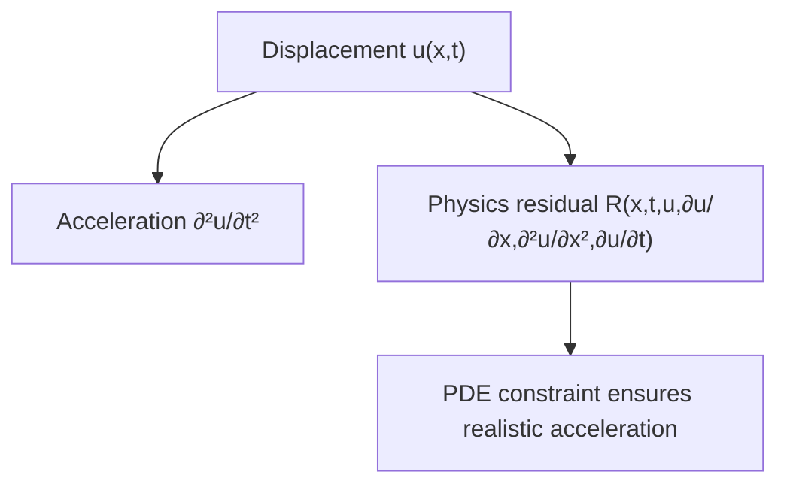
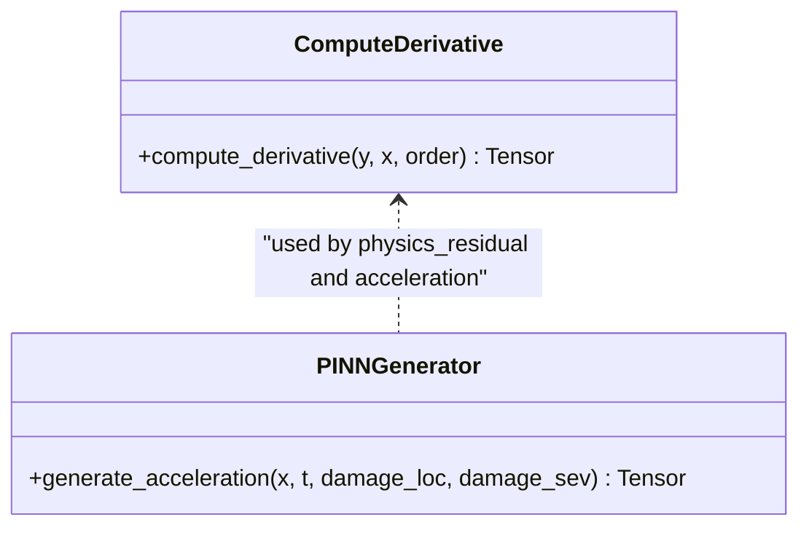
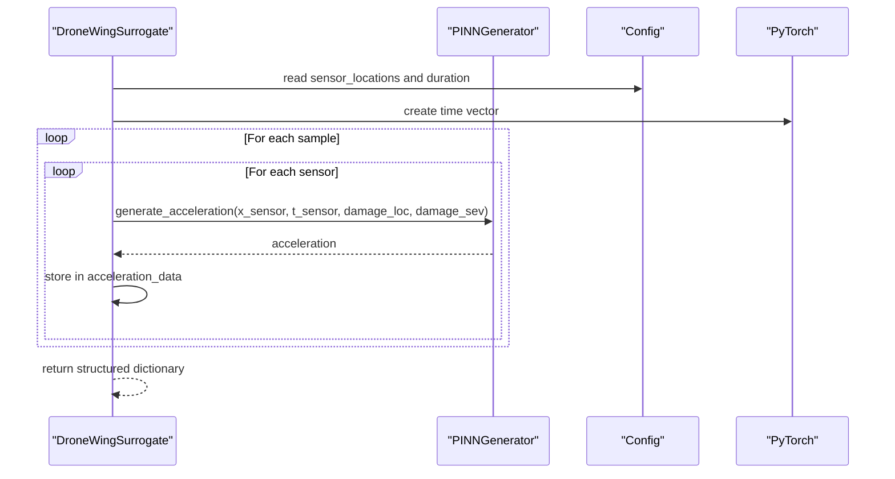
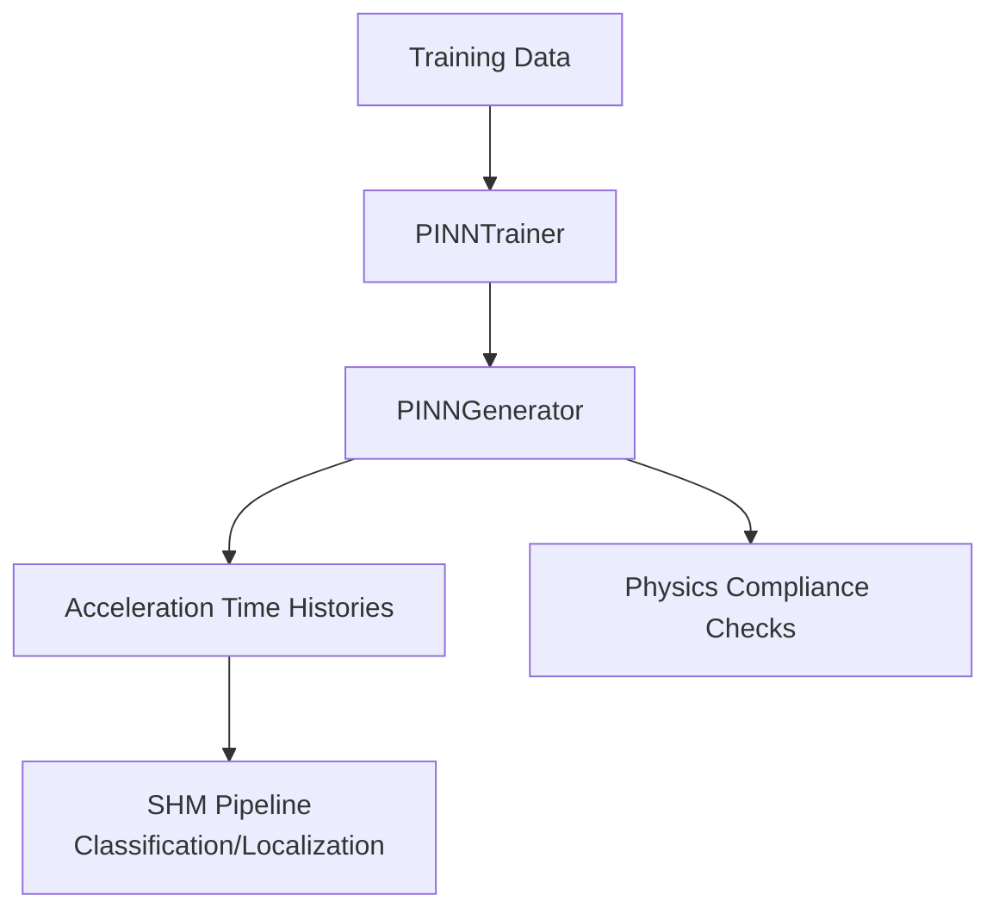
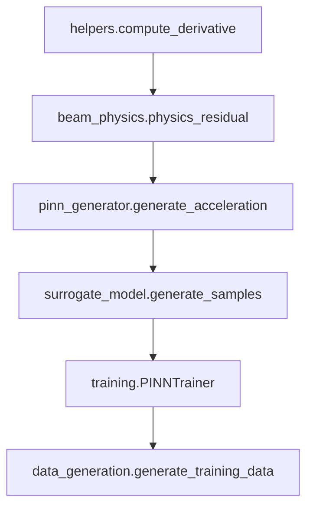

# Acceleration Generation

<cite>
**Referenced Files in This Document**
- [pinn_generator.py](file://gen-shm/src/models/pinn_generator.py)
- [beam_physics.py](file://gen-shm/src/models/beam_physics.py)
- [helpers.py](file://gen-shm/src/utils/helpers.py)
- [surrogate_model.py](file://gen-shm/src/models/surrogate_model.py)
- [data_generation.py](file://gen-shm/src/data/data_generation.py)
- [trainer.py](file://gen-shm/src/training/trainer.py)
- [default.yaml](file://gen-shm/configs/default.yaml)
</cite>

## Table of Contents
1. [Introduction](#introduction)
2. [Project Structure](#project-structure)
3. [Core Components](#core-components)
4. [Architecture Overview](#architecture-overview)
5. [Detailed Component Analysis](#detailed-component-analysis)
6. [Dependency Analysis](#dependency-analysis)
7. [Performance Considerations](#performance-considerations)
8. [Troubleshooting Guide](#troubleshooting-guide)
9. [Conclusion](#conclusion)

## Introduction
This document explains how acceleration is generated from displacement predictions in the PINN framework for drone wing structural health monitoring. It focuses on the generate_acceleration method, detailing second-order time derivative computation using automatic differentiation, gradient chaining, and numerical acceleration generation. It also covers the relationship between displacement and acceleration in beam vibration analysis, acceleration time history generation, sensor simulation capabilities, examples for different damage scenarios, numerical accuracy considerations, and integration with structural health monitoring applications.

## Project Structure
The acceleration generation pipeline spans several modules:
- PINN model and physics engine define the governing equations and compute derivatives.
- Helper utilities provide automatic differentiation primitives.
- Surrogate model orchestrates training, inference, and sensor simulation.
- Data generation module supplies synthetic datasets and analytical baselines.
- Training module manages loss composition and optimization.

**Diagram sources**
- [pinn_generator.py:241-272](file://gen-shm/src/models/pinn_generator.py#L241-L272)
- [beam_physics.py:107-150](file://gen-shm/src/models/beam_physics.py#L107-L150)
- [helpers.py:76-103](file://gen-shm/src/utils/helpers.py#L76-L103)
- [surrogate_model.py:48-129](file://gen-shm/src/models/surrogate_model.py#L48-L129)
- [data_generation.py:30-132](file://gen-shm/src/data/data_generation.py#L30-L132)
- [trainer.py:207-297](file://gen-shm/src/training/trainer.py#L207-L297)

**Section sources**
- [pinn_generator.py:1-352](file://gen-shm/src/models/pinn_generator.py#L1-L352)
- [beam_physics.py:1-300](file://gen-shm/src/models/beam_physics.py#L1-L300)
- [helpers.py:1-161](file://gen-shm/src/utils/helpers.py#L1-L161)
- [surrogate_model.py:1-337](file://gen-shm/src/models/surrogate_model.py#L1-L337)
- [data_generation.py:1-384](file://gen-shm/src/data/data_generation.py#L1-L384)
- [trainer.py:1-392](file://gen-shm/src/training/trainer.py#L1-L392)
- [default.yaml:1-100](file://gen-shm/configs/default.yaml#L1-L100)

## Core Components
- PINNGenerator.generate_acceleration: Computes acceleration as the second time derivative of displacement using automatic differentiation.
- BeamPhysics.physics_residual: Implements the Euler-Bernoulli beam PDE residual and supports first and second spatial derivatives via compute_derivative.
- compute_derivative: Provides first and second-order derivatives using torch.autograd.grad with create_graph and retain_graph to enable gradient chaining.
- DroneWingSurrogate.generate_samples: Generates acceleration time histories for multiple sensors and damage scenarios.
- SyntheticDataGenerator: Supplies healthy baseline data and analytical solutions for validation.

Key implementation references:
- [generate_acceleration:241-272](file://gen-shm/src/models/pinn_generator.py#L241-L272)
- [physics_residual:107-150](file://gen-shm/src/models/beam_physics.py#L107-L150)
- [compute_derivative:76-103](file://gen-shm/src/utils/helpers.py#L76-L103)
- [generate_samples:48-129](file://gen-shm/src/models/surrogate_model.py#L48-L129)
- [generate_healthy_calibration_data:30-132](file://gen-shm/src/data/data_generation.py#L30-L132)

**Section sources**
- [pinn_generator.py:241-272](file://gen-shm/src/models/pinn_generator.py#L241-L272)
- [beam_physics.py:107-150](file://gen-shm/src/models/beam_physics.py#L107-L150)
- [helpers.py:76-103](file://gen-shm/src/utils/helpers.py#L76-L103)
- [surrogate_model.py:48-129](file://gen-shm/src/models/surrogate_model.py#L48-L129)
- [data_generation.py:30-132](file://gen-shm/src/data/data_generation.py#L30-L132)

## Architecture Overview
The acceleration generation pipeline integrates the PINN’s displacement prediction with automatic differentiation to produce acceleration time histories at sensor locations. Damage parameters are embedded into the input so that acceleration reflects the current damage scenario.

**Diagram sources**
- [surrogate_model.py:48-129](file://gen-shm/src/models/surrogate_model.py#L48-L129)
- [pinn_generator.py:241-272](file://gen-shm/src/models/pinn_generator.py#L241-L272)
- [helpers.py:76-103](file://gen-shm/src/utils/helpers.py#L76-L103)

## Detailed Component Analysis

### Acceleration Generation Method
The generate_acceleration method computes acceleration as the second time derivative of the predicted displacement field. It:
- Enables gradient tracking on spatial and temporal inputs.
- Calls the forward pass to obtain displacement u(x,t).
- Uses autograd.grad twice with create_graph=True and retain_graph=True to chain gradients and compute ∂²u/∂t².

**Diagram sources**
- [pinn_generator.py:241-272](file://gen-shm/src/models/pinn_generator.py#L241-L272)

**Section sources**
- [pinn_generator.py:241-272](file://gen-shm/src/models/pinn_generator.py#L241-L272)

### Relationship Between Displacement and Acceleration in Beam Vibration
The governing equation for Euler-Bernoulli beam vibration is:
ρA ∂²u/∂t² + c ∂u/∂t + ∂²/∂x²[EI(x;d) ∂²u/∂x²] = 0
- Displacement u(x,t) is the primary unknown.
- Acceleration is ∂²u/∂t².
- The physics residual enforces the PDE, implicitly constraining the relationship between displacement and acceleration.

**Diagram sources**
- [beam_physics.py:16-150](file://gen-shm/src/models/beam_physics.py#L16-L150)

**Section sources**
- [beam_physics.py:16-150](file://gen-shm/src/models/beam_physics.py#L16-L150)

### Automatic Differentiation and Gradient Chaining
compute_derivative encapsulates first and second-order derivatives using torch.autograd.grad with:
- grad_outputs=torch.ones_like to compute derivatives consistently.
- create_graph=True to keep gradients in the computational graph for higher-order derivatives.
- retain_graph=True to reuse intermediate computations during training and inference.

**Diagram sources**
- [helpers.py:76-103](file://gen-shm/src/utils/helpers.py#L76-L103)
- [pinn_generator.py:241-272](file://gen-shm/src/models/pinn_generator.py#L241-L272)

**Section sources**
- [helpers.py:76-103](file://gen-shm/src/utils/helpers.py#L76-L103)
- [pinn_generator.py:241-272](file://gen-shm/src/models/pinn_generator.py#L241-L272)

### Numerical Acceleration Generation and Sensor Simulation
DroneWingSurrogate.generate_samples orchestrates:
- Sensor placement along the wing (normalized positions).
- Time vector creation and repeated damage parameters across time steps.
- Per-sensor acceleration generation via generate_acceleration.
- Aggregation into structured arrays for downstream analysis.

**Diagram sources**
- [surrogate_model.py:48-129](file://gen-shm/src/models/surrogate_model.py#L48-L129)

**Section sources**
- [surrogate_model.py:48-129](file://gen-shm/src/models/surrogate_model.py#L48-L129)

### Examples of Acceleration Computation for Different Damage Scenarios
- Healthy wing: damage_level=0.0, damage_location≈0.5.
- Root damage: damage_location≈0.0 with moderate severity.
- Center damage: damage_location≈0.5 with moderate severity.
- Tip damage: damage_location≈0.9 with severe severity.

These scenarios are demonstrated in the surrogate’s quick training and generation workflow and validated via physics compliance checks.

**Section sources**
- [surrogate_model.py:310-337](file://gen-shm/src/models/surrogate_model.py#L310-L337)
- [trainer.py:207-297](file://gen-shm/src/training/trainer.py#L207-L297)

### Integration with Structural Health Monitoring Applications
- Training: PINNTrainer manages loss composition, optimizer, scheduler, and early stopping.
- Validation: Physics compliance metrics are computed across damage scenarios.
- Deployment: Surrogate generates acceleration time histories for classification and anomaly detection tasks.

**Diagram sources**
- [trainer.py:207-297](file://gen-shm/src/training/trainer.py#L207-L297)
- [surrogate_model.py:131-166](file://gen-shm/src/models/surrogate_model.py#L131-L166)

**Section sources**
- [trainer.py:207-297](file://gen-shm/src/training/trainer.py#L207-L297)
- [surrogate_model.py:131-166](file://gen-shm/src/models/surrogate_model.py#L131-L166)

## Dependency Analysis
The acceleration generation depends on:
- PINNGenerator for displacement predictions and second-order time derivatives.
- BeamPhysics for physics constraints and derivative utilities.
- Helpers for automatic differentiation primitives.
- Surrogate for orchestration and sensor simulation.
- Data generation for analytical baselines and healthy calibration data.
- Training for loss composition and regularization.

**Diagram sources**
- [helpers.py:76-103](file://gen-shm/src/utils/helpers.py#L76-L103)
- [beam_physics.py:107-150](file://gen-shm/src/models/beam_physics.py#L107-L150)
- [pinn_generator.py:241-272](file://gen-shm/src/models/pinn_generator.py#L241-L272)
- [surrogate_model.py:48-129](file://gen-shm/src/models/surrogate_model.py#L48-L129)
- [trainer.py:207-297](file://gen-shm/src/training/trainer.py#L207-L297)
- [data_generation.py:211-263](file://gen-shm/src/data/data_generation.py#L211-L263)

**Section sources**
- [helpers.py:76-103](file://gen-shm/src/utils/helpers.py#L76-L103)
- [beam_physics.py:107-150](file://gen-shm/src/models/beam_physics.py#L107-L150)
- [pinn_generator.py:241-272](file://gen-shm/src/models/pinn_generator.py#L241-L272)
- [surrogate_model.py:48-129](file://gen-shm/src/models/surrogate_model.py#L48-L129)
- [trainer.py:207-297](file://gen-shm/src/training/trainer.py#L207-L297)
- [data_generation.py:211-263](file://gen-shm/src/data/data_generation.py#L211-L263)

## Performance Considerations
- Gradient chaining: Using create_graph=True and retain_graph=True enables higher-order derivatives but increases memory usage. Consider gradient checkpointing for large batches.
- Device placement: Ensure tensors are moved to the configured device to avoid overhead.
- Batch-wise generation: Generate acceleration per sensor and per time step to manage memory.
- Numerical stability: Adjust loss weights and gradient clipping to stabilize training and inference.
- Configuration tuning: Adjust hidden dimensions, activation functions, and dropout rates to balance accuracy and speed.

[No sources needed since this section provides general guidance]

## Troubleshooting Guide
Common issues and resolutions:
- Missing training: generate_samples raises an error if the model is not trained. Train the model first using DroneWingSurrogate.train.
- Input validation: damage_level and damage_location must be within [0.0, 1.0].
- Device mismatch: Ensure tensors are on the correct device; helper functions and trainers handle device selection.
- Memory pressure: Reduce batch size or time steps; consider disabling retain_graph in inference if not needed.
- Physics compliance: Use validate_physics_compliance to check residual magnitudes across scenarios.

**Section sources**
- [surrogate_model.py:71-73](file://gen-shm/src/models/surrogate_model.py#L71-L73)
- [surrogate_model.py:76-79](file://gen-shm/src/models/surrogate_model.py#L76-L79)
- [trainer.py:207-297](file://gen-shm/src/training/trainer.py#L207-L297)

## Conclusion
The generate_acceleration method leverages automatic differentiation to compute acceleration from PINN displacement predictions, enabling accurate acceleration time histories for structural health monitoring. By embedding physics constraints and integrating with sensor simulation, the system supports diverse damage scenarios, validation, and deployment-ready outputs suitable for real-time applications.