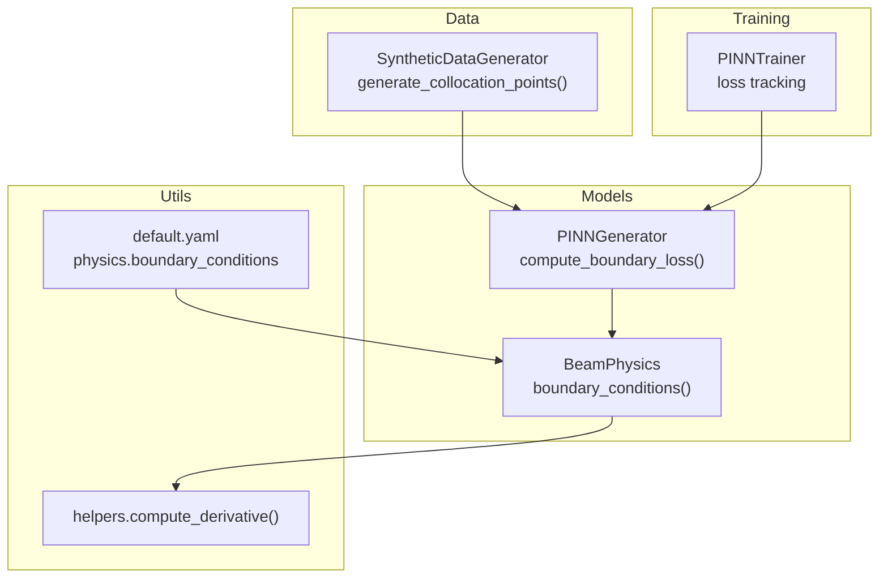
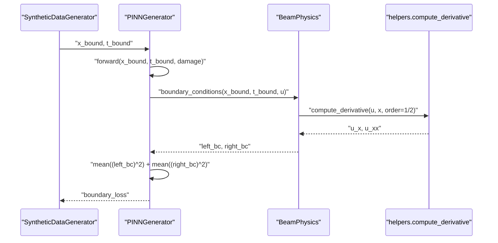
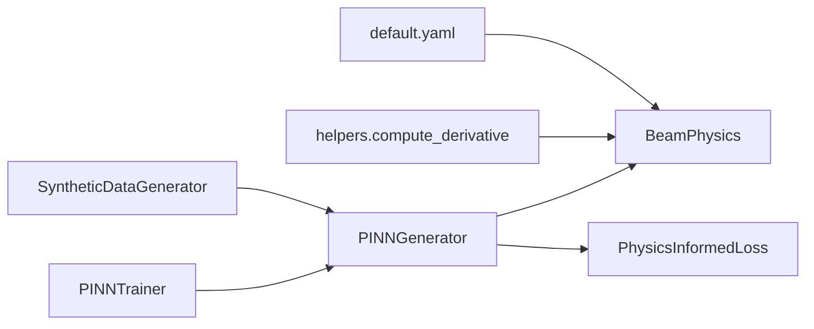

# Boundary Condition Enforcement

<cite>
**Referenced Files in This Document**
- [beam_physics.py](file://gen-shm/src/models/beam_physics.py)
- [pinn_generator.py](file://gen-shm/src/models/pinn_generator.py)
- [data_generation.py](file://gen-shm/src/data/data_generation.py)
- [helpers.py](file://gen-shm/src/utils/helpers.py)
- [default.yaml](file://gen-shm/configs/default.yaml)
- [trainer.py](file://gen-shm/src/training/trainer.py)
</cite>

## Table of Contents
1. [Introduction](#introduction)
2. [Project Structure](#project-structure)
3. [Core Components](#core-components)
4. [Architecture Overview](#architecture-overview)
5. [Detailed Component Analysis](#detailed-component-analysis)
6. [Dependency Analysis](#dependency-analysis)
7. [Performance Considerations](#performance-considerations)
8. [Troubleshooting Guide](#troubleshooting-guide)
9. [Conclusion](#conclusion)

## Introduction
This document explains the boundary condition enforcement mechanisms in the PINN framework for Euler-Bernoulli beam dynamics. It focuses on the boundary_conditions method implementation, covering fixed-end (clamped) and free-end boundary conditions, left and right boundary computations, displacement and slope constraint enforcement, and the mathematical formulation behind beam boundary conditions. It also documents boundary loss computation using mean squared residuals, boundary point generation strategies, and integration with the overall physics loss computation.

## Project Structure
The boundary enforcement logic is implemented within the physics engine and integrated into the PINN generator’s loss computation pipeline. Supporting utilities handle numerical differentiation and collocation point generation.

**Diagram sources**
- [beam_physics.py:152-200](file://gen-shm/src/models/beam_physics.py#L152-L200)
- [pinn_generator.py:187-212](file://gen-shm/src/models/pinn_generator.py#L187-L212)
- [data_generation.py:134-182](file://gen-shm/src/data/data_generation.py#L134-L182)
- [helpers.py:76-103](file://gen-shm/src/utils/helpers.py#L76-L103)
- [default.yaml:13-16](file://gen-shm/configs/default.yaml#L13-L16)
- [trainer.py:127-180](file://gen-shm/src/training/trainer.py#L127-L180)

**Section sources**
- [beam_physics.py:152-200](file://gen-shm/src/models/beam_physics.py#L152-L200)
- [pinn_generator.py:187-212](file://gen-shm/src/models/pinn_generator.py#L187-L212)
- [data_generation.py:134-182](file://gen-shm/src/data/data_generation.py#L134-L182)
- [helpers.py:76-103](file://gen-shm/src/utils/helpers.py#L76-L103)
- [default.yaml:13-16](file://gen-shm/configs/default.yaml#L13-L16)
- [trainer.py:127-180](file://gen-shm/src/training/trainer.py#L127-L180)

## Core Components
- BeamPhysics.boundary_conditions: Computes boundary residuals for left and right ends based on configured boundary types.
- PINNGenerator.compute_boundary_loss: Consumes boundary residuals and computes mean squared boundary loss.
- SyntheticDataGenerator.generate_collocation_points: Generates boundary points at x=0 and x=L across time.
- helpers.compute_derivative: Provides first and second-order derivatives via automatic differentiation.
- default.yaml: Defines boundary condition types for left and right ends.

Key responsibilities:
- Enforce displacement and slope constraints at boundaries.
- Compute residuals for boundary loss using automatic differentiation.
- Integrate boundary loss into the composite loss function.

**Section sources**
- [beam_physics.py:152-200](file://gen-shm/src/models/beam_physics.py#L152-L200)
- [pinn_generator.py:187-212](file://gen-shm/src/models/pinn_generator.py#L187-L212)
- [data_generation.py:162-172](file://gen-shm/src/data/data_generation.py#L162-L172)
- [helpers.py:76-103](file://gen-shm/src/utils/helpers.py#L76-L103)
- [default.yaml:13-16](file://gen-shm/configs/default.yaml#L13-L16)

## Architecture Overview
The boundary enforcement pipeline connects data generation, the PINN model, and the physics engine.

**Diagram sources**
- [data_generation.py:162-172](file://gen-shm/src/data/data_generation.py#L162-L172)
- [pinn_generator.py:187-212](file://gen-shm/src/models/pinn_generator.py#L187-L212)
- [beam_physics.py:152-200](file://gen-shm/src/models/beam_physics.py#L152-L200)
- [helpers.py:76-103](file://gen-shm/src/utils/helpers.py#L76-L103)

## Detailed Component Analysis

### Boundary Conditions Implementation
The BeamPhysics.boundary_conditions method enforces boundary constraints at x=0 (left) and x=L (right) depending on configuration. It computes residuals for each end and concatenates them for the caller.

Left boundary (x=0):
- Clamped: u(0,t)=0 and ∂u/∂x(0,t)=0
- Simply supported: u(0,t)=0 and ∂²u/∂x²(0,t)=0
- Free: no enforced residual (returns zero residual)

Right boundary (x=L):
- Free: ∂²u/∂x²(L,t)=0 and ∂³u/∂x³(L,t)=0
- Clamped: u(L,t)=0 and ∂u/∂x(L,t)=0
- Simply supported: u(L,t)=0 and ∂²u/∂x²(L,t)=0

Residuals are computed using automatic differentiation via helpers.compute_derivative.

Mathematical formulation summary:
- Displacement constraint: u(x,t)=0 at the constrained end.
- Slope constraint: ∂u/∂x(x,t)=0 at the constrained end.
- Moment constraint: ∂²u/∂x²(x,t)=0 at the constrained end.
- Shear constraint: ∂³u/∂x³(x,t)=0 at the constrained end (for free end).

These constraints are embedded into the loss via mean squared residuals.

**Section sources**
- [beam_physics.py:152-200](file://gen-shm/src/models/beam_physics.py#L152-L200)
- [helpers.py:76-103](file://gen-shm/src/utils/helpers.py#L76-L103)
- [default.yaml:13-16](file://gen-shm/configs/default.yaml#L13-L16)

### Boundary Loss Computation
The PINNGenerator.compute_boundary_loss method:
- Requires gradients on boundary inputs.
- Calls the model forward pass to obtain u at boundary points.
- Invokes BeamPhysics.boundary_conditions to compute left and right residuals.
- Aggregates boundary loss as the sum of mean squared residuals across both ends.

Integration with composite loss:
- PhysicsInformedLoss includes boundary_loss with configurable weight.
- The total loss is a weighted combination of data fidelity, physics residual, and boundary loss.

**Section sources**
- [pinn_generator.py:187-212](file://gen-shm/src/models/pinn_generator.py#L187-L212)
- [pinn_generator.py:299-352](file://gen-shm/src/models/pinn_generator.py#L299-L352)

### Boundary Point Generation Strategies
SyntheticDataGenerator.generate_collocation_points creates boundary points:
- Left boundary: x=0 for random times t in [0, T].
- Right boundary: x=L for the same random times t in [0, T].
- Boundary points are sampled uniformly in time and fixed at spatial boundaries.

This ensures the model learns boundary constraints across the temporal domain.

**Section sources**
- [data_generation.py:162-172](file://gen-shm/src/data/data_generation.py#L162-L172)

### Constraint Satisfaction Verification
Verification steps:
- Inspect boundary_loss magnitude during training; it should decrease alongside physics and data losses.
- Confirm that the configured boundary types match the intended beam configuration (e.g., clamped-free).
- Validate that the number of boundary points is sufficient to enforce constraints across time.

Training loop integrates boundary loss into the composite loss and tracks metrics.

**Section sources**
- [trainer.py:127-180](file://gen-shm/src/training/trainer.py#L127-L180)
- [pinn_generator.py:299-352](file://gen-shm/src/models/pinn_generator.py#L299-L352)

### Examples of Boundary Condition Implementations
Common beam configurations:
- Clamped-Free: Left end clamped (displacement and slope zero); right end free (moment and shear zero).
- Simply Supported-Free: Left end simply supported (displacement zero and moment zero); right end free.
- Clamped-Simply Supported: Left end clamped; right end simply supported.

Configuration keys:
- physics.boundary_conditions.left: "clamped", "simply_supported", or "free"
- physics.boundary_conditions.right: "free", "clamped", or "simply_supported"

These keys drive the BeamPhysics.boundary_conditions logic.

**Section sources**
- [default.yaml:13-16](file://gen-shm/configs/default.yaml#L13-L16)
- [beam_physics.py:152-200](file://gen-shm/src/models/beam_physics.py#L152-L200)

### Numerical Boundary Handling
Numerical considerations:
- Automatic differentiation is used to compute spatial derivatives at boundaries.
- Gradients are enabled on boundary inputs prior to forward pass.
- Boundary points are selected at exact x=0 and x=L to ensure strict constraint enforcement.

Derivative computation relies on helpers.compute_derivative with order 1 and 2.

**Section sources**
- [pinn_generator.py:187-212](file://gen-shm/src/models/pinn_generator.py#L187-L212)
- [beam_physics.py:152-200](file://gen-shm/src/models/beam_physics.py#L152-L200)
- [helpers.py:76-103](file://gen-shm/src/utils/helpers.py#L76-L103)

### Integration with Overall Physics Loss
The composite loss includes:
- Data fidelity loss: mean squared difference between predicted and observed displacements.
- Physics loss: mean squared residual of the Euler-Bernoulli PDE.
- Boundary loss: mean squared boundary residuals.

Weights for these terms are defined in configuration and can be adapted during training.

**Section sources**
- [pinn_generator.py:299-352](file://gen-shm/src/models/pinn_generator.py#L299-L352)
- [default.yaml:42-46](file://gen-shm/configs/default.yaml#L42-L46)

## Dependency Analysis
The boundary enforcement pipeline depends on:
- Configuration for boundary types.
- Automatic differentiation utilities for computing derivatives.
- Data generation for boundary collocation points.
- Training framework for loss aggregation and monitoring.

**Diagram sources**
- [default.yaml:13-16](file://gen-shm/configs/default.yaml#L13-L16)
- [beam_physics.py:152-200](file://gen-shm/src/models/beam_physics.py#L152-L200)
- [helpers.py:76-103](file://gen-shm/src/utils/helpers.py#L76-L103)
- [data_generation.py:134-182](file://gen-shm/src/data/data_generation.py#L134-L182)
- [pinn_generator.py:299-352](file://gen-shm/src/models/pinn_generator.py#L299-L352)
- [trainer.py:127-180](file://gen-shm/src/training/trainer.py#L127-L180)

**Section sources**
- [beam_physics.py:152-200](file://gen-shm/src/models/beam_physics.py#L152-L200)
- [pinn_generator.py:187-212](file://gen-shm/src/models/pinn_generator.py#L187-L212)
- [data_generation.py:134-182](file://gen-shm/src/data/data_generation.py#L134-L182)
- [helpers.py:76-103](file://gen-shm/src/utils/helpers.py#L76-L103)
- [default.yaml:13-16](file://gen-shm/configs/default.yaml#L13-L16)
- [trainer.py:127-180](file://gen-shm/src/training/trainer.py#L127-L180)

## Performance Considerations
- Ensure adequate boundary point density to satisfy constraints across time.
- Use appropriate weights for boundary loss to balance with physics and data terms.
- Enable gradient tracking only where necessary to reduce memory overhead.
- Monitor boundary_loss convergence to detect under-constrained regions.

[No sources needed since this section provides general guidance]

## Troubleshooting Guide
Common issues and resolutions:
- Boundary loss not decreasing:
  - Verify boundary types in configuration match the intended beam end conditions.
  - Increase boundary point count or adjust boundary loss weight.
- Incorrect boundary enforcement:
  - Confirm that x-bound inputs are exactly at x=0 and x=L.
  - Ensure gradients are enabled on boundary inputs before forward pass.
- Numerical instability:
  - Check derivative order and ensure consistent grid spacing for boundary points.
  - Apply gradient clipping during training if needed.

**Section sources**
- [default.yaml:13-16](file://gen-shm/configs/default.yaml#L13-L16)
- [pinn_generator.py:187-212](file://gen-shm/src/models/pinn_generator.py#L187-L212)
- [trainer.py:127-180](file://gen-shm/src/training/trainer.py#L127-L180)

## Conclusion
The boundary condition enforcement in the PINN framework is implemented through a clean separation of concerns: BeamPhysics computes boundary residuals based on configuration-driven types, PINNGenerator aggregates these into a boundary loss using mean squared residuals, and SyntheticDataGenerator supplies boundary collocation points. Together with automatic differentiation and the composite loss, this approach ensures robust enforcement of beam boundary conditions across diverse configurations.

[No sources needed since this section summarizes without analyzing specific files]