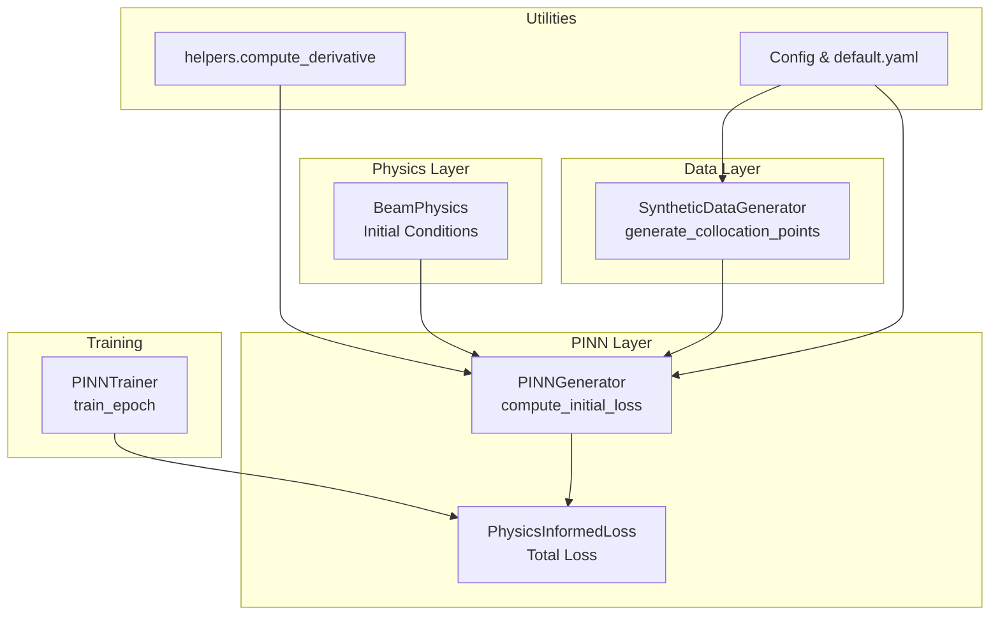
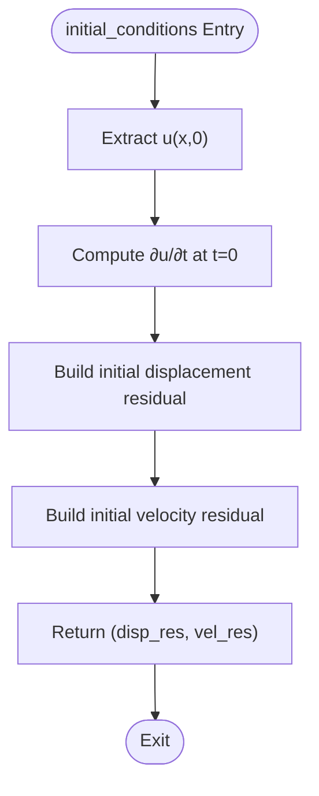
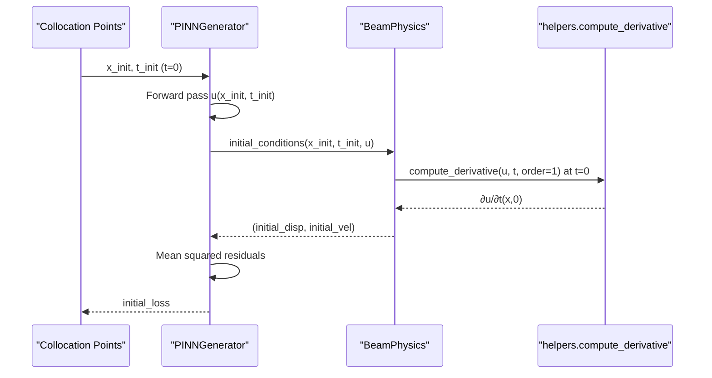
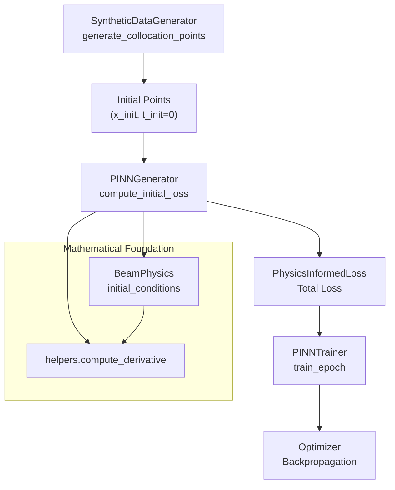
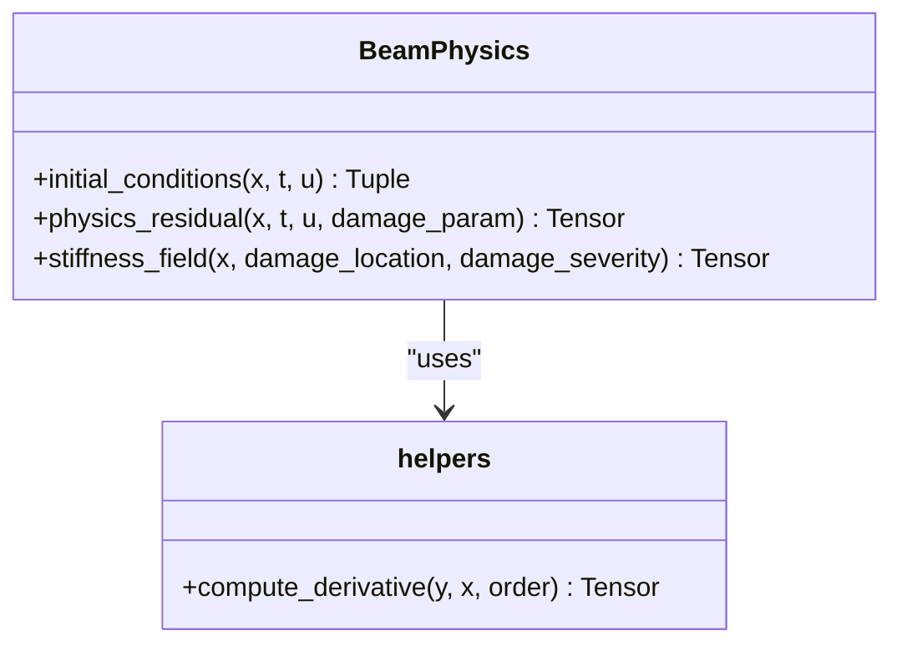
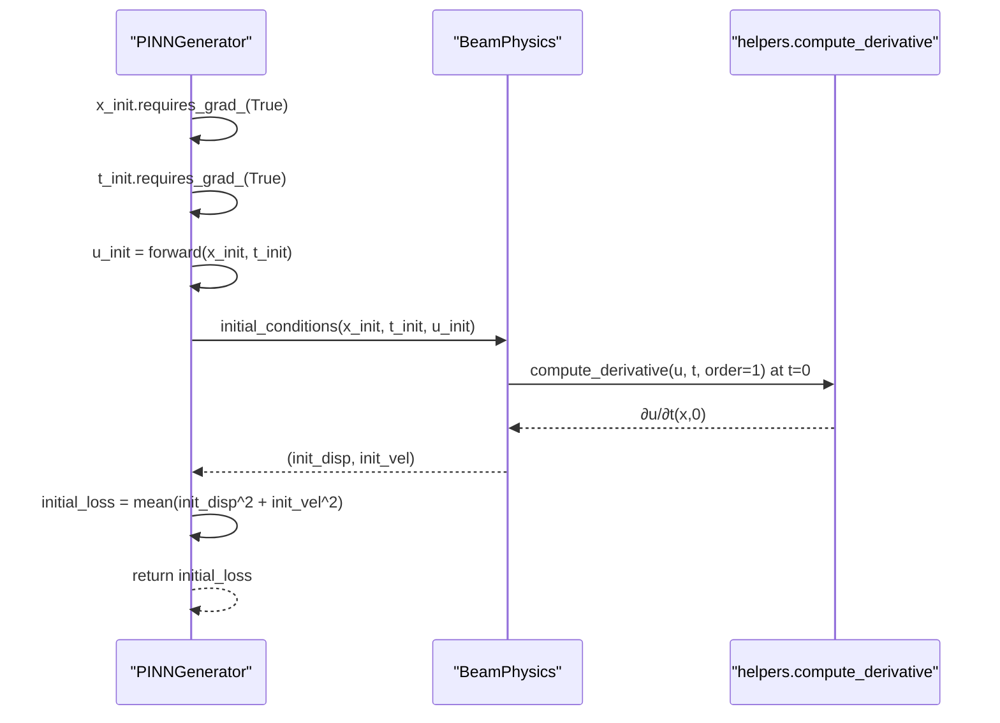
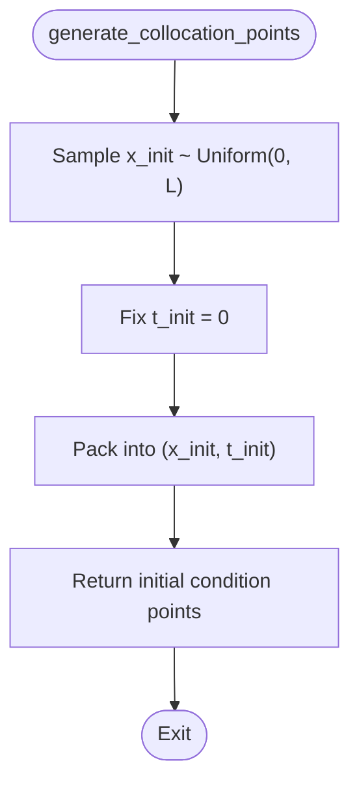
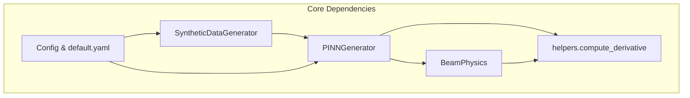

# Initial Condition Handling

<cite>
**Referenced Files in This Document**
- [beam_physics.py](file://gen-shm/src/models/beam_physics.py)
- [pinn_generator.py](file://gen-shm/src/models/pinn_generator.py)
- [data_generation.py](file://gen-shm/src/data/data_generation.py)
- [helpers.py](file://gen-shm/src/utils/helpers.py)
- [config.py](file://gen-shm/src/utils/config.py)
- [default.yaml](file://gen-shm/configs/default.yaml)
- [trainer.py](file://gen-shm/src/training/trainer.py)
- [surrogate_model.py](file://gen-shm/src/models/surrogate_model.py)
</cite>

## Table of Contents
1. [Introduction](#introduction)
2. [Project Structure](#project-structure)
3. [Core Components](#core-components)
4. [Architecture Overview](#architecture-overview)
5. [Detailed Component Analysis](#detailed-component-analysis)
6. [Dependency Analysis](#dependency-analysis)
7. [Performance Considerations](#performance-considerations)
8. [Troubleshooting Guide](#troubleshooting-guide)
9. [Conclusion](#conclusion)

## Introduction
This document provides comprehensive technical documentation for initial condition handling in the Physics-Informed Neural Network (PINN) framework used for drone wing structural health monitoring. It explains the mathematical formulation of initial conditions for beam vibration problems, the implementation of initial condition computation in the PINN generator, and how these conditions integrate with the physics loss function. The document covers temporal derivative handling, initial point generation strategies, constraint satisfaction verification, and optimization considerations for enforcing initial conditions effectively.

## Project Structure
The initial condition handling spans several modules:
- Physics engine: computes beam vibration dynamics and boundary conditions
- PINN generator: computes physics-informed loss and enforces initial conditions
- Data generation: creates collocation points including initial condition points
- Utilities: provides automatic differentiation and helper functions
- Configuration: defines training parameters including initial condition point counts

**Diagram sources**
- [beam_physics.py:202-223](file://gen-shm/src/models/beam_physics.py#L202-L223)
- [pinn_generator.py:214-239](file://gen-shm/src/models/pinn_generator.py#L214-L239)
- [data_generation.py:134-182](file://gen-shm/src/data/data_generation.py#L134-L182)
- [helpers.py:76-103](file://gen-shm/src/utils/helpers.py#L76-L103)
- [config.py:25-93](file://gen-shm/src/utils/config.py#L25-L93)
- [default.yaml:48-51](file://gen-shm/configs/default.yaml#L48-L51)
- [trainer.py:127-180](file://gen-shm/src/training/trainer.py#L127-L180)

**Section sources**
- [beam_physics.py:12-300](file://gen-shm/src/models/beam_physics.py#L12-L300)
- [pinn_generator.py:1-352](file://gen-shm/src/models/pinn_generator.py#L1-L352)
- [data_generation.py:1-384](file://gen-shm/src/data/data_generation.py#L1-L384)
- [helpers.py:1-161](file://gen-shm/src/utils/helpers.py#L1-L161)
- [config.py:1-123](file://gen-shm/src/utils/config.py#L1-L123)
- [default.yaml:1-100](file://gen-shm/configs/default.yaml#L1-L100)
- [trainer.py:1-392](file://gen-shm/src/training/trainer.py#L1-L392)

## Core Components
This section focuses on the core implementation of initial condition handling in the PINN framework.

### Mathematical Formulation of Initial Conditions
For beam vibration governed by the Euler-Bernoulli equation, the initial conditions are:
- Initial displacement: u(x, 0) = 0
- Initial velocity: ∂u/∂t(x, 0) = 0

These conditions enforce zero initial displacement and zero initial velocity across the spatial domain at t = 0.

**Section sources**
- [beam_physics.py:202-223](file://gen-shm/src/models/beam_physics.py#L202-L223)

### Implementation of initial_conditions Method
The initial conditions are computed in the BeamPhysics class:
- Extracts the subset of predictions where t = 0
- Computes the first temporal derivative at t = 0 for initial velocity
- Returns residuals for both initial displacement and initial velocity

**Diagram sources**
- [beam_physics.py:202-223](file://gen-shm/src/models/beam_physics.py#L202-L223)

**Section sources**
- [beam_physics.py:202-223](file://gen-shm/src/models/beam_physics.py#L202-L223)

### Initial Condition Loss Computation
The PINNGenerator computes the initial condition loss as mean squared residuals:
- Uses automatic differentiation to compute ∂u/∂t at t = 0
- Computes mean squared error for both displacement and velocity residuals
- Integrates with the total loss function alongside physics and boundary losses

**Diagram sources**
- [pinn_generator.py:214-239](file://gen-shm/src/models/pinn_generator.py#L214-L239)
- [beam_physics.py:202-223](file://gen-shm/src/models/beam_physics.py#L202-L223)
- [helpers.py:76-103](file://gen-shm/src/utils/helpers.py#L76-L103)

**Section sources**
- [pinn_generator.py:214-239](file://gen-shm/src/models/pinn_generator.py#L214-L239)
- [beam_physics.py:202-223](file://gen-shm/src/models/beam_physics.py#L202-L223)
- [helpers.py:76-103](file://gen-shm/src/utils/helpers.py#L76-L103)

### Integration with Physics Loss Function
The initial condition loss integrates seamlessly with the composite loss function:
- Included only when initial condition points are provided
- Combined with data fidelity, physics, and boundary losses
- Weighted according to training configuration

**Section sources**
- [pinn_generator.py:290-352](file://gen-shm/src/models/pinn_generator.py#L290-L352)
- [config.py:61-75](file://gen-shm/src/utils/config.py#L61-L75)
- [default.yaml:42-47](file://gen-shm/configs/default.yaml#L42-L47)

## Architecture Overview
The initial condition handling pipeline connects data generation, model computation, and training orchestration.

**Diagram sources**
- [data_generation.py:134-182](file://gen-shm/src/data/data_generation.py#L134-L182)
- [pinn_generator.py:214-239](file://gen-shm/src/models/pinn_generator.py#L214-L239)
- [pinn_generator.py:290-352](file://gen-shm/src/models/pinn_generator.py#L290-L352)
- [trainer.py:127-180](file://gen-shm/src/training/trainer.py#L127-L180)
- [beam_physics.py:202-223](file://gen-shm/src/models/beam_physics.py#L202-L223)
- [helpers.py:76-103](file://gen-shm/src/utils/helpers.py#L76-L103)

## Detailed Component Analysis

### BeamPhysics.initial_conditions Implementation
The BeamPhysics class implements the initial conditions computation:
- Extracts predictions at t = 0 using boolean indexing
- Computes first-order temporal derivatives using automatic differentiation
- Returns residuals for both initial displacement and initial velocity

**Diagram sources**
- [beam_physics.py:202-223](file://gen-shm/src/models/beam_physics.py#L202-L223)
- [helpers.py:76-103](file://gen-shm/src/utils/helpers.py#L76-L103)

**Section sources**
- [beam_physics.py:202-223](file://gen-shm/src/models/beam_physics.py#L202-L223)
- [helpers.py:76-103](file://gen-shm/src/utils/helpers.py#L76-L103)

### PINNGenerator.compute_initial_loss
The PINNGenerator encapsulates the initial condition loss computation:
- Requires gradient computation for temporal derivatives
- Performs forward pass and extracts initial condition residuals
- Computes mean squared error across initial condition points

**Diagram sources**
- [pinn_generator.py:214-239](file://gen-shm/src/models/pinn_generator.py#L214-L239)
- [beam_physics.py:202-223](file://gen-shm/src/models/beam_physics.py#L202-L223)
- [helpers.py:76-103](file://gen-shm/src/utils/helpers.py#L76-L103)

**Section sources**
- [pinn_generator.py:214-239](file://gen-shm/src/models/pinn_generator.py#L214-L239)
- [beam_physics.py:202-223](file://gen-shm/src/models/beam_physics.py#L202-L223)
- [helpers.py:76-103](file://gen-shm/src/utils/helpers.py#L76-L103)

### Data Generation and Point Sampling
Initial condition points are generated uniformly across the spatial domain at t = 0:
- Random spatial sampling within beam length
- Fixed temporal coordinate at zero
- Configurable point count for training stability

**Diagram sources**
- [data_generation.py:174-176](file://gen-shm/src/data/data_generation.py#L174-L176)

**Section sources**
- [data_generation.py:134-182](file://gen-shm/src/data/data_generation.py#L134-L182)
- [default.yaml:48-51](file://gen-shm/configs/default.yaml#L48-L51)

### Training Integration and Optimization
The initial condition loss participates in the training loop:
- Computed alongside physics and boundary losses
- Integrated into weighted total loss
- Updated automatically during backpropagation
- Supports gradient clipping for numerical stability

**Section sources**
- [pinn_generator.py:290-352](file://gen-shm/src/models/pinn_generator.py#L290-L352)
- [trainer.py:127-180](file://gen-shm/src/training/trainer.py#L127-L180)

## Dependency Analysis
Initial condition handling depends on several interconnected components:

**Diagram sources**
- [beam_physics.py:12-300](file://gen-shm/src/models/beam_physics.py#L12-L300)
- [pinn_generator.py:1-352](file://gen-shm/src/models/pinn_generator.py#L1-L352)
- [data_generation.py:1-384](file://gen-shm/src/data/data_generation.py#L1-L384)
- [helpers.py:1-161](file://gen-shm/src/utils/helpers.py#L1-L161)
- [config.py:1-123](file://gen-shm/src/utils/config.py#L1-L123)
- [default.yaml:1-100](file://gen-shm/configs/default.yaml#L1-L100)

Key dependency relationships:
- Data generation provides initial condition points to the model
- The model computes initial condition residuals using the physics engine
- Automatic differentiation enables temporal derivative computation
- Configuration controls point counts and training weights

**Section sources**
- [beam_physics.py:12-300](file://gen-shm/src/models/beam_physics.py#L12-L300)
- [pinn_generator.py:1-352](file://gen-shm/src/models/pinn_generator.py#L1-L352)
- [data_generation.py:1-384](file://gen-shm/src/data/data_generation.py#L1-L384)
- [helpers.py:1-161](file://gen-shm/src/utils/helpers.py#L1-L161)
- [config.py:1-123](file://gen-shm/src/utils/config.py#L1-L123)
- [default.yaml:1-100](file://gen-shm/configs/default.yaml#L1-L100)

## Performance Considerations
- Computational cost: Computing temporal derivatives at initial condition points adds minimal overhead compared to physics loss computation
- Memory usage: Initial condition points are small relative to physics points, so memory impact is modest
- Convergence: Proper weighting of initial condition loss prevents dominance over physics loss
- Numerical stability: Gradient clipping and careful point sampling improve training stability

## Troubleshooting Guide
Common issues and resolutions for initial condition handling:

### Issue: Initial condition loss not affecting training
- Verify initial condition points are included in training data
- Check that t_init values are exactly zero
- Confirm loss weights are appropriately configured

### Issue: Poor initial condition satisfaction
- Increase initial_condition_points count
- Adjust loss weights to give more emphasis to initial conditions
- Verify automatic differentiation is enabled for temporal derivatives

### Issue: Training instability with initial conditions
- Apply gradient clipping in the training loop
- Reduce learning rate temporarily
- Ensure proper normalization of input data

**Section sources**
- [pinn_generator.py:214-239](file://gen-shm/src/models/pinn_generator.py#L214-L239)
- [trainer.py:127-180](file://gen-shm/src/training/trainer.py#L127-L180)
- [config.py:61-75](file://gen-shm/src/utils/config.py#L61-L75)
- [default.yaml:42-47](file://gen-shm/configs/default.yaml#L42-L47)

## Conclusion
The initial condition handling in the PINN framework provides a robust foundation for enforcing physical constraints at t = 0. The implementation combines mathematical rigor with efficient computational practices, leveraging automatic differentiation and configurable training parameters. The modular design ensures that initial conditions integrate seamlessly with physics and boundary constraints, enabling accurate and stable training for beam vibration modeling applications.