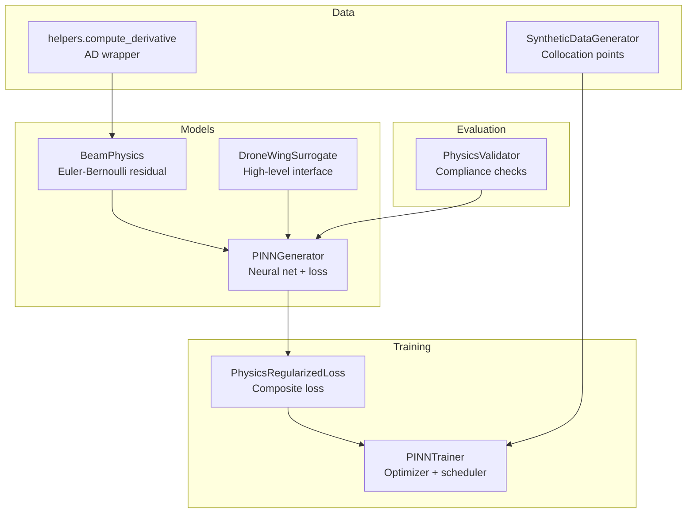
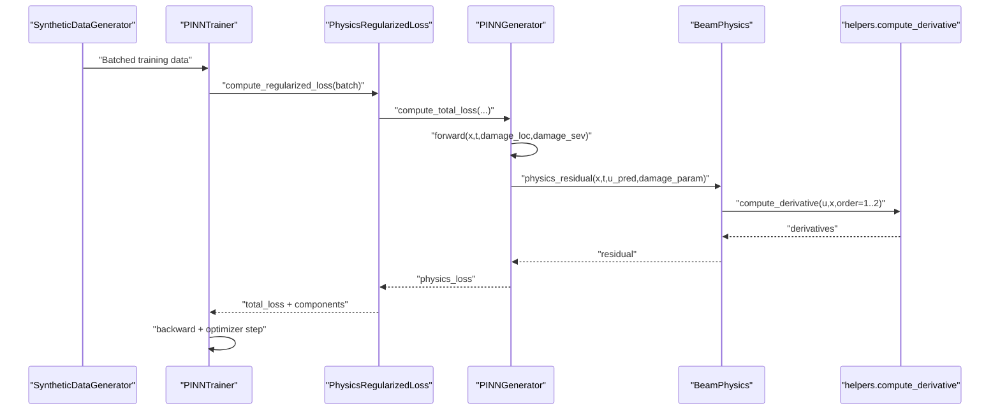
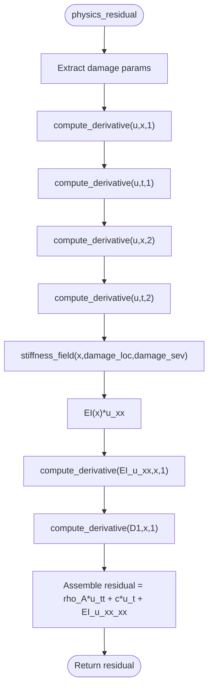
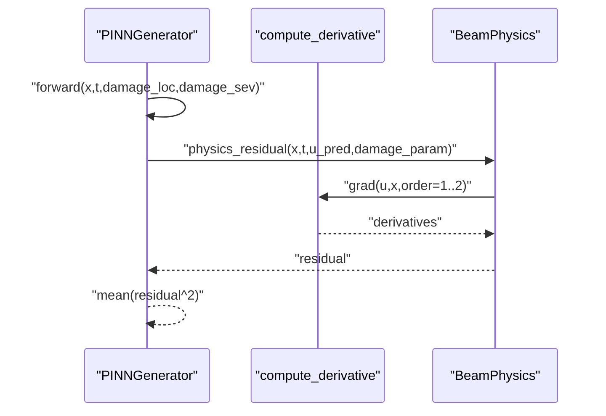
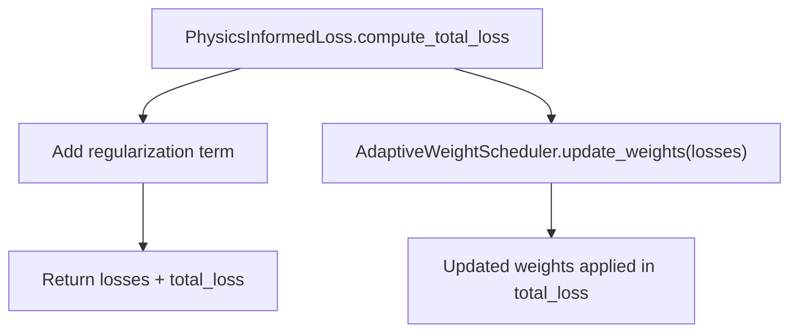
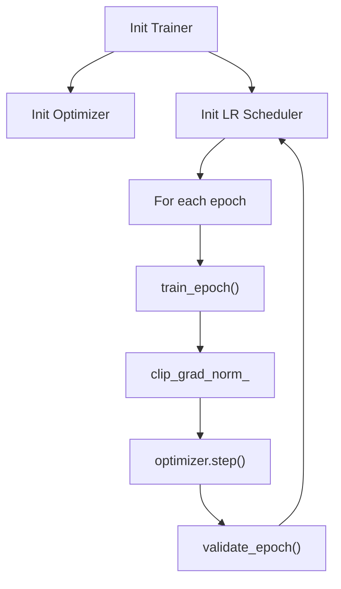
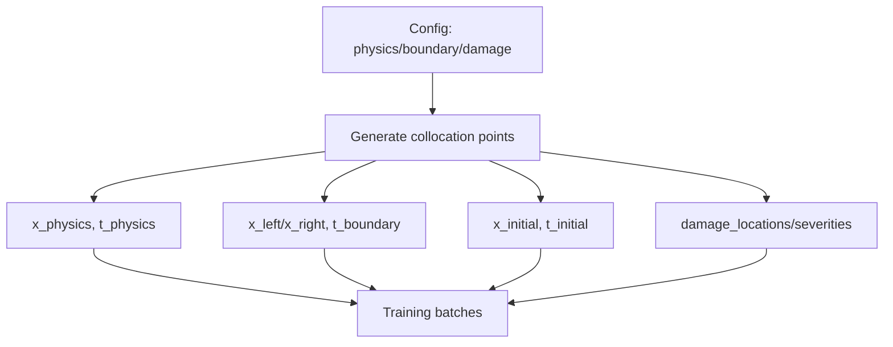
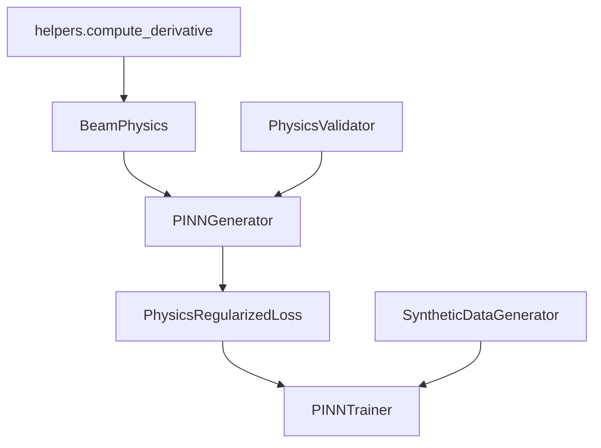

# Physics Integration

<cite>
**Referenced Files in This Document**
- [beam_physics.py](file://gen-shm/src/models/beam_physics.py)
- [pinn_generator.py](file://gen-shm/src/models/pinn_generator.py)
- [surrogate_model.py](file://gen-shm/src/models/surrogate_model.py)
- [loss_functions.py](file://gen-shm/src/training/loss_functions.py)
- [trainer.py](file://gen-shm/src/training/trainer.py)
- [helpers.py](file://gen-shm/src/utils/helpers.py)
- [data_generation.py](file://gen-shm/src/data/data_generation.py)
- [validation.py](file://gen-shm/src/evaluation/validation.py)
- [default.yaml](file://gen-shm/configs/default.yaml)
- [test_physics.py](file://gen-shm/tests/test_physics.py)
</cite>

## Table of Contents
1. [Introduction](#introduction)
2. [Project Structure](#project-structure)
3. [Core Components](#core-components)
4. [Architecture Overview](#architecture-overview)
5. [Detailed Component Analysis](#detailed-component-analysis)
6. [Dependency Analysis](#dependency-analysis)
7. [Performance Considerations](#performance-considerations)
8. [Troubleshooting Guide](#troubleshooting-guide)
9. [Conclusion](#conclusion)
10. [Appendices](#appendices)

## Introduction
This document explains the physics integration mechanisms in the PINN framework for drone wing structural health monitoring. It focuses on automatic differentiation for computing derivatives, Euler-Bernoulli beam theory-based physics residual calculation, boundary and initial condition enforcement, physics loss computation, collocation point utilization, and damage parameterization. It also covers numerical differentiation accuracy, gradient computation stability, and strategies for satisfying physics constraints during training.

## Project Structure
The physics integration spans several modules:
- Physics engine: Euler-Bernoulli beam with spatially varying stiffness and damage-aware residual computation
- PINN generator: Neural network that embeds physics via loss functions
- Training pipeline: Loss composition, adaptive weighting, and optimization
- Data generation: Collocation points for physics, boundary, and initial conditions
- Evaluation: Physics compliance checks and stability validation

**Diagram sources**
- [beam_physics.py:12-300](file://gen-shm/src/models/beam_physics.py#L12-L300)
- [pinn_generator.py:39-352](file://gen-shm/src/models/pinn_generator.py#L39-L352)
- [surrogate_model.py:15-337](file://gen-shm/src/models/surrogate_model.py#L15-L337)
- [loss_functions.py:63-167](file://gen-shm/src/training/loss_functions.py#L63-L167)
- [trainer.py:55-392](file://gen-shm/src/training/trainer.py#L55-L392)
- [helpers.py:76-103](file://gen-shm/src/utils/helpers.py#L76-L103)
- [data_generation.py:14-384](file://gen-shm/src/data/data_generation.py#L14-L384)
- [validation.py:16-376](file://gen-shm/src/evaluation/validation.py#L16-L376)

**Section sources**
- [beam_physics.py:12-300](file://gen-shm/src/models/beam_physics.py#L12-L300)
- [pinn_generator.py:39-352](file://gen-shm/src/models/pinn_generator.py#L39-L352)
- [surrogate_model.py:15-337](file://gen-shm/src/models/surrogate_model.py#L15-L337)
- [loss_functions.py:63-167](file://gen-shm/src/training/loss_functions.py#L63-L167)
- [trainer.py:55-392](file://gen-shm/src/training/trainer.py#L55-L392)
- [helpers.py:76-103](file://gen-shm/src/utils/helpers.py#L76-L103)
- [data_generation.py:14-384](file://gen-shm/src/data/data_generation.py#L14-L384)
- [validation.py:16-376](file://gen-shm/src/evaluation/validation.py#L16-L376)

## Core Components
- BeamPhysics: Implements Euler-Bernoulli beam residual, boundary conditions, initial conditions, and stiffness field with damage parameterization.
- PINNGenerator: Wraps the neural net, computes physics loss, boundary loss, and initial loss using automatic differentiation.
- PhysicsRegularizedLoss: Composes data fidelity, physics, and boundary losses with optional regularization and adaptive weighting.
- PINNTrainer: Manages training loop, optimizer, learning rate scheduling, gradient clipping, and monitoring.
- SyntheticDataGenerator: Produces collocation points for physics loss, boundary conditions, and initial conditions.
- helpers.compute_derivative: Provides first and second-order automatic differentiation via torch.autograd.grad.

**Section sources**
- [beam_physics.py:12-300](file://gen-shm/src/models/beam_physics.py#L12-L300)
- [pinn_generator.py:39-352](file://gen-shm/src/models/pinn_generator.py#L39-L352)
- [loss_functions.py:63-167](file://gen-shm/src/training/loss_functions.py#L63-L167)
- [trainer.py:55-392](file://gen-shm/src/training/trainer.py#L55-L392)
- [data_generation.py:14-384](file://gen-shm/src/data/data_generation.py#L14-L384)
- [helpers.py:76-103](file://gen-shm/src/utils/helpers.py#L76-L103)

## Architecture Overview
The PINN integrates physics through loss functions computed at collocation points. Automatic differentiation computes derivatives required by the Euler-Bernoulli residual, boundary conditions, and initial conditions. Damage parameters are embedded as inputs to the neural net and influence the stiffness field.

**Diagram sources**
- [data_generation.py:14-384](file://gen-shm/src/data/data_generation.py#L14-L384)
- [trainer.py:127-181](file://gen-shm/src/training/trainer.py#L127-L181)
- [loss_functions.py:73-105](file://gen-shm/src/training/loss_functions.py#L73-L105)
- [pinn_generator.py:299-352](file://gen-shm/src/models/pinn_generator.py#L299-L352)
- [beam_physics.py:107-150](file://gen-shm/src/models/beam_physics.py#L107-L150)
- [helpers.py:76-103](file://gen-shm/src/utils/helpers.py#L76-L103)

## Detailed Component Analysis

### BeamPhysics: Euler-Bernoulli residual, stiffness field, and boundary/initial conditions
- Governing equation: ρA ∂²u/∂t² + c ∂u/∂t + ∂²/∂x²[EI(x;d) ∂²u/∂x²] = 0
- Stiffness field EI(x;d) = EI₀ · (1 − d · φ(x)) with configurable damage function φ (gaussian or step)
- Boundary conditions: clamped, simply supported, free enforced at x=0 and x=L
- Initial conditions: u(x,0)=0 and ∂u/∂t(x,0)=0 enforced at t=0
- Energy conservation check: computes kinetic and strain energy densities and integrals

**Diagram sources**
- [beam_physics.py:107-150](file://gen-shm/src/models/beam_physics.py#L107-L150)
- [beam_physics.py:81-106](file://gen-shm/src/models/beam_physics.py#L81-L106)
- [helpers.py:76-103](file://gen-shm/src/utils/helpers.py#L76-L103)

**Section sources**
- [beam_physics.py:12-300](file://gen-shm/src/models/beam_physics.py#L12-L300)

### PINNGenerator: Physics loss, boundary loss, initial loss, and acceleration generation
- compute_physics_loss: Enables gradients, predicts u, stacks damage parameters, computes residual, returns mean squared residual
- compute_boundary_loss: Enforces BCs at x=0 and x=L using BeamPhysics.boundary_conditions
- compute_initial_loss: Enforces initial displacement and velocity at t=0
- generate_acceleration: Computes second time derivative using torch.autograd.grad twice

**Diagram sources**
- [pinn_generator.py:155-239](file://gen-shm/src/models/pinn_generator.py#L155-L239)
- [beam_physics.py:107-200](file://gen-shm/src/models/beam_physics.py#L107-L200)
- [helpers.py:76-103](file://gen-shm/src/utils/helpers.py#L76-L103)

**Section sources**
- [pinn_generator.py:155-239](file://gen-shm/src/models/pinn_generator.py#L155-L239)

### PhysicsRegularizedLoss and AdaptiveWeightScheduler
- PhysicsRegularizedLoss: Adds L2 regularization on weights to the base PhysicsInformedLoss
- AdaptiveWeightScheduler: Dynamically adjusts loss weights to balance data, physics, and boundary contributions

**Diagram sources**
- [loss_functions.py:63-116](file://gen-shm/src/training/loss_functions.py#L63-L116)
- [loss_functions.py:11-61](file://gen-shm/src/training/loss_functions.py#L11-L61)
- [pinn_generator.py:299-352](file://gen-shm/src/models/pinn_generator.py#L299-L352)

**Section sources**
- [loss_functions.py:63-116](file://gen-shm/src/training/loss_functions.py#L63-L116)
- [loss_functions.py:11-61](file://gen-shm/src/training/loss_functions.py#L11-L61)

### Training Pipeline: Optimizer, scheduler, gradient clipping, monitoring
- Optimizer: Adam, AdamW, or SGD with configurable weight decay
- Scheduler: CosineAnnealingLR or ReduceLROnPlateau
- Gradient clipping: clip_grad_norm_ to stabilize training
- Monitoring: Early stopping, learning rate updates, and history recording

**Diagram sources**
- [trainer.py:67-126](file://gen-shm/src/training/trainer.py#L67-L126)
- [trainer.py:127-181](file://gen-shm/src/training/trainer.py#L127-L181)
- [trainer.py:182-206](file://gen-shm/src/training/trainer.py#L182-L206)

**Section sources**
- [trainer.py:67-126](file://gen-shm/src/training/trainer.py#L67-L126)
- [trainer.py:127-181](file://gen-shm/src/training/trainer.py#L127-L181)
- [trainer.py:182-206](file://gen-shm/src/training/trainer.py#L182-L206)

### Collocation Point Utilization and Data Generation
- Collocation points: uniform sampling in space-time domain for physics loss
- Boundary points: x=0 and x=L with random t for BC enforcement
- Initial points: random x with t=0 for IC enforcement
- Damage scenarios: random locations and severities sampled within configured bounds

**Diagram sources**
- [data_generation.py:134-182](file://gen-shm/src/data/data_generation.py#L134-L182)
- [default.yaml:4-60](file://gen-shm/configs/default.yaml#L4-L60)

**Section sources**
- [data_generation.py:134-182](file://gen-shm/src/data/data_generation.py#L134-L182)
- [default.yaml:4-60](file://gen-shm/configs/default.yaml#L4-L60)

### Damage Parameterization and Constraint Satisfaction Strategies
- Damage parameterization: [location, severity] normalized to [0,1]; stiffness reduction via φ(x)
- Constraint satisfaction: enforced via physics loss (PDE residual), boundary loss (BCs), and initial loss (ICs)
- Robustness: regularization, gradient clipping, and adaptive weighting improve convergence and stability

**Section sources**
- [beam_physics.py:58-106](file://gen-shm/src/models/beam_physics.py#L58-L106)
- [pinn_generator.py:155-239](file://gen-shm/src/models/pinn_generator.py#L155-L239)
- [loss_functions.py:63-116](file://gen-shm/src/training/loss_functions.py#L63-L116)

## Dependency Analysis
Key dependencies and relationships:
- BeamPhysics depends on helpers.compute_derivative for automatic differentiation
- PINNGenerator composes BeamPhysics and uses it for residual computation
- PhysicsRegularizedLoss wraps PhysicsInformedLoss and adds regularization
- PINNTrainer orchestrates training with optimizer, scheduler, and monitoring
- SyntheticDataGenerator produces collocation points consumed by the training pipeline
- Evaluation module validates physics compliance and numerical stability

**Diagram sources**
- [beam_physics.py:8-9](file://gen-shm/src/models/beam_physics.py#L8-L9)
- [helpers.py:76-103](file://gen-shm/src/utils/helpers.py#L76-L103)
- [pinn_generator.py:9-11](file://gen-shm/src/models/pinn_generator.py#L9-L11)
- [loss_functions.py:157-158](file://gen-shm/src/training/loss_functions.py#L157-L158)
- [trainer.py:13-18](file://gen-shm/src/training/trainer.py#L13-L18)
- [data_generation.py:10-11](file://gen-shm/src/data/data_generation.py#L10-L11)
- [validation.py:11-13](file://gen-shm/src/evaluation/validation.py#L11-L13)

**Section sources**
- [beam_physics.py:8-9](file://gen-shm/src/models/beam_physics.py#L8-L9)
- [helpers.py:76-103](file://gen-shm/src/utils/helpers.py#L76-L103)
- [pinn_generator.py:9-11](file://gen-shm/src/models/pinn_generator.py#L9-L11)
- [loss_functions.py:157-158](file://gen-shm/src/training/loss_functions.py#L157-L158)
- [trainer.py:13-18](file://gen-shm/src/training/trainer.py#L13-L18)
- [data_generation.py:10-11](file://gen-shm/src/data/data_generation.py#L10-L11)
- [validation.py:11-13](file://gen-shm/src/evaluation/validation.py#L11-L13)

## Performance Considerations
- Automatic differentiation accuracy: First and second-order derivatives computed via torch.autograd.grad with create_graph and retain_graph to support higher-order derivatives
- Gradient computation stability: Gradient clipping (norm=1.0) prevents exploding gradients; regularization reduces overfitting
- Collocation point distribution: Uniform sampling across space-time improves coverage; increasing counts improves accuracy at the cost of compute
- Boundary and initial condition enforcement: Proper selection of BCs and ICs ensures well-posedness; mismatched constraints can cause divergence
- Numerical tolerance: Small tolerances prevent division by zero and ensure stable normalization

[No sources needed since this section provides general guidance]

## Troubleshooting Guide
Common issues and remedies:
- Exploding gradients: Enable gradient clipping and reduce learning rate; verify BC/IC enforcement
- Poor physics satisfaction: Increase physics loss weight; adjust collocation point density; validate with PhysicsValidator
- Instability in long-time simulations: Check numerical stability metrics; reduce learning rate; ensure proper BC/IC alignment
- Slow convergence: Use adaptive weighting; switch to cosine annealing or plateau scheduler; increase training epochs

**Section sources**
- [trainer.py:162-164](file://gen-shm/src/training/trainer.py#L162-L164)
- [validation.py:197-248](file://gen-shm/src/evaluation/validation.py#L197-L248)

## Conclusion
The PINN framework integrates Euler-Bernoulli beam physics via automatic differentiation and collocation-based loss functions. Damage parameterization influences stiffness, and boundary/initial conditions are enforced through dedicated losses. The training pipeline employs adaptive weighting, regularization, and gradient clipping to achieve stable convergence. Validation tools confirm physics compliance and numerical stability.

[No sources needed since this section summarizes without analyzing specific files]

## Appendices

### Examples and References
- Physics residual computation: [beam_physics.py:107-150](file://gen-shm/src/models/beam_physics.py#L107-L150)
- Boundary condition enforcement: [beam_physics.py:152-200](file://gen-shm/src/models/beam_physics.py#L152-L200)
- Initial condition implementation: [beam_physics.py:202-223](file://gen-shm/src/models/beam_physics.py#L202-L223)
- Collocation point generation: [data_generation.py:134-182](file://gen-shm/src/data/data_generation.py#L134-L182)
- Automatic differentiation wrapper: [helpers.py:76-103](file://gen-shm/src/utils/helpers.py#L76-L103)
- Unit tests for physics: [test_physics.py:26-73](file://gen-shm/tests/test_physics.py#L26-L73)