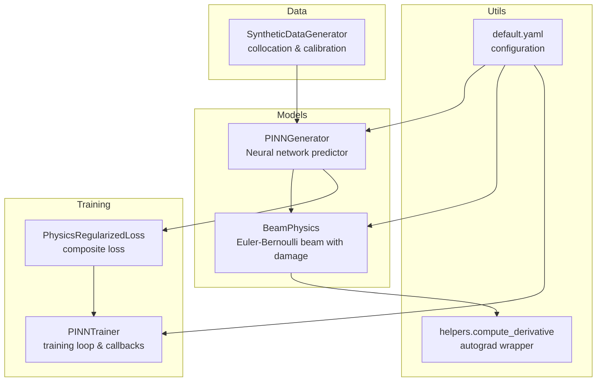
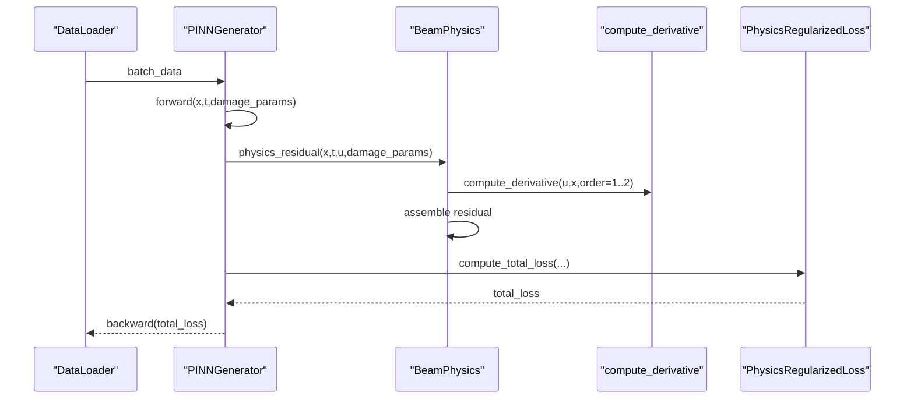
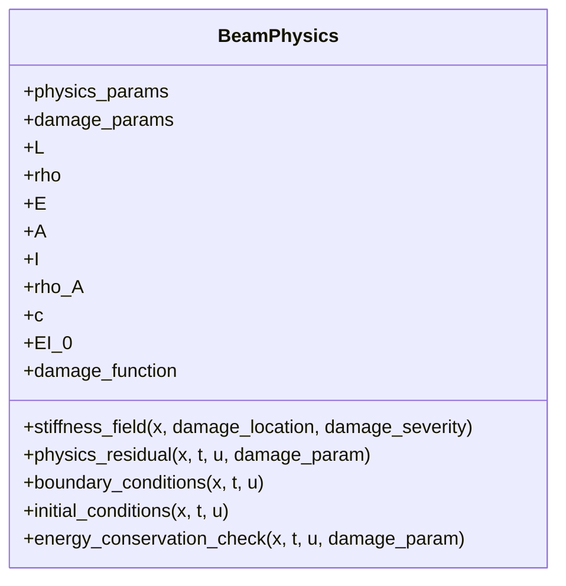
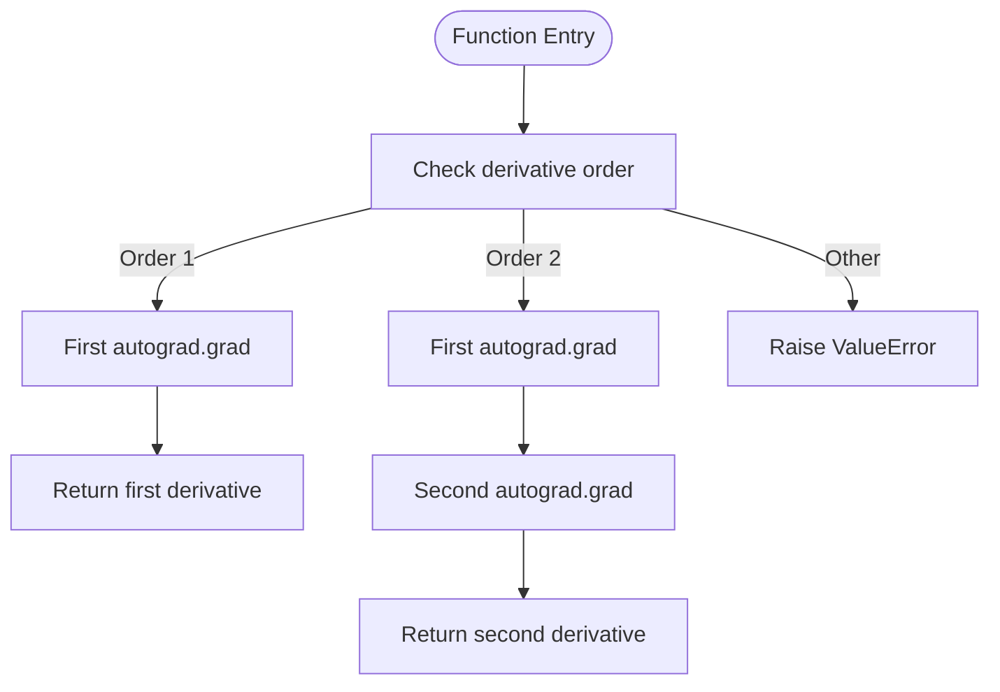
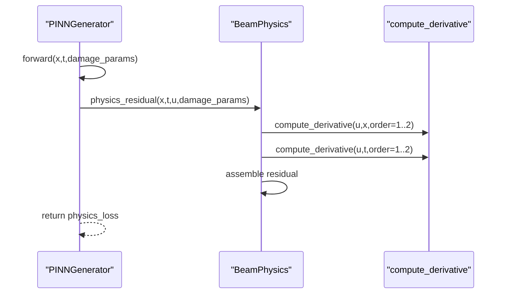
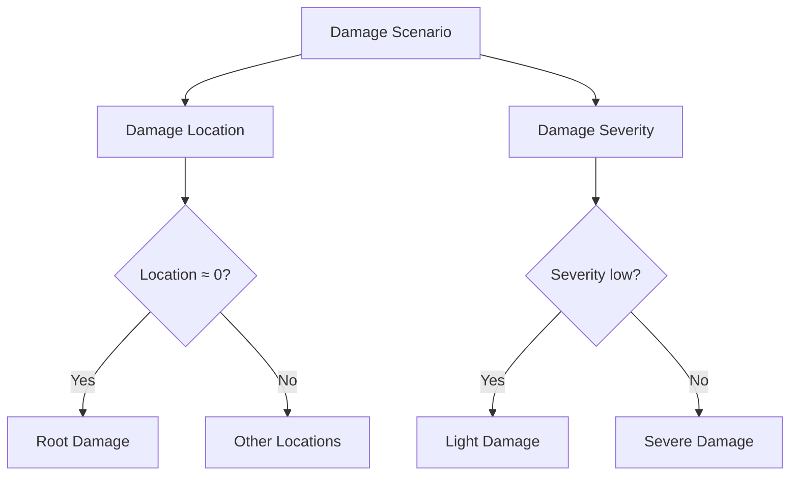
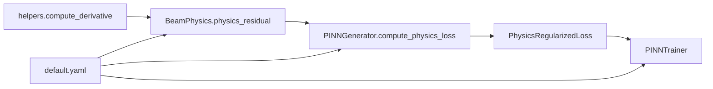

# Physics Residual Computation

<cite>
**Referenced Files in This Document**
- [beam_physics.py](file://gen-shm/src/models/beam_physics.py)
- [pinn_generator.py](file://gen-shm/src/models/pinn_generator.py)
- [helpers.py](file://gen-shm/src/utils/helpers.py)
- [default.yaml](file://gen-shm/configs/default.yaml)
- [test_physics.py](file://gen-shm/tests/test_physics.py)
- [trainer.py](file://gen-shm/src/training/trainer.py)
- [data_generation.py](file://gen-shm/src/data/data_generation.py)
</cite>

## Table of Contents
1. [Introduction](#introduction)
2. [Project Structure](#project-structure)
3. [Core Components](#core-components)
4. [Architecture Overview](#architecture-overview)
5. [Detailed Component Analysis](#detailed-component-analysis)
6. [Dependency Analysis](#dependency-analysis)
7. [Performance Considerations](#performance-considerations)
8. [Troubleshooting Guide](#troubleshooting-guide)
9. [Conclusion](#conclusion)
10. [Appendices](#appendices)

## Introduction
This document explains the physics residual computation in the PINN framework for Euler-Bernoulli beam dynamics with spatially varying stiffness due to damage. It focuses on:
- Automatic differentiation using torch.autograd to compute spatial and temporal derivatives
- Implementation of the physics_residual method in the BeamPhysics engine
- Gradient computation, derivative stacking, and residual assembly
- Examples of residual computation under different damage scenarios
- Numerical accuracy, computational efficiency, and stability considerations
- Higher-order derivatives, gradient flow stability, and physics constraint satisfaction verification

## Project Structure
The repository organizes the PINN-based structural health monitoring system into modular components:
- Physics engine: Euler-Bernoulli beam with damage-aware stiffness
- PINN generator: Neural network that predicts displacement u(x,t) conditioned on damage parameters
- Utilities: Automatic differentiation helper and configuration management
- Training: Loss composition, adaptive weighting, and optimization
- Data: Synthetic data generation and validation datasets

**Diagram sources**
- [beam_physics.py:12-300](file://gen-shm/src/models/beam_physics.py#L12-L300)
- [pinn_generator.py:39-352](file://gen-shm/src/models/pinn_generator.py#L39-L352)
- [helpers.py:76-104](file://gen-shm/src/utils/helpers.py#L76-L104)
- [default.yaml:1-100](file://gen-shm/configs/default.yaml#L1-L100)
- [trainer.py:55-392](file://gen-shm/src/training/trainer.py#L55-L392)
- [data_generation.py:14-384](file://gen-shm/src/data/data_generation.py#L14-L384)

**Section sources**
- [beam_physics.py:12-300](file://gen-shm/src/models/beam_physics.py#L12-L300)
- [pinn_generator.py:39-352](file://gen-shm/src/models/pinn_generator.py#L39-L352)
- [helpers.py:76-104](file://gen-shm/src/utils/helpers.py#L76-L104)
- [default.yaml:1-100](file://gen-shm/configs/default.yaml#L1-L100)
- [trainer.py:55-392](file://gen-shm/src/training/trainer.py#L55-L392)
- [data_generation.py:14-384](file://gen-shm/src/data/data_generation.py#L14-L384)

## Core Components
- BeamPhysics: Computes stiffness field with damage, assembles the Euler-Bernoulli residual, and enforces boundary/initial conditions.
- PINNGenerator: Wraps the physics engine inside a neural network, enabling automatic differentiation for derivatives and residual computation.
- helpers.compute_derivative: Provides robust first and second-order derivatives via torch.autograd with configurable graph creation and retention.
- Configuration: Defines beam geometry, material properties, boundary conditions, and training parameters.

Key responsibilities:
- Automatic differentiation: compute_derivative uses torch.autograd.grad with create_graph=True and retain_graph=True to support higher-order derivatives.
- Residual assembly: physics_residual computes ρA ∂²u/∂t² + c ∂u/∂t + ∂²/∂x²[EI(x;d) ∂²u/∂x²].
- Damage modeling: stiffness_field applies Gaussian or step-shaped damage influence to EI(x;d).

**Section sources**
- [beam_physics.py:12-300](file://gen-shm/src/models/beam_physics.py#L12-L300)
- [pinn_generator.py:155-240](file://gen-shm/src/models/pinn_generator.py#L155-L240)
- [helpers.py:76-104](file://gen-shm/src/utils/helpers.py#L76-L104)
- [default.yaml:4-86](file://gen-shm/configs/default.yaml#L4-L86)

## Architecture Overview
The PINN architecture embeds physics into the loss function. At each training iteration:
- Inputs: x, t, and damage parameters are stacked and passed through the PINN to predict u(x,t).
- Gradients: torch.autograd enables first and second derivatives with respect to x and t.
- Residual: The physics engine computes the residual and boundary/initial residuals.
- Loss: A weighted combination of data fidelity, physics, and boundary terms drives training.

**Diagram sources**
- [pinn_generator.py:155-240](file://gen-shm/src/models/pinn_generator.py#L155-L240)
- [beam_physics.py:107-150](file://gen-shm/src/models/beam_physics.py#L107-L150)
- [helpers.py:76-104](file://gen-shm/src/utils/helpers.py#L76-L104)
- [trainer.py:127-181](file://gen-shm/src/training/trainer.py#L127-L181)

## Detailed Component Analysis

### BeamPhysics Engine
The BeamPhysics engine encapsulates:
- Material and geometric properties (ρA, EI₀)
- Damage function selection (Gaussian or step)
- Stiffness field computation EI(x;d)
- Physics residual assembly
- Boundary and initial condition enforcement
- Energy conservation diagnostics

**Diagram sources**
- [beam_physics.py:12-300](file://gen-shm/src/models/beam_physics.py#L12-L300)

Key implementation highlights:
- Stiffness field: Normalizes x, evaluates damage influence, and computes EI(x;d) = EI₀(1 − d·φ(x)).
- Physics residual: Uses compute_derivative to obtain u_t, u_tt, u_x, u_xx, and assembles ∂²/∂x²[EI(x;d) ∂²u/∂x²].
- Boundary/Initial conditions: Enforce BCs and ICs via derivatives evaluated at boundaries and t=0.

**Section sources**
- [beam_physics.py:58-106](file://gen-shm/src/models/beam_physics.py#L58-L106)
- [beam_physics.py:107-150](file://gen-shm/src/models/beam_physics.py#L107-L150)
- [beam_physics.py:152-223](file://gen-shm/src/models/beam_physics.py#L152-L223)
- [beam_physics.py:225-258](file://gen-shm/src/models/beam_physics.py#L225-L258)

### Automatic Differentiation Wrapper
The compute_derivative function provides a unified interface for first and second derivatives using torch.autograd.grad with:
- grad_outputs=torch.ones_like(y)
- create_graph=True to keep gradients in the computational graph
- retain_graph=True to enable subsequent higher-order derivatives

**Diagram sources**
- [helpers.py:76-104](file://gen-shm/src/utils/helpers.py#L76-L104)

**Section sources**
- [helpers.py:76-104](file://gen-shm/src/utils/helpers.py#L76-L104)

### PINNGenerator and Residual Computation Pipeline
PINNGenerator integrates the physics engine into the training pipeline:
- Forward pass stacks [x, t, damage_location, damage_severity] and predicts u(x,t).
- compute_physics_loss sets requires_grad_(True) on x and t, runs forward, stacks damage parameters, and calls physics_residual.
- compute_boundary_loss and compute_initial_loss similarly require gradients and enforce constraints.

**Diagram sources**
- [pinn_generator.py:155-240](file://gen-shm/src/models/pinn_generator.py#L155-L240)
- [beam_physics.py:107-150](file://gen-shm/src/models/beam_physics.py#L107-L150)
- [helpers.py:76-104](file://gen-shm/src/utils/helpers.py#L76-L104)

**Section sources**
- [pinn_generator.py:155-240](file://gen-shm/src/models/pinn_generator.py#L155-L240)

### Damage Scenarios and Residual Examples
The system supports multiple damage scenarios:
- Healthy beam: damage_location and damage_severity near zero yield EI(x;d) ≈ EI₀.
- Root, center, and tip damage: different locations and severities produce distinct residual patterns.
- Validation scenarios: predefined configurations enable targeted evaluation.

**Diagram sources**
- [data_generation.py:281-318](file://gen-shm/src/data/data_generation.py#L281-L318)

**Section sources**
- [data_generation.py:184-210](file://gen-shm/src/data/data_generation.py#L184-L210)
- [data_generation.py:281-318](file://gen-shm/src/data/data_generation.py#L281-L318)

### Numerical Accuracy and Stability
- Automatic differentiation: Using create_graph=True and retain_graph=True ensures higher-order derivatives can be computed without recomputing lower-order ones.
- Gradient clipping: Applied in the training loop to stabilize gradient flow.
- Numerical tolerance: Configuration includes numerical tolerance settings for robustness.
- Multi-scale training: Gradually increasing resolution improves convergence and reduces numerical artifacts.

**Section sources**
- [helpers.py:88-101](file://gen-shm/src/utils/helpers.py#L88-L101)
- [trainer.py:162-163](file://gen-shm/src/training/trainer.py#L162-L163)
- [default.yaml:84-86](file://gen-shm/configs/default.yaml#L84-L86)
- [trainer.py:118-143](file://gen-shm/src/training/trainer.py#L118-L143)

## Dependency Analysis
The residual computation pipeline depends on:
- BeamPhysics for governing equation and boundary/initial conditions
- helpers.compute_derivative for automatic differentiation
- PINNGenerator for integrating physics into the loss
- Configuration for physical parameters and training settings

**Diagram sources**
- [beam_physics.py:107-150](file://gen-shm/src/models/beam_physics.py#L107-L150)
- [pinn_generator.py:155-240](file://gen-shm/src/models/pinn_generator.py#L155-L240)
- [helpers.py:76-104](file://gen-shm/src/utils/helpers.py#L76-L104)
- [default.yaml:4-86](file://gen-shm/configs/default.yaml#L4-L86)
- [trainer.py:55-91](file://gen-shm/src/training/trainer.py#L55-L91)

**Section sources**
- [beam_physics.py:107-150](file://gen-shm/src/models/beam_physics.py#L107-L150)
- [pinn_generator.py:155-240](file://gen-shm/src/models/pinn_generator.py#L155-L240)
- [helpers.py:76-104](file://gen-shm/src/utils/helpers.py#L76-L104)
- [default.yaml:4-86](file://gen-shm/configs/default.yaml#L4-L86)
- [trainer.py:55-91](file://gen-shm/src/training/trainer.py#L55-L91)

## Performance Considerations
- Efficient derivative computation: compute_derivative reuses intermediate gradients via retain_graph=True, reducing redundant computations.
- Graph construction: create_graph=True enables higher-order derivatives without recomputation overhead.
- Training stability: Gradient clipping prevents exploding gradients; adaptive weighting balances data and physics terms.
- Computational efficiency: Multi-scale training starts with coarse grids to accelerate convergence, then refines resolution.

[No sources needed since this section provides general guidance]

## Troubleshooting Guide
Common issues and remedies:
- Residual not near zero for known solutions: Verify boundary/initial conditions and ensure x and t have requires_grad_(True) before calling compute_physics_loss.
- Instability during training: Enable gradient clipping and adjust learning rate; consider adaptive weighting.
- Incorrect stiffness field: Confirm damage function type and parameter ranges in configuration.
- Boundary enforcement failures: Ensure boundary points align with configured BC types.

Validation references:
- Tests confirm stiffness field behavior for healthy and damaged beams and verify finite boundary residuals.

**Section sources**
- [test_physics.py:26-72](file://gen-shm/tests/test_physics.py#L26-L72)
- [beam_physics.py:152-223](file://gen-shm/src/models/beam_physics.py#L152-L223)

## Conclusion
The PINN framework embeds Euler-Bernoulli beam physics through automatic differentiation, enabling accurate residual computation with spatially varying stiffness due to damage. The BeamPhysics engine, integrated via PINNGenerator, assembles residuals and enforces boundary/initial conditions. Robust derivative computation, adaptive weighting, and multi-scale training contribute to numerical stability and efficient convergence. Validation tests confirm correctness of stiffness modeling and boundary enforcement.

[No sources needed since this section summarizes without analyzing specific files]

## Appendices

### Appendix A: Physics Residual Assembly Details
- Mass and damping terms: ρA ∂²u/∂t² and c ∂u/∂t
- Stiffness field: EI(x;d) computed from damage parameters
- Curvature term: ∂²/∂x²[EI(x;d) ∂²u/∂x²]
- Residual: sum of the above terms

**Section sources**
- [beam_physics.py:107-150](file://gen-shm/src/models/beam_physics.py#L107-L150)

### Appendix B: Higher-Order Derivatives and Acceleration Generation
- Acceleration generation uses second-order time derivatives via torch.autograd.grad with create_graph=True and retain_graph=True.
- This supports physics-informed acceleration-based SHM workflows.

**Section sources**
- [pinn_generator.py:241-272](file://gen-shm/src/models/pinn_generator.py#L241-L272)