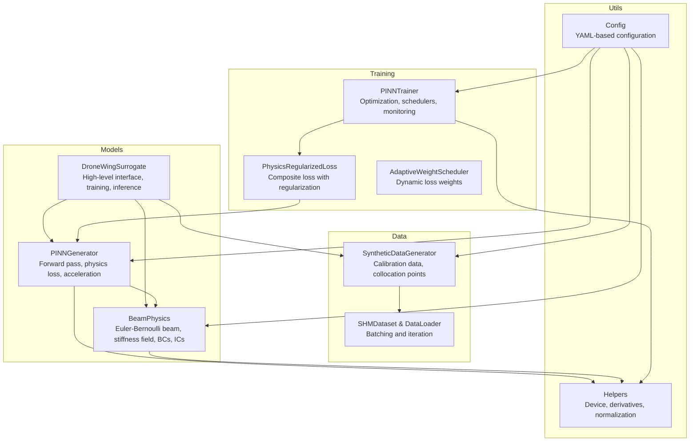
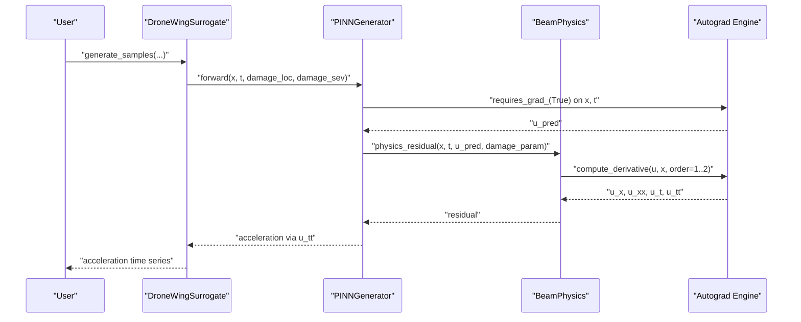
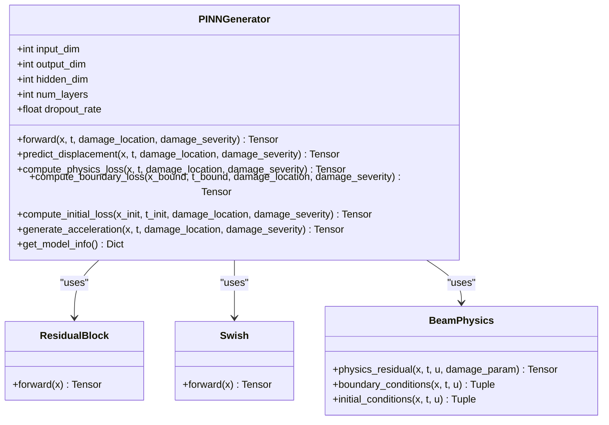
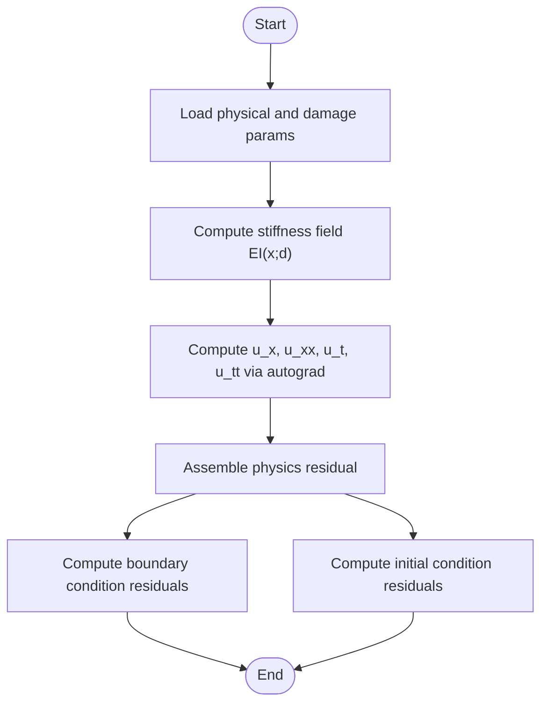
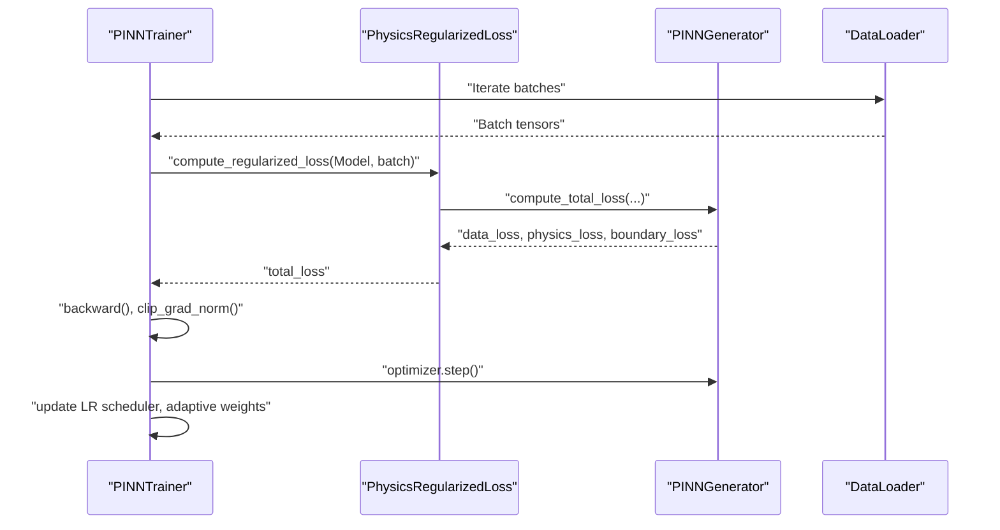
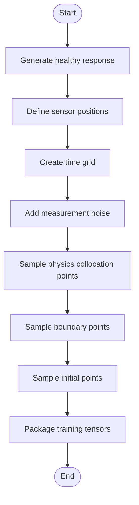
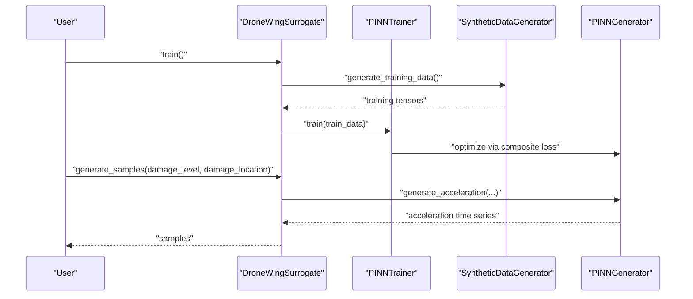
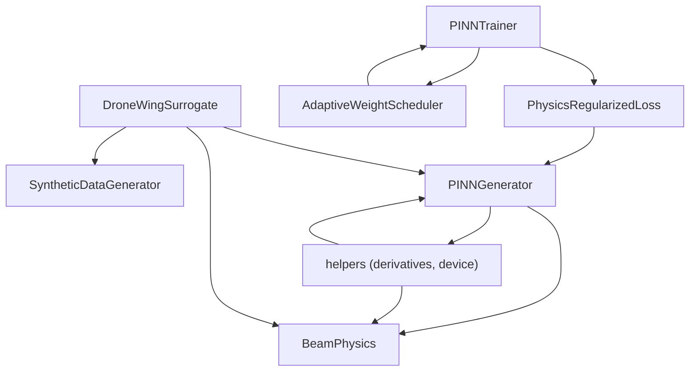

# Physics-Informed Neural Network

<cite>
**Referenced Files in This Document**
- [pinn_generator.py](file://gen-shm/src/models/pinn_generator.py)
- [beam_physics.py](file://gen-shm/src/models/beam_physics.py)
- [surrogate_model.py](file://gen-shm/src/models/surrogate_model.py)
- [loss_functions.py](file://gen-shm/src/training/loss_functions.py)
- [trainer.py](file://gen-shm/src/training/trainer.py)
- [data_generation.py](file://gen-shm/src/data/data_generation.py)
- [helpers.py](file://gen-shm/src/utils/helpers.py)
- [default.yaml](file://gen-shm/configs/default.yaml)
- [README.md](file://gen-shm/README.md)
- [test_physics.py](file://gen-shm/tests/test_physics.py)
</cite>

## Table of Contents
1. [Introduction](#introduction)
2. [Project Structure](#project-structure)
3. [Core Components](#core-components)
4. [Architecture Overview](#architecture-overview)
5. [Detailed Component Analysis](#detailed-component-analysis)
6. [Dependency Analysis](#dependency-analysis)
7. [Performance Considerations](#performance-considerations)
8. [Troubleshooting Guide](#troubleshooting-guide)
9. [Conclusion](#conclusion)
10. [Appendices](#appendices)

## Introduction
This document provides a comprehensive guide to the PINNGenerator class that implements physics-informed neural networks for structural health monitoring of drone wings. It explains the architecture that combines deep neural networks with physics constraints through automatic differentiation, details the forward pass, input/output tensor handling, GPU acceleration, and the physics loss computation integrating Euler–Bernoulli beam theory. It also covers the damage parameterization scheme, boundary condition enforcement, collocation point generation strategies, activation function selection, network depth/width configuration, optimization techniques, and practical examples for model inference, acceleration generation, and physics residual computation. Finally, it addresses numerical stability, gradient flow, and convergence optimization strategies.

## Project Structure
The Gen-SHM project organizes functionality into modular components:
- Models: PINN generator, beam physics engine, and surrogate model interface
- Training: Trainer, loss functions, and callbacks
- Data: Synthetic data generation and dataset utilities
- Utils: Configuration, helpers, and logging
- Configs: Default YAML configuration
- Experiments: Training and evaluation scripts
- Tests: Physics and integration tests

**Diagram sources**
- [surrogate_model.py:15-272](file://gen-shm/src/models/surrogate_model.py#L15-L272)
- [pinn_generator.py:39-352](file://gen-shm/src/models/pinn_generator.py#L39-L352)
- [beam_physics.py:12-300](file://gen-shm/src/models/beam_physics.py#L12-L300)
- [trainer.py:55-339](file://gen-shm/src/training/trainer.py#L55-L339)
- [loss_functions.py:11-167](file://gen-shm/src/training/loss_functions.py#L11-L167)
- [data_generation.py:14-384](file://gen-shm/src/data/data_generation.py#L14-L384)
- [helpers.py:11-161](file://gen-shm/src/utils/helpers.py#L11-L161)
- [default.yaml:1-100](file://gen-shm/configs/default.yaml#L1-L100)

**Section sources**
- [README.md:1-105](file://gen-shm/README.md#L1-L105)
- [default.yaml:1-100](file://gen-shm/configs/default.yaml#L1-L100)

## Core Components
- PINNGenerator: Implements the parametric neural network that predicts displacement u(x,t) conditioned on spatial and temporal coordinates and damage parameters. It computes physics-informed losses and generates acceleration time histories.
- BeamPhysics: Encodes Euler–Bernoulli beam dynamics with spatially varying stiffness due to damage, and provides residual computation, boundary conditions, and initial conditions.
- DroneWingSurrogate: High-level interface orchestrating training, inference, and validation.
- Training framework: Optimizers, schedulers, adaptive weighting, and regularization for robust convergence.
- Data generation: Synthetic calibration data, collocation points, and dataset utilities.

**Section sources**
- [pinn_generator.py:39-352](file://gen-shm/src/models/pinn_generator.py#L39-L352)
- [beam_physics.py:12-300](file://gen-shm/src/models/beam_physics.py#L12-L300)
- [surrogate_model.py:15-272](file://gen-shm/src/models/surrogate_model.py#L15-L272)
- [trainer.py:55-339](file://gen-shm/src/training/trainer.py#L55-L339)
- [loss_functions.py:11-167](file://gen-shm/src/training/loss_functions.py#L11-L167)
- [data_generation.py:14-384](file://gen-shm/src/data/data_generation.py#L14-L384)

## Architecture Overview
The system integrates a deep residual network with automatic differentiation to embed physics constraints directly into the loss landscape. The PINNGenerator takes inputs [x, t, damage_location, damage_severity] and outputs displacement u(x,t). Physics constraints are enforced via:
- Physics residual loss computed from Euler–Bernoulli beam dynamics
- Boundary condition loss enforcing left/right boundary constraints
- Initial condition loss enforcing u(x,0)=0 and ∂u/∂t(x,0)=0

**Diagram sources**
- [surrogate_model.py:48-129](file://gen-shm/src/models/surrogate_model.py#L48-L129)
- [pinn_generator.py:117-137](file://gen-shm/src/models/pinn_generator.py#L117-L137)
- [pinn_generator.py:155-185](file://gen-shm/src/models/pinn_generator.py#L155-L185)
- [beam_physics.py:107-150](file://gen-shm/src/models/beam_physics.py#L107-L150)
- [helpers.py:76-103](file://gen-shm/src/utils/helpers.py#L76-L103)

## Detailed Component Analysis

### PINNGenerator: Architecture and Forward Pass
- Input/Output:
  - Inputs: x (spatial), t (temporal), damage_location, damage_severity
  - Output: predicted displacement u(x,t)
- Network architecture:
  - Input layer → LayerNorm → Activation → Dropout (optional)
  - Residual blocks with LayerNorm and activation for improved gradient flow
  - Output linear layer
- Activation functions: Swish, SiLU, ReLU, Tanh selectable via configuration
- Device placement: Automatically moved to CUDA if available

**Diagram sources**
- [pinn_generator.py:39-107](file://gen-shm/src/models/pinn_generator.py#L39-L107)
- [pinn_generator.py:21-36](file://gen-shm/src/models/pinn_generator.py#L21-L36)
- [pinn_generator.py:14-18](file://gen-shm/src/models/pinn_generator.py#L14-L18)
- [beam_physics.py:12-57](file://gen-shm/src/models/beam_physics.py#L12-L57)

Key implementation highlights:
- Forward pass concatenates inputs and feeds through stacked residual blocks
- Physics loss requires gradients on x and t; computes residual via BeamPhysics
- Acceleration generation uses second-order autograd to compute ∂²u/∂t²

**Section sources**
- [pinn_generator.py:39-352](file://gen-shm/src/models/pinn_generator.py#L39-L352)

### BeamPhysics: Euler–Bernoulli Beam Theory and Damage Modeling
- Governing equation: ρA ∂²u/∂t² + c ∂u/∂t + ∂²/∂x²[EI(x;d) ∂²u/∂x²] = 0
- Stiffness field: EI(x;d) = EI₀ · (1 − d · φ(x)), where φ(x) is a Gaussian or step influence function
- Boundary conditions: Clamped, simply supported, or free enforced at x=0 and x=L
- Initial conditions: u(x,0)=0 and ∂u/∂t(x,0)=0
- Automatic differentiation used for computing first and second derivatives

**Diagram sources**
- [beam_physics.py:12-57](file://gen-shm/src/models/beam_physics.py#L12-L57)
- [beam_physics.py:81-106](file://gen-shm/src/models/beam_physics.py#L81-L106)
- [beam_physics.py:107-150](file://gen-shm/src/models/beam_physics.py#L107-L150)
- [beam_physics.py:152-223](file://gen-shm/src/models/beam_physics.py#L152-L223)
- [helpers.py:76-103](file://gen-shm/src/utils/helpers.py#L76-L103)

**Section sources**
- [beam_physics.py:12-300](file://gen-shm/src/models/beam_physics.py#L12-L300)
- [helpers.py:76-103](file://gen-shm/src/utils/helpers.py#L76-L103)

### Training Framework: Loss Functions, Optimization, and Scheduling
- Composite loss: data fidelity loss + physics loss + boundary loss (with configurable weights)
- Regularization: L2 on weights and optional physics regularization
- Adaptive weighting: Dynamically adjusts loss weights to balance contributions
- Optimization: Adam, AdamW, or SGD with cosine annealing or plateau LR scheduling
- Gradient clipping and early stopping for stability and convergence

**Diagram sources**
- [trainer.py:55-339](file://gen-shm/src/training/trainer.py#L55-L339)
- [loss_functions.py:63-116](file://gen-shm/src/training/loss_functions.py#L63-L116)
- [loss_functions.py:11-61](file://gen-shm/src/training/loss_functions.py#L11-L61)

**Section sources**
- [trainer.py:55-339](file://gen-shm/src/training/trainer.py#L55-L339)
- [loss_functions.py:11-167](file://gen-shm/src/training/loss_functions.py#L11-L167)

### Data Generation: Collocation Points and Calibration Data
- Healthy calibration data: Sparse sensor measurements synthesized from analytical beam modes with excitation signals
- Collocation points: Uniform sampling in space-time domain for physics loss; boundary and initial points
- Dataset and DataLoader: Handles batching and device placement

**Diagram sources**
- [data_generation.py:30-132](file://gen-shm/src/data/data_generation.py#L30-L132)
- [data_generation.py:134-182](file://gen-shm/src/data/data_generation.py#L134-L182)
- [data_generation.py:321-384](file://gen-shm/src/data/data_generation.py#L321-L384)

**Section sources**
- [data_generation.py:14-384](file://gen-shm/src/data/data_generation.py#L14-L384)

### Surrogate Model Interface: Training, Inference, and Validation
- High-level orchestration for training, inference, and physics validation
- Generates acceleration time series for given damage scenarios
- Validates physics compliance by measuring residual norms across test points

**Diagram sources**
- [surrogate_model.py:131-166](file://gen-shm/src/models/surrogate_model.py#L131-L166)
- [surrogate_model.py:48-129](file://gen-shm/src/models/surrogate_model.py#L48-L129)
- [surrogate_model.py:192-234](file://gen-shm/src/models/surrogate_model.py#L192-L234)

**Section sources**
- [surrogate_model.py:15-337](file://gen-shm/src/models/surrogate_model.py#L15-L337)

## Dependency Analysis
- PINNGenerator depends on BeamPhysics for residual computation and on helpers for automatic differentiation.
- Surrogate model composes PINNGenerator, BeamPhysics, and SyntheticDataGenerator.
- Trainer composes PhysicsRegularizedLoss and AdaptiveWeightScheduler and interacts with DataLoader.
- Configuration drives model architecture, training hyperparameters, and physics parameters.

**Diagram sources**
- [pinn_generator.py:8-11](file://gen-shm/src/models/pinn_generator.py#L8-L11)
- [beam_physics.py:8-9](file://gen-shm/src/models/beam_physics.py#L8-L9)
- [surrogate_model.py:8-12](file://gen-shm/src/models/surrogate_model.py#L8-L12)
- [trainer.py:13-18](file://gen-shm/src/training/trainer.py#L13-L18)
- [loss_functions.py:11-21](file://gen-shm/src/training/loss_functions.py#L11-L21)

**Section sources**
- [pinn_generator.py:8-11](file://gen-shm/src/models/pinn_generator.py#L8-L11)
- [beam_physics.py:8-9](file://gen-shm/src/models/beam_physics.py#L8-L9)
- [surrogate_model.py:8-12](file://gen-shm/src/models/surrogate_model.py#L8-L12)
- [trainer.py:13-18](file://gen-shm/src/training/trainer.py#L13-L18)
- [loss_functions.py:11-21](file://gen-shm/src/training/loss_functions.py#L11-L21)

## Performance Considerations
- GPU acceleration: Automatic device selection and tensor movement to CUDA if available
- Efficient derivatives: Single-pass autograd for first and second derivatives
- Residual blocks and LayerNorm improve gradient flow and training stability
- Adaptive loss weighting and gradient clipping prevent divergence
- Multi-scale training reduces computational cost initially and improves convergence

[No sources needed since this section provides general guidance]

## Troubleshooting Guide
Common issues and remedies:
- Instability or exploding gradients:
  - Enable gradient clipping and reduce learning rate
  - Use LayerNorm and residual blocks to stabilize training
- Poor physics compliance:
  - Increase physics loss weight and boundary loss weight
  - Verify boundary condition types and initial conditions
- Slow convergence:
  - Use cosine annealing or plateau LR scheduling
  - Apply adaptive weighting to balance loss contributions
- Numerical errors:
  - Ensure proper normalization of inputs and outputs
  - Validate stiffness field computation and damage influence function

**Section sources**
- [trainer.py:162-163](file://gen-shm/src/training/trainer.py#L162-L163)
- [loss_functions.py:11-61](file://gen-shm/src/training/loss_functions.py#L11-L61)
- [beam_physics.py:58-79](file://gen-shm/src/models/beam_physics.py#L58-L79)
- [helpers.py:106-124](file://gen-shm/src/utils/helpers.py#L106-L124)

## Conclusion
The PINNGenerator integrates a deep residual network with Euler–Bernoulli beam physics through automatic differentiation, enabling robust, data-efficient training for structural health monitoring. The system’s modular design supports flexible configuration, efficient GPU utilization, and comprehensive validation. By combining synthetic calibration data with physics-informed losses and adaptive optimization, it achieves strong generalization across damage scenarios and provides reliable acceleration predictions for inference.

[No sources needed since this section summarizes without analyzing specific files]

## Appendices

### Example Workflows

- Model inference and acceleration generation:
  - Use DroneWingSurrogate.generate_samples to produce acceleration time series for a given damage scenario
  - Internally, PINNGenerator.generate_acceleration computes ∂²u/∂t² via autograd

- Physics residual computation:
  - Call PINNGenerator.compute_physics_loss with x and t requiring gradients
  - BeamPhysics.physics_residual computes the residual using automatic differentiation

- Boundary and initial condition enforcement:
  - Use compute_boundary_loss and compute_initial_loss to enforce BCs and ICs
  - Boundary conditions configured via configuration (clamped, simply supported, free)

**Section sources**
- [surrogate_model.py:48-129](file://gen-shm/src/models/surrogate_model.py#L48-L129)
- [pinn_generator.py:155-239](file://gen-shm/src/models/pinn_generator.py#L155-L239)
- [beam_physics.py:152-223](file://gen-shm/src/models/beam_physics.py#L152-L223)

### Configuration Reference
- Model architecture: input_dim, output_dim, hidden_layers, hidden_dim, activation, dropout_rate
- Training: epochs, batch_size, learning_rate, optimizer, lr_scheduler, loss_weights
- Physics: beam_length, beam_width, beam_height, young_modulus, density, damping_coefficient, boundary_conditions
- Damage: min_severity, max_severity, location_range, damage_function
- Data: spatial_points, temporal_points, sensor_locations, noise_level, frequency_range

**Section sources**
- [default.yaml:25-86](file://gen-shm/configs/default.yaml#L25-L86)
- [config.py:25-93](file://gen-shm/src/utils/config.py#L25-L93)

### Validation and Testing
- Unit tests validate stiffness field computation, analytical solution residuals, and boundary conditions
- Physics compliance validation measures residual norms across test scenarios

**Section sources**
- [test_physics.py:18-96](file://gen-shm/tests/test_physics.py#L18-L96)
- [surrogate_model.py:192-234](file://gen-shm/src/models/surrogate_model.py#L192-L234)