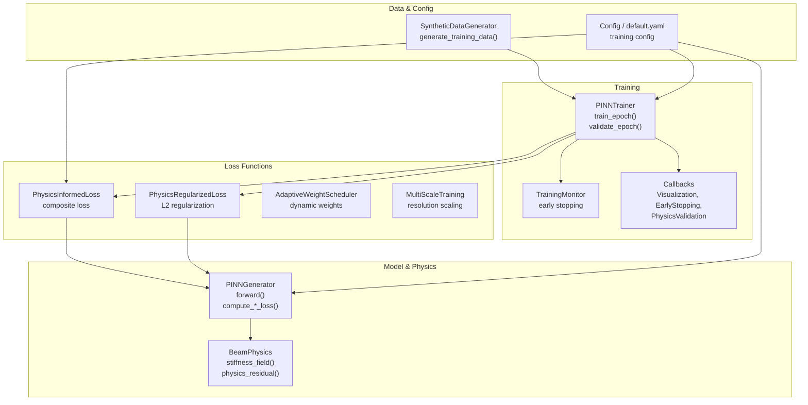
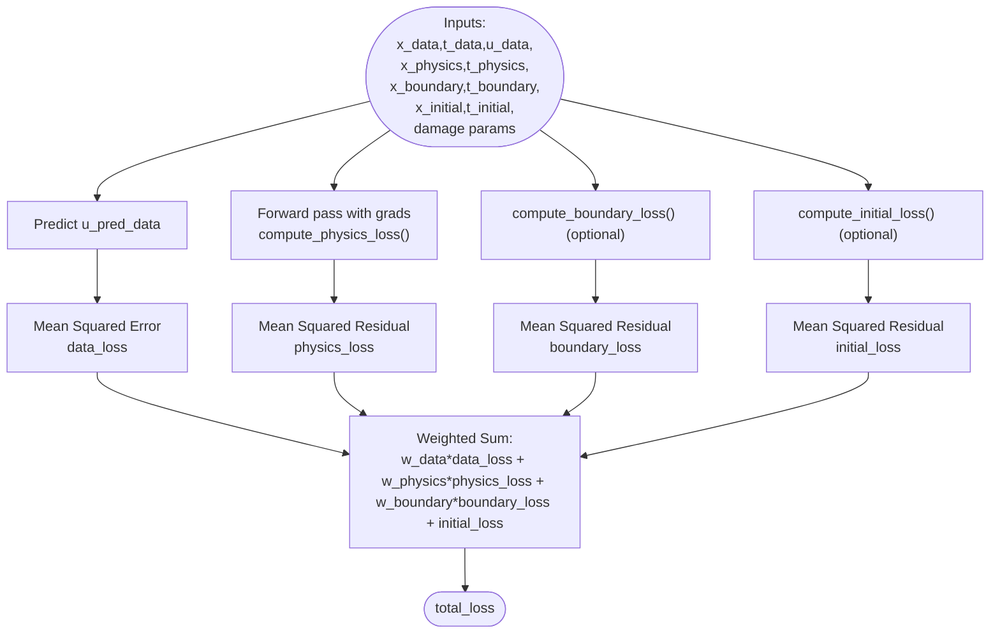
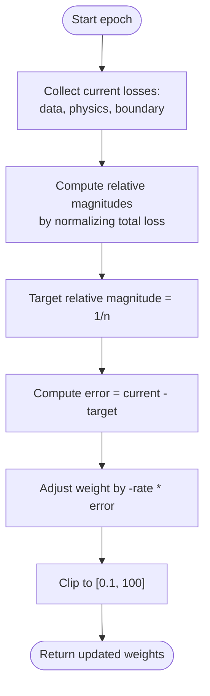
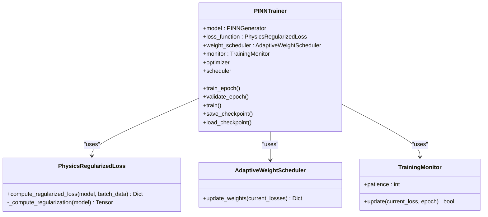
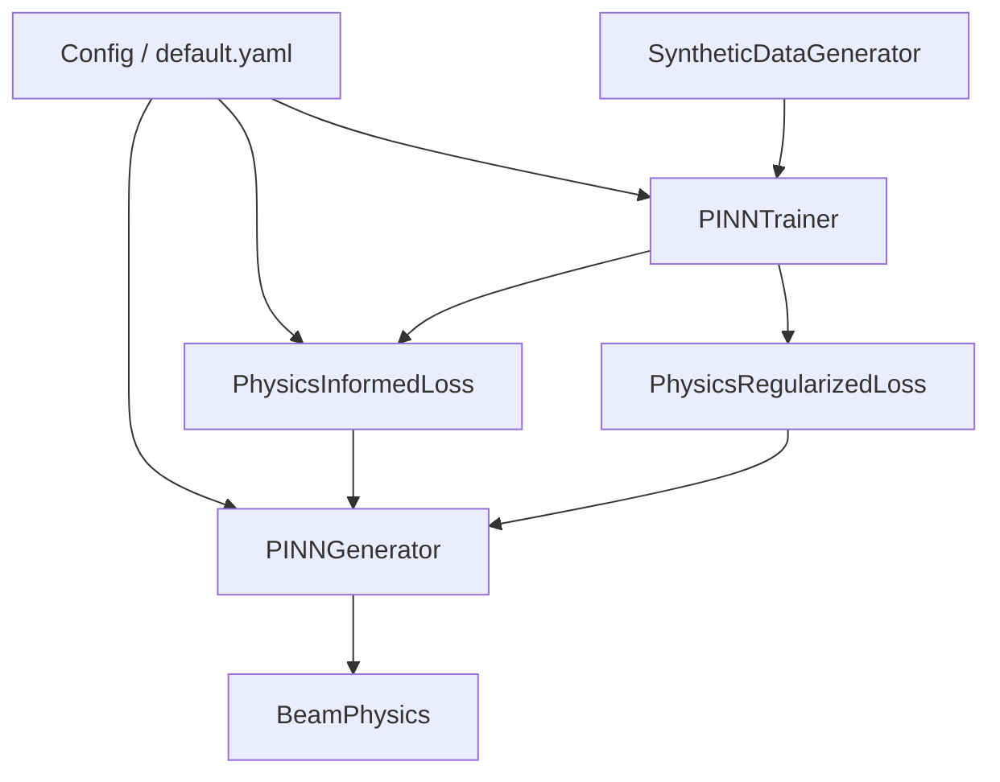

# Training Computation

<cite>
**Referenced Files in This Document**
- [loss_functions.py](file://gen-shm/src/training/loss_functions.py)
- [trainer.py](file://gen-shm/src/training/trainer.py)
- [pinn_generator.py](file://gen-shm/src/models/pinn_generator.py)
- [beam_physics.py](file://gen-shm/src/models/beam_physics.py)
- [config.py](file://gen-shm/src/utils/config.py)
- [default.yaml](file://gen-shm/configs/default.yaml)
- [data_generation.py](file://gen-shm/src/data/data_generation.py)
- [surrogate_model.py](file://gen-shm/src/models/surrogate_model.py)
- [callbacks.py](file://gen-shm/src/training/callbacks.py)
- [logger.py](file://gen-shm/src/utils/logger.py)
</cite>

## Table of Contents
1. [Introduction](#introduction)
2. [Project Structure](#project-structure)
3. [Core Components](#core-components)
4. [Architecture Overview](#architecture-overview)
5. [Detailed Component Analysis](#detailed-component-analysis)
6. [Dependency Analysis](#dependency-analysis)
7. [Performance Considerations](#performance-considerations)
8. [Troubleshooting Guide](#troubleshooting-guide)
9. [Conclusion](#conclusion)

## Introduction
This document explains the training computation components within the PINN framework, focusing on the composite loss function, weighted loss combination strategies, and training objective formulation. It documents the PhysicsInformedLoss class functionality, data fidelity loss calculation, and physics constraint balancing. It also covers loss weight configuration, multi-loss optimization, convergence criteria, examples of loss computation workflows, weight adjustment strategies, and training stability optimization, including loss function scaling, gradient flow management, and numerical conditioning during training.

## Project Structure
The training computation spans several modules:
- Training orchestration and optimization: PINNTrainer, TrainingMonitor, and callbacks
- Loss computation and composition: PhysicsInformedLoss, PhysicsRegularizedLoss, AdaptiveWeightScheduler, and MultiScaleTraining
- Model and physics: PINNGenerator and BeamPhysics
- Configuration and data generation: Config, default.yaml, and SyntheticDataGenerator
- Utilities: helpers for derivatives and device management, logger for experiment logging



**Diagram sources**
- [trainer.py:55-392](file://gen-shm/src/training/trainer.py#L55-L392)
- [loss_functions.py:118-167](file://gen-shm/src/training/loss_functions.py#L118-L167)
- [pinn_generator.py:290-352](file://gen-shm/src/models/pinn_generator.py#L290-L352)
- [beam_physics.py:12-300](file://gen-shm/src/models/beam_physics.py#L12-L300)
- [data_generation.py:211-263](file://gen-shm/src/data/data_generation.py#L211-L263)
- [config.py:10-123](file://gen-shm/src/utils/config.py#L10-L123)
- [default.yaml:34-87](file://gen-shm/configs/default.yaml#L34-L87)

**Section sources**
- [trainer.py:55-392](file://gen-shm/src/training/trainer.py#L55-L392)
- [loss_functions.py:118-167](file://gen-shm/src/training/loss_functions.py#L118-L167)
- [pinn_generator.py:290-352](file://gen-shm/src/models/pinn_generator.py#L290-L352)
- [beam_physics.py:12-300](file://gen-shm/src/models/beam_physics.py#L12-L300)
- [data_generation.py:211-263](file://gen-shm/src/data/data_generation.py#L211-L263)
- [config.py:10-123](file://gen-shm/src/utils/config.py#L10-L123)
- [default.yaml:34-87](file://gen-shm/configs/default.yaml#L34-L87)

## Core Components
- PhysicsInformedLoss: Computes the composite loss combining data fidelity, physics residual, boundary conditions, and initial conditions. It applies configurable weights to balance contributions.
- PhysicsRegularizedLoss: Adds L2 regularization on model weights to improve training stability and generalization.
- AdaptiveWeightScheduler: Dynamically adjusts loss weights based on current loss magnitudes to achieve balanced contributions among components.
- MultiScaleTraining: Gradually increases training resolution to improve convergence and robustness.
- PINNTrainer: Orchestrates training loops, optimizer/scheduler updates, gradient clipping, and logging/history recording.
- TrainingMonitor: Implements early stopping based on validation loss trends.
- BeamPhysics: Provides the governing equation residual and boundary/initial conditions for the beam with spatially varying stiffness.

Key configuration parameters affecting training:
- Training hyperparameters: epochs, batch_size, learning_rate, optimizer, lr_scheduler, loss_weights, and collocation point counts.
- Advanced options: multi-scale training, adaptive weighting, L2 regularization, gradient clipping, and numerical tolerance.

**Section sources**
- [pinn_generator.py:290-352](file://gen-shm/src/models/pinn_generator.py#L290-L352)
- [loss_functions.py:63-116](file://gen-shm/src/training/loss_functions.py#L63-L116)
- [loss_functions.py:11-61](file://gen-shm/src/training/loss_functions.py#L11-L61)
- [loss_functions.py:118-154](file://gen-shm/src/training/loss_functions.py#L118-L154)
- [trainer.py:55-392](file://gen-shm/src/training/trainer.py#L55-L392)
- [beam_physics.py:12-300](file://gen-shm/src/models/beam_physics.py#L12-L300)
- [config.py:10-123](file://gen-shm/src/utils/config.py#L10-L123)
- [default.yaml:34-87](file://gen-shm/configs/default.yaml#L34-L87)

## Architecture Overview
The training pipeline integrates data generation, model forward passes, physics computation, and loss composition. The trainer iterates over batches, computes the composite loss, performs backward propagation with gradient clipping, and updates weights. Loss weights are adapted dynamically, and optional multi-scale training modulates resolution.

```mermaid
sequenceDiagram
participant Loader as "DataLoader"
participant Trainer as "PINNTrainer"
participant Loss as "PhysicsRegularizedLoss"
participant Model as "PINNGenerator"
participant Physics as "BeamPhysics"
Loader->>Trainer : batch_data
Trainer->>Trainer : zero_grad()
Trainer->>Loss : compute_regularized_loss(model, batch_data)
Loss->>Model : predict_displacement(...)
Loss->>Model : compute_physics_loss(...)
Loss->>Model : compute_boundary_loss(...) (optional)
Loss->>Model : compute_initial_loss(...) (optional)
Model->>Physics : stiffness_field(...)
Physics-->>Model : EI(x;d)
Model-->>Loss : data_loss, physics_loss, boundary_loss, initial_loss
Loss-->>Trainer : total_loss
Trainer->>Trainer : backward(total_loss)
Trainer->>Trainer : clip_grad_norm_()
Trainer->>Trainer : optimizer.step()
Trainer-->>Loader : next batch
```

**Diagram sources**
- [trainer.py:127-180](file://gen-shm/src/training/trainer.py#L127-L180)
- [loss_functions.py:73-105](file://gen-shm/src/training/loss_functions.py#L73-L105)
- [pinn_generator.py:299-351](file://gen-shm/src/models/pinn_generator.py#L299-L351)
- [beam_physics.py:81-150](file://gen-shm/src/models/beam_physics.py#L81-L150)

## Detailed Component Analysis

### PhysicsInformedLoss: Composite Loss and Weighted Combination
PhysicsInformedLoss computes:
- Data fidelity loss: mean squared difference between predicted and observed displacement at sparse sensor locations.
- Physics loss: mean squared residual of the Euler-Bernoulli beam equation with spatially varying stiffness.
- Boundary loss: mean squared residuals of boundary conditions (left/right ends) when provided.
- Initial loss: mean squared residuals of initial conditions (displacement and velocity) when provided.

It then forms a weighted sum using configuration-specified weights for data, physics, and boundary terms. The initial loss is included when initial condition points are provided.



**Diagram sources**
- [pinn_generator.py:299-351](file://gen-shm/src/models/pinn_generator.py#L299-L351)
- [pinn_generator.py:155-239](file://gen-shm/src/models/pinn_generator.py#L155-L239)
- [beam_physics.py:107-150](file://gen-shm/src/models/beam_physics.py#L107-L150)

**Section sources**
- [pinn_generator.py:290-352](file://gen-shm/src/models/pinn_generator.py#L290-L352)
- [beam_physics.py:12-300](file://gen-shm/src/models/beam_physics.py#L12-L300)
- [config.py:67-71](file://gen-shm/src/utils/config.py#L67-L71)
- [default.yaml:42-46](file://gen-shm/configs/default.yaml#L42-L46)

### PhysicsRegularizedLoss: Stability Through Regularization
PhysicsRegularizedLoss wraps PhysicsInformedLoss and adds an L2 regularization term on model weights. This stabilizes training by penalizing large weights and reducing overfitting to the data term.

- Base loss computed via PhysicsInformedLoss.compute_total_loss
- Regularization computed as sum of squared weights scaled by a small strength
- Added to total loss with a fixed multiplier

**Section sources**
- [loss_functions.py:63-116](file://gen-shm/src/training/loss_functions.py#L63-L116)

### AdaptiveWeightScheduler: Dynamic Weight Balancing
AdaptiveWeightScheduler adjusts loss weights based on current loss magnitudes to balance contributions across data, physics, and boundary terms.

- Computes relative magnitudes of current losses
- Targets uniform contribution (equal relative share)
- Updates weights proportionally to deviation from target
- Clips weights to a safe range to prevent instability



**Diagram sources**
- [loss_functions.py:23-60](file://gen-shm/src/training/loss_functions.py#L23-L60)

**Section sources**
- [loss_functions.py:11-61](file://gen-shm/src/training/loss_functions.py#L11-L61)
- [trainer.py:261-267](file://gen-shm/src/training/trainer.py#L261-L267)

### MultiScaleTraining: Resolution Scaling Strategy
MultiScaleTraining starts with coarser resolution and progressively increases detail. This improves convergence by allowing the model to learn coarse patterns first.

- Tracks current scale and max scale
- Computes resolution parameters per scale using powers of two
- Increases scale periodically based on epoch intervals

**Section sources**
- [loss_functions.py:118-154](file://gen-shm/src/training/loss_functions.py#L118-L154)

### PINNTrainer: Training Loop, Optimization, and Monitoring
PINNTrainer orchestrates:
- Optimizer selection (Adam, AdamW, SGD) with configured weight decay
- Learning rate scheduling (CosineAnnealing or ReduceLROnPlateau)
- Per-epoch training and validation
- Gradient clipping to manage gradient explosion
- History recording and periodic logging
- Early stopping via TrainingMonitor



**Diagram sources**
- [trainer.py:55-392](file://gen-shm/src/training/trainer.py#L55-L392)
- [loss_functions.py:63-116](file://gen-shm/src/training/loss_functions.py#L63-L116)
- [loss_functions.py:11-61](file://gen-shm/src/training/loss_functions.py#L11-L61)

**Section sources**
- [trainer.py:55-392](file://gen-shm/src/training/trainer.py#L55-L392)

### Data Generation and Training Data Composition
SyntheticDataGenerator creates:
- Healthy calibration data with sparse sensor measurements
- Collocation points for physics, boundary, and initial conditions
- Damage scenarios with randomized locations and severities

These are packaged into training_data and consumed by the trainer.

**Section sources**
- [data_generation.py:211-263](file://gen-shm/src/data/data_generation.py#L211-L263)
- [surrogate_model.py:131-166](file://gen-shm/src/models/surrogate_model.py#L131-L166)

### Physics Engine: Stiffness Field and Residual
BeamPhysics defines:
- Spatially varying stiffness field EI(x;d) parameterized by Gaussian or step damage influence
- Physics residual assembly using second-order derivatives
- Boundary and initial conditions for different boundary types

**Section sources**
- [beam_physics.py:12-300](file://gen-shm/src/models/beam_physics.py#L12-L300)

## Dependency Analysis
The training computation exhibits clear separation of concerns:
- Trainer depends on loss functions and model
- Loss functions depend on model and configuration
- Model depends on physics engine and configuration
- Data generation supplies inputs to trainer
- Configuration drives all components



**Diagram sources**
- [trainer.py:67-75](file://gen-shm/src/training/trainer.py#L67-L75)
- [pinn_generator.py:295-297](file://gen-shm/src/models/pinn_generator.py#L295-L297)
- [data_generation.py:211-263](file://gen-shm/src/data/data_generation.py#L211-L263)
- [config.py:10-123](file://gen-shm/src/utils/config.py#L10-L123)
- [default.yaml:34-87](file://gen-shm/configs/default.yaml#L34-L87)

**Section sources**
- [trainer.py:67-75](file://gen-shm/src/training/trainer.py#L67-L75)
- [pinn_generator.py:295-297](file://gen-shm/src/models/pinn_generator.py#L295-L297)
- [data_generation.py:211-263](file://gen-shm/src/data/data_generation.py#L211-L263)
- [config.py:10-123](file://gen-shm/src/utils/config.py#L10-L123)
- [default.yaml:34-87](file://gen-shm/configs/default.yaml#L34-L87)

## Performance Considerations
- Gradient flow management:
  - Gradient clipping is applied to prevent exploding gradients during physics-informed training.
  - Residual blocks and layer normalization in the PINN architecture improve gradient flow.
- Numerical conditioning:
  - Automatic differentiation is used carefully; gradients are enabled only where needed.
  - Numerical tolerance and regularization help stabilize computations.
- Loss scaling:
  - Weights are tuned to balance data fidelity, physics, and boundary terms.
  - Adaptive weighting dynamically adjusts weights to maintain balanced contributions.
- Multi-scale training:
  - Starting with coarser resolution reduces computational cost and improves convergence.
- Early stopping and monitoring:
  - TrainingMonitor prevents unnecessary training by detecting plateauing loss.

[No sources needed since this section provides general guidance]

## Troubleshooting Guide
Common issues and remedies:
- Imbalanced loss components:
  - Symptoms: dominance of one loss term causing poor convergence.
  - Actions: adjust loss_weights, enable AdaptiveWeightScheduler, or increase boundary/initial weights.
- Exploding gradients:
  - Symptoms: NaNs or unstable loss spikes.
  - Actions: reduce learning rate, apply gradient clipping, or lower physics weight.
- Poor physics compliance:
  - Symptoms: high physics residual after training.
  - Actions: increase physics_points, adjust boundary conditions, or enable PhysicsRegularizedLoss.
- Slow convergence:
  - Symptoms: minimal improvement over many epochs.
  - Actions: enable multi-scale training, switch to AdamW, or increase batch size.

**Section sources**
- [trainer.py:162-163](file://gen-shm/src/training/trainer.py#L162-L163)
- [loss_functions.py:118-154](file://gen-shm/src/training/loss_functions.py#L118-L154)
- [loss_functions.py:63-116](file://gen-shm/src/training/loss_functions.py#L63-L116)
- [pinn_generator.py:155-239](file://gen-shm/src/models/pinn_generator.py#L155-L239)

## Conclusion
The training computation in the PINN framework combines data fidelity, physics constraints, and boundary/initial conditions through a configurable composite loss. PhysicsRegularizedLoss adds stability via L2 regularization, while AdaptiveWeightScheduler ensures balanced contributions across loss terms. MultiScaleTraining and gradient clipping improve convergence and numerical stability. Proper configuration of loss weights, optimizer, and scheduling, combined with careful data generation and monitoring, yields robust training outcomes.