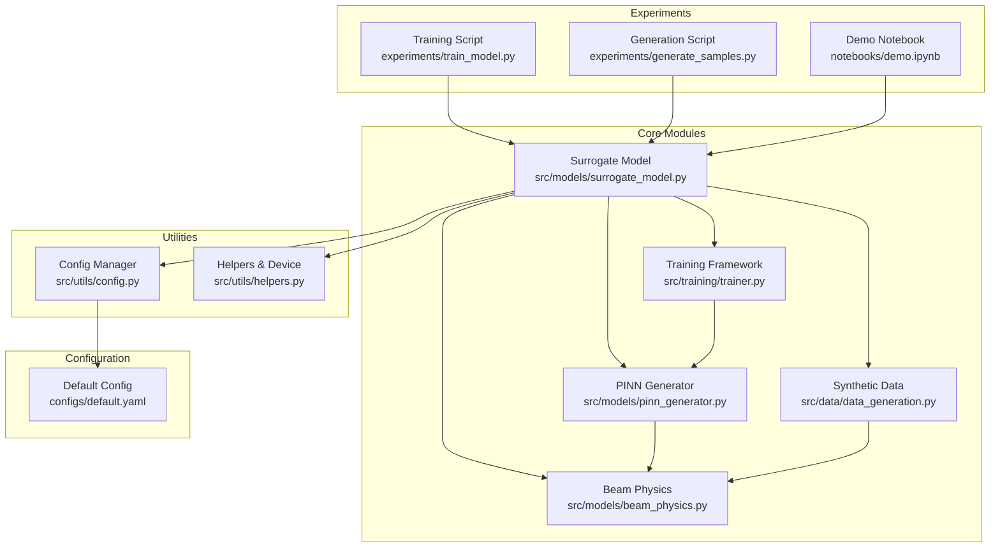
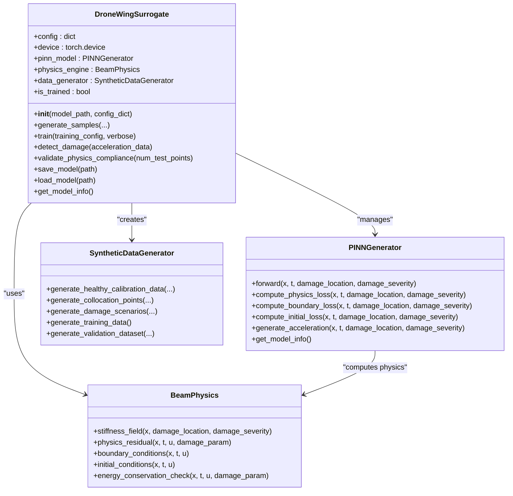
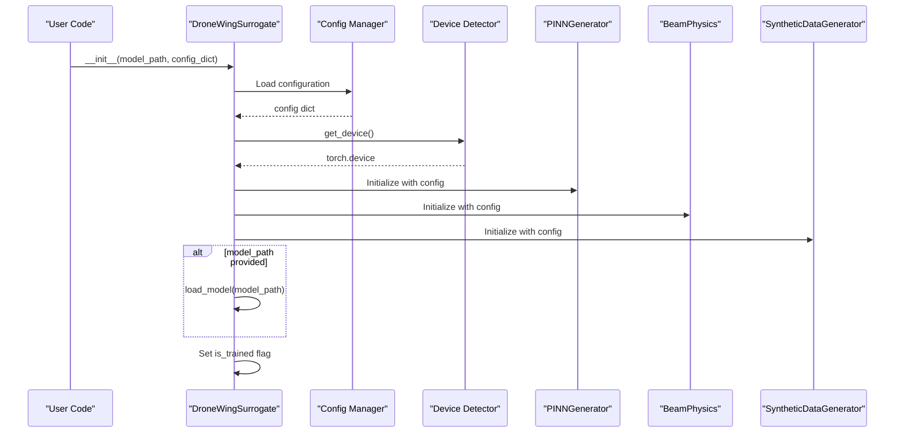
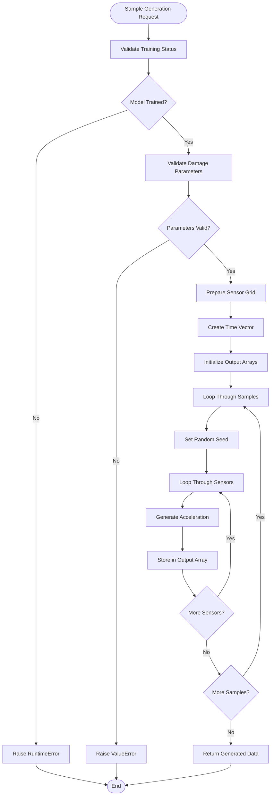
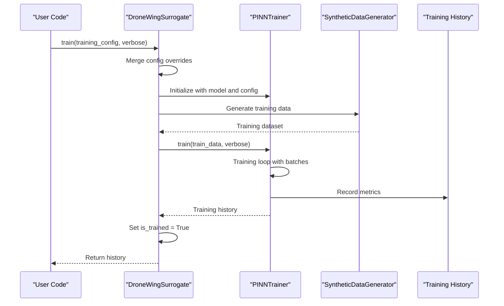
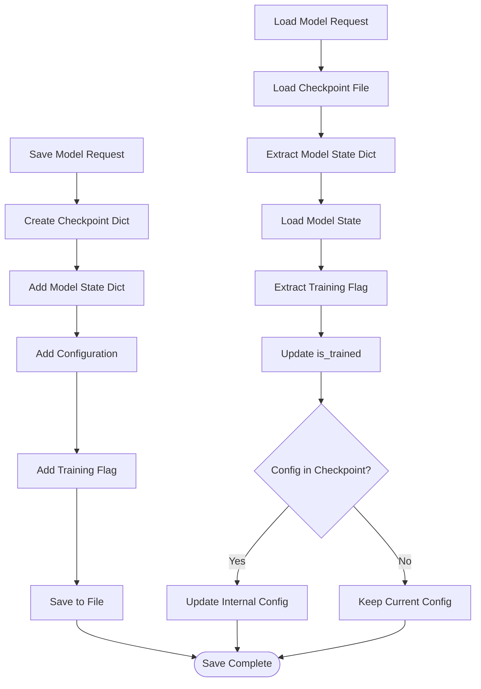
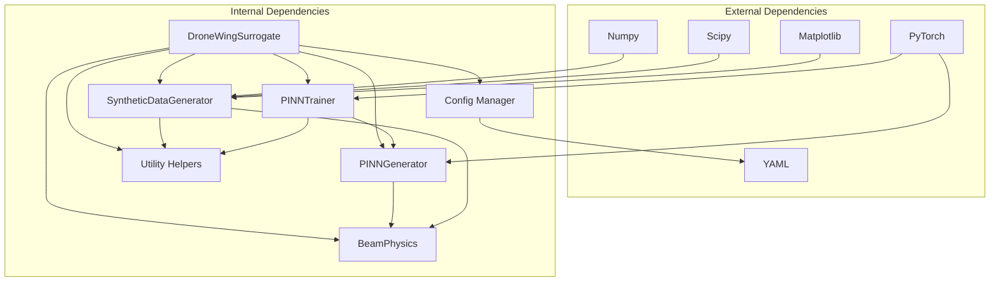

# Surrogate Model Interface

<cite>
**Referenced Files in This Document**
- [surrogate_model.py](file://src/models/surrogate_model.py)
- [pinn_generator.py](file://src/models/pinn_generator.py)
- [beam_physics.py](file://src/models/beam_physics.py)
- [data_generation.py](file://src/data/data_generation.py)
- [trainer.py](file://src/training/trainer.py)
- [config.py](file://src/utils/config.py)
- [helpers.py](file://src/utils/helpers.py)
- [default.yaml](file://configs/default.yaml)
- [train_model.py](file://experiments/train_model.py)
- [generate_samples.py](file://experiments/generate_samples.py)
- [demo.ipynb](file://notebooks/demo.ipynb)
- [README.md](file://README.md)
- [GETTING_STARTED.md](file://GETTING_STARTED.md)
</cite>

## Table of Contents
1. [Introduction](#introduction)
2. [Project Structure](#project-structure)
3. [Core Components](#core-components)
4. [Architecture Overview](#architecture-overview)
5. [Detailed Component Analysis](#detailed-component-analysis)
6. [Dependency Analysis](#dependency-analysis)
7. [Performance Considerations](#performance-considerations)
8. [Troubleshooting Guide](#troubleshooting-guide)
9. [Conclusion](#conclusion)
10. [Appendices](#appendices)

## Introduction
DroneWingSurrogate is the high-level interface orchestrating the entire Gen-SHM system. It serves as the main entry point for users, managing three core subsystems:
- PINN model: Physics-informed neural network generator that learns the solution operator across damage parameters
- Beam physics engine: Implements Euler-Bernoulli beam theory with spatially varying stiffness and boundary conditions
- Data generation: Provides synthetic training data and validation datasets

The class supports four primary workflows:
- Sample generation: Generate synthetic vibration data for arbitrary damage scenarios
- Model training: Train the PINN model on synthetic data with physics-informed loss
- Damage detection: Placeholder for damage assessment inference (future extension)
- Physics validation: Verify that the trained model satisfies physics constraints

## Project Structure
The Gen-SHM project follows a modular architecture organized by functional domains:



**Diagram sources**
- [surrogate_model.py:15-47](file://src/models/surrogate_model.py#L15-L47)
- [pinn_generator.py:39-86](file://src/models/pinn_generator.py#L39-L86)
- [beam_physics.py:12-57](file://src/models/beam_physics.py#L12-L57)
- [data_generation.py:14-29](file://src/data/data_generation.py#L14-L29)
- [trainer.py:55-91](file://src/training/trainer.py#L55-L91)
- [config.py:10-93](file://src/utils/config.py#L10-L93)
- [helpers.py:21-24](file://src/utils/helpers.py#L21-L24)

**Section sources**
- [README.md:41-55](file://README.md#L41-L55)
- [GETTING_STARTED.md:104-122](file://GETTING_STARTED.md#L104-L122)

## Core Components
The DroneWingSurrogate class provides a unified interface for the entire Gen-SHM system. Its core responsibilities include:

### Initialization and Configuration Management
- Accepts optional pretrained model path for immediate inference
- Supports custom configuration overrides via config_dict parameter
- Automatically detects and configures device (GPU/CPU) availability
- Initializes three core subsystems: PINN model, beam physics engine, and data generator

### Component Lifecycle Management
- Training status tracking through is_trained flag
- Model persistence with save/load functionality
- Automatic device placement for all components
- Configuration inheritance from global defaults with selective overrides

### Four Primary Workflows
1. **Sample Generation**: Generates synthetic vibration data for specified damage scenarios
2. **Model Training**: Trains PINN model with physics-informed loss functions
3. **Damage Detection**: Placeholder for future damage assessment capabilities
4. **Physics Validation**: Validates model compliance with Euler-Bernoulli beam equations

**Section sources**
- [surrogate_model.py:26-47](file://src/models/surrogate_model.py#L26-L47)
- [surrogate_model.py:131-167](file://src/models/surrogate_model.py#L131-L167)
- [surrogate_model.py:168-191](file://src/models/surrogate_model.py#L168-L191)
- [surrogate_model.py:192-235](file://src/models/surrogate_model.py#L192-L235)

## Architecture Overview
The system implements a layered architecture with clear separation of concerns:



**Diagram sources**
- [surrogate_model.py:15-274](file://src/models/surrogate_model.py#L15-L274)
- [pinn_generator.py:39-288](file://src/models/pinn_generator.py#L39-L288)
- [beam_physics.py:12-259](file://src/models/beam_physics.py#L12-L259)
- [data_generation.py:14-319](file://src/data/data_generation.py#L14-L319)

## Detailed Component Analysis

### DroneWingSurrogate Class
The main orchestrator class provides comprehensive functionality for the Gen-SHM system.

#### Initialization Process
The constructor handles three critical initialization phases:
1. Configuration loading and device detection
2. Component instantiation with shared configuration
3. Optional model loading from checkpoint



**Diagram sources**
- [surrogate_model.py:26-47](file://src/models/surrogate_model.py#L26-L47)
- [config.py:13-24](file://src/utils/config.py#L13-L24)
- [helpers.py:21-24](file://src/utils/helpers.py#L21-L24)

#### Sample Generation Workflow
The generate_samples method implements a sophisticated data generation pipeline:



**Diagram sources**
- [surrogate_model.py:48-130](file://src/models/surrogate_model.py#L48-L130)

#### Training Workflow
The train method coordinates the complete training process:



**Diagram sources**
- [surrogate_model.py:131-167](file://src/models/surrogate_model.py#L131-L167)
- [trainer.py:207-297](file://src/training/trainer.py#L207-L297)
- [data_generation.py:211-263](file://src/data/data_generation.py#L211-L263)

#### Model Persistence System
The save/load functionality ensures model portability and reproducibility:



**Diagram sources**
- [surrogate_model.py:236-254](file://src/models/surrogate_model.py#L236-L254)

**Section sources**
- [surrogate_model.py:26-47](file://src/models/surrogate_model.py#L26-L47)
- [surrogate_model.py:48-130](file://src/models/surrogate_model.py#L48-L130)
- [surrogate_model.py:131-167](file://src/models/surrogate_model.py#L131-L167)
- [surrogate_model.py:236-254](file://src/models/surrogate_model.py#L236-L254)

### PINN Generator Architecture
The PINNGenerator implements a physics-informed neural network with specialized loss functions:

#### Network Architecture
- Input dimension: 4 ([x, t, damage_location, damage_severity])
- Hidden layers: Configurable depth with residual connections
- Activation functions: Swish, SiLU, ReLU, or Tanh
- Output dimension: 1 (displacement field)

#### Physics-Informed Loss Functions
The generator computes multiple loss components:
- Data fidelity loss: Matches calibration data
- Physics loss: Enforces Euler-Bernoulli beam equations
- Boundary loss: Satisfies boundary conditions
- Initial loss: Enforces initial conditions

**Section sources**
- [pinn_generator.py:39-107](file://src/models/pinn_generator.py#L39-L107)
- [pinn_generator.py:155-240](file://src/models/pinn_generator.py#L155-L240)
- [pinn_generator.py:290-352](file://src/models/pinn_generator.py#L290-L352)

### Beam Physics Engine
Implements Euler-Bernoulli beam theory with damage parameterization:

#### Damage Modeling
Supports two damage influence functions:
- Gaussian: Smooth damage distribution with configurable width
- Step: Sharp damage representation within defined width

#### Boundary Conditions
Handles three boundary condition types:
- Left boundary: Clamped, simply supported, or free
- Right boundary: Free, clamped, or simply supported

#### Energy Conservation
Computes kinetic and strain energy for validation purposes.

**Section sources**
- [beam_physics.py:58-106](file://src/models/beam_physics.py#L58-L106)
- [beam_physics.py:152-200](file://src/models/beam_physics.py#L152-L200)
- [beam_physics.py:225-258](file://src/models/beam_physics.py#L225-L258)

### Data Generation Pipeline
Provides comprehensive synthetic data generation:

#### Healthy Calibration Data
- Generates sparse sensor measurements from undamaged wing response
- Uses analytical beam solutions for realistic excitation
- Adds configurable noise levels

#### Collocation Points
- Physics points: Uniform sampling in space-time domain
- Boundary points: Left and right boundary conditions
- Initial points: t=0 conditions

#### Damage Scenarios
- Random damage location and severity sampling
- Configurable severity ranges
- Support for multiple damage types

**Section sources**
- [data_generation.py:30-133](file://src/data/data_generation.py#L30-L133)
- [data_generation.py:134-183](file://src/data/data_generation.py#L134-L183)
- [data_generation.py:184-210](file://src/data/data_generation.py#L184-L210)
- [data_generation.py:211-263](file://src/data/data_generation.py#L211-L263)

### Training Framework
Comprehensive training infrastructure with advanced features:

#### Adaptive Loss Weighting
- Physics regularization with configurable strength
- Adaptive weight scheduler for dynamic loss balancing
- Multi-scale training progression

#### Optimization and Scheduling
- Multiple optimizer support (Adam, AdamW, SGD)
- Learning rate scheduling (Cosine annealing, Reduce on plateau)
- Gradient clipping for numerical stability

#### Monitoring and Logging
- Training progress monitoring with early stopping
- Comprehensive loss history tracking
- Experiment logging with timestamped directories

**Section sources**
- [trainer.py:55-91](file://src/training/trainer.py#L55-L91)
- [trainer.py:127-181](file://src/training/trainer.py#L127-L181)
- [trainer.py:207-297](file://src/training/trainer.py#L207-L297)

## Dependency Analysis
The system exhibits clean dependency management with clear separation of concerns:



**Diagram sources**
- [surrogate_model.py:5-12](file://src/models/surrogate_model.py#L5-L12)
- [pinn_generator.py:5-11](file://src/models/pinn_generator.py#L5-L11)
- [data_generation.py:5-11](file://src/data/data_generation.py#L5-L11)
- [trainer.py:5-18](file://src/training/trainer.py#L5-L18)
- [config.py:5-8](file://src/utils/config.py#L5-L8)

### Configuration Management
The configuration system provides flexible parameter management:

#### Configuration Hierarchy
1. Default configuration from YAML file
2. Runtime overrides via config_dict parameter
3. Training-specific overrides
4. Global configuration singleton

#### Device Management
Automatic device detection with fallback to CPU:
- CUDA availability check
- GPU selection with environment variables
- Consistent device placement across all components

**Section sources**
- [config.py:13-24](file://src/utils/config.py#L13-L24)
- [helpers.py:21-24](file://src/utils/helpers.py#L21-L24)
- [default.yaml:1-100](file://configs/default.yaml#L1-L100)

## Performance Considerations
The Gen-SHM system is designed for both performance and accuracy:

### Computational Efficiency
- Physics-informed training reduces sample requirements
- GPU acceleration for tensor computations
- Efficient automatic differentiation for derivatives
- Batch processing for data generation

### Memory Management
- Dynamic collocation point generation
- Configurable batch sizes for training
- Checkpoint-based model persistence
- Progressive model specialization

### Scalability Features
- Modular architecture allows component replacement
- Configurable network depths and widths
- Multi-scale training for progressive complexity
- Transfer learning capabilities for scenario specialization

## Troubleshooting Guide

### Common Initialization Issues
- **CUDA Out of Memory**: Reduce batch_size in configuration or use CPU
- **Missing Dependencies**: Ensure all requirements are installed
- **Configuration Errors**: Validate YAML syntax and parameter ranges

### Training Problems
- **Slow Convergence**: Adjust learning rates or increase physics weights
- **Poor Physics Compliance**: Increase physics loss weight or training epochs
- **Overfitting**: Add regularization or reduce model complexity

### Runtime Errors
- **Untrained Model**: Call train() before generate_samples()
- **Invalid Parameters**: Ensure damage parameters within valid ranges
- **Device Mismatch**: Check CUDA availability and memory allocation

### Input Validation
The system implements comprehensive input validation:
- Damage level validation (0.0 to 1.0 range)
- Damage location validation (0.0 to 1.0 range)
- Training status verification
- Device compatibility checks

**Section sources**
- [surrogate_model.py:71-79](file://src/models/surrogate_model.py#L71-L79)
- [surrogate_model.py:202-203](file://src/models/surrogate_model.py#L202-L203)
- [GETTING_STARTED.md:212-227](file://GETTING_STARTED.md#L212-L227)

## Conclusion
DroneWingSurrogate provides a comprehensive, production-ready interface for the Gen-SHM system. Its design emphasizes:

- **User-Friendly Interface**: Simple API with sensible defaults
- **Physics-Grounded Learning**: Built-in physical constraints ensure realistic outputs
- **Flexible Configuration**: Extensive customization options for diverse applications
- **Production Readiness**: Robust training, validation, and deployment capabilities

The system successfully bridges the gap between theoretical physics and practical engineering applications, enabling zero-shot damage detection for drone wing structural health monitoring.

## Appendices

### Practical Usage Examples

#### Quick Training and Generation
```python
from src.models.surrogate_model import quick_train_and_generate

# Generate 25 samples with 20% damage at wing root
samples = quick_train_and_generate(
    damage_level=0.2,
    damage_location=0.0,
    num_samples=25
)
```

#### Multiple Damage Scenarios
```python
from src.models.surrogate_model import demo_damage_scenarios

# Generate samples for multiple scenarios
scenarios = demo_damage_scenarios()
for scenario in scenarios:
    print(f"Scenario: {scenario['scenario_name']}")
    print(f"Damage Level: {scenario['damage_info']['level']}")
    print(f"Damage Location: {scenario['damage_info']['location']}")
```

#### Full Training Workflow
```python
from src.models.surrogate_model import DroneWingSurrogate

# Initialize and train
surrogate = DroneWingSurrogate()
history = surrogate.train(verbose=True)

# Generate samples
samples = surrogate.generate_samples(
    damage_level=0.15,
    damage_location=0.3,
    num_samples=50
)

# Save model
surrogate.save_model('my_trained_model.pt')

# Load model
surrogate_loaded = DroneWingSurrogate(model_path='my_trained_model.pt')
```

### Configuration Reference
Key configuration parameters include:
- **Physics**: Beam dimensions, material properties, boundary conditions
- **Damage**: Severity ranges, damage function types
- **Model**: Network architecture, activation functions, dropout rates
- **Training**: Hyperparameters, loss weights, collocation point counts
- **Data**: Sensor configurations, noise levels, frequency ranges

**Section sources**
- [GETTING_STARTED.md:26-242](file://GETTING_STARTED.md#L26-L242)
- [default.yaml:4-100](file://configs/default.yaml#L4-L100)