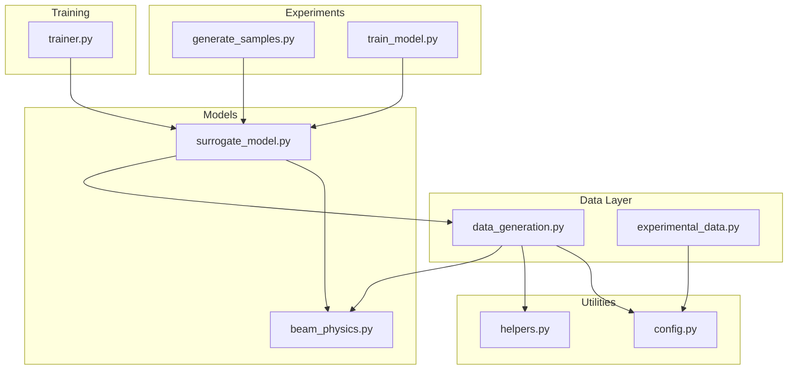
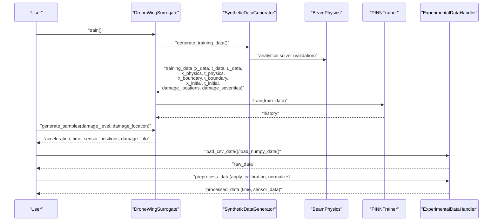
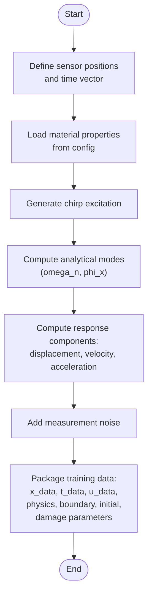
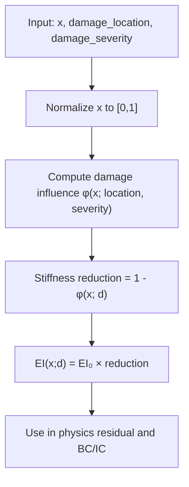
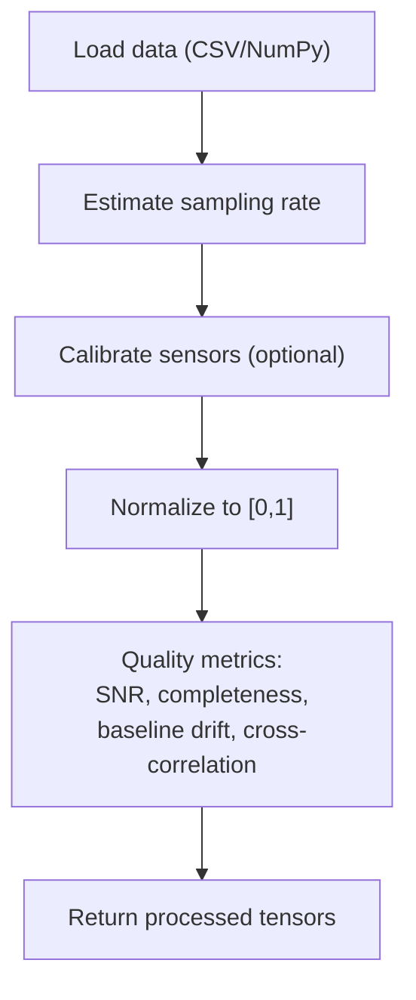
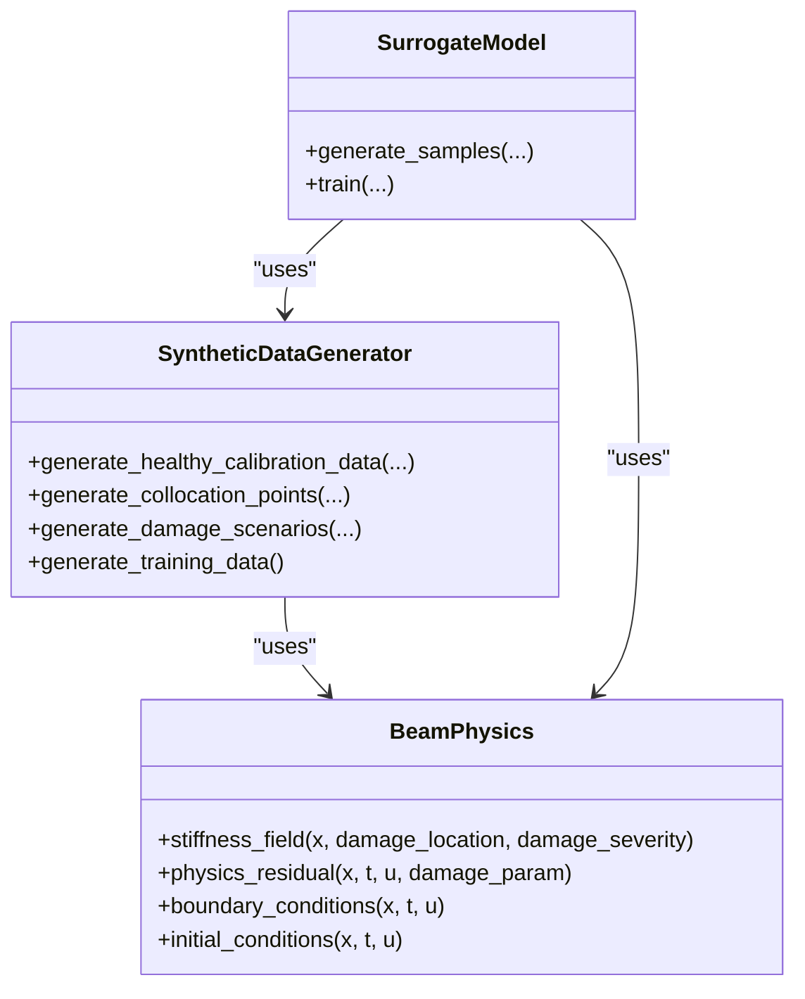
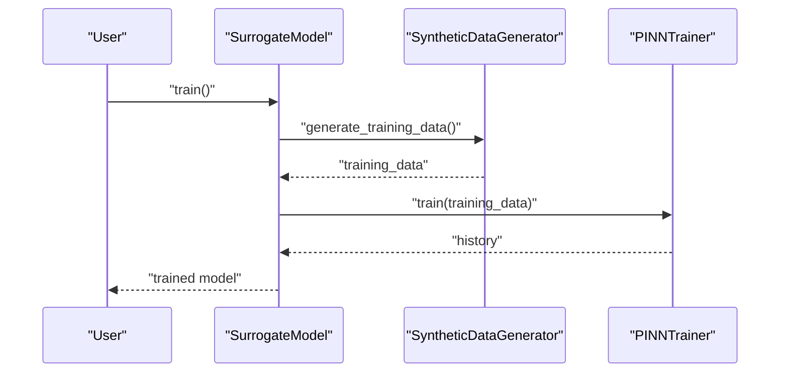
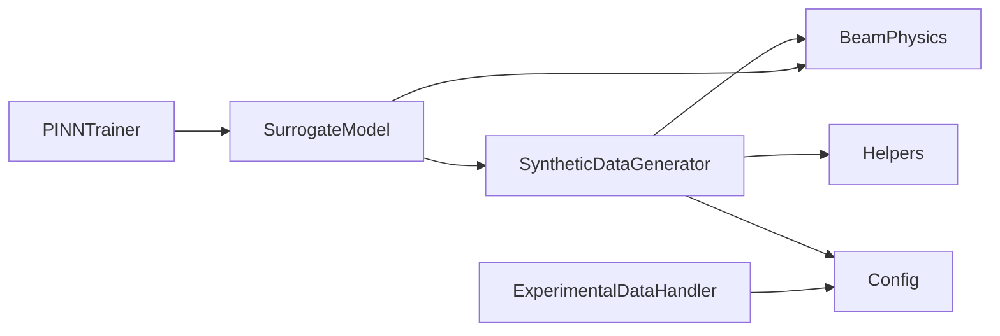

# Data Generation System

<cite>
**Referenced Files in This Document**
- [data_generation.py](file://gen-shm/src/data/data_generation.py)
- [experimental_data.py](file://gen-shm/src/data/experimental_data.py)
- [beam_physics.py](file://gen-shm/src/models/beam_physics.py)
- [surrogate_model.py](file://gen-shm/src/models/surrogate_model.py)
- [helpers.py](file://gen-shm/src/utils/helpers.py)
- [config.py](file://gen-shm/src/utils/config.py)
- [default.yaml](file://gen-shm/configs/default.yaml)
- [generate_samples.py](file://gen-shm/experiments/generate_samples.py)
- [train_model.py](file://gen-shm/experiments/train_model.py)
- [trainer.py](file://gen-shm/src/training/trainer.py)
- [demo.ipynb](file://gen-shm/notebooks/demo.ipynb)
</cite>

## Table of Contents
1. [Introduction](#introduction)
2. [Project Structure](#project-structure)
3. [Core Components](#core-components)
4. [Architecture Overview](#architecture-overview)
5. [Detailed Component Analysis](#detailed-component-analysis)
6. [Dependency Analysis](#dependency-analysis)
7. [Performance Considerations](#performance-considerations)
8. [Troubleshooting Guide](#troubleshooting-guide)
9. [Conclusion](#conclusion)
10. [Appendices](#appendices)

## Introduction
This document describes the data generation system for synthetic dataset creation tailored to structural health monitoring (SHM) of drone wings. It focuses on the data_generation module for damage parameterization, boundary condition sampling, and collocation point generation strategies, and the experimental_data module for real-world dataset integration and preprocessing. It explains how physical parameters relate to neural network inputs (spatial discretization, temporal sampling, and damage scenario simulation), and provides practical examples for generating training datasets, validating data quality, and augmenting existing datasets. Configuration options for noise addition, outlier simulation, and data distribution controls are documented alongside preprocessing pipelines, normalization strategies, and format conversions.

## Project Structure
The data generation system spans several modules:
- Data generation: synthetic data creation, collocation points, and training dataset packaging
- Experimental data: loading, preprocessing, calibration, and quality validation
- Physics engine: Euler-Bernoulli beam theory with damage parameterization
- Surrogate model: high-level interface that orchestrates data generation and model training
- Utilities: configuration, helpers, and training framework

**Diagram sources**
- [data_generation.py:14-384](file://gen-shm/src/data/data_generation.py#L14-L384)
- [experimental_data.py:13-237](file://gen-shm/src/data/experimental_data.py#L13-L237)
- [beam_physics.py:12-300](file://gen-shm/src/models/beam_physics.py#L12-L300)
- [surrogate_model.py:15-200](file://gen-shm/src/models/surrogate_model.py#L15-L200)
- [helpers.py:11-161](file://gen-shm/src/utils/helpers.py#L11-L161)
- [config.py:10-123](file://gen-shm/src/utils/config.py#L10-L123)
- [generate_samples.py:73-216](file://gen-shm/experiments/generate_samples.py#L73-L216)
- [train_model.py:77-165](file://gen-shm/experiments/train_model.py#L77-L165)
- [trainer.py:55-200](file://gen-shm/src/training/trainer.py#L55-L200)

**Section sources**
- [data_generation.py:14-384](file://gen-shm/src/data/data_generation.py#L14-L384)
- [experimental_data.py:13-237](file://gen-shm/src/data/experimental_data.py#L13-L237)
- [beam_physics.py:12-300](file://gen-shm/src/models/beam_physics.py#L12-L300)
- [surrogate_model.py:15-200](file://gen-shm/src/models/surrogate_model.py#L15-L200)
- [helpers.py:11-161](file://gen-shm/src/utils/helpers.py#L11-L161)
- [config.py:10-123](file://gen-shm/src/utils/config.py#L10-L123)
- [default.yaml:1-100](file://gen-shm/configs/default.yaml#L1-L100)
- [generate_samples.py:73-216](file://gen-shm/experiments/generate_samples.py#L73-L216)
- [train_model.py:77-165](file://gen-shm/experiments/train_model.py#L77-L165)
- [trainer.py:55-200](file://gen-shm/src/training/trainer.py#L55-L200)

## Core Components
- SyntheticDataGenerator: creates healthy calibration data, collocation points, and damage scenarios; packages training data for the PINN
- ExperimentalDataHandler: loads, preprocesses, calibrates, and validates real-world sensor data
- BeamPhysics: implements Euler-Bernoulli beam theory with spatially varying stiffness and boundary/initial conditions
- Surrogate model: orchestrates training and sample generation; integrates data generation and physics engines
- Helpers and configuration: device selection, collocation sampling, normalization, and centralized configuration

Key relationships:
- SyntheticDataGenerator depends on BeamPhysics for analytical validation and on helpers for collocation sampling and device management
- Surrogate model composes SyntheticDataGenerator and BeamPhysics and delegates training to the trainer
- ExperimentalDataHandler reads configuration for normalization and calibration routines

**Section sources**
- [data_generation.py:14-384](file://gen-shm/src/data/data_generation.py#L14-L384)
- [experimental_data.py:13-237](file://gen-shm/src/data/experimental_data.py#L13-L237)
- [beam_physics.py:12-300](file://gen-shm/src/models/beam_physics.py#L12-L300)
- [surrogate_model.py:15-200](file://gen-shm/src/models/surrogate_model.py#L15-L200)
- [helpers.py:11-161](file://gen-shm/src/utils/helpers.py#L11-L161)
- [config.py:10-123](file://gen-shm/src/utils/config.py#L10-L123)

## Architecture Overview
The data generation pipeline integrates synthetic and experimental data to produce training datasets compliant with physics constraints. The figure below maps the primary components and their interactions during training and sample generation.

**Diagram sources**
- [surrogate_model.py:131-166](file://gen-shm/src/models/surrogate_model.py#L131-L166)
- [data_generation.py:211-263](file://gen-shm/src/data/data_generation.py#L211-L263)
- [beam_physics.py:107-150](file://gen-shm/src/models/beam_physics.py#L107-L150)
- [trainer.py:127-180](file://gen-shm/src/training/trainer.py#L127-L180)
- [experimental_data.py:29-127](file://gen-shm/src/data/experimental_data.py#L29-L127)

## Detailed Component Analysis

### Synthetic Data Generator
Responsibilities:
- Healthy calibration data: sparse sensor measurements from a chirp excitation response computed via analytical beam modes
- Collocation points: uniform sampling across space-time domain for physics loss, boundary conditions at x=0 and x=L, and initial conditions at t=0
- Damage scenarios: random damage locations and severities within configured bounds
- Training dataset packaging: flattens and aligns tensors for batched training

Processing logic highlights:
- Sensor positions are normalized by beam length and placed according to configuration
- Time vectors are constructed from duration and sampling rate
- Material properties (E, I, rho, A) are derived from configuration
- Chirp excitation spans configured frequency range
- Analytical mode shapes and frequencies are used to synthesize response components (displacement, velocity, acceleration)
- Measurement noise is added proportional to signal magnitude

**Diagram sources**
- [data_generation.py:30-132](file://gen-shm/src/data/data_generation.py#L30-L132)
- [beam_physics.py:261-300](file://gen-shm/src/models/beam_physics.py#L261-L300)

**Section sources**
- [data_generation.py:30-132](file://gen-shm/src/data/data_generation.py#L30-L132)
- [data_generation.py:134-182](file://gen-shm/src/data/data_generation.py#L134-L182)
- [data_generation.py:184-209](file://gen-shm/src/data/data_generation.py#L184-L209)
- [data_generation.py:211-263](file://gen-shm/src/data/data_generation.py#L211-L263)

### Collocation Point Generation Strategies
- Interior points: uniform random sampling in [0, L] × [0, T] using helper utility
- Boundary points: fixed x=0 and x=L with random t ∈ [0, T]
- Initial points: random x ∈ [0, L] with t=0

These points are used to enforce:
- Physics residual: governing PDE residual across interior points
- Boundary conditions: left/right boundary constraints
- Initial conditions: zero displacement and velocity at t=0

**Section sources**
- [data_generation.py:134-182](file://gen-shm/src/data/data_generation.py#L134-L182)
- [helpers.py:50-73](file://gen-shm/src/utils/helpers.py#L50-L73)
- [beam_physics.py:152-200](file://gen-shm/src/models/beam_physics.py#L152-L200)

### Damage Parameterization
- Locations: normalized positions within configured bounds
- Severities: bounded stiffness reduction parameters
- Influence functions: configurable (Gaussian or step) to model stiffness reduction profile
- Damage field: EI(x;d) computed as base stiffness times (1 - influence)

**Diagram sources**
- [beam_physics.py:81-105](file://gen-shm/src/models/beam_physics.py#L81-L105)
- [beam_physics.py:107-150](file://gen-shm/src/models/beam_physics.py#L107-L150)

**Section sources**
- [beam_physics.py:58-80](file://gen-shm/src/models/beam_physics.py#L58-L80)
- [beam_physics.py:81-105](file://gen-shm/src/models/beam_physics.py#L81-L105)
- [data_generation.py:184-209](file://gen-shm/src/data/data_generation.py#L184-L209)

### Experimental Data Integration and Preprocessing
Capabilities:
- Load CSV and NumPy formats
- Estimate sampling rate from time vector
- Calibrate sensors using healthy baseline (mean/std)
- Normalize data to [0,1] range
- Validate data quality (SNR, completeness, baseline drift, cross-correlation)

**Diagram sources**
- [experimental_data.py:29-127](file://gen-shm/src/data/experimental_data.py#L29-L127)
- [experimental_data.py:129-195](file://gen-shm/src/data/experimental_data.py#L129-L195)

**Section sources**
- [experimental_data.py:29-127](file://gen-shm/src/data/experimental_data.py#L29-L127)
- [experimental_data.py:129-195](file://gen-shm/src/data/experimental_data.py#L129-L195)

### Relationship Between Physical Parameters and Neural Network Inputs
- Inputs: [x, t, damage_location, damage_severity]
- Outputs: displacement u(x,t)
- Spatial discretization: sensor positions and collocation points define x grid
- Temporal sampling: time vectors define t grid
- Damage scenario simulation: damage parameters drive stiffness field and thus response

**Diagram sources**
- [beam_physics.py:12-300](file://gen-shm/src/models/beam_physics.py#L12-L300)
- [data_generation.py:14-384](file://gen-shm/src/data/data_generation.py#L14-L384)
- [surrogate_model.py:15-200](file://gen-shm/src/models/surrogate_model.py#L15-L200)

**Section sources**
- [surrogate_model.py:48-129](file://gen-shm/src/models/surrogate_model.py#L48-L129)
- [beam_physics.py:12-300](file://gen-shm/src/models/beam_physics.py#L12-L300)
- [data_generation.py:211-263](file://gen-shm/src/data/data_generation.py#L211-L263)

### Practical Examples

#### Generate Training Datasets
- Use the surrogate model’s training routine to generate synthetic training data and train the PINN
- The training data includes:
  - Sensor data (displacement) aligned with sensor positions and time
  - Collocation points for physics loss
  - Boundary and initial condition points
  - Damage parameters for scenario diversity

**Diagram sources**
- [surrogate_model.py:131-166](file://gen-shm/src/models/surrogate_model.py#L131-L166)
- [data_generation.py:211-263](file://gen-shm/src/data/data_generation.py#L211-L263)
- [trainer.py:127-180](file://gen-shm/src/training/trainer.py#L127-L180)

**Section sources**
- [surrogate_model.py:131-166](file://gen-shm/src/models/surrogate_model.py#L131-L166)
- [data_generation.py:211-263](file://gen-shm/src/data/data_generation.py#L211-L263)
- [train_model.py:115-142](file://gen-shm/experiments/train_model.py#L115-L142)

#### Validate Data Quality
- Use the experimental data handler to compute quality metrics:
  - Signal-to-noise ratio
  - Data completeness
  - Baseline drift
  - Cross-correlation between sensors

**Section sources**
- [experimental_data.py:129-195](file://gen-shm/src/data/experimental_data.py#L129-L195)

#### Augment Existing Datasets
- Load real sensor data using the experimental data handler
- Apply calibration and normalization
- Combine with synthetic data to increase dataset diversity and robustness

**Section sources**
- [experimental_data.py:29-127](file://gen-shm/src/data/experimental_data.py#L29-L127)
- [data_generation.py:211-263](file://gen-shm/src/data/data_generation.py#L211-L263)

#### Generate Samples for Evaluation
- Use the sample generation script to produce vibration data for specified damage scenarios
- Save outputs in multiple formats (pickle, NumPy compressed, CSV)
- Optionally generate plots and statistics

**Section sources**
- [generate_samples.py:73-216](file://gen-shm/experiments/generate_samples.py#L73-L216)
- [demo.ipynb:52-100](file://gen-shm/notebooks/demo.ipynb#L52-L100)

### Configuration Options
Key configuration areas and their roles:
- Physics: beam geometry, material properties, boundary conditions
- Damage: severity bounds, location range, damage function type
- Model: input/output dimensions, architecture parameters
- Training: epochs, batch size, optimizer, loss weights, collocation point counts
- Data: spatial/temporal points, sensor locations, noise level, frequency range
- Advanced: multi-scale training, adaptive weighting, regularization, gradient clipping
- Visualization and logging: plot settings and logging configuration

Practical controls:
- Noise addition: controlled by noise level in data configuration
- Outlier simulation: introduce outliers by adjusting sensor calibration or adding spikes
- Data distribution controls: adjust sensor locations, frequency range, and damage parameter ranges

**Section sources**
- [default.yaml:4-100](file://gen-shm/configs/default.yaml#L4-L100)
- [config.py:17-93](file://gen-shm/src/utils/config.py#L17-L93)
- [data_generation.py:120-123](file://gen-shm/src/data/data_generation.py#L120-L123)

### Data Preprocessing Pipelines and Normalization
- Device selection: automatic CUDA/CPU detection
- Meshgrid and collocation sampling: uniform sampling across space-time domain
- Normalization: min-max scaling to [0,1] with safeguards against division by zero
- Denormalization: reverse operation for post-processing

**Section sources**
- [helpers.py:21-23](file://gen-shm/src/utils/helpers.py#L21-L23)
- [helpers.py:26-47](file://gen-shm/src/utils/helpers.py#L26-L47)
- [helpers.py:50-73](file://gen-shm/src/utils/helpers.py#L50-L73)
- [helpers.py:106-138](file://gen-shm/src/utils/helpers.py#L106-L138)

### Integration of External Experimental Data
- Load formats: CSV and NumPy
- Sensor mapping and names
- Calibration using healthy baseline data
- Quality checks and reporting

**Section sources**
- [experimental_data.py:29-127](file://gen-shm/src/data/experimental_data.py#L29-L127)
- [experimental_data.py:129-195](file://gen-shm/src/data/experimental_data.py#L129-L195)

## Dependency Analysis
The data generation system exhibits cohesive coupling among components:
- SyntheticDataGenerator depends on BeamPhysics for validation and on helpers for sampling and device management
- Surrogate model composes data generator and physics engine and coordinates training
- Trainer consumes training data packaged by the data generator

**Diagram sources**
- [data_generation.py:25-28](file://gen-shm/src/data/data_generation.py#L25-L28)
- [surrogate_model.py:38-40](file://gen-shm/src/models/surrogate_model.py#L38-L40)
- [trainer.py:67-75](file://gen-shm/src/training/trainer.py#L67-L75)

**Section sources**
- [data_generation.py:25-28](file://gen-shm/src/data/data_generation.py#L25-L28)
- [surrogate_model.py:38-40](file://gen-shm/src/models/surrogate_model.py#L38-L40)
- [trainer.py:67-75](file://gen-shm/src/training/trainer.py#L67-L75)

## Performance Considerations
- Device utilization: leverage CUDA when available for faster tensor operations
- Batch sizing: balance memory usage and throughput; consider batch size in training configuration
- Collocation point distribution: ensure adequate coverage of space-time domain for physics loss
- Noise levels: moderate noise improves robustness; excessive noise degrades data fidelity
- Data normalization: consistent normalization improves training stability

[No sources needed since this section provides general guidance]

## Troubleshooting Guide
Common issues and resolutions:
- Device errors: ensure CUDA availability or switch to CPU
- Data shape mismatches: verify sensor locations, time steps, and batch dimensions
- Training instability: adjust learning rate, enable gradient clipping, and review loss weights
- Poor data quality: inspect SNR and completeness metrics; recalibrate sensors if needed

**Section sources**
- [helpers.py:21-23](file://gen-shm/src/utils/helpers.py#L21-L23)
- [trainer.py:162-163](file://gen-shm/src/training/trainer.py#L162-L163)
- [experimental_data.py:129-195](file://gen-shm/src/data/experimental_data.py#L129-L195)

## Conclusion
The data generation system integrates synthetic and experimental data to produce high-quality training datasets for physics-informed neural networks in structural health monitoring. It supports damage parameterization, boundary condition enforcement, and collocation point generation, while providing robust preprocessing, validation, and augmentation capabilities. Configuration-driven controls enable flexible tuning of noise, distributions, and data characteristics, ensuring reliable training and evaluation workflows.

[No sources needed since this section summarizes without analyzing specific files]

## Appendices

### Appendix A: Configuration Reference
- Physics: beam dimensions, material properties, boundary conditions
- Damage: severity bounds, location range, damage function type
- Model: input/output dimensions, architecture parameters
- Training: epochs, batch size, optimizer, loss weights, collocation counts
- Data: spatial/temporal points, sensor locations, noise level, frequency range
- Advanced: multi-scale training, adaptive weighting, regularization, gradient clipping
- Visualization and logging: plot settings and logging configuration

**Section sources**
- [default.yaml:4-100](file://gen-shm/configs/default.yaml#L4-L100)
- [config.py:17-93](file://gen-shm/src/utils/config.py#L17-L93)

### Appendix B: Example Workflows
- Training workflow: generate synthetic data, train model, validate physics compliance
- Sample generation workflow: load trained model, generate samples for damage scenarios, save outputs and plots
- Experimental integration workflow: load real data, preprocess and calibrate, validate quality, augment synthetic data

**Section sources**
- [surrogate_model.py:131-166](file://gen-shm/src/models/surrogate_model.py#L131-L166)
- [generate_samples.py:73-216](file://gen-shm/experiments/generate_samples.py#L73-L216)
- [demo.ipynb:248-316](file://gen-shm/notebooks/demo.ipynb#L248-L316)