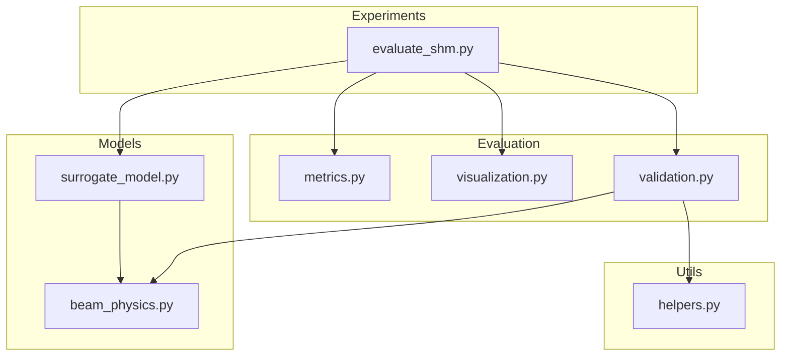
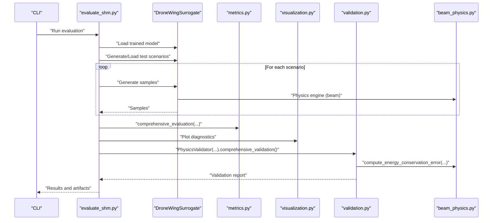
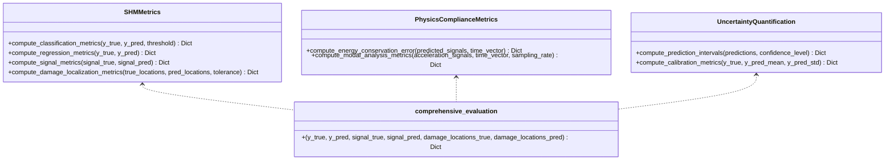
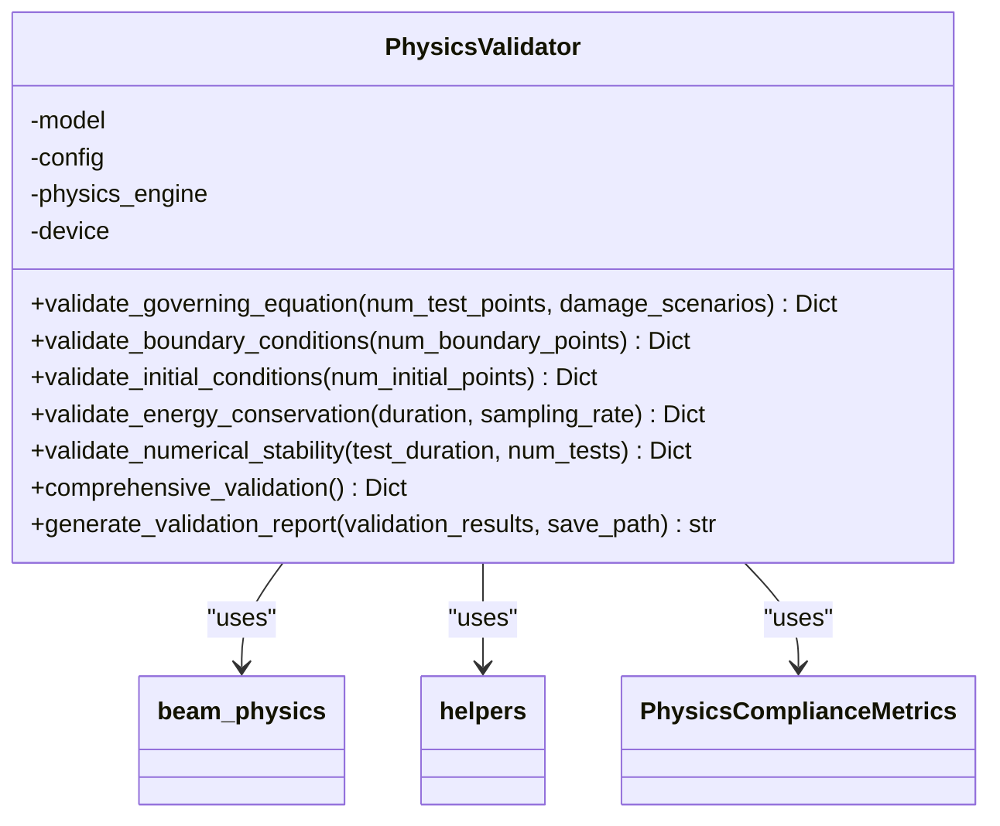
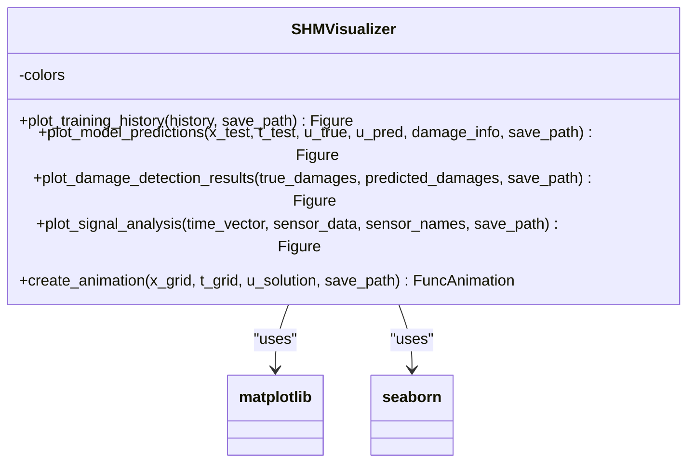
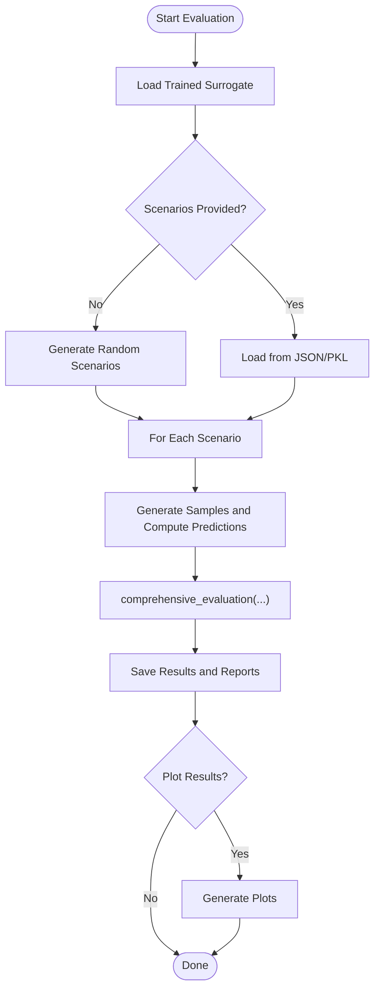
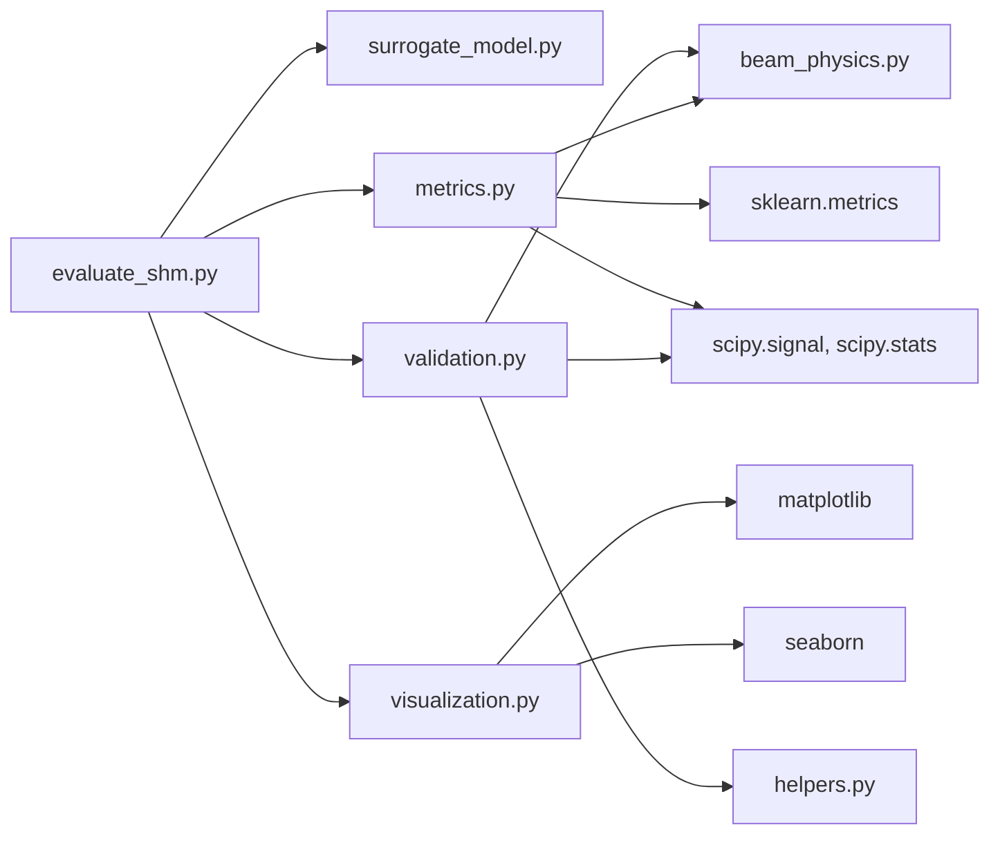

# Evaluation and Validation

<cite>
**Referenced Files in This Document**
- [metrics.py](file://gen-shm/src/evaluation/metrics.py)
- [validation.py](file://gen-shm/src/evaluation/validation.py)
- [visualization.py](file://gen-shm/src/evaluation/visualization.py)
- [evaluate_shm.py](file://gen-shm/experiments/evaluate_shm.py)
- [beam_physics.py](file://gen-shm/src/models/beam_physics.py)
- [helpers.py](file://gen-shm/src/utils/helpers.py)
- [surrogate_model.py](file://gen-shm/src/models/surrogate_model.py)
- [test_physics.py](file://gen-shm/tests/test_physics.py)
- [GETTING_STARTED.md](file://gen-shm/GETTING_STARTED.md)
- [requirements.txt](file://gen-shm/requirements.txt)
</cite>

## Table of Contents
1. [Introduction](#introduction)
2. [Project Structure](#project-structure)
3. [Core Components](#core-components)
4. [Architecture Overview](#architecture-overview)
5. [Detailed Component Analysis](#detailed-component-analysis)
6. [Dependency Analysis](#dependency-analysis)
7. [Performance Considerations](#performance-considerations)
8. [Troubleshooting Guide](#troubleshooting-guide)
9. [Conclusion](#conclusion)
10. [Appendices](#appendices)

## Introduction
This document describes the evaluation and validation system for the Gen-SHM Structural Health Monitoring pipeline. It focuses on:
- Performance assessment: accuracy measures, physics compliance validation, and damage detection performance indicators
- Systematic testing: model correctness, numerical stability, and convergence properties
- Visualization toolkit: result plotting, contour maps, and comparative analysis of predicted vs. actual behaviors
- Practical examples: computing evaluation metrics, validating physics constraints, and generating diagnostic plots
- Statistical methods: significance testing, confidence intervals, and uncertainty quantification
- Pitfalls and best practices for research and production environments

## Project Structure
The evaluation system resides under the evaluation package and integrates with the surrogate model and physics engine. The experiments module orchestrates end-to-end evaluation runs.

**Diagram sources**
- [metrics.py:1-367](file://gen-shm/src/evaluation/metrics.py#L1-L367)
- [validation.py:1-376](file://gen-shm/src/evaluation/validation.py#L1-L376)
- [visualization.py:1-432](file://gen-shm/src/evaluation/visualization.py#L1-L432)
- [evaluate_shm.py:1-319](file://gen-shm/experiments/evaluate_shm.py#L1-L319)
- [beam_physics.py:1-300](file://gen-shm/src/models/beam_physics.py#L1-L300)
- [helpers.py:1-161](file://gen-shm/src/utils/helpers.py#L1-L161)
- [surrogate_model.py:1-337](file://gen-shm/src/models/surrogate_model.py#L1-L337)

**Section sources**
- [GETTING_STARTED.md:104-122](file://gen-shm/GETTING_STARTED.md#L104-L122)

## Core Components
- Metrics: classification, regression, signal processing, localization, and physics compliance metrics; plus uncertainty quantification
- Validation: physics compliance checks (governing equation, boundary/initial conditions, energy conservation, numerical stability)
- Visualization: training history, predictions, damage detection results, signal analysis, animations, and confusion matrices

Key responsibilities:
- Metrics: compute comprehensive performance summaries across domains
- Validation: ensure model adherence to physics laws and numerical constraints
- Visualization: produce diagnostic plots for interpretability and reporting

**Section sources**
- [metrics.py:16-367](file://gen-shm/src/evaluation/metrics.py#L16-L367)
- [validation.py:16-376](file://gen-shm/src/evaluation/validation.py#L16-L376)
- [visualization.py:14-432](file://gen-shm/src/evaluation/visualization.py#L14-L432)

## Architecture Overview
The evaluation pipeline connects the experiment runner to the surrogate model, which internally uses the physics engine. Validation and metrics are computed against synthetic or real test scenarios.

**Diagram sources**
- [evaluate_shm.py:112-319](file://gen-shm/experiments/evaluate_shm.py#L112-L319)
- [surrogate_model.py:15-200](file://gen-shm/src/models/surrogate_model.py#L15-L200)
- [metrics.py:328-367](file://gen-shm/src/evaluation/metrics.py#L328-L367)
- [visualization.py:14-432](file://gen-shm/src/evaluation/visualization.py#L14-L432)
- [validation.py:250-376](file://gen-shm/src/evaluation/validation.py#L250-L376)
- [beam_physics.py:12-300](file://gen-shm/src/models/beam_physics.py#L12-L300)

## Detailed Component Analysis

### Metrics Module
The metrics module provides:
- Classification metrics (accuracy, precision, recall, F1, specificity, ROC-AUC)
- Regression metrics (MSE, RMSE, MAE, MAPE, R²)
- Signal processing metrics (correlation, SNR, cross-correlation peak, frequency similarity)
- Damage localization metrics (accuracy within tolerance, mean/std/median/max error)
- Physics compliance metrics (energy conservation error, modal analysis)
- Uncertainty quantification (prediction intervals, calibration metrics)

Implementation highlights:
- Robust handling of probability vs. binary predictions
- Safe computation of metrics with fallbacks for degenerate cases
- Physics-aware energy and modal analysis using numerical integration and spectral methods

**Diagram sources**
- [metrics.py:16-367](file://gen-shm/src/evaluation/metrics.py#L16-L367)

**Section sources**
- [metrics.py:27-367](file://gen-shm/src/evaluation/metrics.py#L27-L367)

Practical examples:
- Compute classification/regression/signal/localization metrics using the comprehensive evaluation function
- Validate energy conservation and modal consistency using dedicated physics compliance metrics
- Quantify predictive uncertainty via percentiles and calibration checks

### Validation Module
The validation module performs:
- Governing equation satisfaction via residual norms across damage scenarios
- Boundary and initial condition compliance
- Energy conservation checks using generated acceleration signals
- Numerical stability tests over extended durations
- Automated report generation with pass/fail thresholds

**Diagram sources**
- [validation.py:16-376](file://gen-shm/src/evaluation/validation.py#L16-L376)
- [beam_physics.py:12-300](file://gen-shm/src/models/beam_physics.py#L12-L300)
- [helpers.py:21-23](file://gen-shm/src/utils/helpers.py#L21-L23)

**Section sources**
- [validation.py:16-376](file://gen-shm/src/evaluation/validation.py#L16-L376)

Practical examples:
- Run comprehensive validation suite and generate a human-readable report
- Perform quick validation with reduced computational cost
- Integrate validation into CI/CD pipelines for production readiness

### Visualization Module
The visualization module offers:
- Training history plots (losses, learning rate, epoch time, stacked components, smoothed curves, loss ratios)
- Prediction comparisons (3D surfaces, absolute error heatmaps, cross-sectional profiles)
- Damage detection results (location/severity scatter plots, error histograms)
- Signal analysis (time-domain, frequency spectrum, spectrograms)
- Animations of wave propagation
- Confusion matrix plotting

**Diagram sources**
- [visualization.py:14-432](file://gen-shm/src/evaluation/visualization.py#L14-L432)

**Section sources**
- [visualization.py:14-432](file://gen-shm/src/evaluation/visualization.py#L14-L432)

Practical examples:
- Plot training progress and loss contributions
- Visualize prediction vs. ground truth with error maps
- Analyze sensor signals across time, frequency, and spectrogram domains
- Create animated wave propagation videos

### Experiment Orchestration
The evaluation script ties everything together:
- Loads a trained surrogate model
- Generates or loads test scenarios
- Computes metrics and saves results
- Produces plots and reports
- Optionally runs physics validation

**Diagram sources**
- [evaluate_shm.py:112-319](file://gen-shm/experiments/evaluate_shm.py#L112-L319)

**Section sources**
- [evaluate_shm.py:112-319](file://gen-shm/experiments/evaluate_shm.py#L112-L319)

## Dependency Analysis
External libraries and internal dependencies:
- Torch and NumPy for numerical computations
- SciPy for signal processing and integration
- Scikit-learn for classification metrics and confusion matrix
- Matplotlib and Seaborn for visualization
- PyYAML for configuration handling
- Tests rely on pytest

**Diagram sources**
- [evaluate_shm.py:22-26](file://gen-shm/experiments/evaluate_shm.py#L22-L26)
- [metrics.py:5-13](file://gen-shm/src/evaluation/metrics.py#L5-L13)
- [visualization.py:5-11](file://gen-shm/src/evaluation/visualization.py#L5-L11)
- [validation.py:5-13](file://gen-shm/src/evaluation/validation.py#L5-L13)
- [beam_physics.py:5-9](file://gen-shm/src/models/beam_physics.py#L5-L9)
- [helpers.py:5-8](file://gen-shm/src/utils/helpers.py#L5-L8)

**Section sources**
- [requirements.txt:1-14](file://gen-shm/requirements.txt#L1-L14)

## Performance Considerations
- Metrics computation is vectorized using NumPy/Torch for speed
- Signal processing metrics leverage FFT and correlation routines from SciPy
- Visualization uses efficient plotting APIs; animations can be expensive—use appropriate frame rates and durations
- Validation uses batching and GPU acceleration where available
- Numerical stability checks guard against NaN/infs and extreme values

Best practices:
- Prefer GPU when available for faster validation and visualization
- Use moderate window sizes for moving averages and spectrograms
- Limit animation frame counts for production dashboards
- Cache repeated computations (e.g., repeated metrics across folds)

[No sources needed since this section provides general guidance]

## Troubleshooting Guide
Common issues and remedies:
- CUDA out of memory: reduce batch sizes or number of validation points
- Slow training/validation: decrease physics points or model complexity
- Poor physics compliance: increase physics loss weight or training epochs
- Import errors: ensure the working directory and PYTHONPATH include the src directory
- Numerical instabilities: inspect stability metrics and adjust model or training configuration

Validation thresholds:
- Residuals below a small threshold indicate good governing equation satisfaction
- Stability ratio above a threshold indicates reliable long-term behavior
- Energy conservation error below a threshold indicates acceptable energy balance

**Section sources**
- [GETTING_STARTED.md:212-227](file://gen-shm/GETTING_STARTED.md#L212-L227)
- [validation.py:314-324](file://gen-shm/src/evaluation/validation.py#L314-L324)

## Conclusion
The evaluation and validation system provides a comprehensive toolkit for assessing Gen-SHM performance across classification, regression, signal processing, and physics compliance domains. It integrates seamlessly with the surrogate model and offers robust visualization and reporting capabilities. The system supports both research exploration and production-grade validation workflows.

[No sources needed since this section summarizes without analyzing specific files]

## Appendices

### Practical Examples Index
- Computing evaluation metrics:
  - Use the comprehensive evaluation function to compute classification, regression, signal, and localization metrics
  - Reference: [metrics.py:328-367](file://gen-shm/src/evaluation/metrics.py#L328-L367)
- Validating physics constraints:
  - Run the comprehensive validation suite to check governing equation, boundary/initial conditions, energy conservation, and numerical stability
  - Reference: [validation.py:250-376](file://gen-shm/src/evaluation/validation.py#L250-L376)
- Generating diagnostic plots:
  - Plot training history, predictions, damage detection results, and signal analysis
  - Reference: [visualization.py:14-432](file://gen-shm/src/evaluation/visualization.py#L14-L432)
- Statistical significance and uncertainty:
  - Compute prediction intervals and calibration metrics for uncertainty quantification
  - Reference: [metrics.py:266-325](file://gen-shm/src/evaluation/metrics.py#L266-L325)

### Automated Validation Workflows
- Research environment:
  - Use the evaluation script to generate metrics and plots for multiple scenarios
  - Reference: [evaluate_shm.py:112-319](file://gen-shm/experiments/evaluate_shm.py#L112-L319)
- Production environment:
  - Integrate validation into CI/CD with pass/fail thresholds
  - Use quick validation for rapid feedback loops
  - Reference: [validation.py:356-376](file://gen-shm/src/evaluation/validation.py#L356-L376)

### Physics Engine Integration
- The surrogate model uses the beam physics engine for stiffness modeling and residual computation
- Validation leverages the same engine for energy conservation checks
- Reference: [surrogate_model.py:15-200](file://gen-shm/src/models/surrogate_model.py#L15-L200), [beam_physics.py:12-300](file://gen-shm/src/models/beam_physics.py#L12-L300)