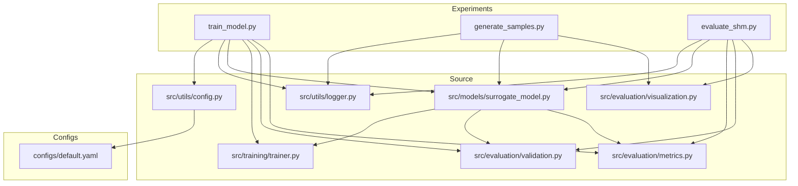
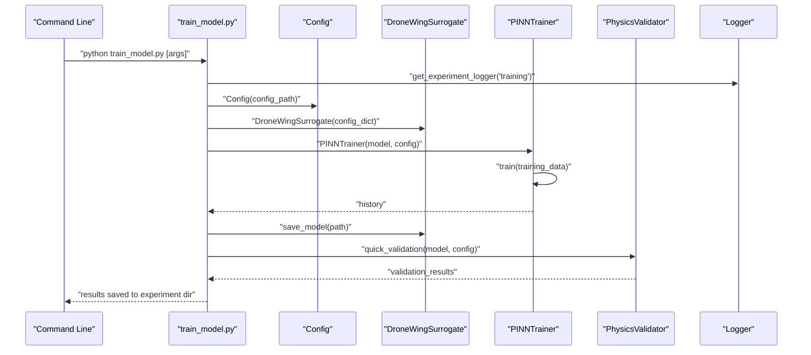
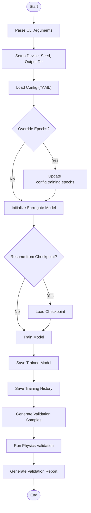
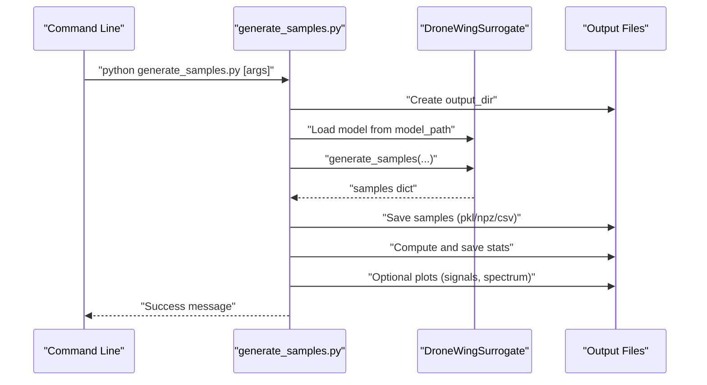
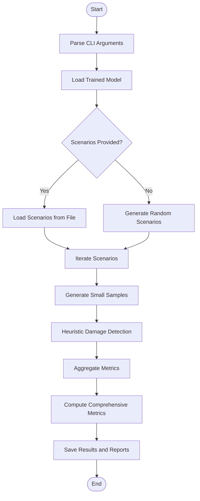
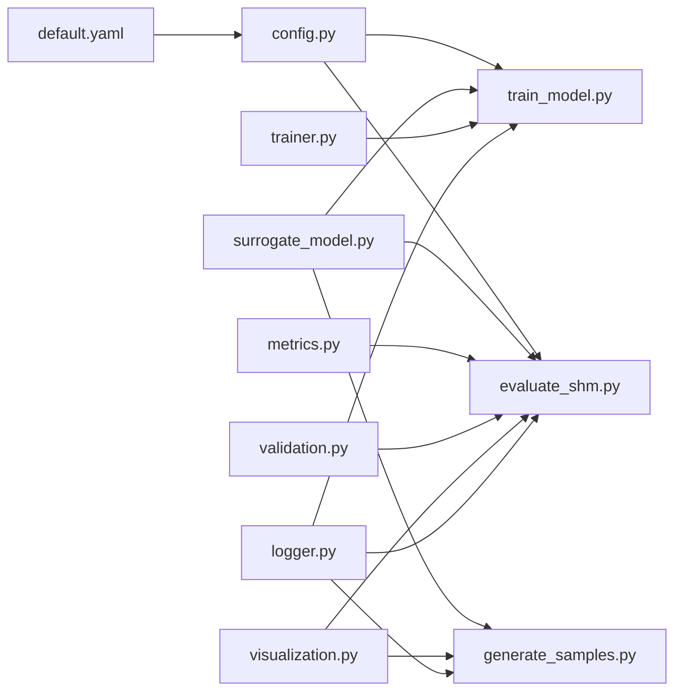

# Experiment Workflows

<cite>
**Referenced Files in This Document**
- [train_model.py](file://gen-shm/experiments/train_model.py)
- [generate_samples.py](file://gen-shm/experiments/generate_samples.py)
- [evaluate_shm.py](file://gen-shm/experiments/evaluate_shm.py)
- [default.yaml](file://gen-shm/configs/default.yaml)
- [surrogate_model.py](file://gen-shm/src/models/surrogate_model.py)
- [config.py](file://gen-shm/src/utils/config.py)
- [logger.py](file://gen-shm/src/utils/logger.py)
- [trainer.py](file://gen-shm/src/training/trainer.py)
- [metrics.py](file://gen-shm/src/evaluation/metrics.py)
- [validation.py](file://gen-shm/src/evaluation/validation.py)
- [visualization.py](file://gen-shm/src/evaluation/visualization.py)
- [README.md](file://gen-shm/README.md)
- [GETTING_STARTED.md](file://gen-shm/GETTING_STARTED.md)
</cite>

## Table of Contents
1. [Introduction](#introduction)
2. [Project Structure](#project-structure)
3. [Core Components](#core-components)
4. [Architecture Overview](#architecture-overview)
5. [Detailed Component Analysis](#detailed-component-analysis)
6. [Dependency Analysis](#dependency-analysis)
7. [Performance Considerations](#performance-considerations)
8. [Troubleshooting Guide](#troubleshooting-guide)
9. [Conclusion](#conclusion)
10. [Appendices](#appendices)

## Introduction
This document describes the experiment workflows for training, generating, and evaluating the Gen-SHM physics-informed surrogate model. It explains command-line execution, research automation, configuration loading, model initialization, checkpoint management, batch processing, and integration with external monitoring systems. It also covers reproducibility practices, experiment tracking, and result archiving strategies, with guidance for customizing workflows and extending the framework for research applications.

## Project Structure
The experiments are organized around three primary scripts:
- Training pipeline: train_model.py
- Batch data generation: generate_samples.py
- Systematic evaluation: evaluate_shm.py

These scripts coordinate with shared components under src/, including configuration management, model interfaces, training frameworks, evaluation metrics, and visualization utilities. Configuration defaults are centralized in configs/default.yaml.

**Diagram sources**
- [train_model.py:1-165](file://gen-shm/experiments/train_model.py#L1-L165)
- [generate_samples.py:1-216](file://gen-shm/experiments/generate_samples.py#L1-L216)
- [evaluate_shm.py:1-319](file://gen-shm/experiments/evaluate_shm.py#L1-L319)
- [config.py:1-123](file://gen-shm/src/utils/config.py#L1-L123)
- [surrogate_model.py:1-337](file://gen-shm/src/models/surrogate_model.py#L1-L337)
- [trainer.py:1-392](file://gen-shm/src/training/trainer.py#L1-L392)
- [metrics.py:1-367](file://gen-shm/src/evaluation/metrics.py#L1-L367)
- [validation.py:1-376](file://gen-shm/src/evaluation/validation.py#L1-L376)
- [visualization.py:1-432](file://gen-shm/src/evaluation/visualization.py#L1-L432)
- [default.yaml:1-100](file://gen-shm/configs/default.yaml#L1-L100)

**Section sources**
- [README.md:41-55](file://gen-shm/README.md#L41-L55)
- [GETTING_STARTED.md:104-122](file://gen-shm/GETTING_STARTED.md#L104-L122)

## Core Components
- Configuration management: Loads and updates YAML-based configuration, supports dot-notation access and persistence.
- Surrogate model interface: High-level API for training, generating synthetic samples, and validating physics compliance.
- Training framework: Optimizer selection, loss computation, adaptive weighting, learning rate scheduling, and checkpointing.
- Evaluation metrics: Classification, regression, signal processing, localization, and physics compliance metrics.
- Validation utilities: Comprehensive physics validation suite and quick validation helpers.
- Visualization: Training history plots, prediction comparisons, signal analysis, and confusion matrices.
- Logging: Structured logging with console and file outputs, experiment-scoped loggers.

**Section sources**
- [config.py:10-123](file://gen-shm/src/utils/config.py#L10-L123)
- [surrogate_model.py:15-272](file://gen-shm/src/models/surrogate_model.py#L15-L272)
- [trainer.py:55-339](file://gen-shm/src/training/trainer.py#L55-L339)
- [metrics.py:16-367](file://gen-shm/src/evaluation/metrics.py#L16-L367)
- [validation.py:16-376](file://gen-shm/src/evaluation/validation.py#L16-L376)
- [visualization.py:14-432](file://gen-shm/src/evaluation/visualization.py#L14-L432)
- [logger.py:11-69](file://gen-shm/src/utils/logger.py#L11-L69)

## Architecture Overview
The experiment workflows orchestrate a pipeline from configuration to training, checkpointing, and evaluation. The training script initializes the surrogate model, loads configuration, trains the PINN, saves artifacts, and runs physics validation. The generation script loads a trained model and produces batches of synthetic data with optional plots and animations. The evaluation script performs systematic performance assessment across predefined and randomized scenarios, computes metrics, and optionally validates physics compliance.

**Diagram sources**
- [train_model.py:77-162](file://gen-shm/experiments/train_model.py#L77-L162)
- [surrogate_model.py:131-166](file://gen-shm/src/models/surrogate_model.py#L131-L166)
- [trainer.py:207-297](file://gen-shm/src/training/trainer.py#L207-L297)
- [validation.py:356-376](file://gen-shm/src/evaluation/validation.py#L356-L376)
- [logger.py:52-65](file://gen-shm/src/utils/logger.py#L52-L65)

## Detailed Component Analysis

### Training Pipeline: train_model.py
- Command-line arguments:
  - --config: Path to YAML configuration file (default: configs/default.yaml)
  - --epochs: Override training epochs
  - --gpu: GPU device ID; -1 to force CPU
  - --seed: Random seed for reproducibility
  - --output_dir: Base directory for experiment outputs
  - --experiment_name: Custom experiment name
  - --resume: Path to checkpoint to resume training
  - --verbose: Enable verbose logging
- Environment setup:
  - Device selection (CUDA/CPU) and seed setting
  - Timestamped experiment directory creation
- Execution flow:
  - Load configuration and override epochs if provided
  - Save configuration to experiment directory
  - Initialize surrogate model and optionally resume from checkpoint
  - Train model and capture training history
  - Save trained model and training history
  - Generate validation samples and save
  - Run physics validation and produce a validation report
- Outputs:
  - Saved model weights, training history, validation samples, and validation report

**Diagram sources**
- [train_model.py:26-162](file://gen-shm/experiments/train_model.py#L26-L162)

**Section sources**
- [train_model.py:26-162](file://gen-shm/experiments/train_model.py#L26-L162)
- [surrogate_model.py:236-254](file://gen-shm/src/models/surrogate_model.py#L236-L254)
- [trainer.py:309-339](file://gen-shm/src/training/trainer.py#L309-L339)
- [validation.py:356-376](file://gen-shm/src/evaluation/validation.py#L356-L376)

### Batch Data Generation: generate_samples.py
- Command-line arguments:
  - --model_path: Path to a trained model checkpoint
  - --damage_level: Damage severity (0.0–1.0)
  - --damage_location: Damage location (0.0–1.0)
  - --num_samples: Number of samples to generate
  - --duration: Duration per sample in seconds
  - --sampling_rate: Sampling rate in Hz
  - --output_dir: Output directory for results
  - --save_format: Output format (pkl, npz, csv)
  - --plot: Generate plots (time-domain signals and spectra)
  - --animate: Create animation (placeholder)
- Processing logic:
  - Load trained model and validate training state
  - Generate samples via surrogate model
  - Save samples in chosen format
  - Compute and save summary statistics
  - Optionally generate plots and save them
  - Animation feature is noted as requiring 2D field data
- Outputs:
  - Saved samples (format depends on argument), statistics, and optional plots

**Diagram sources**
- [generate_samples.py:73-212](file://gen-shm/experiments/generate_samples.py#L73-L212)
- [surrogate_model.py:48-129](file://gen-shm/src/models/surrogate_model.py#L48-L129)

**Section sources**
- [generate_samples.py:26-212](file://gen-shm/experiments/generate_samples.py#L26-L212)
- [surrogate_model.py:48-129](file://gen-shm/src/models/surrogate_model.py#L48-L129)

### Systematic Evaluation: evaluate_shm.py
- Command-line arguments:
  - --model_path: Path to trained model
  - --test_scenarios: Path to JSON/PKL scenarios file (optional)
  - --num_test_cases: Number of randomized test cases (default: 50)
  - --output_dir: Output directory for results
  - --plot_results: Generate evaluation plots
  - --physics_validation: Include physics compliance validation
  - --save_predictions: Save detailed predictions
- Test scenario generation:
  - Predefined healthy and damaged cases
  - Randomized cases to reach desired count
- Evaluation workflow:
  - Load model and scenarios
  - Iterate scenarios, generate small batches of samples
  - Compute simple heuristic-based damage detection (placeholder)
  - Aggregate labels, probabilities, and features
  - Compute comprehensive metrics (classification/regression/signal/localization)
  - Save results and optional plots (confusion matrix, ROC curve)
  - Optional physics validation report
- Outputs:
  - Evaluation results JSON, optional predictions, reports, and plots

**Diagram sources**
- [evaluate_shm.py:112-315](file://gen-shm/experiments/evaluate_shm.py#L112-L315)

**Section sources**
- [evaluate_shm.py:29-315](file://gen-shm/experiments/evaluate_shm.py#L29-L315)
- [metrics.py:328-367](file://gen-shm/src/evaluation/metrics.py#L328-L367)
- [validation.py:250-281](file://gen-shm/src/evaluation/validation.py#L250-L281)

## Dependency Analysis
- Configuration loading:
  - train_model.py and evaluate_shm.py both depend on src/utils/config.py to load and persist configuration.
  - default.yaml provides baseline parameters for physics, damage, model, training, data, and advanced options.
- Model orchestration:
  - All scripts depend on src/models/surrogate_model.py for training, generation, and validation.
  - Training relies on src/training/trainer.py for optimizer, scheduler, and checkpointing.
- Evaluation and validation:
  - Metrics and validation are provided by src/evaluation/metrics.py and src/evaluation/validation.py.
  - Visualization utilities are in src/evaluation/visualization.py.
- Logging:
  - src/utils/logger.py centralizes logging for experiments.

**Diagram sources**
- [default.yaml:1-100](file://gen-shm/configs/default.yaml#L1-L100)
- [config.py:10-123](file://gen-shm/src/utils/config.py#L10-L123)
- [surrogate_model.py:15-272](file://gen-shm/src/models/surrogate_model.py#L15-L272)
- [trainer.py:55-339](file://gen-shm/src/training/trainer.py#L55-L339)
- [metrics.py:16-367](file://gen-shm/src/evaluation/metrics.py#L16-L367)
- [validation.py:16-376](file://gen-shm/src/evaluation/validation.py#L16-L376)
- [visualization.py:14-432](file://gen-shm/src/evaluation/visualization.py#L14-L432)
- [logger.py:11-69](file://gen-shm/src/utils/logger.py#L11-L69)

**Section sources**
- [train_model.py:20-23](file://gen-shm/experiments/train_model.py#L20-L23)
- [generate_samples.py:21-23](file://gen-shm/experiments/generate_samples.py#L21-L23)
- [evaluate_shm.py:22-26](file://gen-shm/experiments/evaluate_shm.py#L22-L26)

## Performance Considerations
- Device selection: Use --gpu to leverage CUDA; fallback to CPU when unavailable.
- Reproducibility: Set --seed for deterministic runs; training seeds are also set internally.
- Batch sizing: Adjust training.batch_size and data spatial/temporal points to balance speed and quality.
- Loss weighting: Tune training.loss_weights to emphasize data fidelity, physics compliance, or boundary conditions.
- Early stopping and scheduling: The trainer supports early stopping and learning rate schedules to improve convergence.
- Logging overhead: Logging to file adds I/O; disable or reduce verbosity for performance-sensitive runs.

[No sources needed since this section provides general guidance]

## Troubleshooting Guide
- CUDA out of memory: Reduce training.batch_size or data spatial/temporal points.
- Slow training: Decrease physics_points or model.hidden_layers; use fewer epochs for testing.
- Poor physics compliance: Increase physics loss weight or training epochs; review validation reports.
- Import errors: Ensure working directory is gen-shm and dependencies are installed.
- Checkpoint loading: Verify model_path points to a valid checkpoint produced by the framework.

**Section sources**
- [GETTING_STARTED.md:212-227](file://gen-shm/GETTING_STARTED.md#L212-L227)

## Conclusion
The experiment workflows provide a complete pipeline for training, generating, and evaluating the Gen-SHM surrogate model. They support reproducible runs, flexible configuration, batch processing, and comprehensive validation. The modular design enables extension for research applications, including custom metrics, validation suites, and visualization components.

[No sources needed since this section summarizes without analyzing specific files]

## Appendices

### Command-Line Reference
- Training
  - python experiments/train_model.py [--config PATH] [--epochs N] [--gpu ID] [--seed N] [--output_dir DIR] [--experiment_name NAME] [--resume PATH] [--verbose]
- Sample Generation
  - python experiments/generate_samples.py --model_path PATH [--damage_level F] [--damage_location F] [--num_samples N] [--duration F] [--sampling_rate N] [--output_dir DIR] [--save_format {pkl,npz,csv}] [--plot] [--animate]
- Evaluation
  - python experiments/evaluate_shm.py --model_path PATH [--test_scenarios PATH] [--num_test_cases N] [--output_dir DIR] [--plot_results] [--physics_validation] [--save_predictions]

**Section sources**
- [train_model.py:5-7](file://gen-shm/experiments/train_model.py#L5-L7)
- [generate_samples.py:7-9](file://gen-shm/experiments/generate_samples.py#L7-L9)
- [evaluate_shm.py:7-9](file://gen-shm/experiments/evaluate_shm.py#L7-L9)

### Configuration Reference
Key configuration groups and parameters:
- physics: beam_length, beam_width, beam_height, young_modulus, density, damping_coefficient, boundary_conditions
- damage: min_severity, max_severity, location_range, damage_function
- model: input_dim, output_dim, hidden_layers, hidden_dim, activation, dropout_rate
- training: epochs, batch_size, learning_rate, optimizer, lr_scheduler, loss_weights, physics_points, boundary_points, initial_condition_points
- data: spatial_points, temporal_points, sensor_locations, noise_level, frequency_range
- paths: data_dir, checkpoints_dir, logs_dir, results_dir, experiments_dir
- advanced: multiscale_training, scale_epochs, max_scales, adaptive_weighting, weight_adaptation_rate, l2_regularization, physics_regularization, gradient_clipping, numerical_tolerance
- visualization: plot_training_progress, save_plots, plot_frequency, style
- logging: level, format, save_to_file, console_output

**Section sources**
- [default.yaml:1-100](file://gen-shm/configs/default.yaml#L1-L100)

### Reproducibility and Experiment Tracking
- Use --seed to ensure reproducible runs.
- Experiment directories are timestamped; configuration and artifacts are saved per run.
- Logging is experiment-scoped; logs are saved to logs/ with timestamps.
- Checkpoints enable resuming training and comparing model variants.

**Section sources**
- [train_model.py:50-74](file://gen-shm/experiments/train_model.py#L50-L74)
- [logger.py:52-65](file://gen-shm/src/utils/logger.py#L52-L65)
- [trainer.py:309-339](file://gen-shm/src/training/trainer.py#L309-L339)

### Extending the Framework
- Adding new evaluation metrics:
  - Extend src/evaluation/metrics.py with new static methods or classes.
  - Integrate into comprehensive_evaluation() or create dedicated evaluation functions.
- Integrating external monitoring systems:
  - Use generate_samples.py to simulate real-time data streams by adjusting duration and sampling_rate.
  - Save outputs in preferred formats (pkl/npz/csv) for ingestion by external systems.
- Production deployment workflows:
  - Save trained models via surrogate_model.save_model().
  - Load models with DroneWingSurrogate(model_path=path) for inference.
  - Use validation to ensure physics compliance before deployment.

**Section sources**
- [metrics.py:328-367](file://gen-shm/src/evaluation/metrics.py#L328-L367)
- [surrogate_model.py:236-254](file://gen-shm/src/models/surrogate_model.py#L236-L254)
- [generate_samples.py:54-71](file://gen-shm/experiments/generate_samples.py#L54-L71)