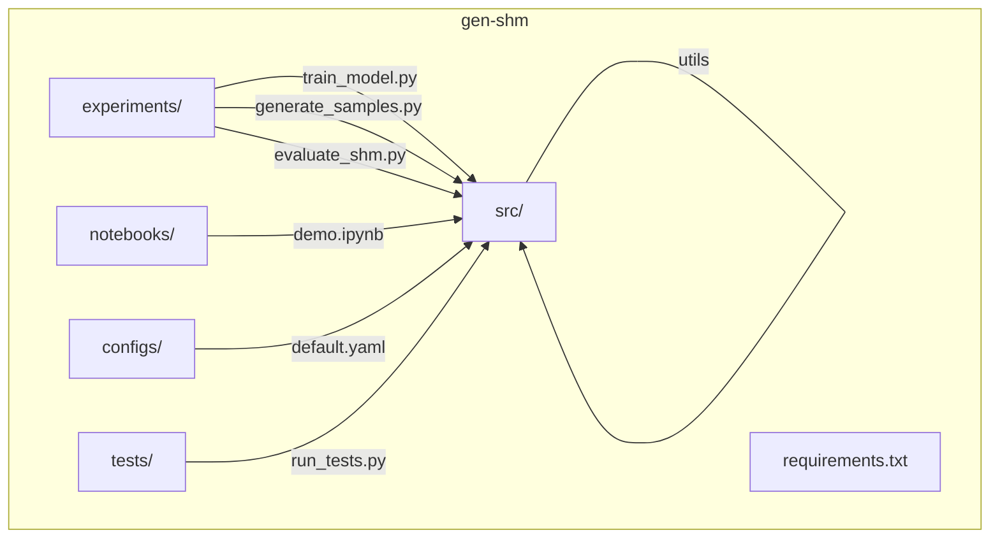
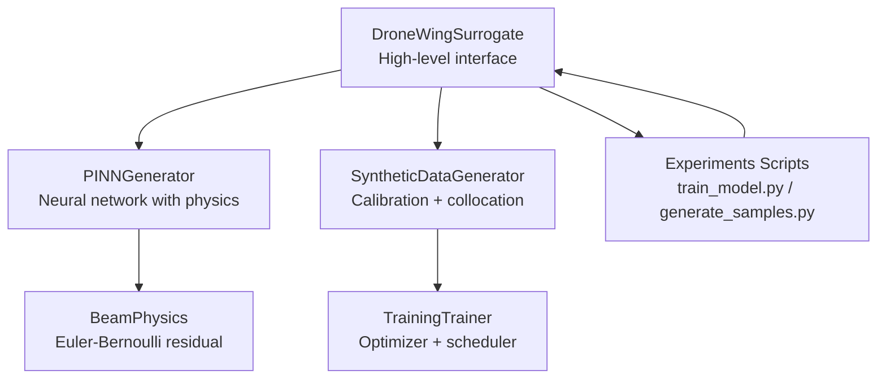
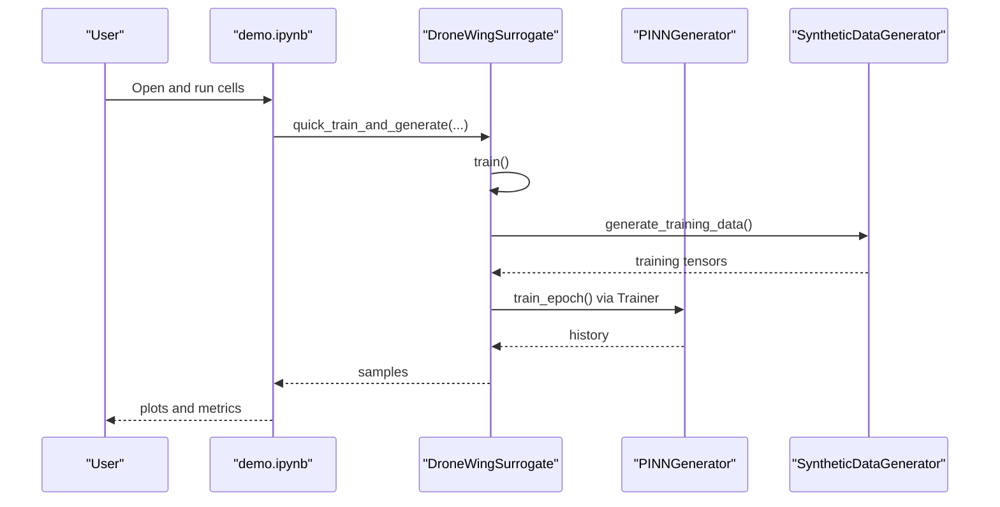
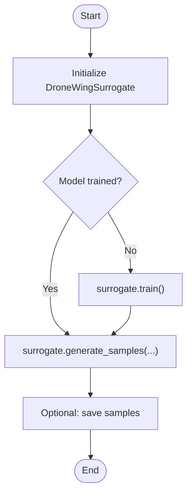
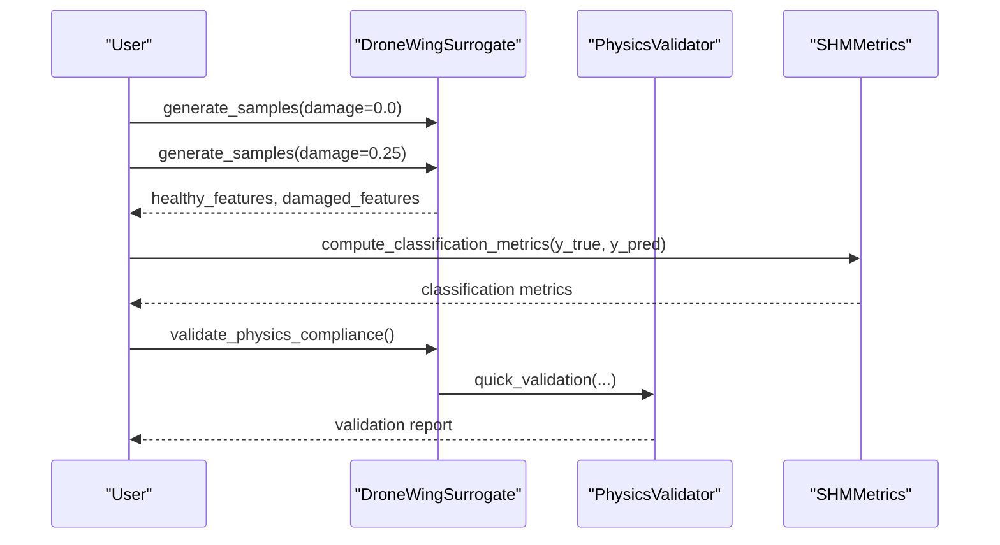
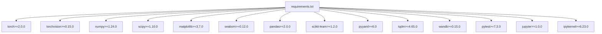

# Getting Started

<cite>
**Referenced Files in This Document**
- [GETTING_STARTED.md](file://gen-shm/GETTING_STARTED.md)
- [README.md](file://gen-shm/README.md)
- [requirements.txt](file://gen-shm/requirements.txt)
- [default.yaml](file://gen-shm/configs/default.yaml)
- [demo.ipynb](file://gen-shm/notebooks/demo.ipynb)
- [surrogate_model.py](file://gen-shm/src/models/surrogate_model.py)
- [pinn_generator.py](file://gen-shm/src/models/pinn_generator.py)
- [data_generation.py](file://gen-shm/src/data/data_generation.py)
- [trainer.py](file://gen-shm/src/training/trainer.py)
- [generate_samples.py](file://gen-shm/experiments/generate_samples.py)
- [train_model.py](file://gen-shm/experiments/train_model.py)
- [run_tests.py](file://gen-shm/tests/run_tests.py)
</cite>

## Table of Contents
1. [Introduction](#introduction)
2. [Project Structure](#project-structure)
3. [Core Components](#core-components)
4. [Architecture Overview](#architecture-overview)
5. [Detailed Component Analysis](#detailed-component-analysis)
6. [Dependency Analysis](#dependency-analysis)
7. [Performance Considerations](#performance-considerations)
8. [Troubleshooting Guide](#troubleshooting-guide)
9. [Conclusion](#conclusion)
10. [Appendices](#appendices)

## Introduction
This guide helps you quickly install, configure, and run the Gen-SHM project for drone wing structural health monitoring using physics-informed generative surrogates. It covers:
- Installing dependencies and setting up the environment
- Running the demo notebook for immediate functionality
- Generating synthetic samples and performing basic structural health monitoring tasks
- Configuring defaults and understanding first-time workflows
- Troubleshooting common setup issues and verifying installation

## Project Structure
The repository is organized around a modular Python package with clear separation of concerns:
- src/: Core library code (models, data, training, evaluation, utilities)
- experiments/: Command-line scripts for training, sampling, and evaluation
- notebooks/: Interactive demo notebook
- configs/: Default configuration file
- tests/: Minimal verification suite
- requirements.txt: Python dependency list

**Diagram sources**
- [README.md:41-55](file://gen-shm/README.md#L41-L55)
- [GETTING_STARTED.md:104-122](file://gen-shm/GETTING_STARTED.md#L104-L122)

**Section sources**
- [README.md:41-55](file://gen-shm/README.md#L41-L55)
- [GETTING_STARTED.md:104-122](file://gen-shm/GETTING_STARTED.md#L104-L122)

## Core Components
- Surrogate model: High-level interface for training, generating, and validating the physics-informed model
- PINN generator: Neural network embedding Euler-Bernoulli beam physics
- Data generation: Synthetic datasets and collocation points for training
- Training framework: Optimizer, scheduler, loss, and monitoring
- Experiments: CLI scripts for training, sampling, and evaluation
- Configuration: YAML-based defaults for physics, model, training, and data parameters

Key capabilities:
- Zero-shot generation for arbitrary damage scenarios
- Physics-compliant outputs via PINN loss
- Lightweight surrogate suitable for edge deployment
- Integrated validation and visualization utilities

**Section sources**
- [surrogate_model.py:15-272](file://gen-shm/src/models/surrogate_model.py#L15-L272)
- [pinn_generator.py:39-288](file://gen-shm/src/models/pinn_generator.py#L39-L288)
- [data_generation.py:14-318](file://gen-shm/src/data/data_generation.py#L14-L318)
- [trainer.py:55-339](file://gen-shm/src/training/trainer.py#L55-L339)

## Architecture Overview
The system integrates a PINN generator with physics constraints and a surrogate interface. Training uses synthetic data and collocation points; generation produces time-series acceleration for SHM tasks.

**Diagram sources**
- [surrogate_model.py:26-46](file://gen-shm/src/models/surrogate_model.py#L26-L46)
- [pinn_generator.py:57-85](file://gen-shm/src/models/pinn_generator.py#L57-L85)
- [data_generation.py:25-318](file://gen-shm/src/data/data_generation.py#L25-L318)
- [trainer.py:67-90](file://gen-shm/src/training/trainer.py#L67-L90)
- [train_model.py:106-117](file://gen-shm/experiments/train_model.py#L106-L117)
- [generate_samples.py:86-104](file://gen-shm/experiments/generate_samples.py#L86-L104)

## Detailed Component Analysis

### Installation and Environment Setup
- Prerequisites: Python 3.8+ and a compatible GPU (optional) for efficient training
- Install dependencies from requirements.txt
- Verify installation by running the test suite

Verification steps:
- Run the test suite to confirm imports and basic functionality
- Confirm CUDA availability if using GPU-enabled training

**Section sources**
- [requirements.txt:1-14](file://gen-shm/requirements.txt#L1-L14)
- [run_tests.py:12-56](file://gen-shm/tests/run_tests.py#L12-L56)
- [GETTING_STARTED.md:17-24](file://gen-shm/GETTING_STARTED.md#L17-L24)

### Quick Start Tutorial Using the Demo Notebook
The demo notebook provides an end-to-end walkthrough:
- Imports and environment setup
- Quick generation of synthetic vibration data
- Comparative analysis across damage scenarios
- Frequency-domain insights
- Training demonstration and physics validation
- Damage detection evaluation

**Diagram sources**
- [demo.ipynb:63-72](file://gen-shm/notebooks/demo.ipynb#L63-L72)
- [surrogate_model.py:295-307](file://gen-shm/src/models/surrogate_model.py#L295-L307)
- [data_generation.py:211-263](file://gen-shm/src/data/data_generation.py#L211-L263)
- [trainer.py:207-297](file://gen-shm/src/training/trainer.py#L207-L297)

**Section sources**
- [demo.ipynb:14-39](file://gen-shm/notebooks/demo.ipynb#L14-L39)
- [demo.ipynb:63-72](file://gen-shm/notebooks/demo.ipynb#L63-L72)
- [demo.ipynb:128-137](file://gen-shm/notebooks/demo.ipynb#L128-L137)
- [demo.ipynb:248-263](file://gen-shm/notebooks/demo.ipynb#L248-L263)

### Running the PINN Generator and Generating Synthetic Samples
Two primary paths:
- Programmatic generation via the surrogate interface
- Command-line generation using the experiments script

Programmatic example:
- Initialize the surrogate
- Train (or load a pretrained model)
- Generate samples for a given damage level and location

Command-line example:
- Use the sample generation script with arguments for model path, damage parameters, and output options

**Diagram sources**
- [surrogate_model.py:131-166](file://gen-shm/src/models/surrogate_model.py#L131-L166)
- [surrogate_model.py:48-129](file://gen-shm/src/models/surrogate_model.py#L48-L129)
- [generate_samples.py:86-104](file://gen-shm/experiments/generate_samples.py#L86-L104)

**Section sources**
- [surrogate_model.py:48-129](file://gen-shm/src/models/surrogate_model.py#L48-L129)
- [generate_samples.py:73-140](file://gen-shm/experiments/generate_samples.py#L73-L140)

### Performing Basic Structural Health Monitoring Tasks
Common tasks demonstrated in the notebook:
- Damage scenario comparison
- Frequency analysis (Welch PSD)
- Physics compliance validation
- Simple threshold-based classification

**Diagram sources**
- [demo.ipynb:339-346](file://gen-shm/notebooks/demo.ipynb#L339-L346)
- [demo.ipynb:348-369](file://gen-shm/notebooks/demo.ipynb#L348-L369)
- [demo.ipynb:294-316](file://gen-shm/notebooks/demo.ipynb#L294-L316)

**Section sources**
- [demo.ipynb:107-173](file://gen-shm/notebooks/demo.ipynb#L107-L173)
- [demo.ipynb:180-229](file://gen-shm/notebooks/demo.ipynb#L180-L229)
- [demo.ipynb:282-317](file://gen-shm/notebooks/demo.ipynb#L282-L317)
- [demo.ipynb:323-399](file://gen-shm/notebooks/demo.ipynb#L323-L399)

### Initial Configuration Through default.yaml
Key configuration areas:
- Physics: beam geometry, material properties, boundary conditions
- Damage: severity bounds, location range, damage function type
- Model: input/output dimensions, hidden layers, activation, dropout
- Training: epochs, batch size, optimizer, LR scheduler, loss weights, collocation point counts
- Data: spatial/temporal points, sensor locations, noise level, frequency range
- Paths: directories for artifacts
- Advanced: multi-scale training, adaptive weighting, regularization, numerical stability
- Visualization and logging: plot settings and log configuration

Practical tips:
- Adjust training epochs and loss weights for your hardware budget
- Tune sensor locations and noise level to match your sensing setup
- Enable GPU via command-line flags when training

**Section sources**
- [default.yaml:4-100](file://gen-shm/configs/default.yaml#L4-L100)
- [GETTING_STARTED.md:141-167](file://gen-shm/GETTING_STARTED.md#L141-L167)

## Dependency Analysis
External dependencies include:
- PyTorch and torchvision for neural networks and tensor operations
- NumPy and SciPy for numerical computations
- Matplotlib, Seaborn, Pandas for visualization and data handling
- scikit-learn for metrics and classification
- PyYAML for configuration parsing
- tqdm for progress bars
- Weights & Biases for experiment tracking
- pytest for tests
- Jupyter and ipykernel for notebooks

**Diagram sources**
- [requirements.txt:1-14](file://gen-shm/requirements.txt#L1-L14)

**Section sources**
- [requirements.txt:1-14](file://gen-shm/requirements.txt#L1-L14)

## Performance Considerations
- Use GPU if available; pass the GPU index to training scripts
- Start with fewer training epochs for testing
- Reduce batch size or physics points if memory constrained
- Monitor training progress with verbose flags and plots
- Adjust loss weights to balance data fidelity and physics compliance

[No sources needed since this section provides general guidance]

## Troubleshooting Guide
Common issues and remedies:
- CUDA out of memory: reduce batch size or physics points
- Slow training: lower epochs, reduce physics points, or use CPU
- Poor physics compliance: increase physics loss weight or training epochs
- Import errors: ensure you are in the gen-shm directory and dependencies are installed

Verification steps:
- Run the test suite to validate imports and basic functionality
- Confirm device selection (CPU/GPU) and seed reproducibility
- Check configuration loading and saving

**Section sources**
- [GETTING_STARTED.md:212-227](file://gen-shm/GETTING_STARTED.md#L212-L227)
- [run_tests.py:12-56](file://gen-shm/tests/run_tests.py#L12-L56)
- [train_model.py:50-74](file://gen-shm/experiments/train_model.py#L50-L74)

## Conclusion
You are ready to explore Gen-SHM’s physics-informed generative surrogate for drone wing structural health monitoring. Start with the demo notebook, generate synthetic samples, and iterate on configurations. Use the experiments scripts for scalable training and sampling, and rely on the configuration file to tailor the system to your application.

[No sources needed since this section summarizes without analyzing specific files]

## Appendices

### Quick Start Checklist
- Install dependencies from requirements.txt
- Launch the demo notebook and run all cells
- Generate samples via the surrogate interface or CLI
- Review configuration defaults and adjust as needed
- Run tests to verify installation

**Section sources**
- [GETTING_STARTED.md:7-24](file://gen-shm/GETTING_STARTED.md#L7-L24)
- [README.md:17-39](file://gen-shm/README.md#L17-L39)
- [run_tests.py:79-107](file://gen-shm/tests/run_tests.py#L79-L107)