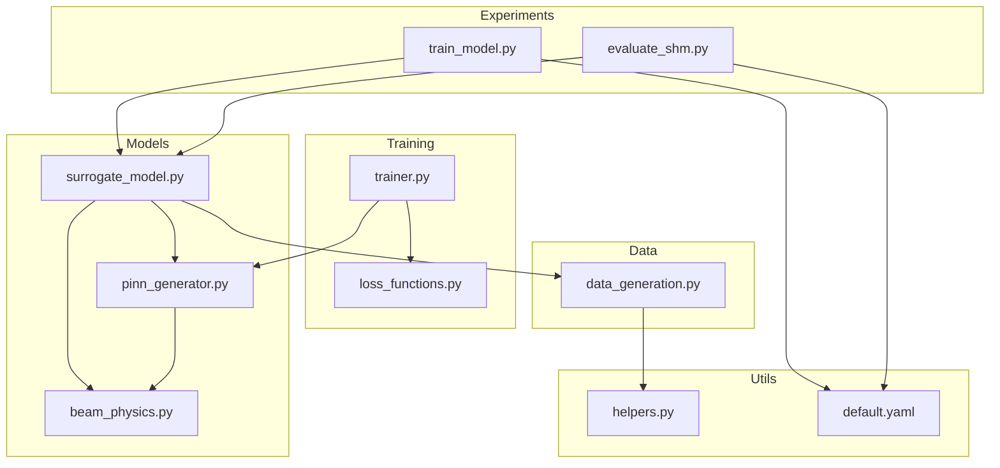
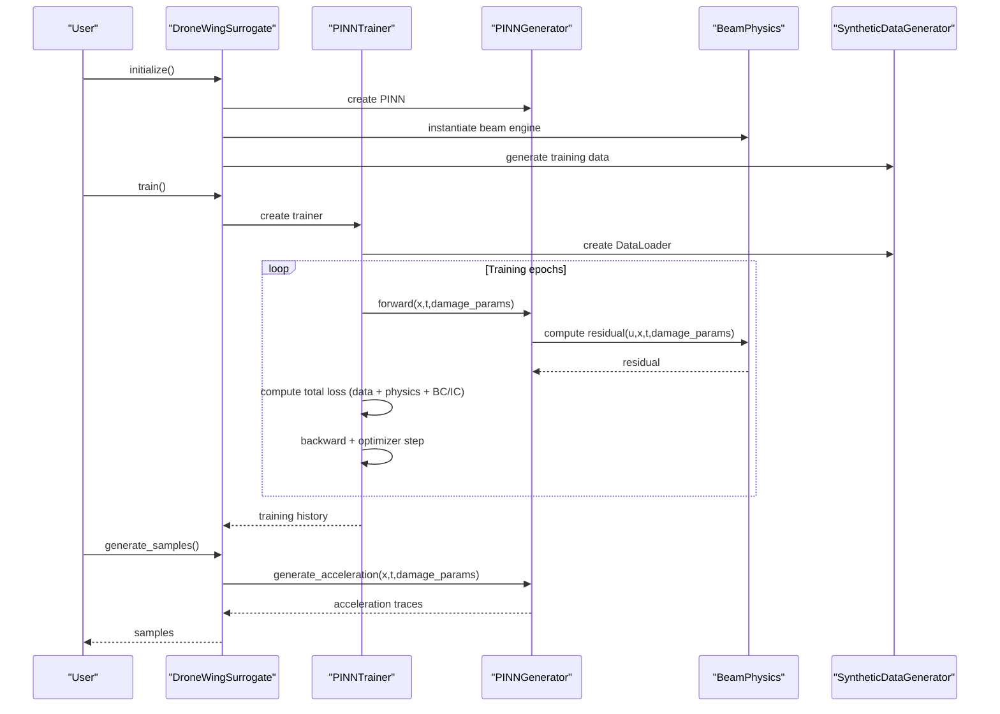
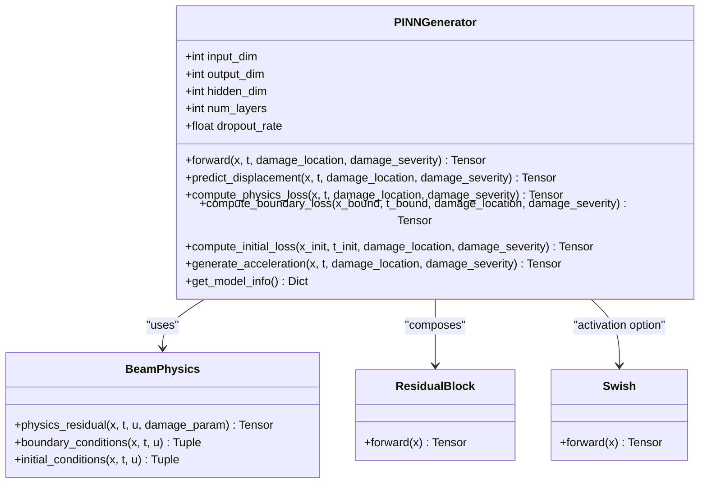
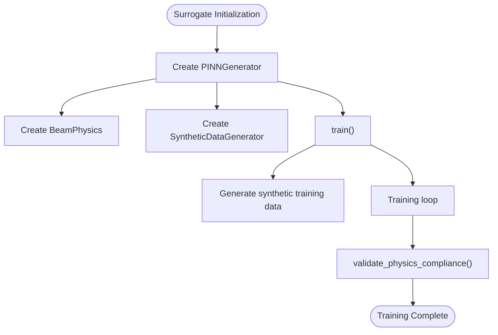
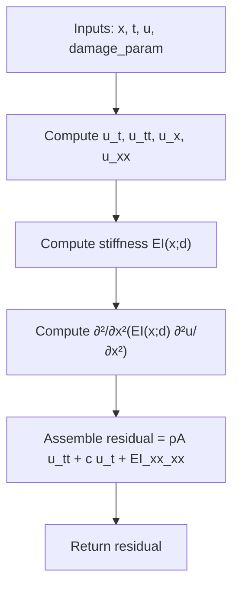
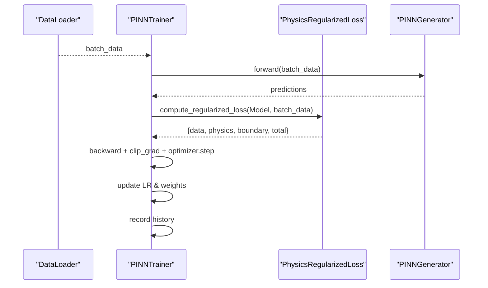
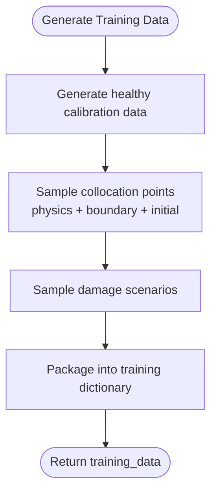
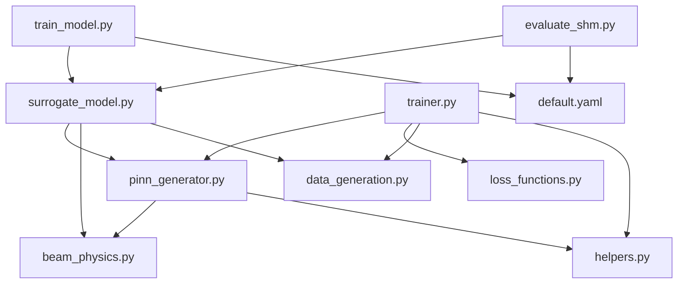

# Neural Network Architecture

<cite>
**Referenced Files in This Document**
- [pinn_generator.py](file://gen-shm/src/models/pinn_generator.py)
- [surrogate_model.py](file://gen-shm/src/models/surrogate_model.py)
- [beam_physics.py](file://gen-shm/src/models/beam_physics.py)
- [trainer.py](file://gen-shm/src/training/trainer.py)
- [loss_functions.py](file://gen-shm/src/training/loss_functions.py)
- [helpers.py](file://gen-shm/src/utils/helpers.py)
- [data_generation.py](file://gen-shm/src/data/data_generation.py)
- [default.yaml](file://gen-shm/configs/default.yaml)
- [train_model.py](file://gen-shm/experiments/train_model.py)
- [evaluate_shm.py](file://gen-shm/experiments/evaluate_shm.py)
- [demo.ipynb](file://gen-shm/notebooks/demo.ipynb)
- [README.md](file://gen-shm/README.md)
- [requirements.txt](file://gen-shm/requirements.txt)
</cite>

## Table of Contents
1. [Introduction](#introduction)
2. [Project Structure](#project-structure)
3. [Core Components](#core-components)
4. [Architecture Overview](#architecture-overview)
5. [Detailed Component Analysis](#detailed-component-analysis)
6. [Dependency Analysis](#dependency-analysis)
7. [Performance Considerations](#performance-considerations)
8. [Troubleshooting Guide](#troubleshooting-guide)
9. [Conclusion](#conclusion)
10. [Appendices](#appendices)

## Introduction
This document presents a comprehensive guide to the Physics-Informed Neural Network (PINN) architecture designed for structural health monitoring (SHM) of drone wings. The system embeds the Euler–Bernoulli beam equation into a parametric neural network to learn a solution operator that maps spatial coordinates, temporal coordinates, and damage parameters to vibration responses. It integrates physics constraints through automatic differentiation, collocation point sampling, and custom loss functions. The surrogate model orchestrates model creation, training, and inference workflows, while advanced features include adaptive weighting, multi-scale training, and placeholders for uncertainty quantification.

## Project Structure
The repository follows a modular layout:
- src/models: Neural network architectures and physics engines
- src/training: Training loops, loss functions, and schedulers
- src/data: Synthetic data generation and dataset utilities
- src/utils: Helpers, configuration, and logging
- experiments: End-to-end training and evaluation scripts
- notebooks: Interactive demos
- configs: YAML configuration files
- tests: Unit and integration tests

**Diagram sources**
- [train_model.py:1-165](file://gen-shm/experiments/train_model.py#L1-L165)
- [evaluate_shm.py:1-319](file://gen-shm/experiments/evaluate_shm.py#L1-L319)
- [surrogate_model.py:1-337](file://gen-shm/src/models/surrogate_model.py#L1-L337)
- [pinn_generator.py:1-352](file://gen-shm/src/models/pinn_generator.py#L1-L352)
- [beam_physics.py:1-300](file://gen-shm/src/models/beam_physics.py#L1-L300)
- [trainer.py:1-392](file://gen-shm/src/training/trainer.py#L1-L392)
- [loss_functions.py:1-167](file://gen-shm/src/training/loss_functions.py#L1-L167)
- [data_generation.py:1-384](file://gen-shm/src/data/data_generation.py#L1-L384)
- [helpers.py:1-161](file://gen-shm/src/utils/helpers.py#L1-L161)
- [default.yaml:1-100](file://gen-shm/configs/default.yaml#L1-L100)

**Section sources**
- [README.md:1-105](file://gen-shm/README.md#L1-L105)
- [requirements.txt:1-14](file://gen-shm/requirements.txt#L1-L14)

## Core Components
- PINNGenerator: A feedforward network with residual blocks, normalization, and optional dropout. It accepts inputs [x, t, damage_location, damage_severity] and outputs displacement u(x,t). It computes physics, boundary, and initial losses using automatic differentiation and integrates a BeamPhysics engine.
- BeamPhysics: Implements Euler–Bernoulli beam theory with spatially varying stiffness EI(x;d) parameterized by damage location and severity. Provides physics residual, boundary conditions, and initial conditions.
- DroneWingSurrogate: High-level orchestrator that initializes the PINN, generates synthetic data, trains the model, performs inference, and validates physics compliance.
- PINNTrainer: Training loop with optimizer selection, learning rate scheduling, gradient clipping, early stopping, and checkpointing. Integrates PhysicsRegularizedLoss and AdaptiveWeightScheduler.
- PhysicsRegularizedLoss and AdaptiveWeightScheduler: Composite loss combining data fidelity, physics residual, and boundary/initial losses with dynamic weight adaptation.
- SyntheticDataGenerator: Generates healthy calibration data, collocation points, and damage scenarios; creates PyTorch DataLoader instances.

**Section sources**
- [pinn_generator.py:39-287](file://gen-shm/src/models/pinn_generator.py#L39-L287)
- [beam_physics.py:12-224](file://gen-shm/src/models/beam_physics.py#L12-L224)
- [surrogate_model.py:15-271](file://gen-shm/src/models/surrogate_model.py#L15-L271)
- [trainer.py:55-339](file://gen-shm/src/training/trainer.py#L55-L339)
- [loss_functions.py:63-116](file://gen-shm/src/training/loss_functions.py#L63-L116)
- [data_generation.py:14-263](file://gen-shm/src/data/data_generation.py#L14-L263)

## Architecture Overview
The system couples a parametric PINN with a physics engine to satisfy governing equations and boundary/initial conditions. Automatic differentiation computes derivatives required for the physics residual. Training combines data fidelity with physics compliance and boundary/initial constraints, with adaptive weighting and optional multi-scale refinement.

**Diagram sources**
- [surrogate_model.py:131-166](file://gen-shm/src/models/surrogate_model.py#L131-L166)
- [trainer.py:207-297](file://gen-shm/src/training/trainer.py#L207-L297)
- [pinn_generator.py:155-272](file://gen-shm/src/models/pinn_generator.py#L155-L272)
- [beam_physics.py:107-150](file://gen-shm/src/models/beam_physics.py#L107-L150)
- [data_generation.py:211-263](file://gen-shm/src/data/data_generation.py#L211-L263)

## Detailed Component Analysis

### PINNGenerator: Network Topology, Activation Functions, and Input/Output Mappings
- Input/Output mapping:
  - Inputs: [x, t, damage_location, damage_severity] with dimensionality defined by configuration.
  - Output: displacement u(x,t) with shape (batch_size, 1).
- Network topology:
  - Input layer: Linear(4, hidden_dim)
  - Normalization: LayerNorm(hidden_dim)
  - Activation: Swish, SiLU, ReLU, or Tanh selectable via configuration.
  - Dropout: Optional, controlled by dropout_rate.
  - Residual blocks: Multiple residual blocks with skip connections for improved gradient flow.
  - Output layer: Linear(hidden_dim, 1).
- Initialization: Xavier uniform for linear weights; zeros for biases.
- Device placement: Moves model to CUDA if available, otherwise CPU.
- Forward pass: Stacks inputs and feeds through the sequential network.
- Physics loss computation:
  - Requires gradients for x and t.
  - Calls BeamPhysics.physics_residual to compute residual.
  - Returns mean squared residual as physics loss.
- Boundary and initial losses:
  - Enforce boundary conditions and initial conditions using BeamPhysics.
- Acceleration generation:
  - Uses automatic differentiation to compute second time derivative for acceleration.

**Diagram sources**
- [pinn_generator.py:39-138](file://gen-shm/src/models/pinn_generator.py#L39-L138)
- [pinn_generator.py:21-36](file://gen-shm/src/models/pinn_generator.py#L21-L36)
- [pinn_generator.py:14-18](file://gen-shm/src/models/pinn_generator.py#L14-L18)
- [beam_physics.py:12-57](file://gen-shm/src/models/beam_physics.py#L12-L57)

**Section sources**
- [pinn_generator.py:47-107](file://gen-shm/src/models/pinn_generator.py#L47-L107)
- [pinn_generator.py:117-154](file://gen-shm/src/models/pinn_generator.py#L117-L154)
- [pinn_generator.py:155-240](file://gen-shm/src/models/pinn_generator.py#L155-L240)
- [pinn_generator.py:241-272](file://gen-shm/src/models/pinn_generator.py#L241-L272)
- [pinn_generator.py:274-287](file://gen-shm/src/models/pinn_generator.py#L274-L287)

### Surrogate Model Wrapper: Orchestration of Creation, Training, and Inference
- Initializes PINN, BeamPhysics, and SyntheticDataGenerator.
- Provides:
  - generate_samples: Produces acceleration time histories for given damage scenarios.
  - train: Builds trainer, generates synthetic data, and runs training loop.
  - validate_physics_compliance: Tests physics residual across damage scenarios.
  - save/load model: Persists model weights and configuration.
  - get_model_info: Reports model and physics metadata.
- Integration points:
  - Uses helpers.get_device for device selection.
  - Uses data_generation.create_data_loaders for batching.

**Diagram sources**
- [surrogate_model.py:26-46](file://gen-shm/src/models/surrogate_model.py#L26-L46)
- [surrogate_model.py:131-166](file://gen-shm/src/models/surrogate_model.py#L131-L166)
- [surrogate_model.py:192-234](file://gen-shm/src/models/surrogate_model.py#L192-L234)

**Section sources**
- [surrogate_model.py:26-46](file://gen-shm/src/models/surrogate_model.py#L26-L46)
- [surrogate_model.py:131-166](file://gen-shm/src/models/surrogate_model.py#L131-L166)
- [surrogate_model.py:192-234](file://gen-shm/src/models/surrogate_model.py#L192-L234)
- [surrogate_model.py:236-271](file://gen-shm/src/models/surrogate_model.py#L236-L271)

### Physics Engine: Euler–Bernoulli Beam with Damage Modeling
- Governing equation: ρA ∂²u/∂t² + c ∂u/∂t + ∂²/∂x²[EI(x;d) ∂²u/∂x²] = 0
- Damage parameterization:
  - Damage location and severity influence stiffness EI(x;d).
  - Supports Gaussian or step-shaped damage functions.
- Stiffness field: EI(x;d) computed from normalized spatial coordinates and damage parameters.
- Physics residual: Uses automatic differentiation to compute u_t, u_tt, u_x, u_xx, and assemble residual.
- Boundary conditions: Clamped, simply supported, or free boundary types supported at both ends.
- Initial conditions: u(x,0)=0 and ∂u/∂t(x,0)=0 enforced.
- Energy conservation check: Computes kinetic and strain energy densities and integrals.

**Diagram sources**
- [beam_physics.py:107-150](file://gen-shm/src/models/beam_physics.py#L107-L150)
- [beam_physics.py:152-200](file://gen-shm/src/models/beam_physics.py#L152-L200)
- [beam_physics.py:202-223](file://gen-shm/src/models/beam_physics.py#L202-L223)

**Section sources**
- [beam_physics.py:12-57](file://gen-shm/src/models/beam_physics.py#L12-L57)
- [beam_physics.py:81-106](file://gen-shm/src/models/beam_physics.py#L81-L106)
- [beam_physics.py:107-150](file://gen-shm/src/models/beam_physics.py#L107-L150)
- [beam_physics.py:152-200](file://gen-shm/src/models/beam_physics.py#L152-L200)
- [beam_physics.py:202-223](file://gen-shm/src/models/beam_physics.py#L202-L223)
- [beam_physics.py:225-258](file://gen-shm/src/models/beam_physics.py#L225-L258)

### Training Framework: Optimizers, Schedulers, and Loss Composition
- Optimizer selection: Adam, AdamW, or SGD with configurable weight decay.
- Learning rate scheduling: Cosine annealing or ReduceLROnPlateau.
- Loss composition:
  - Data fidelity loss: Mean squared difference between predicted and observed displacement.
  - Physics loss: Mean squared physics residual.
  - Boundary/Initial losses: Optional, mean squared boundary and initial residuals.
- Adaptive weighting: Dynamically adjusts weights based on relative loss magnitudes.
- Multi-scale training: Gradually increases resolution and collocation point counts.
- Regularization: L2 penalty on weights for stability.
- Training loop: Iterates batches, clips gradients, updates weights, records history, early stopping, and checkpointing.

**Diagram sources**
- [trainer.py:127-180](file://gen-shm/src/training/trainer.py#L127-L180)
- [trainer.py:182-205](file://gen-shm/src/training/trainer.py#L182-L205)
- [trainer.py:207-297](file://gen-shm/src/training/trainer.py#L207-L297)
- [loss_functions.py:63-116](file://gen-shm/src/training/loss_functions.py#L63-L116)

**Section sources**
- [trainer.py:67-80](file://gen-shm/src/training/trainer.py#L67-L80)
- [trainer.py:92-126](file://gen-shm/src/training/trainer.py#L92-L126)
- [trainer.py:127-180](file://gen-shm/src/training/trainer.py#L127-L180)
- [trainer.py:182-205](file://gen-shm/src/training/trainer.py#L182-L205)
- [trainer.py:207-297](file://gen-shm/src/training/trainer.py#L207-L297)
- [loss_functions.py:11-61](file://gen-shm/src/training/loss_functions.py#L11-L61)
- [loss_functions.py:63-116](file://gen-shm/src/training/loss_functions.py#L63-L116)
- [loss_functions.py:118-154](file://gen-shm/src/training/loss_functions.py#L118-L154)

### Data Generation and Sampling Strategies
- Healthy calibration data: Generates synthetic acceleration traces using analytical mode shapes and damped oscillatory responses with chirp excitation and noise.
- Collocation points: Uniform sampling in space-time domain for physics loss; boundary points at x=0 and x=L; initial points at t=0.
- Damage scenarios: Randomly sampled damage locations and severities within configured bounds.
- Dataset and loader: SHMDataset batches data consistently; create_data_loaders wraps it for training.

**Diagram sources**
- [data_generation.py:30-132](file://gen-shm/src/data/data_generation.py#L30-L132)
- [data_generation.py:134-182](file://gen-shm/src/data/data_generation.py#L134-L182)
- [data_generation.py:184-209](file://gen-shm/src/data/data_generation.py#L184-L209)
- [data_generation.py:211-263](file://gen-shm/src/data/data_generation.py#L211-L263)

**Section sources**
- [data_generation.py:30-132](file://gen-shm/src/data/data_generation.py#L30-L132)
- [data_generation.py:134-182](file://gen-shm/src/data/data_generation.py#L134-L182)
- [data_generation.py:184-209](file://gen-shm/src/data/data_generation.py#L184-L209)
- [data_generation.py:211-263](file://gen-shm/src/data/data_generation.py#L211-L263)
- [data_generation.py:321-384](file://gen-shm/src/data/data_generation.py#L321-L384)

### Practical Examples: Network Initialization, Configuration, and Forward Pass
- Network initialization:
  - Instantiate PINNGenerator with configuration; activation, hidden layers, and dimensions are taken from defaults.
  - Device placement handled automatically.
- Parameter configuration:
  - Model input/output dimensions, hidden layers, activation, dropout, and physics parameters are defined in default.yaml.
- Forward pass:
  - Call forward(x, t, damage_location, damage_severity) to obtain displacement predictions.
  - Use generate_acceleration(x, t, damage_location, damage_severity) to compute acceleration time histories.
- Example usage:
  - Quick training and sample generation via quick_train_and_generate convenience function.
  - End-to-end training via train_model.py and evaluation via evaluate_shm.py.

**Section sources**
- [pinn_generator.py:47-86](file://gen-shm/src/models/pinn_generator.py#L47-L86)
- [default.yaml:25-51](file://gen-shm/configs/default.yaml#L25-L51)
- [pinn_generator.py:117-154](file://gen-shm/src/models/pinn_generator.py#L117-L154)
- [pinn_generator.py:241-272](file://gen-shm/src/models/pinn_generator.py#L241-L272)
- [surrogate_model.py:275-307](file://gen-shm/src/models/surrogate_model.py#L275-L307)
- [train_model.py:77-165](file://gen-shm/experiments/train_model.py#L77-L165)
- [evaluate_shm.py:112-319](file://gen-shm/experiments/evaluate_shm.py#L112-L319)
- [demo.ipynb:52-72](file://gen-shm/notebooks/demo.ipynb#L52-L72)

### Advanced Features: Adaptive Weighting, Multi-Fidelity Training, and Uncertainty Quantification
- Adaptive weighting:
  - AdaptiveWeightScheduler adjusts loss weights dynamically to balance data, physics, and boundary contributions based on relative magnitudes.
- Multi-scale training:
  - MultiScaleTraining progressively increases spatial/temporal resolution and collocation point counts to improve convergence.
- Multi-fidelity training:
  - TransferLearningTrainer demonstrates freezing early layers and specializing final layers for specific damage scenarios.
- Uncertainty quantification:
  - Placeholder present in surrogate’s detect_damage method; future extensions could incorporate Bayesian neural networks or ensemble methods.

**Section sources**
- [loss_functions.py:11-61](file://gen-shm/src/training/loss_functions.py#L11-L61)
- [loss_functions.py:118-154](file://gen-shm/src/training/loss_functions.py#L118-L154)
- [trainer.py:341-392](file://gen-shm/src/training/trainer.py#L341-L392)
- [surrogate_model.py:168-190](file://gen-shm/src/models/surrogate_model.py#L168-L190)

### Performance Optimization and GPU Utilization
- Device selection: Automatic CUDA/CPU detection via helpers.get_device.
- Gradient clipping: Applied to stabilize training.
- Early stopping: Prevents overfitting and reduces training time.
- Checkpointing: Saves best and latest models with optimizer and scheduler states.
- Data loading: SHMDataset and DataLoader with controlled batching and worker settings.
- Memory management:
  - Use appropriate batch sizes and collocation point counts from configuration.
  - Prefer residual blocks and normalization to improve training stability.
  - Disable dropout for physics problems as configured.

**Section sources**
- [helpers.py:21-23](file://gen-shm/src/utils/helpers.py#L21-L23)
- [trainer.py:162-163](file://gen-shm/src/training/trainer.py#L162-L163)
- [trainer.py:292-295](file://gen-shm/src/training/trainer.py#L292-L295)
- [trainer.py:309-338](file://gen-shm/src/training/trainer.py#L309-L338)
- [data_generation.py:321-384](file://gen-shm/src/data/data_generation.py#L321-L384)
- [default.yaml:34-51](file://gen-shm/configs/default.yaml#L34-L51)

## Dependency Analysis
The following diagram highlights key module dependencies and interactions:

**Diagram sources**
- [pinn_generator.py:9-11](file://gen-shm/src/models/pinn_generator.py#L9-L11)
- [surrogate_model.py:8-12](file://gen-shm/src/models/surrogate_model.py#L8-L12)
- [trainer.py:13-18](file://gen-shm/src/training/trainer.py#L13-L18)
- [train_model.py:20-23](file://gen-shm/experiments/train_model.py#L20-L23)
- [evaluate_shm.py:22-26](file://gen-shm/experiments/evaluate_shm.py#L22-L26)

**Section sources**
- [pinn_generator.py:9-11](file://gen-shm/src/models/pinn_generator.py#L9-L11)
- [surrogate_model.py:8-12](file://gen-shm/src/models/surrogate_model.py#L8-L12)
- [trainer.py:13-18](file://gen-shm/src/training/trainer.py#L13-L18)
- [train_model.py:20-23](file://gen-shm/experiments/train_model.py#L20-L23)
- [evaluate_shm.py:22-26](file://gen-shm/experiments/evaluate_shm.py#L22-L26)

## Performance Considerations
- Choose activation functions suited for physics problems (Swish/SiLU) and avoid dropout for stability.
- Tune batch size and collocation point counts to balance accuracy and speed.
- Use gradient clipping and early stopping to prevent divergence.
- Prefer cosine annealing or plateau reduction for learning rate scheduling.
- Monitor training history and adjust loss weights adaptively.

[No sources needed since this section provides general guidance]

## Troubleshooting Guide
- Device mismatch errors: Ensure tensors and model are on the same device using helpers.get_device.
- Training instability: Enable gradient clipping and reduce learning rate; verify physics residual magnitude.
- Poor physics compliance: Increase physics loss weight or boundary/initial weights; validate with validate_physics_compliance.
- Overfitting: Use early stopping, regularization, and reduce model capacity if needed.
- Memory issues: Lower batch size or collocation point counts; ensure proper cleanup of intermediate tensors.

**Section sources**
- [helpers.py:21-23](file://gen-shm/src/utils/helpers.py#L21-L23)
- [trainer.py:162-163](file://gen-shm/src/training/trainer.py#L162-L163)
- [trainer.py:292-295](file://gen-shm/src/training/trainer.py#L292-L295)
- [surrogate_model.py:192-234](file://gen-shm/src/models/surrogate_model.py#L192-L234)

## Conclusion
The Gen-SHM system demonstrates a robust PINN architecture for drone wing SHM. By embedding physics constraints through automatic differentiation and carefully designed loss functions, it achieves data-efficient, zero-shot generalization to unseen damage scenarios. The surrogate model wrapper streamlines training and inference, while advanced features like adaptive weighting and multi-scale training enhance convergence and robustness. Future work can explore uncertainty quantification and multi-fidelity training pipelines.

[No sources needed since this section summarizes without analyzing specific files]

## Appendices

### Configuration Reference
Key configuration keys and their roles:
- physics: beam geometry, material properties, damping, boundary conditions.
- damage: severity bounds, location range, damage function type.
- model: input/output dimensions, hidden layers, activation, dropout.
- training: epochs, batch size, optimizer, learning rate scheduler, loss weights, collocation counts.
- data: spatial/temporal points, sensor locations, noise level, frequency range.
- advanced: multi-scale training, adaptive weighting, regularization, gradient clipping.
- visualization/logging: plotting and logging preferences.

**Section sources**
- [default.yaml:4-100](file://gen-shm/configs/default.yaml#L4-L100)

### End-to-End Scripts
- Training: train_model.py initializes configuration, sets up environment, trains the model, saves results, and runs validation.
- Evaluation: evaluate_shm.py loads a trained model, generates test scenarios, computes metrics, and produces reports/plots.

**Section sources**
- [train_model.py:77-165](file://gen-shm/experiments/train_model.py#L77-L165)
- [evaluate_shm.py:112-319](file://gen-shm/experiments/evaluate_shm.py#L112-L319)