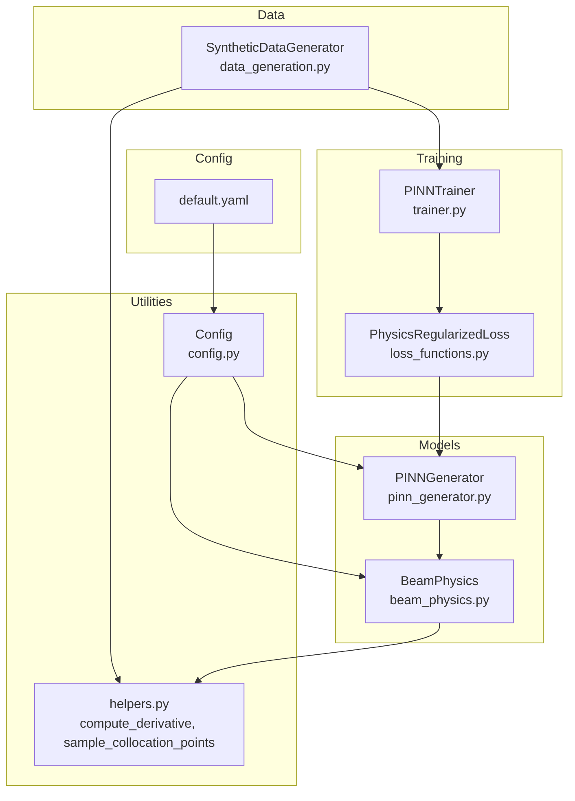
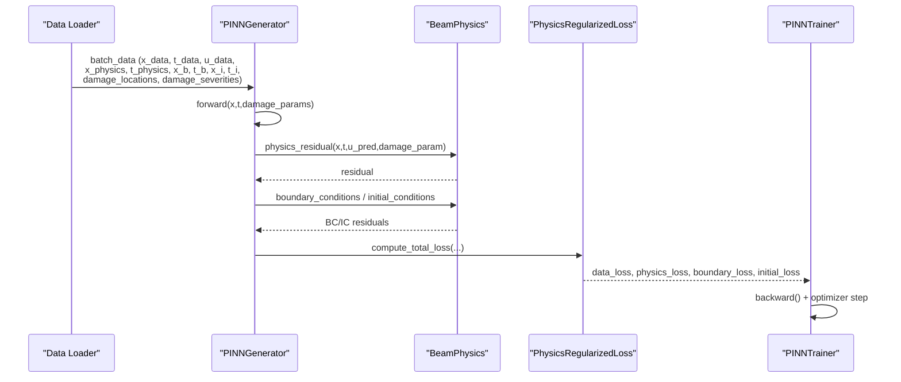
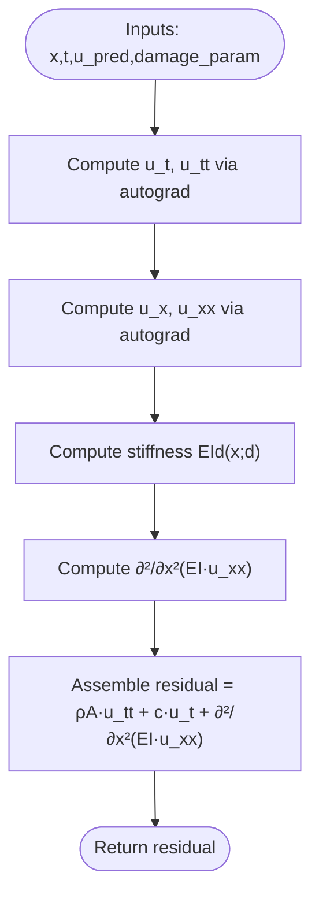
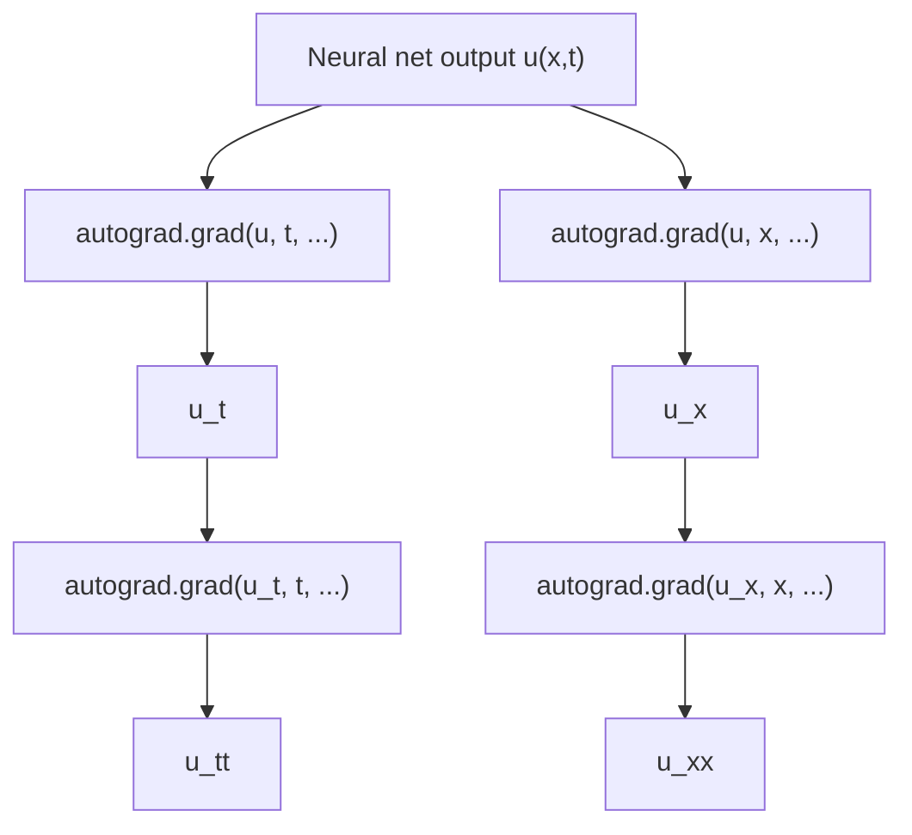
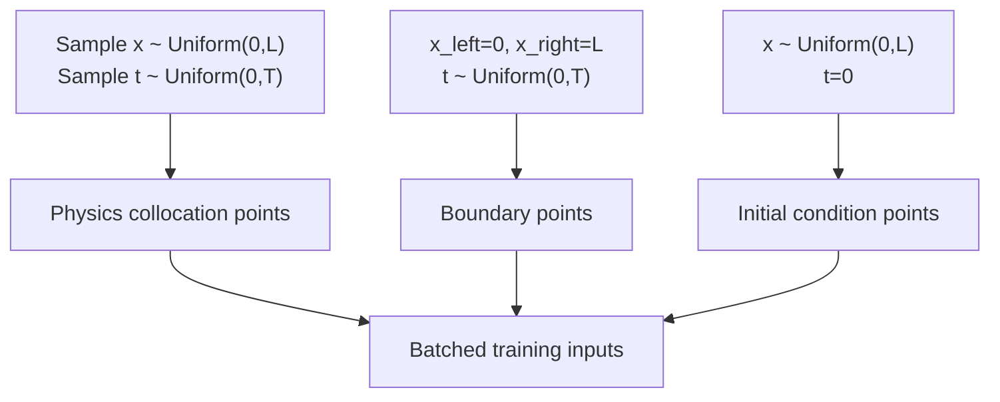
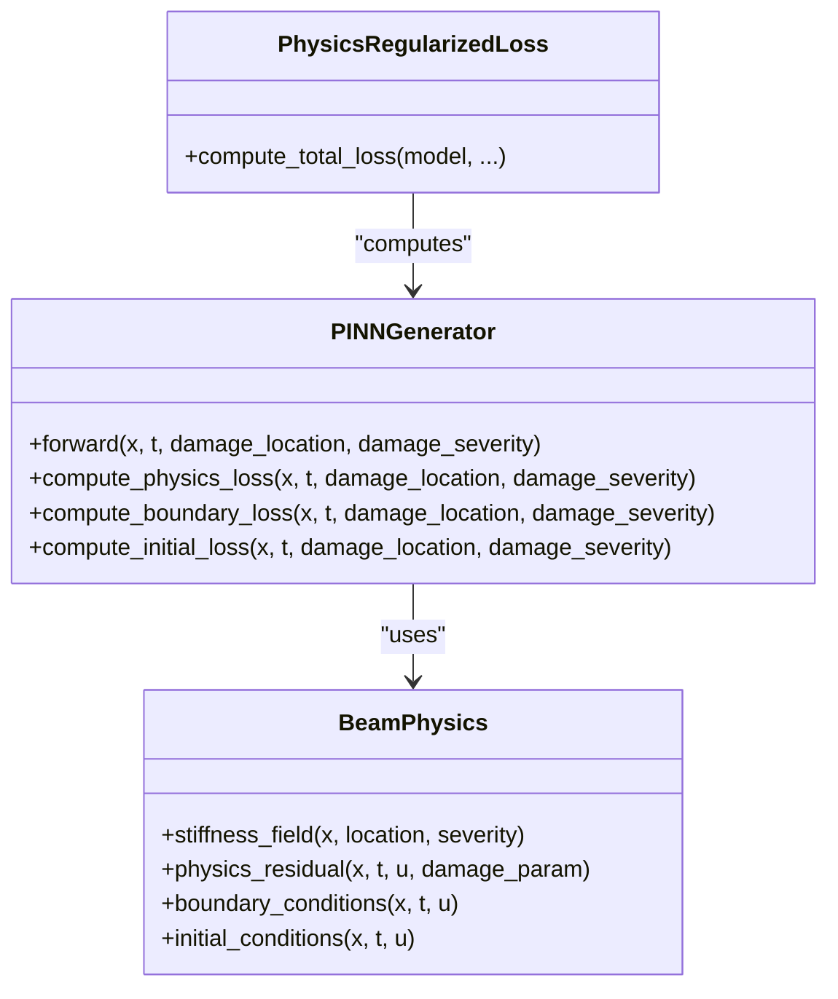
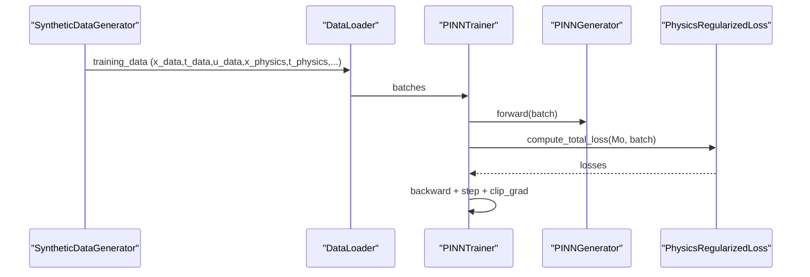
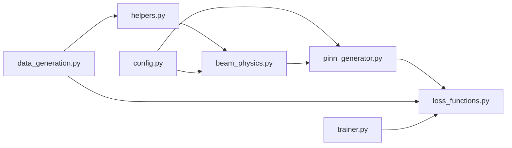

# Physics Engine Implementation

<cite>
**Referenced Files in This Document**
- [beam_physics.py](file://gen-shm/src/models/beam_physics.py)
- [pinn_generator.py](file://gen-shm/src/models/pinn_generator.py)
- [loss_functions.py](file://gen-shm/src/training/loss_functions.py)
- [data_generation.py](file://gen-shm/src/data/data_generation.py)
- [helpers.py](file://gen-shm/src/utils/helpers.py)
- [config.py](file://gen-shm/src/utils/config.py)
- [default.yaml](file://gen-shm/configs/default.yaml)
- [trainer.py](file://gen-shm/src/training/trainer.py)
- [test_physics.py](file://gen-shm/tests/test_physics.py)
- [README.md](file://gen-shm/README.md)
</cite>

## Table of Contents
1. [Introduction](#introduction)
2. [Project Structure](#project-structure)
3. [Core Components](#core-components)
4. [Architecture Overview](#architecture-overview)
5. [Detailed Component Analysis](#detailed-component-analysis)
6. [Dependency Analysis](#dependency-analysis)
7. [Performance Considerations](#performance-considerations)
8. [Troubleshooting Guide](#troubleshooting-guide)
9. [Conclusion](#conclusion)

## Introduction
This document explains the physics engine implementation that integrates Euler-Bernoulli beam theory into a Physics-Informed Neural Network (PINN) for drone wing structural health monitoring. It covers the mathematical foundations of beam deflection and stress-strain relationships, the automatic differentiation pipeline for computing spatial and temporal derivatives, collocation point generation strategies, and how physics constraints are embedded into the neural network training. It also documents configuration options for beam parameters, material properties, and loading conditions, and clarifies the relationship with the PINN architecture and training framework. Finally, it addresses numerical stability and accuracy concerns commonly encountered in PINN-based beam simulations.

## Project Structure
The physics engine resides primarily in the models package and interacts with data generation, training utilities, and configuration management. The key modules are:
- Physics engine: beam_physics.py
- PINN architecture: pinn_generator.py
- Training and loss functions: loss_functions.py, trainer.py
- Data generation and sampling: data_generation.py
- Utilities: helpers.py, config.py
- Configuration: default.yaml
- Tests: test_physics.py
- Documentation: README.md

**Diagram sources**
- [beam_physics.py:12-300](file://gen-shm/src/models/beam_physics.py#L12-L300)
- [pinn_generator.py:39-352](file://gen-shm/src/models/pinn_generator.py#L39-L352)
- [loss_functions.py:63-167](file://gen-shm/src/training/loss_functions.py#L63-L167)
- [trainer.py:55-392](file://gen-shm/src/training/trainer.py#L55-L392)
- [data_generation.py:14-384](file://gen-shm/src/data/data_generation.py#L14-L384)
- [helpers.py:76-104](file://gen-shm/src/utils/helpers.py#L76-L104)
- [config.py:10-123](file://gen-shm/src/utils/config.py#L10-L123)
- [default.yaml:1-100](file://gen-shm/configs/default.yaml#L1-L100)

**Section sources**
- [README.md:41-55](file://gen-shm/README.md#L41-L55)

## Core Components
- BeamPhysics: Implements Euler-Bernoulli beam governing equation with spatially varying stiffness due to damage, computes physics residual, boundary conditions, and initial conditions, and provides an energy-conservation check.
- PINNGenerator: A parametric PINN that takes [x, t, damage_location, damage_severity] as input and predicts u(x,t). It embeds physics constraints via automatic differentiation and composite loss functions.
- PhysicsRegularizedLoss: Computes a weighted combination of data fidelity, physics residual, and boundary/initial condition losses, with optional regularization and adaptive weighting.
- SyntheticDataGenerator: Generates synthetic healthy calibration data, collocation points for physics loss, and validation datasets with known damage scenarios.
- Helpers: Provides automatic differentiation utilities and collocation point sampling.
- Config: Centralized configuration management for physics, model, training, and data parameters.

**Section sources**
- [beam_physics.py:12-300](file://gen-shm/src/models/beam_physics.py#L12-L300)
- [pinn_generator.py:39-352](file://gen-shm/src/models/pinn_generator.py#L39-L352)
- [loss_functions.py:63-167](file://gen-shm/src/training/loss_functions.py#L63-L167)
- [data_generation.py:14-384](file://gen-shm/src/data/data_generation.py#L14-L384)
- [helpers.py:76-104](file://gen-shm/src/utils/helpers.py#L76-L104)
- [config.py:10-123](file://gen-shm/src/utils/config.py#L10-L123)

## Architecture Overview
The PINN architecture embeds the Euler-Bernoulli beam equation as a hard constraint through automatic differentiation. The training loss combines:
- Data fidelity loss: compares predicted displacement against sparse calibration data.
- Physics loss: enforces the beam equation residual computed from the neural network’s derivatives.
- Boundary/Initial losses: enforce boundary and initial conditions.
- Optional regularization: stabilizes training and prevents overfitting.

**Diagram sources**
- [pinn_generator.py:155-240](file://gen-shm/src/models/pinn_generator.py#L155-L240)
- [beam_physics.py:107-223](file://gen-shm/src/models/beam_physics.py#L107-L223)
- [loss_functions.py:299-352](file://gen-shm/src/training/loss_functions.py#L299-L352)
- [trainer.py:127-181](file://gen-shm/src/training/trainer.py#L127-L181)

## Detailed Component Analysis

### Euler-Bernoulli Beam Theory Integration
The governing equation implemented is:
$$
\rho A \frac{\partial^2 u}{\partial t^2} + c \frac{\partial u}{\partial t} + \frac{\partial^2}{\partial x^2}\left[E I(x;d) \frac{\partial^2 u}{\partial x^2}\right] = 0
$$
Where:
- $ u(x,t) $: transverse displacement
- $ \rho A $: mass per unit length
- $ c $: damping coefficient
- $ E I(x;d) $: spatially varying flexural rigidity with damage parameter $ d $

Key implementation aspects:
- Spatial stiffness field: $ E I(x;d) = E I_0 (1 - d \cdot \varphi(x)) $, where $ \varphi(x) $ is a Gaussian or step influence function centered at the damage location.
- Automatic differentiation: first and second derivatives are computed via autograd to form the residual.
- Boundary conditions: configurable left/right BCs (clamped, simply supported, free) enforced as residuals.
- Initial conditions: $ u(x,0) = 0 $ and $ \frac{\partial u}{\partial t}(x,0) = 0 $ enforced as residuals.

**Diagram sources**
- [beam_physics.py:107-150](file://gen-shm/src/models/beam_physics.py#L107-L150)
- [helpers.py:76-104](file://gen-shm/src/utils/helpers.py#L76-L104)

**Section sources**
- [beam_physics.py:12-150](file://gen-shm/src/models/beam_physics.py#L12-L150)
- [beam_physics.py:152-223](file://gen-shm/src/models/beam_physics.py#L152-L223)

### Automatic Differentiation for Spatial Derivatives
The derivative utility supports first and second-order derivatives using PyTorch autograd with:
- create_graph=True to enable higher-order derivatives
- retain_graph=True to reuse intermediate computations during residual assembly

Examples of usage:
- Computing $ \frac{\partial u}{\partial t} $ and $ \frac{\partial^2 u}{\partial t^2} $ for acceleration generation
- Computing $ \frac{\partial u}{\partial x} $, $ \frac{\partial^2 u}{\partial x^2} $, and $ \frac{\partial^3 u}{\partial x^3} $ for stiffness-weighted second spatial derivatives

**Diagram sources**
- [helpers.py:76-104](file://gen-shm/src/utils/helpers.py#L76-L104)
- [pinn_generator.py:241-272](file://gen-shm/src/models/pinn_generator.py#L241-L272)

**Section sources**
- [helpers.py:76-104](file://gen-shm/src/utils/helpers.py#L76-L104)
- [pinn_generator.py:241-272](file://gen-shm/src/models/pinn_generator.py#L241-L272)

### Collocation Point Generation Strategies
Collocation points are generated to satisfy the PDE across the spatio-temporal domain:
- Interior points: uniform sampling in $ [0, L] \times [0, T] $
- Boundary points: fixed x=0 and x=L with random t
- Initial points: random x with t=0

These strategies ensure coverage of the domain and enforcement of boundary/initial conditions.

**Diagram sources**
- [data_generation.py:134-182](file://gen-shm/src/data/data_generation.py#L134-L182)
- [helpers.py:50-74](file://gen-shm/src/utils/helpers.py#L50-L74)

**Section sources**
- [data_generation.py:134-182](file://gen-shm/src/data/data_generation.py#L134-L182)
- [helpers.py:50-74](file://gen-shm/src/utils/helpers.py#L50-L74)

### Physics Constraint Embedding Mechanisms
The PINN enforces physics through:
- Physics loss: mean squared residual over collocation points
- Boundary loss: mean squared BC residuals at boundary points
- Initial loss: mean squared IC residuals at initial points
- Composite loss: weighted sum with adaptive weighting and optional regularization

**Diagram sources**
- [beam_physics.py:81-223](file://gen-shm/src/models/beam_physics.py#L81-L223)
- [pinn_generator.py:155-240](file://gen-shm/src/models/pinn_generator.py#L155-L240)
- [loss_functions.py:299-352](file://gen-shm/src/training/loss_functions.py#L299-L352)

**Section sources**
- [pinn_generator.py:155-240](file://gen-shm/src/models/pinn_generator.py#L155-L240)
- [loss_functions.py:299-352](file://gen-shm/src/training/loss_functions.py#L299-L352)

### Configuration Options for Beam Parameters, Material Properties, and Loading Conditions
Key configuration groups and parameters:
- physics: beam_length, beam_width, beam_height, young_modulus, density, damping_coefficient, boundary_conditions[left|right]
- damage: min_severity, max_severity, location_range, damage_function
- model: input_dim, output_dim, hidden_layers, hidden_dim, activation, dropout_rate
- training: epochs, batch_size, learning_rate, optimizer, lr_scheduler, loss_weights, physics_points, boundary_points, initial_condition_points
- data: spatial_points, temporal_points, sensor_locations, noise_level, frequency_range
- advanced: multiscale_training, adaptive_weighting, l2_regularization, physics_regularization, gradient_clipping, numerical_tolerance
- visualization/logging: plot_training_progress, save_plots, plot_frequency, style, level, format, save_to_file, console_output

These options control geometry, material behavior, damage modeling, network architecture, training dynamics, and data generation.

**Section sources**
- [default.yaml:4-100](file://gen-shm/configs/default.yaml#L4-L100)
- [config.py:10-123](file://gen-shm/src/utils/config.py#L10-L123)

### Relationship with PINN Architecture and Training Framework
- PINNGenerator defines the parametric solution operator $ u(x,t;d) $ and exposes methods to compute physics, boundary, and initial losses.
- PhysicsRegularizedLoss composes the total loss from data fidelity, physics, and boundary/initial terms, with optional regularization and adaptive weighting.
- PINNTrainer orchestrates training, including optimizer selection, learning rate scheduling, gradient clipping, and early stopping.
- Data generation supplies synthetic calibration data and collocation points.

**Diagram sources**
- [data_generation.py:211-263](file://gen-shm/src/data/data_generation.py#L211-L263)
- [trainer.py:127-181](file://gen-shm/src/training/trainer.py#L127-L181)
- [loss_functions.py:299-352](file://gen-shm/src/training/loss_functions.py#L299-L352)

**Section sources**
- [pinn_generator.py:39-138](file://gen-shm/src/models/pinn_generator.py#L39-L138)
- [loss_functions.py:63-167](file://gen-shm/src/training/loss_functions.py#L63-L167)
- [trainer.py:55-392](file://gen-shm/src/training/trainer.py#L55-L392)

## Dependency Analysis
- BeamPhysics depends on helpers.compute_derivative for automatic differentiation and config for physical parameters.
- PINNGenerator depends on BeamPhysics for physics constraints and on helpers for device and normalization utilities.
- PhysicsRegularizedLoss depends on PhysicsInformedLoss and config for loss weights.
- DataGeneration depends on helpers.sample_collocation_points and AnalyticalBeamSolution for validation.
- Trainer depends on PhysicsRegularizedLoss and data loaders.

**Diagram sources**
- [beam_physics.py:8-9](file://gen-shm/src/models/beam_physics.py#L8-L9)
- [pinn_generator.py:9-11](file://gen-shm/src/models/pinn_generator.py#L9-L11)
- [loss_functions.py:8](file://gen-shm/src/training/loss_functions.py#L8)
- [data_generation.py:9-11](file://gen-shm/src/data/data_generation.py#L9-L11)
- [trainer.py:13-18](file://gen-shm/src/training/trainer.py#L13-L18)

**Section sources**
- [beam_physics.py:8-9](file://gen-shm/src/models/beam_physics.py#L8-L9)
- [pinn_generator.py:9-11](file://gen-shm/src/models/pinn_generator.py#L9-L11)
- [loss_functions.py:8](file://gen-shm/src/training/loss_functions.py#L8)
- [data_generation.py:9-11](file://gen-shm/src/data/data_generation.py#L9-L11)
- [trainer.py:13-18](file://gen-shm/src/training/trainer.py#L13-L18)

## Performance Considerations
- Automatic differentiation: Using create_graph=True enables higher-order derivatives but increases memory usage; consider retaining graphs only when necessary.
- Collocation point density: Increasing physics_points improves accuracy but raises computational cost; use multi-scale training to balance speed and precision.
- Gradient clipping: Applied in training to prevent exploding gradients during physics loss computation.
- Numerical tolerance: Configuration includes numerical_tolerance to stabilize computations.
- Device utilization: Ensure tensors are moved to the configured device to leverage GPU acceleration.

[No sources needed since this section provides general guidance]

## Troubleshooting Guide
Common issues and remedies:
- Non-zero physics residual: Verify that x and t require gradients and that the neural network output is passed through the physics engine correctly.
- Boundary/initial condition failures: Confirm boundary and initial points are sampled from the correct domains and that BC/IC functions align with configuration.
- Instability during training: Enable gradient clipping, adjust learning rate, and use adaptive weighting to balance loss contributions.
- Poor accuracy near boundaries: Increase boundary_points and ensure BC enforcement is active.
- Slow convergence: Use multi-scale training and adaptive schedulers; verify loss weights are appropriately tuned.

**Section sources**
- [test_physics.py:18-73](file://gen-shm/tests/test_physics.py#L18-L73)
- [trainer.py:162-163](file://gen-shm/src/training/trainer.py#L162-L163)
- [default.yaml:84-86](file://gen-shm/configs/default.yaml#L84-L86)

## Conclusion
The physics engine integrates Euler-Bernoulli beam theory into a PINN via automatic differentiation, collocation-based physics enforcement, and configurable boundary/initial conditions. The modular design separates physics computation, neural network architecture, and training dynamics, enabling robust and extensible structural health monitoring applications. Proper configuration of material and damage parameters, combined with adaptive training strategies, yields accurate and stable solutions for drone wing vibration modeling.