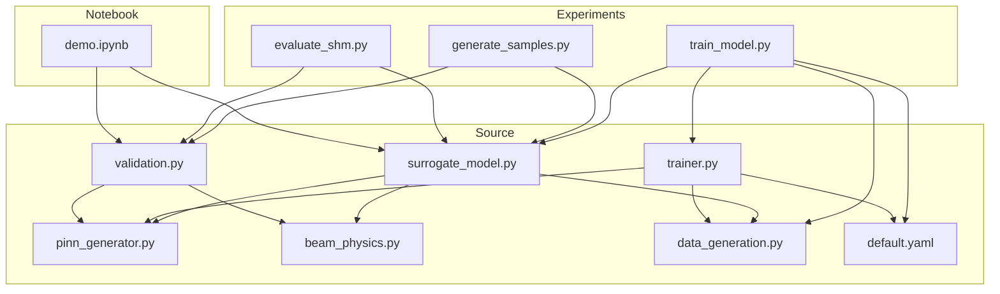
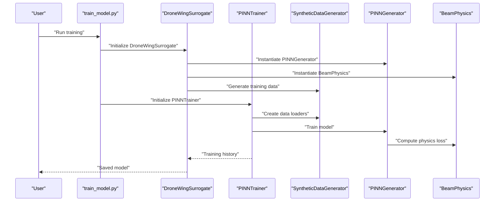
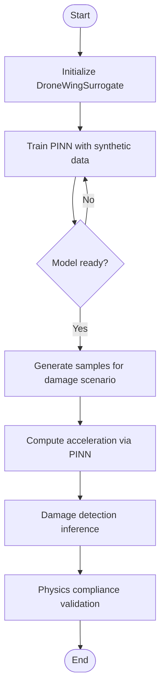
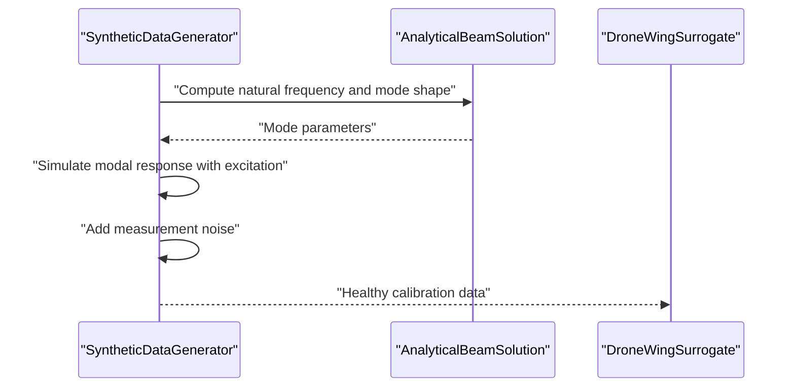
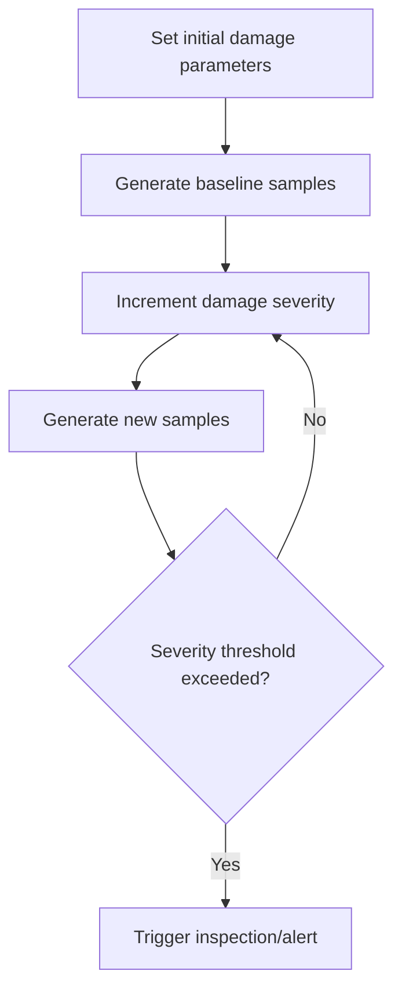
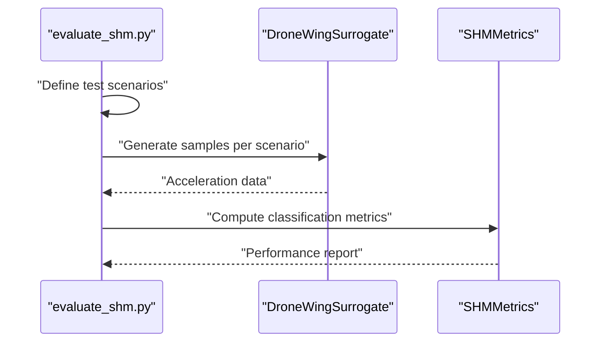
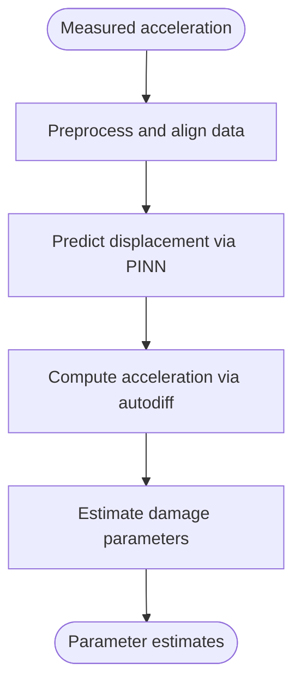
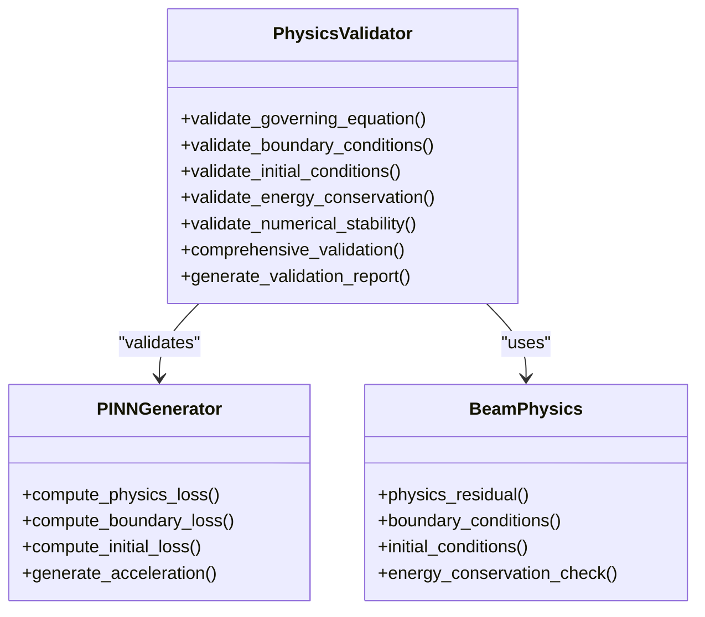
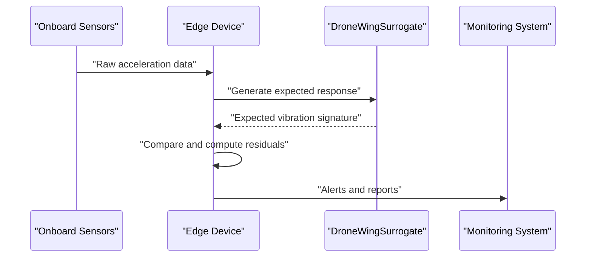
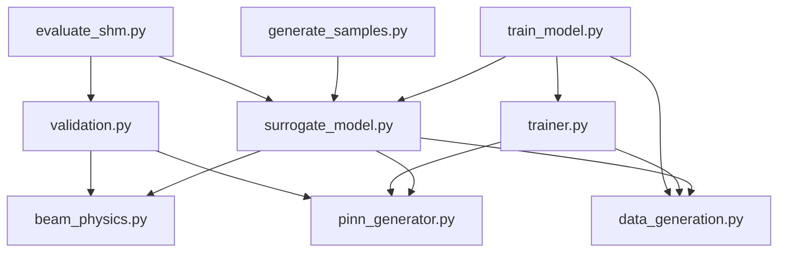

# Applications and Use Cases

<cite>
**Referenced Files in This Document**
- [README.md](file://README.md)
- [GETTING_STARTED.md](file://GETTING_STARTED.md)
- [demo.ipynb](file://notebooks/demo.ipynb)
- [default.yaml](file://configs/default.yaml)
- [surrogate_model.py](file://src/models/surrogate_model.py)
- [pinn_generator.py](file://src/models/pinn_generator.py)
- [beam_physics.py](file://src/models/beam_physics.py)
- [data_generation.py](file://src/data/data_generation.py)
- [validation.py](file://src/evaluation/validation.py)
- [trainer.py](file://src/training/trainer.py)
- [train_model.py](file://experiments/train_model.py)
- [generate_samples.py](file://experiments/generate_samples.py)
- [evaluate_shm.py](file://experiments/evaluate_shm.py)
</cite>

## Table of Contents
1. [Introduction](#introduction)
2. [Project Structure](#project-structure)
3. [Core Components](#core-components)
4. [Architecture Overview](#architecture-overview)
5. [Detailed Component Analysis](#detailed-component-analysis)
6. [Dependency Analysis](#dependency-analysis)
7. [Performance Considerations](#performance-considerations)
8. [Troubleshooting Guide](#troubleshooting-guide)
9. [Conclusion](#conclusion)
10. [Appendices](#appendices)

## Introduction
This document presents practical applications and use cases enabled by the Gen-SHM framework for drone wing structural health monitoring. It focuses on:
- Drone wing damage detection and real-time monitoring simulation
- Zero-shot damage assessment for unseen scenarios
- Pre-damaged wing analysis, crack propagation tracking, and multi-damage simulations
- Research applications: parameter estimation, uncertainty quantification, and model validation
- Production deployment scenarios, integration with existing monitoring systems, and performance benchmarking
- Laboratory-scale testing and field deployment considerations

The framework combines physics-informed neural networks (PINNs) with synthetic data generation to enable robust, data-efficient, and physically grounded structural integrity assessments for drone wings.

## Project Structure
The repository organizes functionality into modular components:
- src/models: PINN generator, beam physics engine, and surrogate model interface
- src/data: Synthetic data generation for training and validation
- src/training: Training framework with adaptive loss weighting and regularization
- src/evaluation: Metrics, validation, and visualization utilities
- src/utils: Configuration, helpers, and logging
- experiments: End-to-end scripts for training, sampling, and evaluation
- notebooks: Interactive demo showcasing capabilities
- configs: Default configuration for physics, model, training, and data parameters

**Diagram sources**
- [train_model.py:1-165](file://experiments/train_model.py#L1-L165)
- [generate_samples.py:1-216](file://experiments/generate_samples.py#L1-L216)
- [evaluate_shm.py:1-319](file://experiments/evaluate_shm.py#L1-L319)
- [demo.ipynb:1-437](file://notebooks/demo.ipynb#L1-L437)
- [surrogate_model.py:1-337](file://src/models/surrogate_model.py#L1-L337)
- [pinn_generator.py:1-352](file://src/models/pinn_generator.py#L1-L352)
- [beam_physics.py:1-300](file://src/models/beam_physics.py#L1-L300)
- [data_generation.py:1-384](file://src/data/data_generation.py#L1-L384)
- [trainer.py:1-392](file://src/training/trainer.py#L1-L392)
- [validation.py:1-376](file://src/evaluation/validation.py#L1-L376)
- [default.yaml:1-100](file://configs/default.yaml#L1-L100)

**Section sources**
- [README.md:41-55](file://README.md#L41-L55)
- [GETTING_STARTED.md:104-122](file://GETTING_STARTED.md#L104-L122)

## Core Components
- Surrogate Model: High-level interface for training, sampling, and validation; orchestrates PINN, physics engine, and data generator.
- PINN Generator: Physics-informed neural network that predicts displacement and computes physics residuals; supports acceleration generation via automatic differentiation.
- Beam Physics Engine: Implements Euler-Bernoulli beam theory with spatially varying stiffness to model damage; enforces boundary and initial conditions.
- Data Generation: Produces synthetic calibration data, collocation points, and validation datasets; simulates realistic sensor measurements with noise.
- Training Framework: Adapts loss weights, schedules learning rates, and monitors convergence; supports early stopping and checkpointing.
- Evaluation and Validation: Provides comprehensive physics compliance checks, numerical stability tests, and performance metrics for damage detection.

**Section sources**
- [surrogate_model.py:15-272](file://src/models/surrogate_model.py#L15-L272)
- [pinn_generator.py:39-288](file://src/models/pinn_generator.py#L39-L288)
- [beam_physics.py:12-224](file://src/models/beam_physics.py#L12-L224)
- [data_generation.py:14-318](file://src/data/data_generation.py#L14-L318)
- [trainer.py:55-339](file://src/training/trainer.py#L55-L339)
- [validation.py:16-281](file://src/evaluation/validation.py#L16-L281)

## Architecture Overview
The system integrates physics-informed generation with machine learning to produce synthetic vibration data for arbitrary damage scenarios. The pipeline supports:
- Zero-shot generation: Generate data for unseen damage locations and severities
- Real-time monitoring simulation: Continuous short-window generation for online assessment
- Physics compliance: Built-in validation ensures governing equation satisfaction and boundary conditions
- Production-ready deployment: Lightweight surrogate suitable for edge devices

**Diagram sources**
- [train_model.py:77-162](file://experiments/train_model.py#L77-L162)
- [surrogate_model.py:131-166](file://src/models/surrogate_model.py#L131-L166)
- [trainer.py:207-297](file://src/training/trainer.py#L207-L297)
- [data_generation.py:211-263](file://src/data/data_generation.py#L211-L263)
- [pinn_generator.py:290-352](file://src/models/pinn_generator.py#L290-L352)
- [beam_physics.py:107-150](file://src/models/beam_physics.py#L107-L150)

## Detailed Component Analysis

### Drone Wing Structural Health Monitoring Pipeline
- Zero-shot damage assessment: The surrogate can generate vibration data for arbitrary damage scenarios without prior training on those specific configurations.
- Real-time monitoring simulation: Short-duration samples enable continuous online monitoring and anomaly detection.
- Multi-damage scenario simulation: The framework supports generating data for multiple simultaneous or sequential damage events.

**Diagram sources**
- [surrogate_model.py:131-234](file://src/models/surrogate_model.py#L131-L234)
- [pinn_generator.py:241-272](file://src/models/pinn_generator.py#L241-L272)
- [validation.py:35-78](file://src/evaluation/validation.py#L35-L78)

**Section sources**
- [README.md:24-89](file://README.md#L24-L89)
- [GETTING_STARTED.md:169-211](file://GETTING_STARTED.md#L169-L211)

### Pre-damaged Wing Analysis
- Purpose: Establish baseline vibration signatures for healthy wings under known excitation.
- Method: Generate sparse sensor measurements using analytical mode shapes and add controlled noise.
- Outputs: Displacement, velocity, and acceleration time histories at virtual sensor locations.

**Diagram sources**
- [data_generation.py:30-132](file://src/data/data_generation.py#L30-L132)
- [beam_physics.py:261-300](file://src/models/beam_physics.py#L261-L300)

**Section sources**
- [data_generation.py:30-132](file://src/data/data_generation.py#L30-L132)

### Crack Propagation Tracking
- Purpose: Simulate evolving damage by gradually increasing severity at fixed or moving locations.
- Method: Iteratively generate samples with incremental damage parameters; track changes in frequency content and amplitude.
- Outputs: Time-series of vibration signatures enabling trend analysis and early warning thresholds.

**Diagram sources**
- [demo.ipynb:119-137](file://notebooks/demo.ipynb#L119-L137)
- [data_generation.py:184-209](file://src/data/data_generation.py#L184-L209)

**Section sources**
- [demo.ipynb:119-137](file://notebooks/demo.ipynb#L119-L137)

### Multi-Damage Scenario Simulation
- Purpose: Evaluate system behavior under multiple simultaneous or sequential damages.
- Method: Generate validation datasets with predefined and randomized damage scenarios; assess combined effects on vibration signatures.
- Outputs: Aggregated metrics for classification and localization tasks.

**Diagram sources**
- [evaluate_shm.py:51-96](file://experiments/evaluate_shm.py#L51-L96)
- [evaluate_shm.py:150-197](file://experiments/evaluate_shm.py#L150-L197)
- [surrogate_model.py:48-129](file://src/models/surrogate_model.py#L48-L129)

**Section sources**
- [evaluate_shm.py:51-96](file://experiments/evaluate_shm.py#L51-L96)
- [evaluate_shm.py:150-197](file://experiments/evaluate_shm.py#L150-L197)

### Research Applications

#### Parameter Estimation
- Objective: Estimate damage location and severity from measured vibration data.
- Approach: Use trained PINN to reconstruct displacement fields and derive acceleration; apply regression or classification heads for parameter estimation.
- Notes: The surrogate’s acceleration generation pathway supports this by computing second time derivatives via automatic differentiation.

**Diagram sources**
- [surrogate_model.py:241-272](file://src/models/surrogate_model.py#L241-L272)
- [pinn_generator.py:241-272](file://src/models/pinn_generator.py#L241-L272)

**Section sources**
- [surrogate_model.py:168-191](file://src/models/surrogate_model.py#L168-L191)

#### Uncertainty Quantification
- Objective: Assess confidence in damage detection and localization.
- Approach: Integrate Bayesian neural networks or ensemble methods; leverage Monte Carlo sampling of damage parameters to quantify variability.
- Notes: The framework’s stochastic generation and noise modeling support uncertainty characterization.

**Section sources**
- [data_generation.py:120-124](file://src/data/data_generation.py#L120-L124)

#### Model Validation
- Objective: Ensure the surrogate satisfies governing equations and boundary conditions.
- Approach: PhysicsValidator performs residual checks, boundary condition validation, initial condition checks, energy conservation verification, and numerical stability tests.

**Diagram sources**
- [validation.py:16-281](file://src/evaluation/validation.py#L16-L281)
- [pinn_generator.py:155-239](file://src/models/pinn_generator.py#L155-L239)
- [beam_physics.py:107-224](file://src/models/beam_physics.py#L107-L224)

**Section sources**
- [validation.py:250-353](file://src/evaluation/validation.py#L250-L353)

### Production Deployment Scenarios

#### Integration with Existing Monitoring Systems
- Data ingestion: Convert measured acceleration traces into the surrogate’s input format (space-time coordinates plus damage parameters).
- Inference pipeline: Use trained model to generate expected vibration signatures; compare with measurements to detect anomalies.
- Edge deployment: The lightweight surrogate enables real-time inference on resource-constrained devices.

**Diagram sources**
- [surrogate_model.py:168-191](file://src/models/surrogate_model.py#L168-L191)
- [generate_samples.py:73-113](file://experiments/generate_samples.py#L73-L113)

**Section sources**
- [README.md:13-15](file://README.md#L13-L15)
- [GETTING_STARTED.md:136-139](file://GETTING_STARTED.md#L136-L139)

#### Performance Benchmarking
- Metrics: Track training convergence, physics compliance, and damage detection performance.
- Tools: Training history, validation reports, and evaluation scripts provide standardized benchmarks.

**Section sources**
- [trainer.py:207-297](file://src/training/trainer.py#L207-L297)
- [validation.py:250-353](file://src/evaluation/validation.py#L250-L353)
- [evaluate_shm.py:226-311](file://experiments/evaluate_shm.py#L226-L311)

### Practical Implementation Guidelines

#### Laboratory-Scale Testing
- Use the demo notebook to explore capabilities and validate assumptions.
- Generate healthy calibration data to establish baselines; introduce controlled damage to study sensitivity.
- Validate physics compliance before deploying to real systems.

**Section sources**
- [demo.ipynb:46-101](file://notebooks/demo.ipynb#L46-L101)
- [data_generation.py:30-132](file://src/data/data_generation.py#L30-L132)
- [validation.py:250-281](file://src/evaluation/validation.py#L250-L281)

#### Field Deployment Considerations
- Sensor placement: Use normalized sensor locations configured in the default settings.
- Noise modeling: Account for environmental noise in synthetic data generation to improve robustness.
- Real-time constraints: Optimize sampling duration and sensor count for latency budgets.

**Section sources**
- [default.yaml:57-59](file://configs/default.yaml#L57-L59)
- [data_generation.py:120-124](file://src/data/data_generation.py#L120-L124)
- [generate_samples.py:38-41](file://experiments/generate_samples.py#L38-L41)

## Dependency Analysis
The following diagram highlights key dependencies among components:

**Diagram sources**
- [surrogate_model.py:38-40](file://src/models/surrogate_model.py#L38-L40)
- [trainer.py:67-75](file://src/training/trainer.py#L67-L75)
- [validation.py:28-32](file://src/evaluation/validation.py#L28-L32)
- [train_model.py:106-114](file://experiments/train_model.py#L106-L114)
- [generate_samples.py:86-88](file://experiments/generate_samples.py#L86-L88)
- [evaluate_shm.py:125-127](file://experiments/evaluate_shm.py#L125-L127)

**Section sources**
- [surrogate_model.py:38-40](file://src/models/surrogate_model.py#L38-L40)
- [trainer.py:67-75](file://src/training/trainer.py#L67-L75)
- [validation.py:28-32](file://src/evaluation/validation.py#L28-L32)

## Performance Considerations
- Training efficiency: Adjust loss weights, collocation point counts, and learning rate scheduling to balance convergence speed and accuracy.
- Physics compliance: Increase physics loss weight or epochs to improve adherence to governing equations.
- Real-time inference: Reduce sampling duration and sensor count for edge deployments; validate numerical stability regularly.

[No sources needed since this section provides general guidance]

## Troubleshooting Guide
Common issues and remedies:
- CUDA out of memory: Reduce batch size or number of collocation points.
- Slow training: Decrease physics points or network depth; use fewer hidden layers.
- Poor physics compliance: Increase physics loss weight or training epochs.
- Import errors: Ensure working directory and dependencies are correctly set up.

**Section sources**
- [GETTING_STARTED.md:212-227](file://GETTING_STARTED.md#L212-L227)

## Conclusion
Gen-SHM enables practical, physics-grounded structural health monitoring for drone wings. Its zero-shot generation, real-time simulation capabilities, and comprehensive validation framework support both research and production use cases. By integrating synthetic data generation, PINN training, and rigorous validation, the system provides a robust foundation for damage detection, parameter estimation, and deployment in laboratory and field environments.

[No sources needed since this section summarizes without analyzing specific files]

## Appendices

### Example Workflows and Scripts
- Training: Use the training script to initialize the surrogate, generate synthetic data, and train the model.
- Sampling: Generate vibration data for specific damage scenarios with the sample generation script.
- Evaluation: Assess damage detection performance and physics compliance using the evaluation script.

**Section sources**
- [train_model.py:77-162](file://experiments/train_model.py#L77-L162)
- [generate_samples.py:73-213](file://experiments/generate_samples.py#L73-L213)
- [evaluate_shm.py:112-319](file://experiments/evaluate_shm.py#L112-L319)

### Configuration Reference
Key configuration categories:
- Physics: Beam geometry, material properties, boundary conditions
- Damage: Severity bounds, location range, damage function type
- Model: Network architecture and activation
- Training: Hyperparameters, loss weights, collocation points
- Data: Sensor locations, noise level, frequency range

**Section sources**
- [default.yaml:4-99](file://configs/default.yaml#L4-L99)