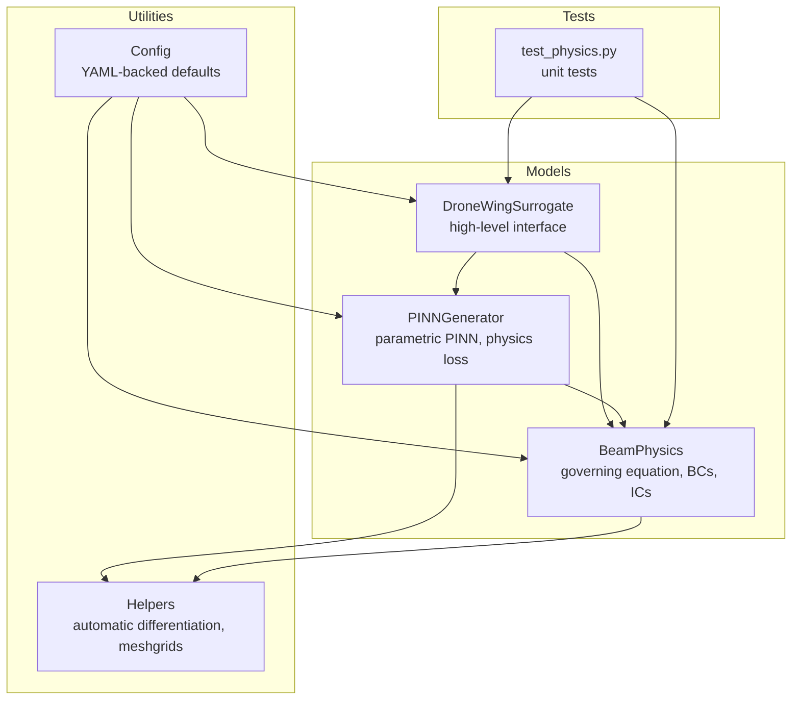
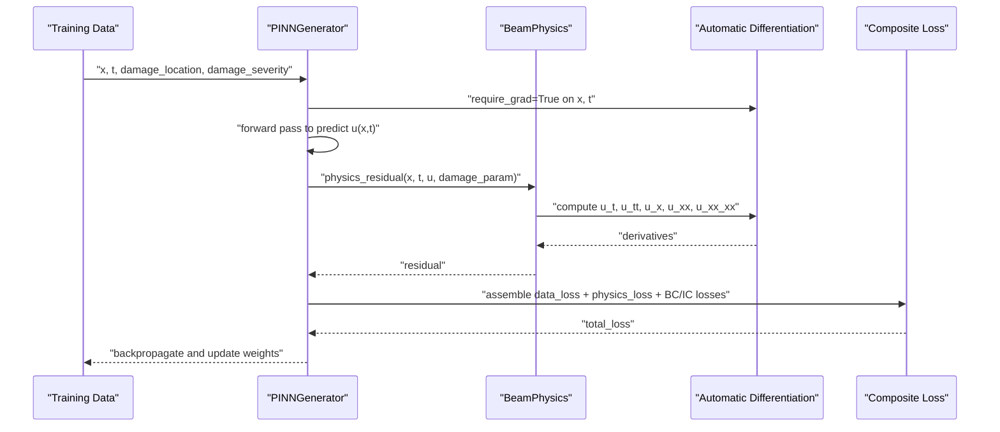
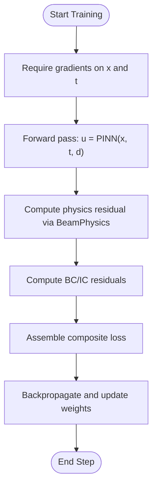
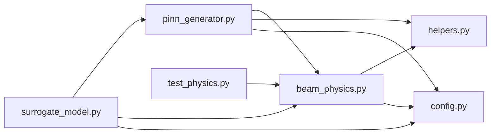

# Core Scientific Concepts and Theory

<cite>
**Referenced Files in This Document**
- [beam_physics.py](file://gen-shm/src/models/beam_physics.py)
- [pinn_generator.py](file://gen-shm/src/models/pinn_generator.py)
- [surrogate_model.py](file://gen-shm/src/models/surrogate_model.py)
- [helpers.py](file://gen-shm/src/utils/helpers.py)
- [config.py](file://gen-shm/src/utils/config.py)
- [default.yaml](file://gen-shm/configs/default.yaml)
- [test_physics.py](file://gen-shm/tests/test_physics.py)
</cite>

## Table of Contents
1. [Introduction](#introduction)
2. [Project Structure](#project-structure)
3. [Core Components](#core-components)
4. [Architecture Overview](#architecture-overview)
5. [Detailed Component Analysis](#detailed-component-analysis)
6. [Dependency Analysis](#dependency-analysis)
7. [Performance Considerations](#performance-considerations)
8. [Troubleshooting Guide](#troubleshooting-guide)
9. [Conclusion](#conclusion)

## Introduction
This document explains the core scientific concepts and theory underpinning the framework’s physics-informed neural networks (PINNs). It focuses on Euler-Bernoulli beam theory, its mathematical formulation, and how it is embedded into neural networks to learn the solution operator for structural dynamics. The document covers governing differential equations, boundary and initial conditions, constitutive relations, and the concept of physics constraint embedding. It also explains automatic differentiation, how physical laws become training objectives, and the relationship between damage parameters, stress-strain relationships, and observable vibrations. The presentation is designed to be accessible to readers with varying mathematical backgrounds while maintaining scientific rigor.

## Project Structure
The repository organizes the physics foundation, PINN architecture, and training components into modular Python modules. The physics engine resides in a dedicated module, while the PINN generator integrates physics constraints into a parametric neural network. Configuration and utilities support numerical stability and reproducibility.

**Diagram sources**
- [beam_physics.py:12-300](file://gen-shm/src/models/beam_physics.py#L12-L300)
- [pinn_generator.py:39-352](file://gen-shm/src/models/pinn_generator.py#L39-L352)
- [surrogate_model.py:15-337](file://gen-shm/src/models/surrogate_model.py#L15-L337)
- [helpers.py:76-104](file://gen-shm/src/utils/helpers.py#L76-L104)
- [config.py:10-123](file://gen-shm/src/utils/config.py#L10-L123)
- [test_physics.py:18-99](file://gen-shm/tests/test_physics.py#L18-L99)

**Section sources**
- [beam_physics.py:12-300](file://gen-shm/src/models/beam_physics.py#L12-L300)
- [pinn_generator.py:39-352](file://gen-shm/src/models/pinn_generator.py#L39-L352)
- [surrogate_model.py:15-337](file://gen-shm/src/models/surrogate_model.py#L15-L337)
- [helpers.py:76-104](file://gen-shm/src/utils/helpers.py#L76-L104)
- [config.py:10-123](file://gen-shm/src/utils/config.py#L10-L123)
- [default.yaml:1-100](file://gen-shm/configs/default.yaml#L1-L100)
- [test_physics.py:18-99](file://gen-shm/tests/test_physics.py#L18-L99)

## Core Components
- Euler-Bernoulli beam equation with spatially varying stiffness: The governing equation balances inertia, damping, and bending stiffness gradients.
- Damage modeling: Stiffness reduction is parameterized by location and severity, enabling representation of cracks or delamination.
- Physics engine: Computes residuals for the PDE, boundary conditions, and initial conditions using automatic differentiation.
- PINN generator: A parametric neural network that embeds physics through loss functions, taking spatial, temporal, and damage parameters as inputs.
- Surrogate interface: Provides high-level orchestration for training, generation, and validation of physics compliance.

Key implementation references:
- Governing equation and stiffness field: [beam_physics.py:16-106](file://gen-shm/src/models/beam_physics.py#L16-L106)
- Physics residual computation: [beam_physics.py:107-150](file://gen-shm/src/models/beam_physics.py#L107-L150)
- Boundary and initial conditions: [beam_physics.py:152-223](file://gen-shm/src/models/beam_physics.py#L152-L223)
- Automatic differentiation utilities: [helpers.py:76-104](file://gen-shm/src/utils/helpers.py#L76-L104)
- PINN architecture and physics loss: [pinn_generator.py:39-288](file://gen-shm/src/models/pinn_generator.py#L39-L288)
- Surrogate interface: [surrogate_model.py:15-272](file://gen-shm/src/models/surrogate_model.py#L15-L272)

**Section sources**
- [beam_physics.py:16-150](file://gen-shm/src/models/beam_physics.py#L16-L150)
- [helpers.py:76-104](file://gen-shm/src/utils/helpers.py#L76-L104)
- [pinn_generator.py:39-288](file://gen-shm/src/models/pinn_generator.py#L39-L288)
- [surrogate_model.py:15-272](file://gen-shm/src/models/surrogate_model.py#L15-L272)

## Architecture Overview
The framework embeds physics into a neural network by constructing a composite loss that includes:
- Data fidelity loss: compares predicted displacements to calibration data.
- Physics loss: enforces the Euler-Bernoulli beam equation via automatic differentiation.
- Boundary and initial condition losses: enforce kinematic constraints at domain boundaries and initial state.

**Diagram sources**
- [pinn_generator.py:155-240](file://gen-shm/src/models/pinn_generator.py#L155-L240)
- [beam_physics.py:107-150](file://gen-shm/src/models/beam_physics.py#L107-L150)
- [helpers.py:76-104](file://gen-shm/src/utils/helpers.py#L76-L104)

## Detailed Component Analysis

### Euler-Bernoulli Beam Theory and Its Embedding
- Governing equation: The beam equation balances inertia, damping, and bending stiffness gradients. The stiffness field varies spatially according to damage parameters.
- Constitutive relations: Bending moment relates to curvature via stiffness; strain energy density depends on curvature and stiffness.
- Boundary conditions: Enforced at the left and right ends depending on structural configuration.
- Initial conditions: Displacement and velocity prescribed at t=0.

Implementation highlights:
- Governing equation and stiffness field: [beam_physics.py:16-106](file://gen-shm/src/models/beam_physics.py#L16-L106)
- Physics residual assembly: [beam_physics.py:107-150](file://gen-shm/src/models/beam_physics.py#L107-L150)
- Boundary conditions: [beam_physics.py:152-200](file://gen-shm/src/models/beam_physics.py#L152-L200)
- Initial conditions: [beam_physics.py:202-223](file://gen-shm/src/models/beam_physics.py#L202-L223)

Mathematical notes:
- The governing equation is a fourth-order PDE in space and second-order in time.
- Damage reduces local stiffness; the stiffness field is computed as a function of normalized spatial coordinates and damage parameters.
- Energy quantities (kinetic and strain) are derived from derivatives of the displacement field.

Validation references:
- Tests confirm stiffness field behavior and residual computation for analytical cases: [test_physics.py:26-73](file://gen-shm/tests/test_physics.py#L26-L73)

**Section sources**
- [beam_physics.py:16-223](file://gen-shm/src/models/beam_physics.py#L16-L223)
- [test_physics.py:26-73](file://gen-shm/tests/test_physics.py#L26-L73)

### Physics Constraint Embedding and Automatic Differentiation
- Physics constraint embedding: The neural network does not solve the PDE directly; instead, the PDE becomes a training objective through the physics loss.
- Automatic differentiation: Gradients are computed using PyTorch autograd to evaluate time and spatial derivatives required by the governing equation and boundary conditions.
- Loss construction: The total loss combines data fidelity, physics compliance, and boundary/initial condition enforcement.

Implementation highlights:
- Physics loss computation: [pinn_generator.py:155-185](file://gen-shm/src/models/pinn_generator.py#L155-L185)
- Boundary and initial losses: [pinn_generator.py:187-239](file://gen-shm/src/models/pinn_generator.py#L187-L239)
- Automatic differentiation utilities: [helpers.py:76-104](file://gen-shm/src/utils/helpers.py#L76-L104)

**Diagram sources**
- [pinn_generator.py:155-239](file://gen-shm/src/models/pinn_generator.py#L155-L239)
- [beam_physics.py:107-200](file://gen-shm/src/models/beam_physics.py#L107-L200)
- [helpers.py:76-104](file://gen-shm/src/utils/helpers.py#L76-L104)

**Section sources**
- [pinn_generator.py:155-239](file://gen-shm/src/models/pinn_generator.py#L155-L239)
- [helpers.py:76-104](file://gen-shm/src/utils/helpers.py#L76-L104)

### Relationship Between Damage Parameters, Stress-Strain, and Vibrations
- Damage parameters: Location and severity define a spatial stiffness reduction modeled by a damage influence function.
- Stress-strain relationship: Curvature (second spatial derivative of displacement) drives internal forces; stiffness reduction lowers resistance to deformation.
- Observable vibrations: Acceleration is derived from second time derivatives of displacement; it reflects dynamic response to excitation and structural changes.

Implementation highlights:
- Damage influence functions (Gaussian/step): [beam_physics.py:58-79](file://gen-shm/src/models/beam_physics.py#L58-L79)
- Stiffness field computation: [beam_physics.py:81-105](file://gen-shm/src/models/beam_physics.py#L81-L105)
- Acceleration generation: [pinn_generator.py:241-272](file://gen-shm/src/models/pinn_generator.py#L241-L272)
- Surrogate acceleration sampling: [surrogate_model.py:103-118](file://gen-shm/src/models/surrogate_model.py#L103-L118)

Validation references:
- Tests demonstrate stiffness reduction and residual behavior: [test_physics.py:26-73](file://gen-shm/tests/test_physics.py#L26-L73)

**Section sources**
- [beam_physics.py:58-105](file://gen-shm/src/models/beam_physics.py#L58-L105)
- [pinn_generator.py:241-272](file://gen-shm/src/models/pinn_generator.py#L241-L272)
- [surrogate_model.py:103-118](file://gen-shm/src/models/surrogate_model.py#L103-L118)
- [test_physics.py:26-73](file://gen-shm/tests/test_physics.py#L26-L73)

### Analytical Solutions and Validation
- Analytical undamaged beam modes: Frequency and mode shapes are available for validation against numerical solutions.
- Validation procedures: Tests confirm stiffness field behavior and that simple solutions yield vanishing residuals.

Implementation highlights:
- Analytical mode computation: [beam_physics.py:261-300](file://gen-shm/src/models/beam_physics.py#L261-L300)
- Unit tests: [test_physics.py:75-96](file://gen-shm/tests/test_physics.py#L75-L96)

**Section sources**
- [beam_physics.py:261-300](file://gen-shm/src/models/beam_physics.py#L261-L300)
- [test_physics.py:75-96](file://gen-shm/tests/test_physics.py#L75-L96)

## Dependency Analysis
The core dependencies among components are:
- The surrogate orchestrates the PINN and physics engine.
- The PINN relies on the physics engine for residual computation and on helpers for automatic differentiation.
- Configuration drives model architecture, training, and data generation parameters.

**Diagram sources**
- [surrogate_model.py:15-337](file://gen-shm/src/models/surrogate_model.py#L15-L337)
- [pinn_generator.py:39-352](file://gen-shm/src/models/pinn_generator.py#L39-L352)
- [beam_physics.py:12-300](file://gen-shm/src/models/beam_physics.py#L12-L300)
- [helpers.py:76-104](file://gen-shm/src/utils/helpers.py#L76-L104)
- [config.py:10-123](file://gen-shm/src/utils/config.py#L10-L123)
- [test_physics.py:18-99](file://gen-shm/tests/test_physics.py#L18-L99)

**Section sources**
- [surrogate_model.py:15-337](file://gen-shm/src/models/surrogate_model.py#L15-L337)
- [pinn_generator.py:39-352](file://gen-shm/src/models/pinn_generator.py#L39-L352)
- [beam_physics.py:12-300](file://gen-shm/src/models/beam_physics.py#L12-L300)
- [helpers.py:76-104](file://gen-shm/src/utils/helpers.py#L76-L104)
- [config.py:10-123](file://gen-shm/src/utils/config.py#L10-L123)
- [test_physics.py:18-99](file://gen-shm/tests/test_physics.py#L18-L99)

## Performance Considerations
- Automatic differentiation cost: Computing second derivatives increases computational overhead; careful batching and gradient retention strategies are essential.
- Collocation point distribution: Ensuring adequate coverage of the spatio-temporal domain improves physics loss effectiveness.
- Model capacity: Deeper networks with residual blocks can improve representational power but require regularization to prevent overfitting.
- Numerical stability: Proper normalization and gradient clipping help stabilize training.

[No sources needed since this section provides general guidance]

## Troubleshooting Guide
Common issues and remedies:
- Poor physics compliance: Increase physics loss weight or adjust collocation point density; verify boundary/initial condition enforcement.
- Instability or divergence: Reduce learning rate, apply gradient clipping, or enable regularization; ensure proper normalization of inputs.
- Underfitting: Increase model capacity or training epochs; consider multi-scale training progression.
- Incorrect boundary enforcement: Verify boundary condition types and parameterization in configuration.

[No sources needed since this section provides general guidance]

## Conclusion
The framework integrates Euler-Bernoulli beam theory into a parametric PINN by embedding the governing equation, boundary conditions, and initial conditions into the training objective via automatic differentiation. Damage parameters modulate the stiffness field, linking structural changes to observable accelerations. The surrogate interface enables efficient generation of synthetic vibration data for structural health monitoring applications. Theoretical grounding, validated by unit tests and analytical solutions, ensures reliable and interpretable behavior across diverse damage scenarios.