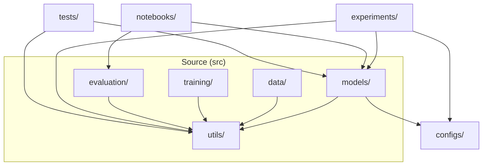
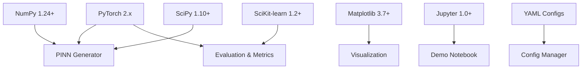
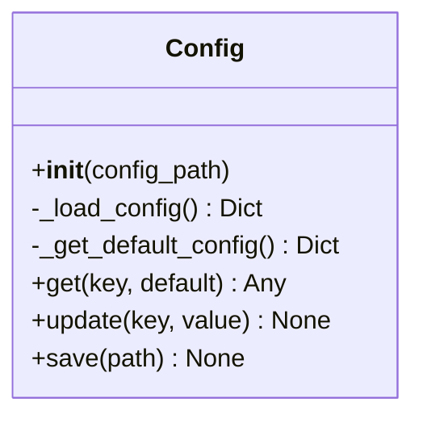
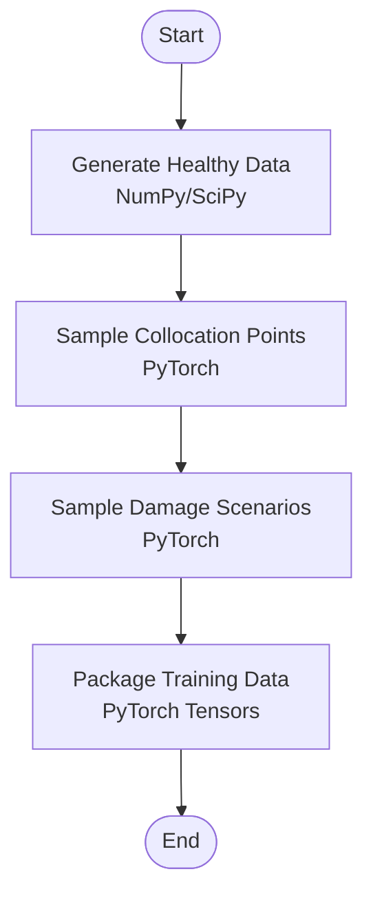
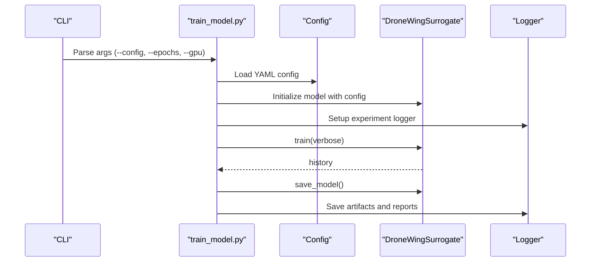
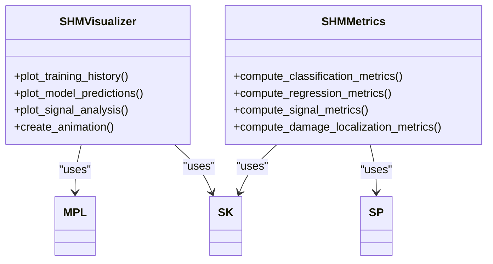
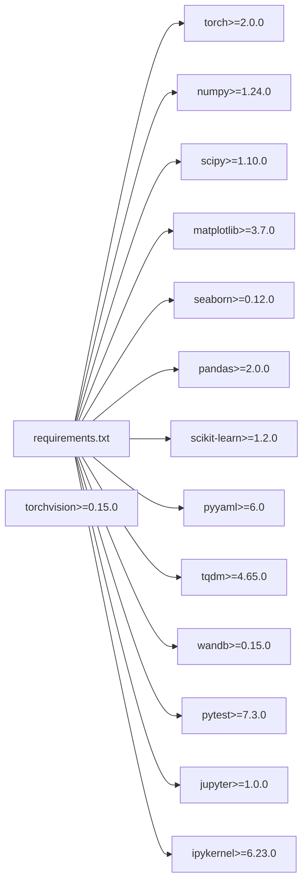

# Ecosystem and Dependencies

<cite>
**Referenced Files in This Document**
- [requirements.txt](file://requirements.txt)
- [default.yaml](file://configs/default.yaml)
- [config.py](file://src/utils/config.py)
- [README.md](file://README.md)
- [GETTING_STARTED.md](file://GETTING_STARTED.md)
- [surrogate_model.py](file://src/models/surrogate_model.py)
- [data_generation.py](file://src/data/data_generation.py)
- [helpers.py](file://src/utils/helpers.py)
- [logger.py](file://src/utils/logger.py)
- [visualization.py](file://src/evaluation/visualization.py)
- [metrics.py](file://src/evaluation/metrics.py)
- [train_model.py](file://experiments/train_model.py)
- [demo.ipynb](file://notebooks/demo.ipynb)
- [test_physics.py](file://tests/test_physics.py)
</cite>

## Table of Contents
1. [Introduction](#introduction)
2. [Project Structure](#project-structure)
3. [Core Components](#core-components)
4. [Architecture Overview](#architecture-overview)
5. [Detailed Component Analysis](#detailed-component-analysis)
6. [Dependency Analysis](#dependency-analysis)
7. [Performance Considerations](#performance-considerations)
8. [Troubleshooting Guide](#troubleshooting-guide)
9. [Conclusion](#conclusion)
10. [Appendices](#appendices)

## Introduction
This document describes the technical environment and external libraries that support the Gen-SHM framework. It covers major dependencies (PyTorch 2.0+, NumPy 1.24+, SciPy 1.10+, Matplotlib 3.7+, SciKit-learn 1.2+, and Jupyter 1.0+), explains their roles in the architecture, outlines configuration via YAML, and provides guidance on environment setup, hardware recommendations, and platform compatibility.

## Project Structure
The repository follows a modular layout with clear separation of concerns:
- Source code under src/ organized by domain: models, data, training, evaluation, and utils
- Configuration under configs/
- Experiment scripts under experiments/
- Jupyter notebooks under notebooks/
- Tests under tests/

**Diagram sources**
- [README.md:41-55](file://README.md#L41-L55)
- [GETTING_STARTED.md:104-122](file://GETTING_STARTED.md#L104-L122)

**Section sources**
- [README.md:41-55](file://README.md#L41-L55)
- [GETTING_STARTED.md:104-122](file://GETTING_STARTED.md#L104-L122)

## Core Components
- PyTorch 2.0+: Deep learning framework powering the PINN generator, automatic differentiation, GPU acceleration, and training orchestration.
- NumPy 1.24+: Numerical computing for array operations, signal processing, and statistical computations.
- SciPy 1.10+: Scientific computing routines for signal analysis (e.g., spectral estimation) and auxiliary math functions.
- Matplotlib 3.7+/Seaborn 0.12+: Visualization of training curves, signal analysis, and evaluation plots.
- SciKit-learn 1.2+: Machine learning metrics and convenience functions used in evaluation and visualization.
- Jupyter 1.0+/IPyKernel 6.23+: Interactive experimentation and notebook-based demos.

These libraries are declared in the project’s dependency specification and are actively used across modules for computation, visualization, and evaluation.

**Section sources**
- [requirements.txt:1-14](file://requirements.txt#L1-L14)
- [surrogate_model.py:5-12](file://src/models/surrogate_model.py#L5-L12)
- [data_generation.py:5-11](file://src/data/data_generation.py#L5-L11)
- [visualization.py:5-11](file://src/evaluation/visualization.py#L5-L11)
- [metrics.py:7-13](file://src/evaluation/metrics.py#L7-L13)
- [demo.ipynb:20-38](file://notebooks/demo.ipynb#L20-L38)

## Architecture Overview
The framework integrates scientific computing libraries around a PyTorch-based PINN generator. Data generation relies on NumPy/SciPy for synthetic datasets, visualization leverages Matplotlib/Seaborn, and evaluation uses SciKit-learn. Configuration is centralized via YAML and consumed by Python utilities.

**Diagram sources**
- [requirements.txt:1-14](file://requirements.txt#L1-L14)
- [surrogate_model.py:5-12](file://src/models/surrogate_model.py#L5-L12)
- [data_generation.py:5-11](file://src/data/data_generation.py#L5-L11)
- [visualization.py:5-11](file://src/evaluation/visualization.py#L5-L11)
- [metrics.py:7-13](file://src/evaluation/metrics.py#L7-L13)
- [config.py:10-123](file://src/utils/config.py#L10-L123)
- [demo.ipynb:20-38](file://notebooks/demo.ipynb#L20-L38)

## Detailed Component Analysis

### Configuration System (YAML + Python)
- Centralized configuration is defined in YAML and loaded by a Python configuration manager.
- The manager supports nested keys, updates, and saving configurations to disk.
- Default values are embedded in the configuration class for fallback behavior.

**Diagram sources**
- [config.py:10-123](file://src/utils/config.py#L10-L123)

**Section sources**
- [default.yaml:1-100](file://configs/default.yaml#L1-L100)
- [config.py:10-123](file://src/utils/config.py#L10-L123)

### Data Generation Pipeline
- Uses NumPy/SciPy for signal synthesis, modal analysis, and noise injection.
- Generates healthy calibration data, collocation points, and damage scenarios.
- Produces PyTorch tensors for training consumption.

**Diagram sources**
- [data_generation.py:30-263](file://src/data/data_generation.py#L30-L263)

**Section sources**
- [data_generation.py:30-263](file://src/data/data_generation.py#L30-L263)

### Training Orchestration and Device Management
- Command-line training script sets device (CPU/GPU), seeds, and experiment directories.
- Loads configuration, initializes the surrogate model, trains, saves artifacts, and runs validation.

**Diagram sources**
- [train_model.py:26-165](file://experiments/train_model.py#L26-L165)
- [surrogate_model.py:131-166](file://src/models/surrogate_model.py#L131-L166)
- [logger.py:11-69](file://src/utils/logger.py#L11-L69)

**Section sources**
- [train_model.py:26-165](file://experiments/train_model.py#L26-L165)
- [surrogate_model.py:131-166](file://src/models/surrogate_model.py#L131-L166)
- [logger.py:11-69](file://src/utils/logger.py#L11-L69)

### Visualization and Evaluation
- Matplotlib/Seaborn for plotting training history, predictions, and signal analysis.
- SciKit-learn for classification/regression metrics and confusion matrices.
- SciPy for signal processing (spectral analysis, correlation).

**Diagram sources**
- [visualization.py:14-432](file://src/evaluation/visualization.py#L14-L432)
- [metrics.py:16-367](file://src/evaluation/metrics.py#L16-L367)

**Section sources**
- [visualization.py:14-432](file://src/evaluation/visualization.py#L14-L432)
- [metrics.py:16-367](file://src/evaluation/metrics.py#L16-L367)

### Notebook-Based Demo
- Demonstrates quick-start workflows, comparative analysis, frequency domain inspection, training visualization, and basic damage detection evaluation.
- Exercises Matplotlib/Seaborn, SciPy, and SciKit-learn for analysis and visualization.

**Section sources**
- [demo.ipynb:20-437](file://notebooks/demo.ipynb#L20-L437)

## Dependency Analysis
The project declares strict minimum versions for scientific computing libraries. These are used pervasively across modules for numerical computation, visualization, and evaluation.

**Diagram sources**
- [requirements.txt:1-14](file://requirements.txt#L1-L14)

**Section sources**
- [requirements.txt:1-14](file://requirements.txt#L1-L14)

## Performance Considerations
- GPU recommendation: The framework detects CUDA availability and automatically targets GPU devices when available. Using a capable GPU significantly reduces training time and enables larger batch sizes and collocation point counts.
- Memory planning: Reduce batch size and collocation point counts if encountering out-of-memory errors. The configuration file exposes these parameters for tuning.
- Computational resource planning: Training time scales with epochs, collocation point counts, and model width/depth. Start with reduced epochs and progressively increase resources.

**Section sources**
- [helpers.py:21-23](file://src/utils/helpers.py#L21-L23)
- [GETTING_STARTED.md:212-226](file://GETTING_STARTED.md#L212-L226)
- [default.yaml:34-51](file://configs/default.yaml#L34-L51)

## Troubleshooting Guide
- CUDA out of memory: Reduce batch size and/or collocation point counts in configuration.
- Slow training: Decrease training epochs or collocation point counts; ensure GPU utilization.
- Poor physics compliance: Increase physics loss weight or training duration; validate with built-in physics checks.
- Import errors: Ensure the working directory is correct and dependencies are installed.

**Section sources**
- [GETTING_STARTED.md:212-226](file://GETTING_STARTED.md#L212-L226)
- [surrogate_model.py:192-234](file://src/models/surrogate_model.py#L192-L234)

## Conclusion
The Gen-SHM framework integrates a cohesive scientific computing stack centered on PyTorch for deep learning, complemented by NumPy/SciPy for numerical rigor, Matplotlib/Seaborn for visualization, and SciKit-learn for evaluation. Configuration is centralized via YAML and Python utilities, enabling reproducible experiments and flexible customization. With GPU acceleration and tunable resource parameters, the framework supports efficient training and deployment across platforms.

## Appendices

### Installation Prerequisites and Environment Setup
- Install dependencies using the provided requirements file.
- Activate a Python virtual environment and install packages prior to running experiments or notebooks.
- Verify CUDA availability for GPU acceleration; otherwise, CPU mode is used automatically.

**Section sources**
- [README.md:17-22](file://README.md#L17-L22)
- [GETTING_STARTED.md:7-24](file://GETTING_STARTED.md#L7-L24)
- [requirements.txt:1-14](file://requirements.txt#L1-14)

### Hardware Recommendations
- GPU: Prefer modern NVIDIA GPUs with sufficient VRAM to accommodate batch size and collocation point counts.
- CPU: Multi-core CPU recommended for data generation and evaluation tasks.
- RAM: Plan for several GB of RAM to handle large datasets and intermediate computations.

**Section sources**
- [helpers.py:21-23](file://src/utils/helpers.py#L21-L23)
- [GETTING_STARTED.md:212-226](file://GETTING_STARTED.md#L212-L226)

### Platform Compatibility and Deployment
- The framework is compatible with Linux/macOS/Windows environments where the listed Python packages are supported.
- Jupyter notebooks and command-line scripts are designed for cross-platform execution.
- For containerized deployment, package the environment using the requirements file and ensure CUDA drivers align with the target runtime.

**Section sources**
- [requirements.txt:1-14](file://requirements.txt#L1-14)
- [demo.ipynb:20-38](file://notebooks/demo.ipynb#L20-L38)
- [GETTING_STARTED.md:16-24](file://GETTING_STARTED.md#L16-L24)