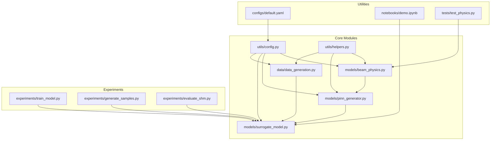
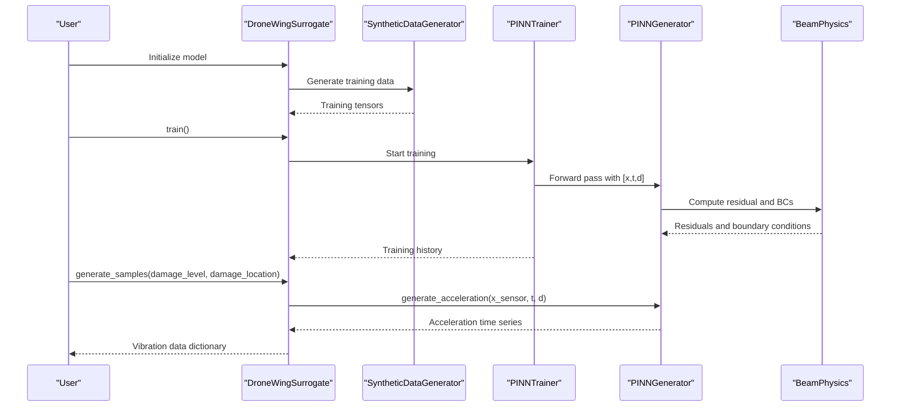
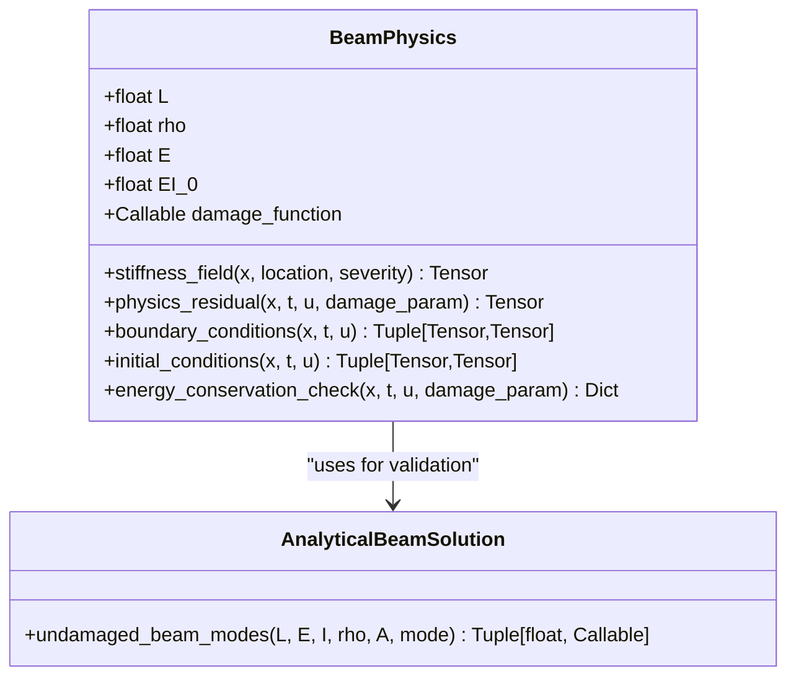
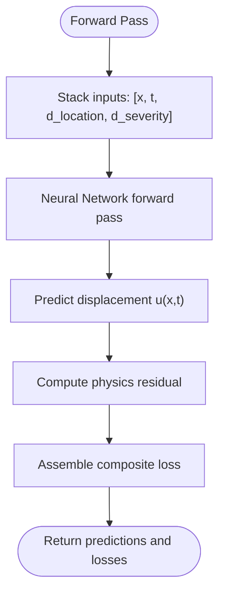
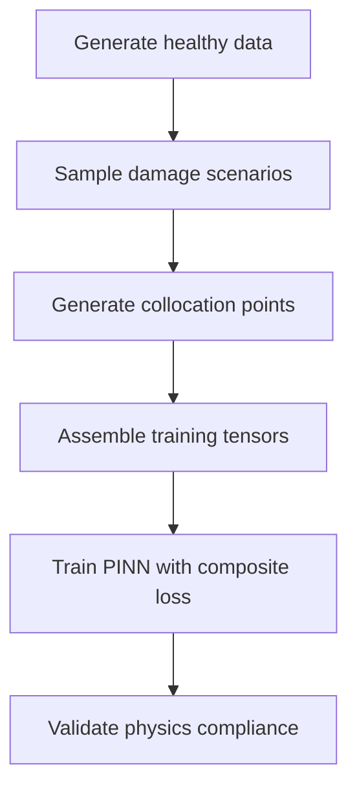
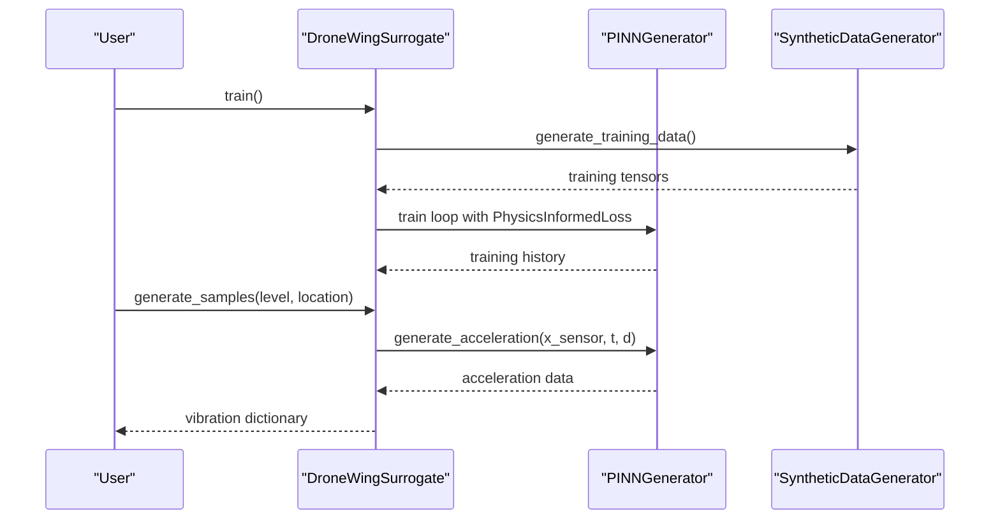
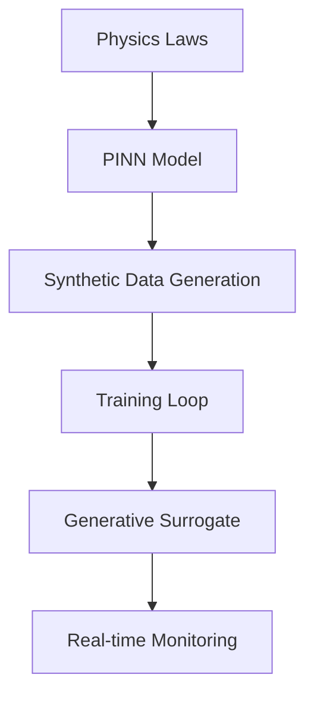
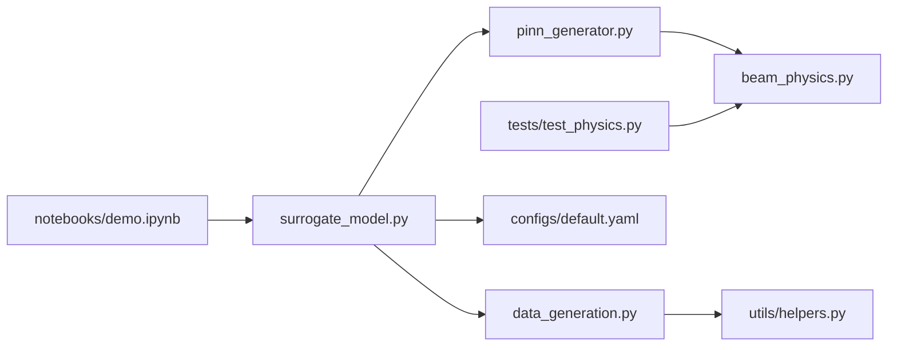

# Introduction and Motivation

<cite>
**Referenced Files in This Document**
- [README.md](file://README.md)
- [GETTING_STARTED.md](file://GETTING_STARTED.md)
- [default.yaml](file://configs/default.yaml)
- [beam_physics.py](file://src/models/beam_physics.py)
- [pinn_generator.py](file://src/models/pinn_generator.py)
- [surrogate_model.py](file://src/models/surrogate_model.py)
- [data_generation.py](file://src/data/data_generation.py)
- [demo.ipynb](file://notebooks/demo.ipynb)
- [test_physics.py](file://tests/test_physics.py)
</cite>

## Table of Contents
1. [Introduction](#introduction)
2. [Project Structure](#project-structure)
3. [Core Components](#core-components)
4. [Architecture Overview](#architecture-overview)
5. [Detailed Component Analysis](#detailed-component-analysis)
6. [Dependency Analysis](#dependency-analysis)
7. [Performance Considerations](#performance-considerations)
8. [Troubleshooting Guide](#troubleshooting-guide)
9. [Conclusion](#conclusion)
10. [Appendices](#appendices)

## Introduction
This document presents the introduction and motivation for the Gen-SHM project: a physics-informed generative surrogate framework designed for drone wing structural health monitoring. The project’s purpose is to bridge deep learning with physical laws by embedding Euler-Bernoulli beam theory into a parametric neural network. This approach enables the generation of synthetic vibration data for arbitrary damage scenarios, addressing the critical shortage of failure data for training structural health monitoring systems. The motivation stems from the aerospace industry’s need for reliable, efficient, and safe inspection of drone wings under real-world operational conditions.

Key scientific and engineering goals:
- Enable zero-shot generation of vibration data for unseen damage configurations.
- Maintain strict adherence to physical laws (governing equations, boundary and initial conditions) through physics-informed loss functions.
- Provide a lightweight, edge-deployable surrogate model suitable for real-time monitoring simulations.
- Support comprehensive validation of physics compliance and SHM performance metrics.

Target audience:
- Researchers in computational mechanics, machine learning, and structural health monitoring.
- Engineers developing predictive maintenance systems, safety-critical inspection pipelines, and data-efficient ML frameworks for aerospace applications.

Scientific significance:
- Demonstrates the value of integrating physical constraints into machine learning models to improve generalization, robustness, and interpretability.
- Highlights the potential of physics-informed neural networks (PINNs) for generating synthetic training data that respects fundamental governing equations.

## Project Structure
The repository organizes functionality into modular components:
- src/models: Neural network architectures and physics engines.
- src/data: Synthetic data generation and preprocessing.
- src/training: Training loops and loss functions.
- src/evaluation: Metrics, validation, and visualization.
- src/utils: Configuration, helpers, and logging utilities.
- experiments: End-to-end scripts for training, sampling, and evaluation.
- notebooks: Interactive demonstrations.
- configs: YAML-based configuration files.
- tests: Unit tests for physics and model components.

**Diagram sources**
- [beam_physics.py:12-300](file://src/models/beam_physics.py#L12-L300)
- [pinn_generator.py:39-352](file://src/models/pinn_generator.py#L39-L352)
- [surrogate_model.py:15-337](file://src/models/surrogate_model.py#L15-L337)
- [data_generation.py:14-384](file://src/data/data_generation.py#L14-L384)
- [default.yaml:1-100](file://configs/default.yaml#L1-L100)

**Section sources**
- [README.md:41-55](file://README.md#L41-L55)
- [GETTING_STARTED.md:104-122](file://GETTING_STARTED.md#L104-L122)

## Core Components
- Physics foundation: Euler-Bernoulli beam theory with spatially varying stiffness to model damage-induced reductions in flexural rigidity. Boundary and initial conditions are enforced to ensure physically meaningful solutions.
- Generative architecture: A parametric PINN that takes spatial, temporal coordinates, and damage parameters as inputs and predicts displacement fields. Automatic differentiation computes residuals of the governing equation.
- Training framework: A hybrid loss combining data fidelity, physics compliance, and boundary/initial condition enforcement. Configurable loss weights and adaptive strategies support robust training.
- Data generation: Synthetic datasets emulate healthy and damaged wing responses, including sparse sensor measurements, collocation points, and validation scenarios.
- Surrogate interface: A high-level class that orchestrates training, sampling, and validation, exposing a simple API for generating vibration data across arbitrary damage scenarios.

**Section sources**
- [beam_physics.py:12-300](file://src/models/beam_physics.py#L12-L300)
- [pinn_generator.py:39-352](file://src/models/pinn_generator.py#L39-L352)
- [data_generation.py:14-384](file://src/data/data_generation.py#L14-L384)
- [surrogate_model.py:15-337](file://src/models/surrogate_model.py#L15-L337)

## Architecture Overview
The system integrates physics-based modeling with machine learning through a PINN generator. The pipeline begins with configuration-driven setup, proceeds through synthetic data generation, and culminates in training a neural network that satisfies the Euler-Bernoulli beam equation. The trained surrogate can then generate acceleration time histories for new damage scenarios.

**Diagram sources**
- [surrogate_model.py:131-166](file://src/models/surrogate_model.py#L131-L166)
- [data_generation.py:211-263](file://src/data/data_generation.py#L211-L263)
- [pinn_generator.py:155-240](file://src/models/pinn_generator.py#L155-L240)
- [beam_physics.py:107-200](file://src/models/beam_physics.py#L107-L200)

## Detailed Component Analysis

### Problem Statement and Motivation
Traditional structural health monitoring approaches often rely on physical testing and historical records, which are expensive, time-consuming, and limited in coverage. In aerospace applications—particularly for drones—inspection must be rapid, reliable, and applicable to diverse flight conditions. The Gen-SHM framework addresses these challenges by:
- Generating synthetic vibration data for arbitrary damage scenarios without destructive testing.
- Embedding Euler-Bernoulli beam theory into the neural network to ensure generated data adheres to physical laws.
- Enabling zero-shot generalization to unseen damage locations and severities.
- Supporting real-time monitoring simulations and training data augmentation for downstream ML systems.

Unique value proposition:
- Combining Euler-Bernoulli beam theory with neural networks yields a physics-informed generative surrogate that is both data-efficient and physically grounded.
- The approach reduces reliance on scarce failure data while maintaining scientific rigor through residual-based training and boundary condition enforcement.

Target audience:
- Academic researchers exploring physics-informed machine learning and structural dynamics.
- Industry engineers building predictive maintenance and safety-critical inspection systems for drone fleets.

Scientific significance:
- Demonstrates how PINNs can serve as generative surrogates that preserve fundamental physical constraints, improving generalization and trustworthiness compared to purely data-driven models.

**Section sources**
- [README.md:7-16](file://README.md#L7-L16)
- [GETTING_STARTED.md:124-140](file://GETTING_STARTED.md#L124-L140)

### Physics Engine: Euler-Bernoulli Beam Theory
The physics engine implements the Euler-Bernoulli beam equation with spatially varying stiffness to represent damage. It computes:
- Stiffness field as a function of damage location and severity.
- Physics residual using automatic differentiation.
- Boundary and initial condition residuals for clamped-free, simply-supported, and free configurations.

**Diagram sources**
- [beam_physics.py:12-300](file://src/models/beam_physics.py#L12-L300)

**Section sources**
- [beam_physics.py:12-300](file://src/models/beam_physics.py#L12-L300)
- [default.yaml:4-17](file://configs/default.yaml#L4-L17)

### Generative PINN Architecture
The PINN generator accepts inputs [x, t, damage_location, damage_severity] and predicts displacement u(x,t). It enforces physics through:
- Physics loss computed from the governing equation residual.
- Boundary and initial condition losses.
- Acceleration generation via second-order time derivatives.

**Diagram sources**
- [pinn_generator.py:117-185](file://src/models/pinn_generator.py#L117-L185)

**Section sources**
- [pinn_generator.py:39-352](file://src/models/pinn_generator.py#L39-L352)

### Data Generation and Training Pipeline
Synthetic data generation creates:
- Healthy calibration data with sparse sensor measurements and excitation signals.
- Collocation points for physics loss, boundary conditions, and initial conditions.
- Random damage scenarios across validated ranges.

Training combines:
- Data fidelity loss against sparse measurements.
- Physics loss enforcing the Euler-Bernoulli equation.
- Boundary and initial condition enforcement.

**Diagram sources**
- [data_generation.py:211-263](file://src/data/data_generation.py#L211-L263)
- [pinn_generator.py:299-352](file://src/models/pinn_generator.py#L299-L352)

**Section sources**
- [data_generation.py:14-384](file://src/data/data_generation.py#L14-L384)
- [default.yaml:34-51](file://configs/default.yaml#L34-L51)

### Surrogate Interface and Usage
The surrogate model provides:
- High-level APIs for training, sampling, and validation.
- Zero-shot capability to generate vibration data for arbitrary damage parameters.
- Physics validation routines to ensure model compliance.

**Diagram sources**
- [surrogate_model.py:131-166](file://src/models/surrogate_model.py#L131-L166)
- [surrogate_model.py:48-129](file://src/models/surrogate_model.py#L48-L129)

**Section sources**
- [surrogate_model.py:15-337](file://src/models/surrogate_model.py#L15-L337)

### Conceptual Overview
The framework’s conceptual workflow emphasizes:
- Physics-first modeling with neural network flexibility.
- Data-efficient training through synthetic generation.
- Real-time simulation readiness for edge deployments.

[No sources needed since this diagram shows conceptual workflow, not actual code structure]

## Dependency Analysis
The core dependencies among components are:
- Surrogate orchestrates data generation, training, and sampling.
- PINN depends on BeamPhysics for residual computation and boundary enforcement.
- DataGeneration relies on configuration and helper utilities for collocation and sensor placement.
- Tests validate physics computations and analytical solutions.

**Diagram sources**
- [surrogate_model.py:15-46](file://src/models/surrogate_model.py#L15-L46)
- [pinn_generator.py:39-57](file://src/models/pinn_generator.py#L39-L57)
- [data_generation.py:14-29](file://src/data/data_generation.py#L14-L29)
- [beam_physics.py:12-35](file://src/models/beam_physics.py#L12-L35)
- [default.yaml:1-100](file://configs/default.yaml#L1-L100)
- [test_physics.py:14-24](file://tests/test_physics.py#L14-L24)
- [demo.ipynb:30-34](file://notebooks/demo.ipynb#L30-L34)

**Section sources**
- [surrogate_model.py:15-46](file://src/models/surrogate_model.py#L15-L46)
- [pinn_generator.py:39-57](file://src/models/pinn_generator.py#L39-L57)
- [data_generation.py:14-29](file://src/data/data_generation.py#L14-L29)
- [beam_physics.py:12-35](file://src/models/beam_physics.py#L12-L35)
- [default.yaml:1-100](file://configs/default.yaml#L1-L100)
- [test_physics.py:14-24](file://tests/test_physics.py#L14-L24)
- [demo.ipynb:30-34](file://notebooks/demo.ipynb#L30-L34)

## Performance Considerations
- Computational efficiency: The PINN architecture uses residual blocks and normalization to improve gradient flow and training stability.
- Scalability: Configuration supports multi-scale training and adaptive weighting to balance data fidelity and physics compliance.
- Edge deployment: Lightweight model design and efficient tensor operations enable real-time monitoring simulations.

[No sources needed since this section provides general guidance]

## Troubleshooting Guide
Common issues and resolutions:
- CUDA out of memory: Reduce batch size or number of collocation points.
- Slow training: Decrease physics points or network depth; adjust learning rate.
- Poor physics compliance: Increase physics loss weight or extend training duration.
- Import errors: Ensure the working directory is correct and dependencies are installed.

**Section sources**
- [GETTING_STARTED.md:212-227](file://GETTING_STARTED.md#L212-L227)

## Conclusion
Gen-SHM advances the state-of-the-art in structural health monitoring by combining Euler-Bernoulli beam theory with physics-informed neural networks. It enables zero-shot generation of vibration data for arbitrary damage scenarios, maintains strict adherence to physical laws, and supports real-time monitoring simulations. The framework offers significant value to both academic research and industrial applications, particularly in aerospace contexts where data scarcity and safety requirements demand robust, interpretable, and efficient solutions.

[No sources needed since this section summarizes without analyzing specific files]

## Appendices
- Configuration highlights: Physics parameters, damage bounds, model architecture, training hyperparameters, and visualization/logging settings are defined in the default configuration file.
- Demo notebook: Provides interactive examples of training, sampling, frequency analysis, and validation.

**Section sources**
- [default.yaml:4-100](file://configs/default.yaml#L4-L100)
- [demo.ipynb:1-437](file://notebooks/demo.ipynb#L1-L437)