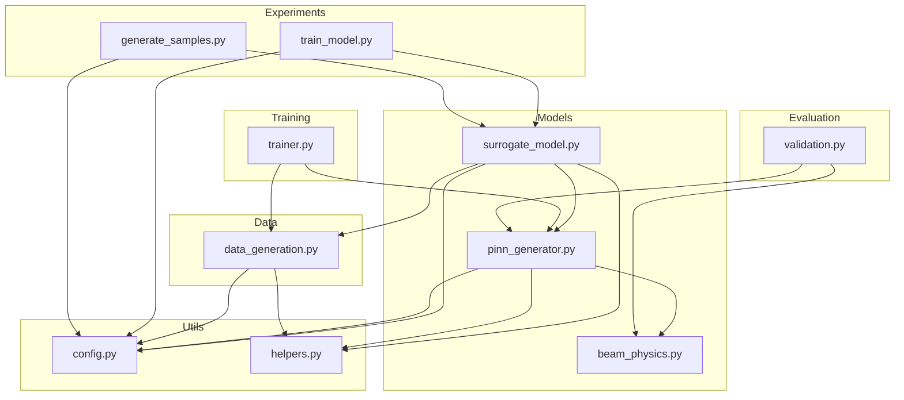
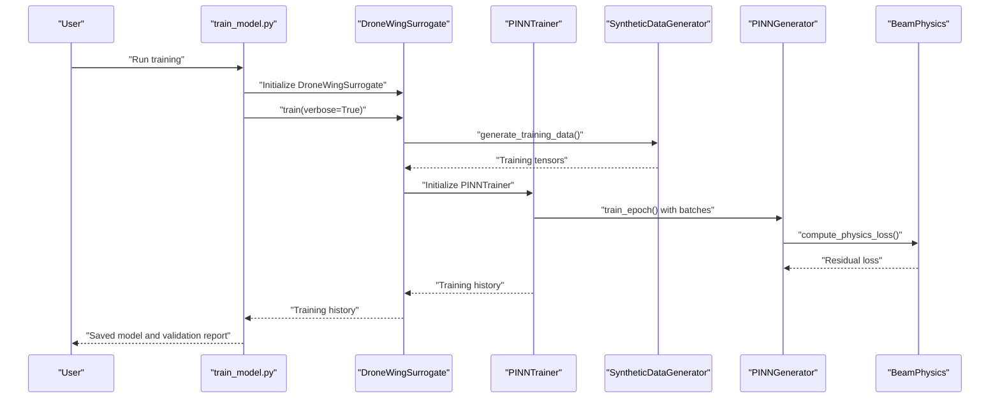
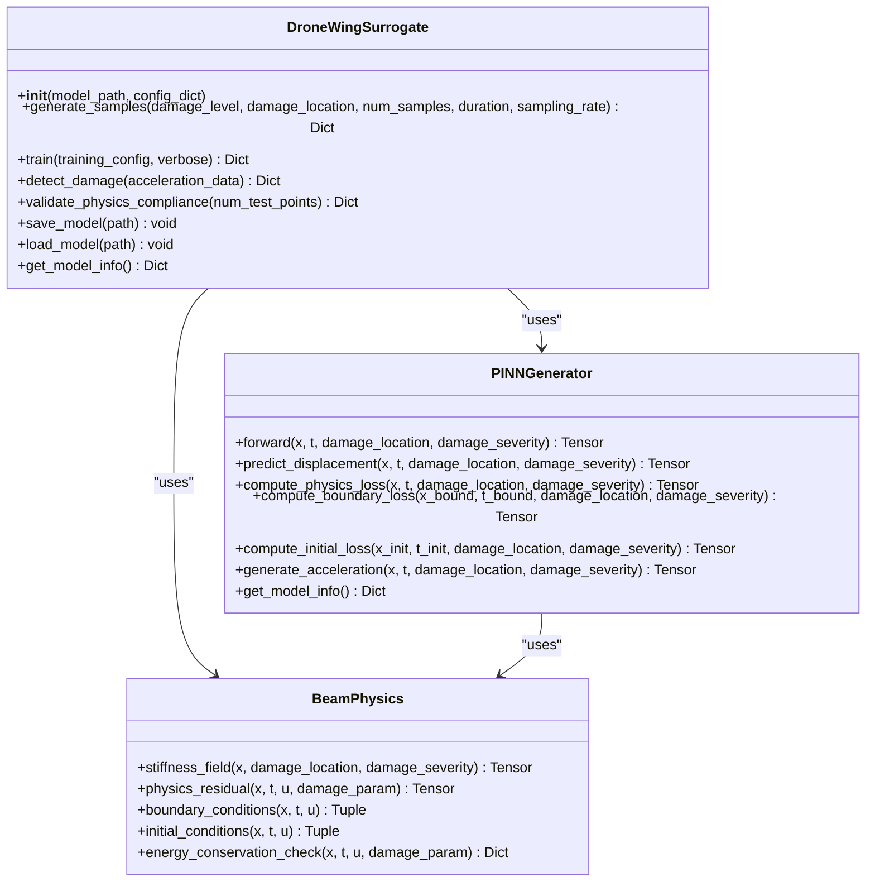
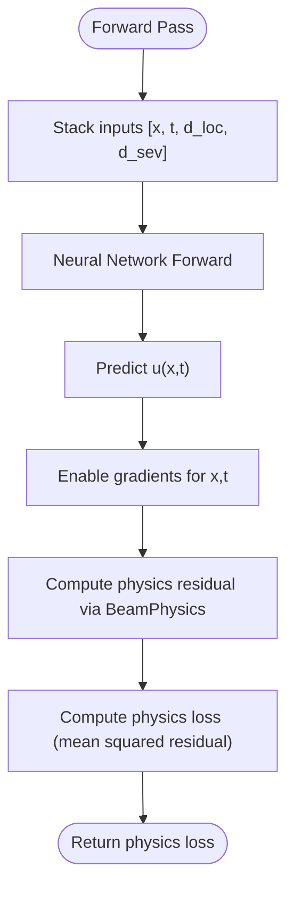
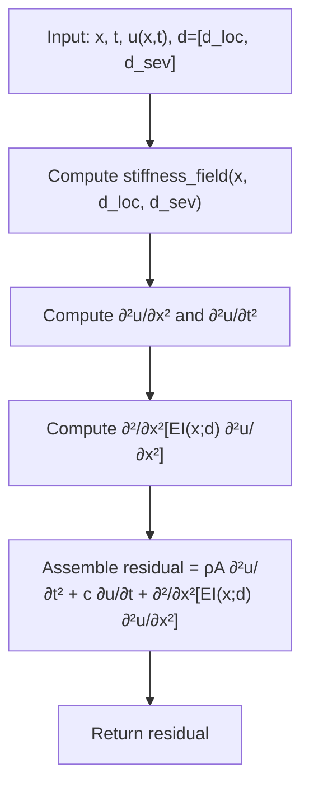
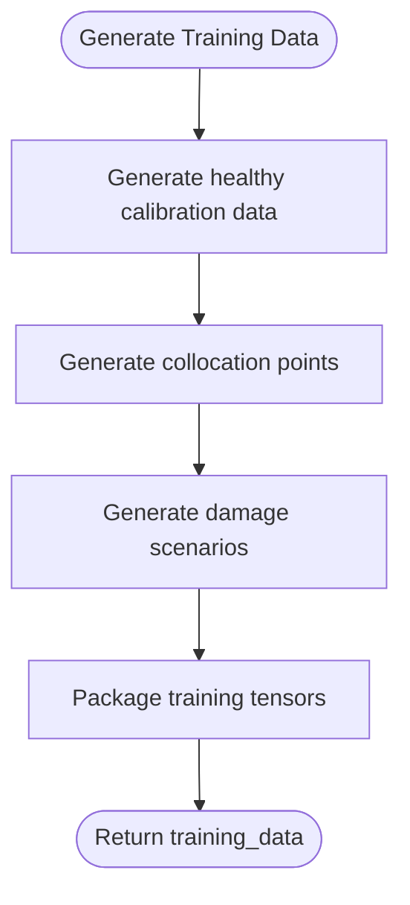
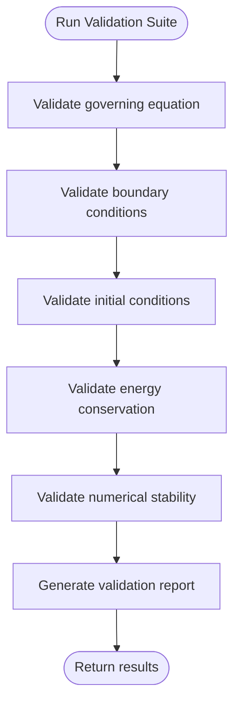
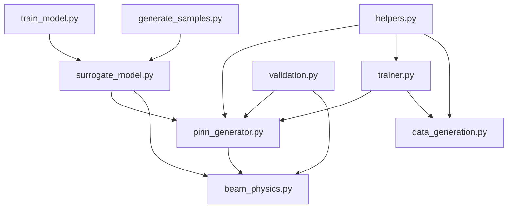

# Project Overview

<cite>
**Referenced Files in This Document**
- [README.md](file://README.md)
- [GETTING_STARTED.md](file://GETTING_STARTED.md)
- [default.yaml](file://configs/default.yaml)
- [beam_physics.py](file://src/models/beam_physics.py)
- [pinn_generator.py](file://src/models/pinn_generator.py)
- [surrogate_model.py](file://src/models/surrogate_model.py)
- [train_model.py](file://experiments/train_model.py)
- [generate_samples.py](file://experiments/generate_samples.py)
- [demo.ipynb](file://notebooks/demo.ipynb)
- [trainer.py](file://src/training/trainer.py)
- [validation.py](file://src/evaluation/validation.py)
- [helpers.py](file://src/utils/helpers.py)
</cite>

## Table of Contents
1. [Introduction](#introduction)
2. [Project Structure](#project-structure)
3. [Core Components](#core-components)
4. [Architecture Overview](#architecture-overview)
5. [Detailed Component Analysis](#detailed-component-analysis)
6. [Dependency Analysis](#dependency-analysis)
7. [Performance Considerations](#performance-considerations)
8. [Troubleshooting Guide](#troubleshooting-guide)
9. [Conclusion](#conclusion)
10. [Appendices](#appendices)

## Introduction
This project implements a Physics-Informed Generative Surrogate for drone wing structural integrity, leveraging Physics-Informed Neural Networks (PINNs) to synthesize vibration data for arbitrary damage scenarios. It integrates Euler-Bernoulli beam theory into a parametric neural network, enabling zero-shot generation of structural responses under unseen damage configurations. The system targets structural health monitoring (SHM) applications where real-world failure data is scarce, offering a data-efficient, physics-constrained approach suitable for both research exploration and production-ready edge deployments.

Key goals:
- Embed Euler-Bernoulli beam dynamics directly into the model via physics constraints.
- Parameterize damage as stiffness reduction with configurable spatial influence.
- Provide a lightweight surrogate model for real-time monitoring simulations.
- Offer comprehensive validation of physics compliance and SHM performance.

## Project Structure
The repository follows a modular layout separating models, data generation, training, evaluation, utilities, and experiments. High-level directories:
- src/models: Neural network architectures and physics engines.
- src/data: Synthetic data generation and preprocessing.
- src/training: Training loops, loss functions, and optimization.
- src/evaluation: Metrics, validation, and visualization.
- src/utils: Configuration, helpers, and logging.
- experiments: CLI scripts for training, sampling, and evaluation.
- notebooks: Interactive demos and tutorials.
- configs: YAML configuration files.
- tests: Unit and integration tests.



**Diagram sources**
- [train_model.py:1-165](file://experiments/train_model.py#L1-L165)
- [generate_samples.py:1-216](file://experiments/generate_samples.py#L1-L216)
- [surrogate_model.py:1-337](file://src/models/surrogate_model.py#L1-L337)
- [pinn_generator.py:1-352](file://src/models/pinn_generator.py#L1-L352)
- [beam_physics.py:1-300](file://src/models/beam_physics.py#L1-L300)
- [data_generation.py:1-384](file://src/data/data_generation.py#L1-L384)
- [trainer.py:1-392](file://src/training/trainer.py#L1-L392)
- [validation.py:1-376](file://src/evaluation/validation.py#L1-L376)
- [config.py:1-123](file://src/utils/config.py#L1-L123)
- [helpers.py:1-161](file://src/utils/helpers.py#L1-L161)

**Section sources**
- [README.md:41-55](file://README.md#L41-L55)
- [GETTING_STARTED.md:104-122](file://GETTING_STARTED.md#L104-L122)

## Core Components
- Surrogate Model (DroneWingSurrogate): High-level interface for training, sampling, and validation. It orchestrates the PINN generator, beam physics engine, and synthetic data generation.
- PINN Generator: Parametric neural network that predicts displacement u(x,t) conditioned on spatial, temporal coordinates, and damage parameters. It computes physics-informed losses using automatic differentiation.
- Beam Physics Engine: Implements Euler-Bernoulli beam theory with spatially varying stiffness, boundary conditions, and initial conditions. Provides physics residual computation and energy checks.
- Training Framework: Adapts loss weighting, schedules learning rates, and monitors convergence. Supports early stopping and checkpointing.
- Data Generation: Produces healthy calibration data, collocation points, and damage scenarios for training and validation.
- Evaluation and Validation: Validates governing equation satisfaction, boundary/initial conditions, energy conservation, and numerical stability.

**Section sources**
- [surrogate_model.py:15-271](file://src/models/surrogate_model.py#L15-L271)
- [pinn_generator.py:39-287](file://src/models/pinn_generator.py#L39-L287)
- [beam_physics.py:12-258](file://src/models/beam_physics.py#L12-L258)
- [trainer.py:55-339](file://src/training/trainer.py#L55-L339)
- [data_generation.py:14-318](file://src/data/data_generation.py#L14-L318)
- [validation.py:16-281](file://src/evaluation/validation.py#L16-L281)

## Architecture Overview
The system combines deep learning with physical laws through PINNs. The surrogate model initializes the PINN generator and beam physics engine, then trains the model using hybrid loss that balances data fidelity, physics compliance, and boundary/initial conditions. During inference, the model generates acceleration time histories at sensor locations for specified damage scenarios.



**Diagram sources**
- [train_model.py:77-162](file://experiments/train_model.py#L77-L162)
- [surrogate_model.py:131-166](file://src/models/surrogate_model.py#L131-L166)
- [trainer.py:207-297](file://src/training/trainer.py#L207-L297)
- [data_generation.py:211-263](file://src/data/data_generation.py#L211-L263)
- [pinn_generator.py:155-185](file://src/models/pinn_generator.py#L155-L185)
- [beam_physics.py:107-150](file://src/models/beam_physics.py#L107-L150)

## Detailed Component Analysis

### Surrogate Model (DroneWingSurrogate)
The surrogate model encapsulates the end-to-end workflow:
- Training: Generates synthetic data, initializes the trainer, and runs the training loop.
- Sampling: Generates acceleration time histories for specified damage levels and locations.
- Validation: Computes physics compliance metrics across damage scenarios.
- Persistence: Saves and loads model checkpoints with configuration.



**Diagram sources**
- [surrogate_model.py:15-271](file://src/models/surrogate_model.py#L15-L271)
- [pinn_generator.py:39-287](file://src/models/pinn_generator.py#L39-L287)
- [beam_physics.py:12-258](file://src/models/beam_physics.py#L12-L258)

**Section sources**
- [surrogate_model.py:15-271](file://src/models/surrogate_model.py#L15-L271)

### PINN Generator and Physics Constraints
The PINN generator embeds physics constraints directly into the loss function:
- Input: [x, t, damage_location, damage_severity].
- Output: displacement u(x,t).
- Physics loss: Residual of the Euler-Bernoulli beam equation computed via automatic differentiation.
- Boundary/Initial losses: Enforce boundary and initial conditions.
- Acceleration generation: Uses second-order time derivatives to produce acceleration time histories.



**Diagram sources**
- [pinn_generator.py:155-185](file://src/models/pinn_generator.py#L155-L185)
- [beam_physics.py:107-150](file://src/models/beam_physics.py#L107-L150)

**Section sources**
- [pinn_generator.py:155-239](file://src/models/pinn_generator.py#L155-L239)
- [beam_physics.py:107-200](file://src/models/beam_physics.py#L107-L200)

### Euler-Bernoulli Beam Theory Integration
The beam physics engine defines:
- Governing equation: ρA ∂²u/∂t² + c ∂u/∂t + ∂²/∂x²[EI(x;d) ∂²u/∂x²] = 0.
- Spatially varying stiffness: EI(x;d) = EI₀ · (1 − φ(x;d)), where φ is a configurable damage influence function (gaussian or step).
- Boundary conditions: Clamped, simply supported, or free at both ends.
- Initial conditions: Zero displacement and velocity at t=0.
- Energy conservation check: Computes kinetic and strain energy densities and totals.



**Diagram sources**
- [beam_physics.py:107-150](file://src/models/beam_physics.py#L107-L150)

**Section sources**
- [beam_physics.py:12-258](file://src/models/beam_physics.py#L12-L258)

### Training Framework and Loss Functions
The training framework:
- Uses a composite loss combining data fidelity, physics compliance, and boundary/initial condition penalties.
- Applies adaptive loss weighting and learning rate scheduling.
- Monitors training progress and supports early stopping.
- Provides checkpointing for model persistence.

```mermaid
sequenceDiagram
participant Loader as "DataLoader"
participant Trainer as "PINNTrainer"
participant Model as "PINNGenerator"
participant Loss as "PhysicsRegularizedLoss"
participant Opt as "Optimizer"
Loader->>Trainer : "Batch of training data"
Trainer->>Model : "Forward pass"
Model-->>Trainer : "Predictions"
Trainer->>Loss : "compute_regularized_loss(model, batch)"
Loss-->>Trainer : "Total loss"
Trainer->>Opt : "Backward and step"
Trainer-->>Loader : "Next batch"
```

**Diagram sources**
- [trainer.py:127-180](file://src/training/trainer.py#L127-L180)
- [trainer.py:207-297](file://src/training/trainer.py#L207-L297)

**Section sources**
- [trainer.py:55-339](file://src/training/trainer.py#L55-L339)

### Data Generation and Collocation Points
Synthetic data generation produces:
- Healthy calibration data with sparse sensor measurements and excitation signals.
- Collocation points for physics loss: interior, boundary, and initial condition points.
- Damage scenarios with randomized locations and severities within configured bounds.



**Diagram sources**
- [data_generation.py:211-263](file://src/data/data_generation.py#L211-L263)

**Section sources**
- [data_generation.py:14-318](file://src/data/data_generation.py#L14-L318)

### Evaluation and Physics Validation
Validation routines assess:
- Governing equation satisfaction across damage scenarios.
- Boundary and initial condition compliance.
- Energy conservation properties.
- Numerical stability over extended simulations.



**Diagram sources**
- [validation.py:250-281](file://src/evaluation/validation.py#L250-L281)

**Section sources**
- [validation.py:16-376](file://src/evaluation/validation.py#L16-L376)

## Dependency Analysis
The system exhibits clear separation of concerns:
- Surrogate model depends on PINN generator and beam physics.
- PINN generator depends on beam physics for residual computation.
- Training framework depends on data generation and loss functions.
- Experiments depend on surrogate model and evaluation utilities.
- Utilities provide shared helpers for device selection, normalization, and derivative computation.



**Diagram sources**
- [surrogate_model.py:1-337](file://src/models/surrogate_model.py#L1-L337)
- [pinn_generator.py:1-352](file://src/models/pinn_generator.py#L1-L352)
- [beam_physics.py:1-300](file://src/models/beam_physics.py#L1-L300)
- [trainer.py:1-392](file://src/training/trainer.py#L1-L392)
- [data_generation.py:1-384](file://src/data/data_generation.py#L1-L384)
- [train_model.py:1-165](file://experiments/train_model.py#L1-L165)
- [generate_samples.py:1-216](file://experiments/generate_samples.py#L1-L216)
- [validation.py:1-376](file://src/evaluation/validation.py#L1-L376)
- [helpers.py:1-161](file://src/utils/helpers.py#L1-L161)

**Section sources**
- [surrogate_model.py:1-337](file://src/models/surrogate_model.py#L1-L337)
- [pinn_generator.py:1-352](file://src/models/pinn_generator.py#L1-L352)
- [beam_physics.py:1-300](file://src/models/beam_physics.py#L1-L300)
- [trainer.py:1-392](file://src/training/trainer.py#L1-L392)
- [data_generation.py:1-384](file://src/data/data_generation.py#L1-L384)
- [train_model.py:1-165](file://experiments/train_model.py#L1-L165)
- [generate_samples.py:1-216](file://experiments/generate_samples.py#L1-L216)
- [validation.py:1-376](file://src/evaluation/validation.py#L1-L376)
- [helpers.py:1-161](file://src/utils/helpers.py#L1-L161)

## Performance Considerations
- Collocation points: The number of physics points, boundary points, and initial condition points directly impacts training cost and accuracy. Tune these counts according to computational budget.
- Network architecture: Depth and width influence capacity and speed. Dropout is disabled for physics problems to preserve smoothness.
- Adaptive weighting: The system adjusts loss weights dynamically to balance data fidelity and physics compliance.
- Numerical stability: Gradient clipping and careful derivative computation prevent blow-ups.
- Early stopping: Prevents overfitting and reduces training time.
- GPU utilization: Prefer GPU when available; adjust batch size accordingly.

[No sources needed since this section provides general guidance]

## Troubleshooting Guide
Common issues and remedies:
- CUDA out of memory: Reduce batch size or number of collocation points.
- Slow training: Decrease physics points, use fewer hidden layers, or switch to CPU.
- Poor physics compliance: Increase physics loss weight or training epochs; verify boundary conditions.
- Import errors: Ensure working directory is gen-shm and dependencies are installed.

Performance tips:
- Use GPU with the --gpu flag.
- Start with fewer epochs for testing.
- Adjust collocation point counts based on resources.
- Monitor progress with --verbose.

**Section sources**
- [GETTING_STARTED.md:212-226](file://GETTING_STARTED.md#L212-L226)

## Conclusion
Gen-SHM delivers a robust, physics-informed surrogate for drone wing structural health monitoring. By integrating Euler-Bernoulli beam theory into a parametric PINN, it enables zero-shot generation of vibration data across arbitrary damage scenarios, with strong validation guarantees. The modular design supports both research experimentation and production deployment, offering a practical pathway to address the scarcity of failure data in SHM applications.

[No sources needed since this section summarizes without analyzing specific files]

## Appendices

### Configuration Options (YAML)
Key configuration categories and representative parameters:
- physics: beam_length, beam_width, beam_height, young_modulus, density, damping_coefficient, boundary_conditions.
- damage: min_severity, max_severity, location_range, damage_function.
- model: input_dim, output_dim, hidden_layers, hidden_dim, activation, dropout_rate.
- training: epochs, batch_size, learning_rate, optimizer, lr_scheduler, loss_weights, physics_points, boundary_points, initial_condition_points.
- data: spatial_points, temporal_points, sensor_locations, noise_level, frequency_range.
- paths: data_dir, checkpoints_dir, logs_dir, results_dir, experiments_dir.
- advanced: multiscale_training, scale_epochs, max_scales, adaptive_weighting, weight_adaptation_rate, l2_regularization, physics_regularization, gradient_clipping, numerical_tolerance.
- visualization: plot_training_progress, save_plots, plot_frequency, style.
- logging: level, format, save_to_file, console_output.

**Section sources**
- [default.yaml:4-100](file://configs/default.yaml#L4-L100)

### Usage Patterns
- Research: Explore damage scenarios, adjust configuration, and validate physics compliance.
- Production: Train on synthetic data, save checkpoints, and generate samples for downstream SHM pipelines.

Practical examples:
- Damage scenario analysis: Compare healthy versus damaged vibration signatures across multiple scenarios.
- Training data augmentation: Generate large synthetic datasets with varied damage severities and locations.
- Real-time monitoring simulation: Continuously generate short windows of acceleration data for change detection.

**Section sources**
- [GETTING_STARTED.md:169-210](file://GETTING_STARTED.md#L169-L210)
- [demo.ipynb:119-173](file://notebooks/demo.ipynb#L119-L173)