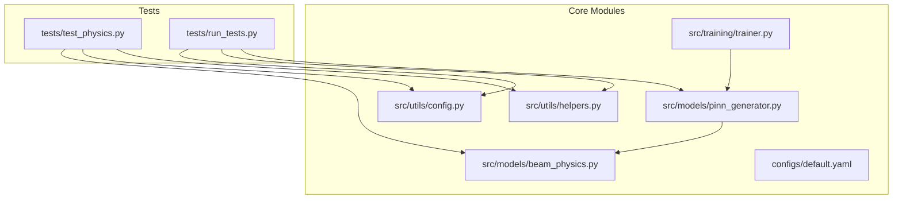
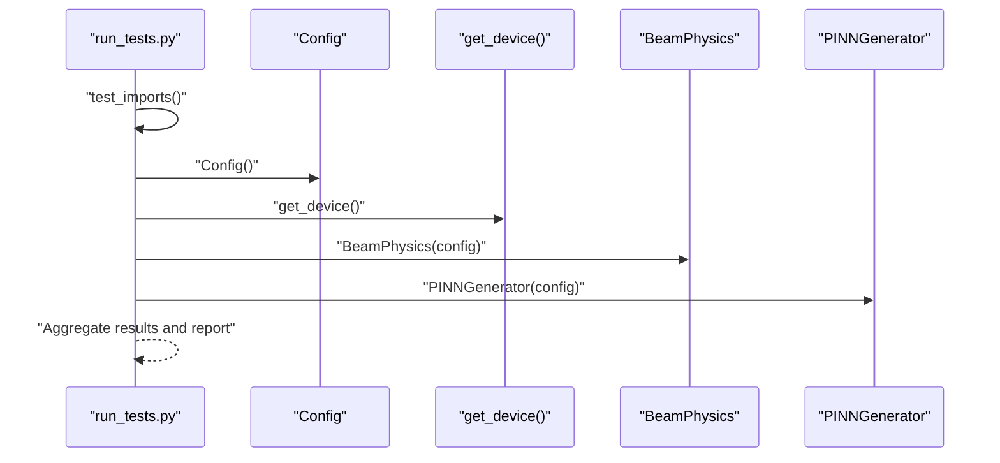
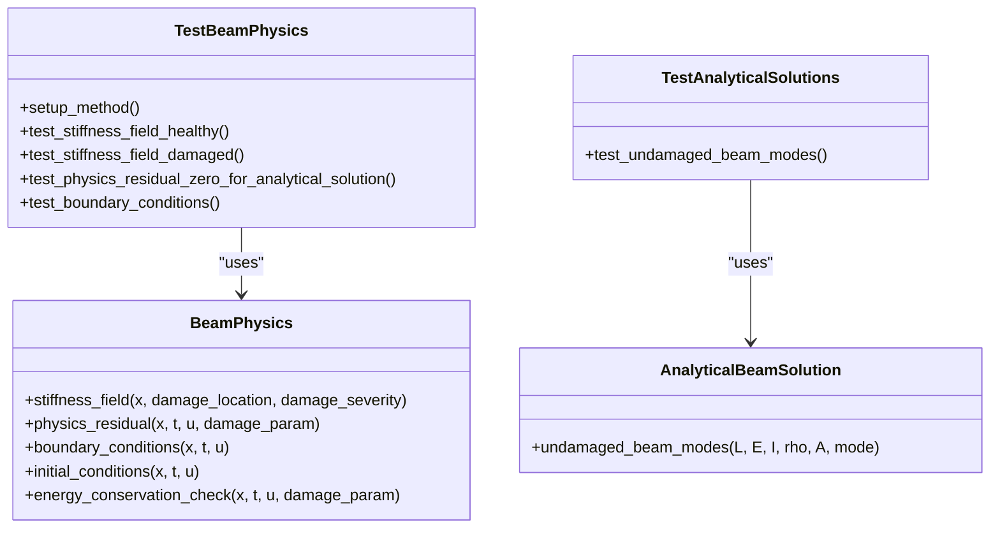
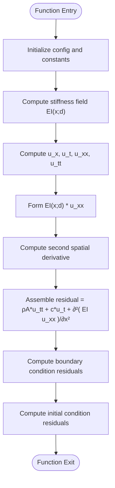
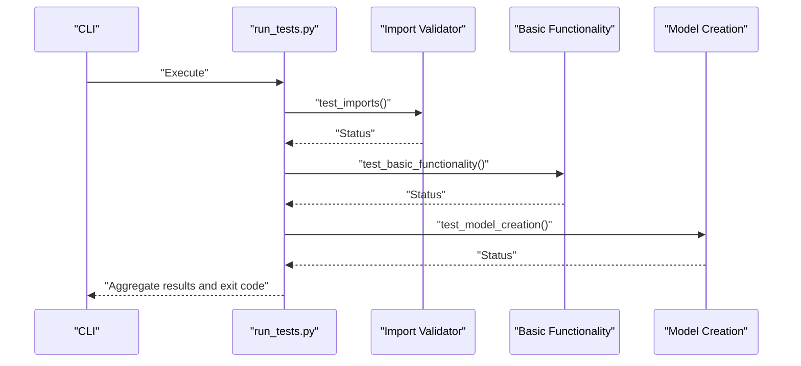
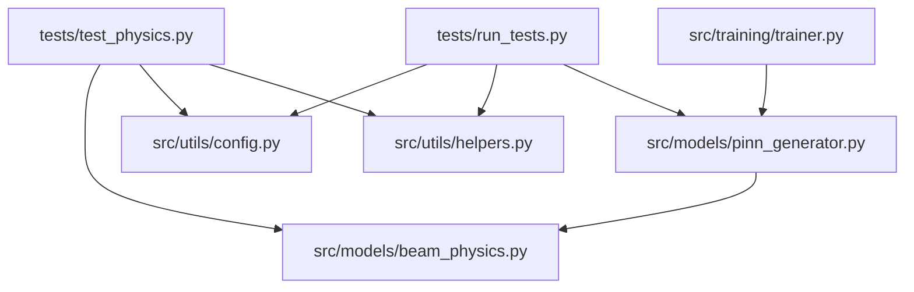

# Testing Framework

<cite>
**Referenced Files in This Document**
- [test_physics.py](file://gen-shm/tests/test_physics.py)
- [run_tests.py](file://gen-shm/tests/run_tests.py)
- [beam_physics.py](file://gen-shm/src/models/beam_physics.py)
- [helpers.py](file://gen-shm/src/utils/helpers.py)
- [config.py](file://gen-shm/src/utils/config.py)
- [default.yaml](file://gen-shm/configs/default.yaml)
- [pinn_generator.py](file://gen-shm/src/models/pinn_generator.py)
- [trainer.py](file://gen-shm/src/training/trainer.py)
- [requirements.txt](file://gen-shm/requirements.txt)
- [README.md](file://gen-shm/README.md)
</cite>

## Table of Contents
1. [Introduction](#introduction)
2. [Project Structure](#project-structure)
3. [Core Components](#core-components)
4. [Architecture Overview](#architecture-overview)
5. [Detailed Component Analysis](#detailed-component-analysis)
6. [Dependency Analysis](#dependency-analysis)
7. [Performance Considerations](#performance-considerations)
8. [Troubleshooting Guide](#troubleshooting-guide)
9. [Conclusion](#conclusion)
10. [Appendices](#appendices)

## Introduction
This document describes the testing framework for the Gen-SHM project with a focus on unit testing and validation procedures. It explains how the physics module is validated via numerical derivatives and physics constraint satisfaction, documents the test orchestrator for automated testing and reporting, and provides practical guidance for writing robust tests, validating model behavior under varied conditions, and ensuring numerical accuracy. It also covers scientific computing testing strategies such as tolerance settings, convergence checks, and regression testing, along with continuous integration considerations, test coverage expectations, and quality assurance procedures.

## Project Structure
The testing-related components reside under the tests directory and exercise core modules under src. The primary files are:
- tests/test_physics.py: Unit tests for beam theory calculations, numerical derivatives, and physics constraint satisfaction.
- tests/run_tests.py: An orchestrator that validates imports, basic functionality, and model creation.

**Diagram sources**
- [test_physics.py](file://gen-shm/tests/test_physics.py)
- [run_tests.py](file://gen-shm/tests/run_tests.py)
- [beam_physics.py](file://gen-shm/src/models/beam_physics.py)
- [helpers.py](file://gen-shm/src/utils/helpers.py)
- [config.py](file://gen-shm/src/utils/config.py)
- [default.yaml](file://gen-shm/configs/default.yaml)
- [pinn_generator.py](file://gen-shm/src/models/pinn_generator.py)
- [trainer.py](file://gen-shm/src/training/trainer.py)

**Section sources**
- [README.md](file://gen-shm/README.md)

## Core Components
- Physics validation tests:
  - Stiffness field computation for healthy and damaged beams.
  - Physics residual verification against analytical solutions.
  - Boundary condition enforcement and finiteness checks.
  - Analytical undamaged beam modes validation.
- Test orchestrator:
  - Import validation across major modules.
  - Basic functionality checks for configuration, device detection, and physics engine initialization.
  - Model creation validation for PINN generator with required methods.

Key implementation references:
- Physics engine and numerical derivatives: [beam_physics.py](file://gen-shm/src/models/beam_physics.py)
- Derivative computation: [helpers.py](file://gen-shm/src/utils/helpers.py)
- Configuration defaults and overrides: [config.py](file://gen-shm/src/utils/config.py), [default.yaml](file://gen-shm/configs/default.yaml)
- PINN generator and physics loss integration: [pinn_generator.py](file://gen-shm/src/models/pinn_generator.py)
- Training integration and loss computation: [trainer.py](file://gen-shm/src/training/trainer.py)
- Test suite entry points: [test_physics.py](file://gen-shm/tests/test_physics.py), [run_tests.py](file://gen-shm/tests/run_tests.py)

**Section sources**
- [test_physics.py](file://gen-shm/tests/test_physics.py)
- [run_tests.py](file://gen-shm/tests/run_tests.py)
- [beam_physics.py](file://gen-shm/src/models/beam_physics.py)
- [helpers.py](file://gen-shm/src/utils/helpers.py)
- [config.py](file://gen-shm/src/utils/config.py)
- [default.yaml](file://gen-shm/configs/default.yaml)
- [pinn_generator.py](file://gen-shm/src/models/pinn_generator.py)
- [trainer.py](file://gen-shm/src/training/trainer.py)

## Architecture Overview
The testing architecture integrates unit tests and an orchestrator to validate:
- Module imports and availability.
- Configuration correctness and defaults.
- Physics engine initialization and numerical routines.
- PINN generator instantiation and method presence.
- Physics residual computation and boundary enforcement.

**Diagram sources**
- [run_tests.py](file://gen-shm/tests/run_tests.py)
- [config.py](file://gen-shm/src/utils/config.py)
- [helpers.py](file://gen-shm/src/utils/helpers.py)
- [beam_physics.py](file://gen-shm/src/models/beam_physics.py)
- [pinn_generator.py](file://gen-shm/src/models/pinn_generator.py)

## Detailed Component Analysis

### Physics Validation Tests
This suite validates:
- Stiffness field computation for undamaged and damaged beams.
- Physics residual evaluation against an analytical baseline.
- Boundary condition enforcement and finiteness.
- Analytical undamaged beam natural frequencies and mode shapes.

**Diagram sources**
- [test_physics.py](file://gen-shm/tests/test_physics.py)
- [beam_physics.py](file://gen-shm/src/models/beam_physics.py)

**Section sources**
- [test_physics.py](file://gen-shm/tests/test_physics.py)
- [beam_physics.py](file://gen-shm/src/models/beam_physics.py)

### Physics Engine and Numerical Derivatives
The physics engine computes:
- Spatially varying stiffness field with configurable damage influence functions.
- Physics residual using automatic differentiation for first and second-order derivatives.
- Boundary and initial condition residuals.
- Energy conservation diagnostics.

**Diagram sources**
- [beam_physics.py](file://gen-shm/src/models/beam_physics.py)
- [helpers.py](file://gen-shm/src/utils/helpers.py)

**Section sources**
- [beam_physics.py](file://gen-shm/src/models/beam_physics.py)
- [helpers.py](file://gen-shm/src/utils/helpers.py)

### Test Orchestrator: Automated Testing and Reporting
The orchestrator performs:
- Import validation across core modules.
- Basic functionality checks for configuration, device detection, and physics engine initialization.
- Model creation validation for the PINN generator with required methods.

**Diagram sources**
- [run_tests.py](file://gen-shm/tests/run_tests.py)

**Section sources**
- [run_tests.py](file://gen-shm/tests/run_tests.py)

## Dependency Analysis
The tests depend on:
- Physics engine and configuration for numerical computations.
- Helper utilities for device detection and numerical derivatives.
- PINN generator for integration testing.

**Diagram sources**
- [test_physics.py](file://gen-shm/tests/test_physics.py)
- [run_tests.py](file://gen-shm/tests/run_tests.py)
- [beam_physics.py](file://gen-shm/src/models/beam_physics.py)
- [helpers.py](file://gen-shm/src/utils/helpers.py)
- [config.py](file://gen-shm/src/utils/config.py)
- [pinn_generator.py](file://gen-shm/src/models/pinn_generator.py)
- [trainer.py](file://gen-shm/src/training/trainer.py)

**Section sources**
- [test_physics.py](file://gen-shm/tests/test_physics.py)
- [run_tests.py](file://gen-shm/tests/run_tests.py)
- [beam_physics.py](file://gen-shm/src/models/beam_physics.py)
- [helpers.py](file://gen-shm/src/utils/helpers.py)
- [config.py](file://gen-shm/src/utils/config.py)
- [pinn_generator.py](file://gen-shm/src/models/pinn_generator.py)
- [trainer.py](file://gen-shm/src/training/trainer.py)

## Performance Considerations
- Determinism and reproducibility:
  - Set seeds and deterministic backends to ensure reproducible numerical tests.
  - Reference: [helpers.py](file://gen-shm/src/utils/helpers.py)
- Device selection:
  - Validate CPU/CUDA availability and consistent device behavior across tests.
  - Reference: [helpers.py](file://gen-shm/src/utils/helpers.py)
- Numerical stability:
  - Use appropriate tolerances for physics residual checks and avoid overly strict absolute tolerances.
  - Reference: [beam_physics.py](file://gen-shm/src/models/beam_physics.py)
- Gradient computation:
  - Ensure gradient retention and graph creation are configured for physics residual computation.
  - Reference: [beam_physics.py](file://gen-shm/src/models/beam_physics.py), [helpers.py](file://gen-shm/src/utils/helpers.py)
- Training integration:
  - Leverage training components to validate loss computation and regularization.
  - Reference: [trainer.py](file://gen-shm/src/training/trainer.py), [pinn_generator.py](file://gen-shm/src/models/pinn_generator.py)

[No sources needed since this section provides general guidance]

## Troubleshooting Guide
Common issues and resolutions:
- Import failures:
  - Verify module paths and ensure src is discoverable in Python path.
  - Reference: [run_tests.py](file://gen-shm/tests/run_tests.py)
- Configuration mismatches:
  - Confirm defaults and overrides in YAML and Config class.
  - Reference: [default.yaml](file://gen-shm/configs/default.yaml), [config.py](file://gen-shm/src/utils/config.py)
- Device errors:
  - Check CUDA availability and fallback to CPU.
  - Reference: [helpers.py](file://gen-shm/src/utils/helpers.py)
- Physics residual violations:
  - Adjust tolerances and verify derivative orders and coordinate normalization.
  - Reference: [beam_physics.py](file://gen-shm/src/models/beam_physics.py), [helpers.py](file://gen-shm/src/utils/helpers.py)
- Model creation failures:
  - Ensure required methods exist and architecture parameters are valid.
  - Reference: [pinn_generator.py](file://gen-shm/src/models/pinn_generator.py)
- Training instability:
  - Enable gradient clipping and adjust learning rates or schedulers.
  - Reference: [trainer.py](file://gen-shm/src/training/trainer.py)

**Section sources**
- [run_tests.py](file://gen-shm/tests/run_tests.py)
- [default.yaml](file://gen-shm/configs/default.yaml)
- [config.py](file://gen-shm/src/utils/config.py)
- [helpers.py](file://gen-shm/src/utils/helpers.py)
- [beam_physics.py](file://gen-shm/src/models/beam_physics.py)
- [pinn_generator.py](file://gen-shm/src/models/pinn_generator.py)
- [trainer.py](file://gen-shm/src/training/trainer.py)

## Conclusion
The testing framework combines focused unit tests for physics validation and a concise orchestrator for automated checks. Together, they ensure correctness of beam theory calculations, numerical derivatives, and physics constraint satisfaction, while validating configuration, device behavior, and model creation. By adopting the recommended strategies—tolerances, convergence checks, and regression testing—the suite remains reliable across diverse hardware and configurations.

[No sources needed since this section summarizes without analyzing specific files]

## Appendices

### Writing New Tests: Practical Examples
- Adding a new stiffness field test:
  - Define test cases for various damage locations and severities.
  - Compare computed stiffness against expected values derived from the configured damage function.
  - Reference: [test_physics.py](file://gen-shm/tests/test_physics.py), [beam_physics.py](file://gen-shm/src/models/beam_physics.py)
- Extending physics residual validation:
  - Provide simple analytical solutions (e.g., zero displacement) and assert small residual norms.
  - Reference: [test_physics.py](file://gen-shm/tests/test_physics.py), [beam_physics.py](file://gen-shm/src/models/beam_physics.py)
- Boundary condition tests:
  - Test different boundary types and assert finite residuals at boundaries.
  - Reference: [test_physics.py](file://gen-shm/tests/test_physics.py), [beam_physics.py](file://gen-shm/src/models/beam_physics.py)
- Analytical mode validation:
  - Validate natural frequency positivity and mode shape finiteness.
  - Reference: [test_physics.py](file://gen-shm/tests/test_physics.py), [beam_physics.py](file://gen-shm/src/models/beam_physics.py)

### Scientific Computing Testing Strategies
- Tolerance settings:
  - Use relative and absolute tolerances appropriate for the problem scale.
  - Reference: [beam_physics.py](file://gen-shm/src/models/beam_physics.py)
- Convergence checks:
  - Refine spatial/temporal grids and verify residual decay.
  - Reference: [beam_physics.py](file://gen-shm/src/models/beam_physics.py)
- Regression testing:
  - Capture baseline outputs for selected test cases and compare against expected values.
  - Reference: [test_physics.py](file://gen-shm/tests/test_physics.py)

### Continuous Integration and Quality Assurance
- Dependencies:
  - Ensure pytest and required packages are installed.
  - Reference: [requirements.txt](file://gen-shm/requirements.txt)
- Test discovery:
  - Run pytest to automatically discover and execute tests.
  - Reference: [test_physics.py](file://gen-shm/tests/test_physics.py)
- Coverage:
  - Integrate coverage collection and enforce minimum thresholds in CI.
  - Reference: [requirements.txt](file://gen-shm/requirements.txt)
- Reporting:
  - Use pytest’s built-in reporting and combine with CI artifacts.
  - Reference: [run_tests.py](file://gen-shm/tests/run_tests.py)

### Maintaining Reliability Across Hardware
- Deterministic runs:
  - Configure seeds and disable non-deterministic operations.
  - Reference: [helpers.py](file://gen-shm/src/utils/helpers.py)
- Device-aware testing:
  - Validate behavior on CPU and CUDA when available.
  - Reference: [helpers.py](file://gen-shm/src/utils/helpers.py)
- Numerical checks:
  - Use robust norms and tolerances to minimize false positives on different hardware.
  - Reference: [beam_physics.py](file://gen-shm/src/models/beam_physics.py)