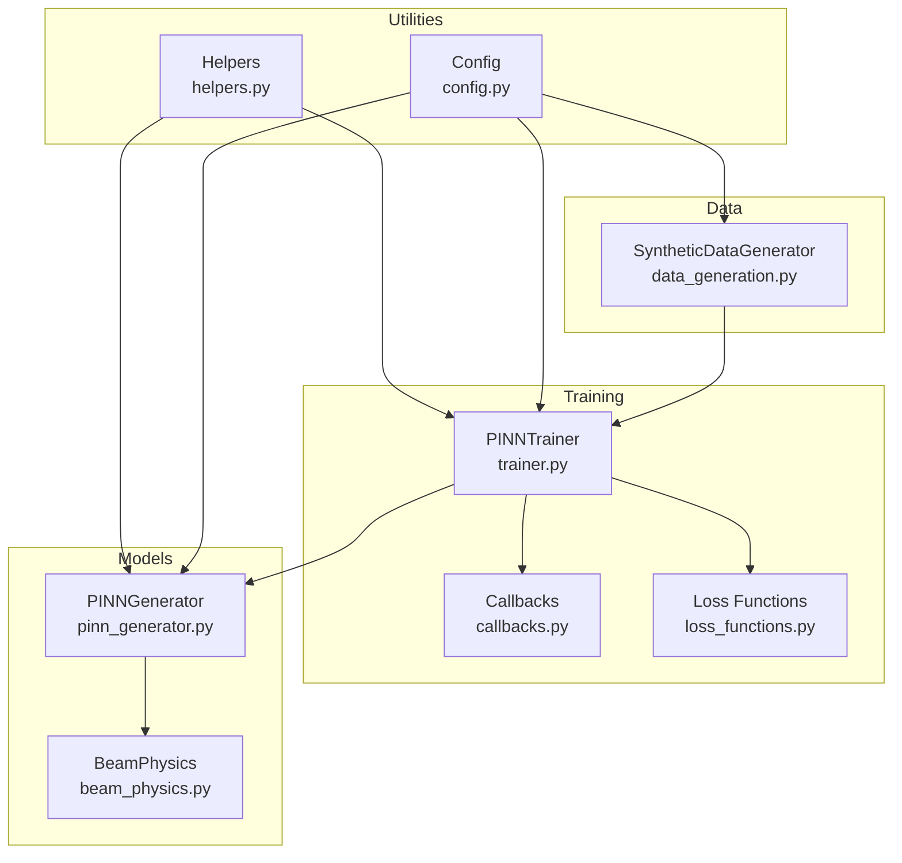
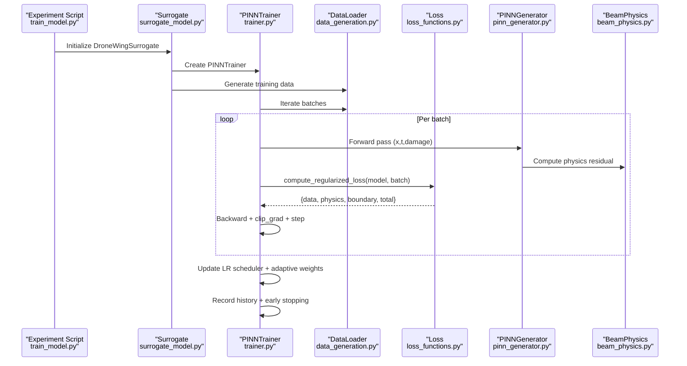
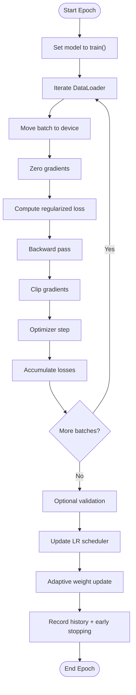
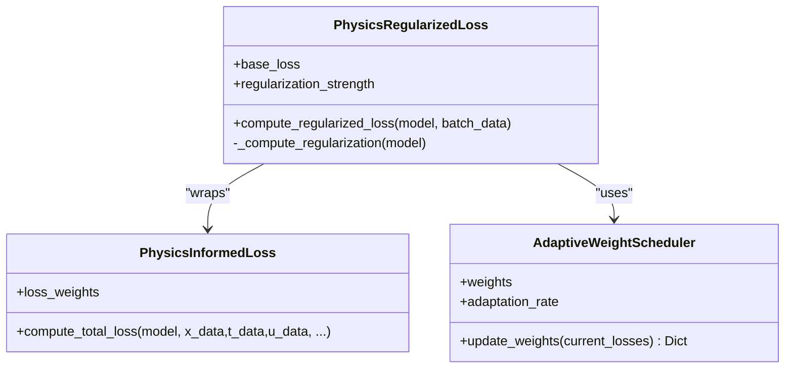
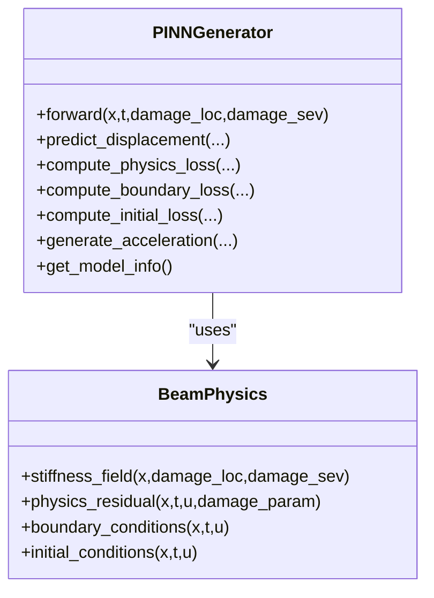
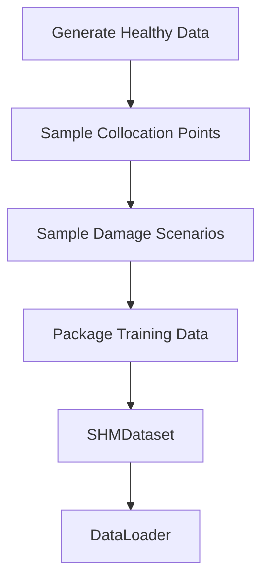
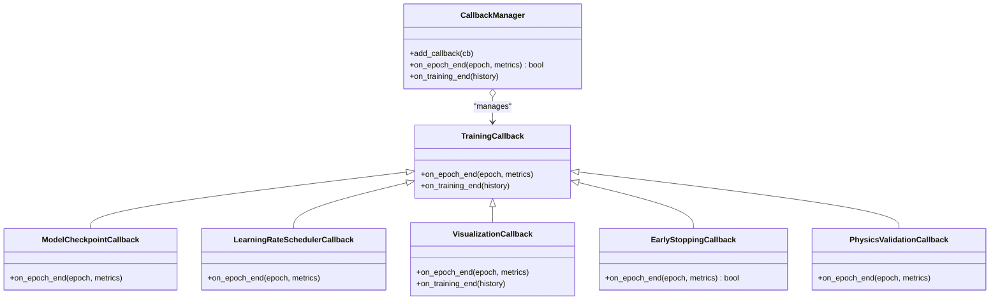
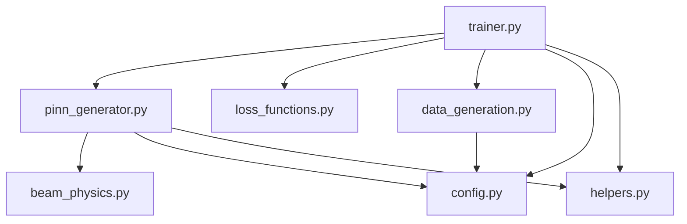

# Training Framework

<cite>
**Referenced Files in This Document**
- [trainer.py](file://gen-shm/src/training/trainer.py)
- [loss_functions.py](file://gen-shm/src/training/loss_functions.py)
- [callbacks.py](file://gen-shm/src/training/callbacks.py)
- [pinn_generator.py](file://gen-shm/src/models/pinn_generator.py)
- [beam_physics.py](file://gen-shm/src/models/beam_physics.py)
- [surrogate_model.py](file://gen-shm/src/models/surrogate_model.py)
- [data_generation.py](file://gen-shm/src/data/data_generation.py)
- [config.py](file://gen-shm/src/utils/config.py)
- [helpers.py](file://gen-shm/src/utils/helpers.py)
- [default.yaml](file://gen-shm/configs/default.yaml)
- [train_model.py](file://gen-shm/experiments/train_model.py)
</cite>

## Table of Contents
1. [Introduction](#introduction)
2. [Project Structure](#project-structure)
3. [Core Components](#core-components)
4. [Architecture Overview](#architecture-overview)
5. [Detailed Component Analysis](#detailed-component-analysis)
6. [Dependency Analysis](#dependency-analysis)
7. [Performance Considerations](#performance-considerations)
8. [Troubleshooting Guide](#troubleshooting-guide)
9. [Conclusion](#conclusion)
10. [Appendices](#appendices)

## Introduction
This document describes the complete training framework for Physics-Informed Neural Networks (PINNs) used in the Gen-SHM project. It explains the trainer implementation, adaptive weighting strategies, optimization algorithms, convergence criteria, and loss function formulations. It also documents batch processing, gradient computation, parameter updates, callback mechanisms for monitoring, early stopping, and checkpoint management. Advanced techniques such as learning rate scheduling, multi-scale training, regularization, and numerical stability measures are covered. Finally, it addresses common training challenges and provides practical guidance for hyperparameter tuning and performance optimization.

## Project Structure
The training framework is organized around modular components:
- Trainer orchestrates training loops, optimizer/scheduler management, and history recording.
- Loss functions define the composite loss combining data fidelity, physics residual, and boundary/initial conditions.
- Callbacks provide monitoring, visualization, early stopping, and checkpointing.
- Model and physics engines define the PINN architecture and governing equations.
- Data generation supplies synthetic training data and collocation points.
- Utilities manage configuration, device selection, and helper functions.

**Diagram sources**
- [trainer.py:55-392](file://gen-shm/src/training/trainer.py#L55-L392)
- [loss_functions.py:63-167](file://gen-shm/src/training/loss_functions.py#L63-L167)
- [callbacks.py:12-251](file://gen-shm/src/training/callbacks.py#L12-L251)
- [pinn_generator.py:39-352](file://gen-shm/src/models/pinn_generator.py#L39-L352)
- [beam_physics.py:12-300](file://gen-shm/src/models/beam_physics.py#L12-L300)
- [data_generation.py:14-384](file://gen-shm/src/data/data_generation.py#L14-L384)
- [config.py:10-123](file://gen-shm/src/utils/config.py#L10-L123)
- [helpers.py:11-161](file://gen-shm/src/utils/helpers.py#L11-L161)

**Section sources**
- [trainer.py:55-392](file://gen-shm/src/training/trainer.py#L55-L392)
- [loss_functions.py:63-167](file://gen-shm/src/training/loss_functions.py#L63-L167)
- [callbacks.py:12-251](file://gen-shm/src/training/callbacks.py#L12-L251)
- [pinn_generator.py:39-352](file://gen-shm/src/models/pinn_generator.py#L39-L352)
- [beam_physics.py:12-300](file://gen-shm/src/models/beam_physics.py#L12-L300)
- [data_generation.py:14-384](file://gen-shm/src/data/data_generation.py#L14-L384)
- [config.py:10-123](file://gen-shm/src/utils/config.py#L10-L123)
- [helpers.py:11-161](file://gen-shm/src/utils/helpers.py#L11-L161)

## Core Components
- PINNTrainer: Main training controller managing epochs, batches, loss computation, optimizer updates, learning rate scheduling, adaptive weighting, early stopping, and checkpointing.
- PhysicsRegularizedLoss: Composite loss combining data fidelity, physics residual, boundary/initial conditions, and optional regularization.
- AdaptiveWeightScheduler: Dynamically adjusts loss weights to balance contributions across data, physics, and boundary terms.
- TrainingMonitor: Tracks loss history and triggers early stopping based on patience.
- Callbacks: Modular callback system for checkpointing, visualization, early stopping, and physics validation.
- PINNGenerator: Neural network that predicts displacement and computes physics residuals via automatic differentiation.
- BeamPhysics: Implements Euler–Bernoulli beam dynamics with spatially varying stiffness due to damage.
- SyntheticDataGenerator: Generates synthetic calibration data, collocation points, and validation datasets.
- Config and Helpers: Centralized configuration and utility functions for device selection, seeding, normalization, and derivative computation.

**Section sources**
- [trainer.py:55-392](file://gen-shm/src/training/trainer.py#L55-L392)
- [loss_functions.py:63-167](file://gen-shm/src/training/loss_functions.py#L63-L167)
- [callbacks.py:12-251](file://gen-shm/src/training/callbacks.py#L12-L251)
- [pinn_generator.py:39-352](file://gen-shm/src/models/pinn_generator.py#L39-L352)
- [beam_physics.py:12-300](file://gen-shm/src/models/beam_physics.py#L12-L300)
- [data_generation.py:14-384](file://gen-shm/src/data/data_generation.py#L14-L384)
- [config.py:10-123](file://gen-shm/src/utils/config.py#L10-L123)
- [helpers.py:11-161](file://gen-shm/src/utils/helpers.py#L11-L161)

## Architecture Overview
The training pipeline integrates data generation, model training, and validation. The trainer drives the loop, invoking the loss function to compute weighted components, performing backward passes, and updating parameters. Adaptive weighting and scheduling adjust training behavior dynamically. Callbacks provide monitoring and diagnostics.

**Diagram sources**
- [train_model.py:77-165](file://gen-shm/experiments/train_model.py#L77-L165)
- [surrogate_model.py:131-167](file://gen-shm/src/models/surrogate_model.py#L131-L167)
- [trainer.py:127-297](file://gen-shm/src/training/trainer.py#L127-L297)
- [data_generation.py:362-384](file://gen-shm/src/data/data_generation.py#L362-L384)
- [loss_functions.py:73-105](file://gen-shm/src/training/loss_functions.py#L73-L105)
- [pinn_generator.py:299-352](file://gen-shm/src/models/pinn_generator.py#L299-L352)
- [beam_physics.py:107-150](file://gen-shm/src/models/beam_physics.py#L107-L150)

## Detailed Component Analysis

### Trainer Implementation
- Optimizers: Adam, AdamW, SGD with configurable weight decay and momentum.
- Learning Rate Scheduling: CosineAnnealingLR or ReduceLROnPlateau with min_lr and patience.
- Training Loop: Iterates batches, moves data to device, zero gradients, computes loss, backward pass, gradient clipping, parameter update, and accumulates metrics.
- Validation Loop: Evaluates total loss without gradients.
- History Recording: Tracks train loss, component losses, learning rate, and epoch time.
- Early Stopping: Uses a monitor with configurable patience based on total loss.
- Checkpointing: Saves model, optimizer, scheduler, and history; supports best-model saving.

**Diagram sources**
- [trainer.py:127-297](file://gen-shm/src/training/trainer.py#L127-L297)

**Section sources**
- [trainer.py:55-392](file://gen-shm/src/training/trainer.py#L55-L392)

### Loss Function Formulations
- PhysicsInformedLoss: Computes data fidelity loss, physics residual loss, boundary condition loss, and initial condition loss. Weights are drawn from configuration.
- PhysicsRegularizedLoss: Adds L2 regularization on weights to stabilize training.
- AdaptiveWeightScheduler: Dynamically adjusts weights to balance contributions across loss components based on relative magnitudes.

**Diagram sources**
- [pinn_generator.py:299-352](file://gen-shm/src/models/pinn_generator.py#L299-L352)
- [loss_functions.py:63-116](file://gen-shm/src/training/loss_functions.py#L63-L116)
- [loss_functions.py:11-61](file://gen-shm/src/training/loss_functions.py#L11-L61)

**Section sources**
- [pinn_generator.py:299-352](file://gen-shm/src/models/pinn_generator.py#L299-L352)
- [loss_functions.py:63-116](file://gen-shm/src/training/loss_functions.py#L63-L116)
- [loss_functions.py:11-61](file://gen-shm/src/training/loss_functions.py#L11-L61)

### Physics Engine and PINN Architecture
- PINNGenerator: Residual-block MLP with Swish/SiLU activations, LayerNorm, and optional Dropout. Provides forward pass, displacement prediction, physics loss computation, boundary/initial losses, and acceleration generation.
- BeamPhysics: Implements Euler–Bernoulli beam with spatially varying stiffness via Gaussian or step damage functions. Computes residuals, boundary conditions, and initial conditions using automatic differentiation.

**Diagram sources**
- [pinn_generator.py:39-352](file://gen-shm/src/models/pinn_generator.py#L39-L352)
- [beam_physics.py:12-300](file://gen-shm/src/models/beam_physics.py#L12-L300)

**Section sources**
- [pinn_generator.py:39-352](file://gen-shm/src/models/pinn_generator.py#L39-L352)
- [beam_physics.py:12-300](file://gen-shm/src/models/beam_physics.py#L12-L300)

### Data Generation and Batching
- SyntheticDataGenerator: Creates healthy calibration data with noisy acceleration, collocation points for physics/BC/IC, and damage scenarios.
- SHMDataset and create_data_loaders: Wrap training data into batches, repeating damage tensors to match batch size.

**Diagram sources**
- [data_generation.py:211-263](file://gen-shm/src/data/data_generation.py#L211-L263)
- [data_generation.py:321-384](file://gen-shm/src/data/data_generation.py#L321-L384)

**Section sources**
- [data_generation.py:211-263](file://gen-shm/src/data/data_generation.py#L211-L263)
- [data_generation.py:321-384](file://gen-shm/src/data/data_generation.py#L321-L384)

### Callback Mechanisms
- TrainingCallback: Base interface for lifecycle hooks.
- ModelCheckpointCallback: Periodic or best-only checkpointing.
- LearningRateSchedulerCallback: Optional dynamic LR adjustments based on recent loss trends.
- VisualizationCallback: Plots training curves, loss balances, learning rates, and training time distributions.
- EarlyStoppingCallback: Stops training when loss plateaus beyond patience and min_delta.
- PhysicsValidationCallback: Periodically evaluates physics residual norms on random points.
- CallbackManager: Aggregates callbacks and coordinates epoch-end checks.

**Diagram sources**
- [callbacks.py:12-251](file://gen-shm/src/training/callbacks.py#L12-L251)

**Section sources**
- [callbacks.py:12-251](file://gen-shm/src/training/callbacks.py#L12-L251)

### Advanced Training Techniques
- Learning Rate Scheduling: CosineAnnealingLR or ReduceLROnPlateau configured via config.
- Multi-Scale Training: Gradually increases resolution and reduces collocation counts per scale.
- Regularization: L2 weight decay and optional physics regularization.
- Numerical Stability: Gradient norm clipping and tolerance controls.
- Mixed Precision: Not implemented in the current codebase; can be integrated via torch.cuda.amp.

**Section sources**
- [trainer.py:106-126](file://gen-shm/src/training/trainer.py#L106-L126)
- [loss_functions.py:118-154](file://gen-shm/src/training/loss_functions.py#L118-L154)
- [config.py:60-93](file://gen-shm/src/utils/config.py#L60-L93)
- [default.yaml:69-87](file://gen-shm/configs/default.yaml#L69-L87)

### Practical Training Guidance
- Hyperparameters:
  - Optimizer: Adam or AdamW; SGD with momentum for robustness.
  - Learning Rate: Start with 1e-3; adjust based on plateau behavior.
  - Loss Weights: Balance data:physics:boundary; adjust boundary weight to enforce BCs.
  - Batch Size: 1024 default; scale with memory.
  - Collocation Counts: Increase physics_points and boundary_points for complex domains.
- Convergence Criteria: Monitor total loss and component ratios; use plateau-based early stopping.
- Distributed Computing: Not implemented; can leverage torch.distributed for multi-GPU training.

**Section sources**
- [config.py:60-93](file://gen-shm/src/utils/config.py#L60-L93)
- [default.yaml:34-51](file://gen-shm/configs/default.yaml#L34-L51)
- [trainer.py:26-52](file://gen-shm/src/training/trainer.py#L26-L52)

## Dependency Analysis
The trainer depends on the model, loss functions, and data utilities. The model depends on the physics engine. Data generation supplies inputs to the trainer. Configuration and helpers provide shared infrastructure.

**Diagram sources**
- [trainer.py:13-18](file://gen-shm/src/training/trainer.py#L13-L18)
- [pinn_generator.py:9-11](file://gen-shm/src/models/pinn_generator.py#L9-L11)
- [data_generation.py:9-11](file://gen-shm/src/data/data_generation.py#L9-L11)
- [config.py:10-123](file://gen-shm/src/utils/config.py#L10-L123)
- [helpers.py:11-161](file://gen-shm/src/utils/helpers.py#L11-L161)

**Section sources**
- [trainer.py:13-18](file://gen-shm/src/training/trainer.py#L13-L18)
- [pinn_generator.py:9-11](file://gen-shm/src/models/pinn_generator.py#L9-L11)
- [data_generation.py:9-11](file://gen-shm/src/data/data_generation.py#L9-L11)
- [config.py:10-123](file://gen-shm/src/utils/config.py#L10-L123)
- [helpers.py:11-161](file://gen-shm/src/utils/helpers.py#L11-L161)

## Performance Considerations
- Gradient Clipping: Prevents exploding gradients; tune max_norm based on training stability.
- L2 Regularization: Helps prevent overfitting; adjust strength according to problem complexity.
- Multi-Scale Training: Reduces computational cost initially and improves convergence.
- Data Loader Efficiency: Disable multiprocessing for reproducibility; consider prefetching for large datasets.
- Device Selection: Prefer CUDA when available; ensure deterministic behavior for reproducibility.

[No sources needed since this section provides general guidance]

## Troubleshooting Guide
- Mode Collapse: Increase boundary weight and ensure sufficient boundary/initial points. Verify BC computations.
- Gradient Vanishing: Use residual blocks, LayerNorm, and appropriate activations. Check learning rate and scheduler behavior.
- Constraint Satisfaction: Monitor physics residual norms via PhysicsValidationCallback; adjust stiffness modeling and collocation density.
- Divergence or Plateau: Reduce learning rate, enable gradient clipping, and switch to ReduceLROnPlateau scheduler.
- Memory Issues: Decrease batch size or use gradient accumulation; offload unnecessary tensors.

**Section sources**
- [callbacks.py:199-226](file://gen-shm/src/training/callbacks.py#L199-L226)
- [loss_functions.py:118-154](file://gen-shm/src/training/loss_functions.py#L118-L154)
- [trainer.py:162-163](file://gen-shm/src/training/trainer.py#L162-L163)

## Conclusion
The training framework integrates a robust PINN trainer with adaptive weighting, scheduled learning rates, and comprehensive callbacks. The loss formulation combines data fidelity, physics residuals, and boundary/initial conditions, with optional regularization for stability. The modular design enables easy extension for advanced techniques such as mixed precision, distributed training, and multi-scale refinement.

[No sources needed since this section summarizes without analyzing specific files]

## Appendices

### Configuration Reference
Key training configuration parameters include epochs, batch size, learning rate, optimizer, scheduler, loss weights, and collocation counts. Defaults are defined in the YAML configuration and loaded via the Config class.

**Section sources**
- [config.py:25-93](file://gen-shm/src/utils/config.py#L25-L93)
- [default.yaml:34-51](file://gen-shm/configs/default.yaml#L34-L51)

### Example Training Script
The experiment script demonstrates environment setup, configuration loading, model initialization, training, checkpointing, and validation reporting.

**Section sources**
- [train_model.py:77-165](file://gen-shm/experiments/train_model.py#L77-L165)