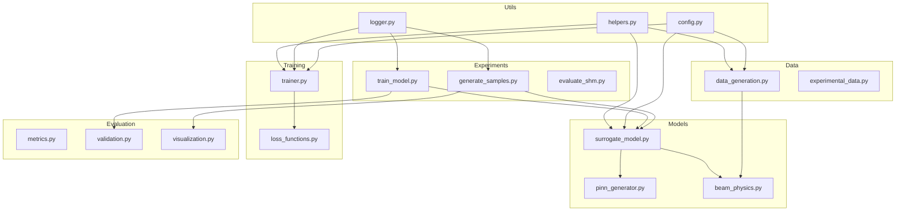
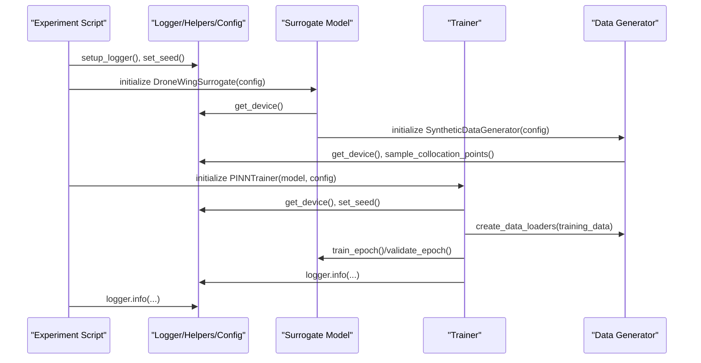
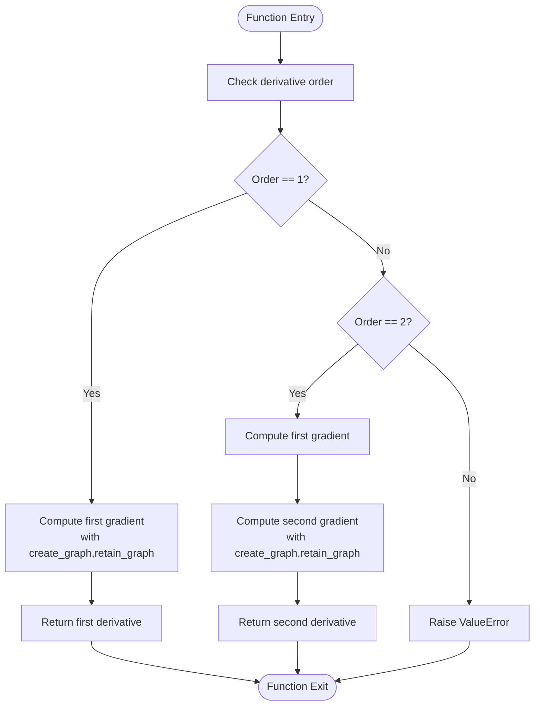
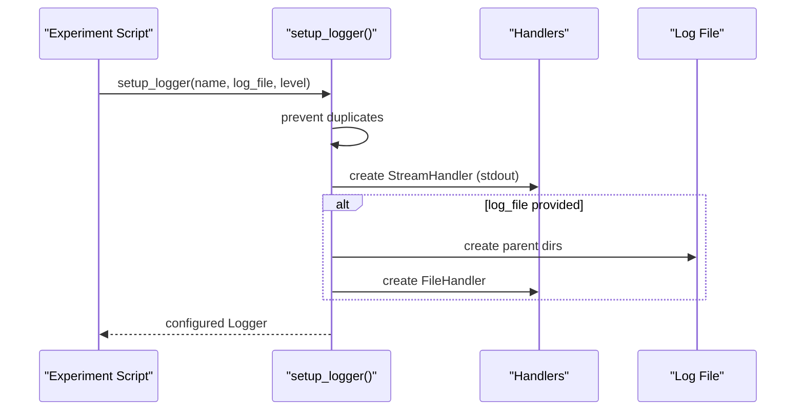
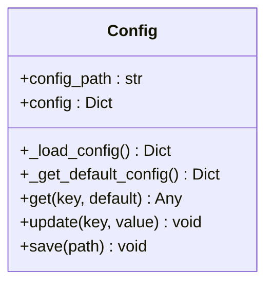
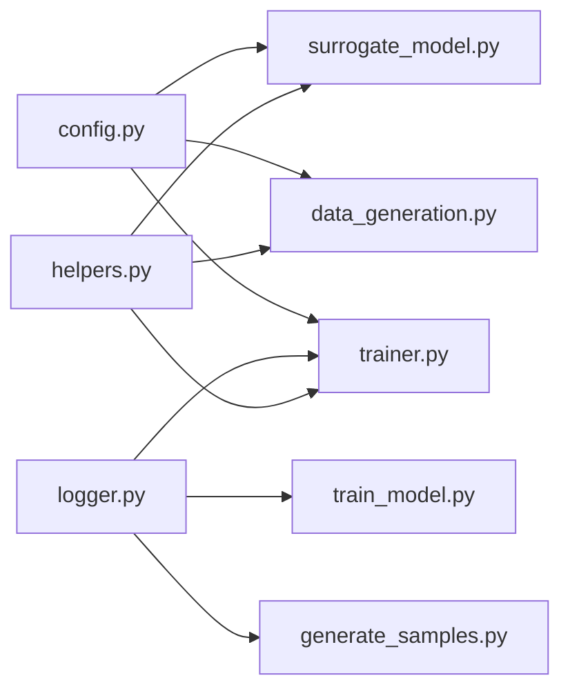

# Utilities and Helpers

<cite>
**Referenced Files in This Document**
- [helpers.py](file://gen-shm/src/utils/helpers.py)
- [logger.py](file://gen-shm/src/utils/logger.py)
- [config.py](file://gen-shm/src/utils/config.py)
- [surrogate_model.py](file://gen-shm/src/models/surrogate_model.py)
- [trainer.py](file://gen-shm/src/training/trainer.py)
- [data_generation.py](file://gen-shm/src/data/data_generation.py)
- [train_model.py](file://gen-shm/experiments/train_model.py)
- [generate_samples.py](file://gen-shm/experiments/generate_samples.py)
- [demo.ipynb](file://gen-shm/notebooks/demo.ipynb)
- [test_physics.py](file://gen-shm/tests/test_physics.py)
- [README.md](file://gen-shm/README.md)
- [requirements.txt](file://gen-shm/requirements.txt)
</cite>

## Table of Contents
1. [Introduction](#introduction)
2. [Project Structure](#project-structure)
3. [Core Components](#core-components)
4. [Architecture Overview](#architecture-overview)
5. [Detailed Component Analysis](#detailed-component-analysis)
6. [Dependency Analysis](#dependency-analysis)
7. [Performance Considerations](#performance-considerations)
8. [Troubleshooting Guide](#troubleshooting-guide)
9. [Conclusion](#conclusion)
10. [Appendices](#appendices)

## Introduction
This document focuses on the utility functions and helper modules that support code organization and development workflows in the Gen-SHM project. It covers:
- The helpers module for mathematical operations, tensor manipulation, and convenience wrappers for scientific computing.
- The logger module for structured logging, progress tracking, and debug information output.
- The configuration module for centralized configuration management.
- How these utilities integrate with core components (models, training, data generation) and experiments.
- Practical examples for data preprocessing, mathematical transformations, and result formatting.
- Best practices for extending the utility library, maintaining consistency, and ensuring cross-system compatibility.
- Debugging techniques, profiling methods, and development workflow optimizations.

## Project Structure
The utilities live under the src/utils package and are consumed by models, training, data generation, and experiment scripts. The README outlines the project’s scope and highlights the physics foundation, generative architecture, and training framework.

**Diagram sources**
- [helpers.py:1-161](file://gen-shm/src/utils/helpers.py#L1-L161)
- [logger.py:1-69](file://gen-shm/src/utils/logger.py#L1-L69)
- [config.py:1-123](file://gen-shm/src/utils/config.py#L1-L123)
- [surrogate_model.py:1-337](file://gen-shm/src/models/surrogate_model.py#L1-L337)
- [trainer.py:1-392](file://gen-shm/src/training/trainer.py#L1-L392)
- [data_generation.py:1-384](file://gen-shm/src/data/data_generation.py#L1-L384)
- [train_model.py:1-165](file://gen-shm/experiments/train_model.py#L1-L165)
- [generate_samples.py:1-216](file://gen-shm/experiments/generate_samples.py#L1-L216)

**Section sources**
- [README.md:1-105](file://gen-shm/README.md#L1-L105)

## Core Components
- helpers.py: Provides device selection, reproducibility, meshgrid creation, collocation sampling, automatic differentiation-based derivatives, tensor normalization/denormalization, moving average smoothing, and parameter counting.
- logger.py: Provides structured logging with console and file handlers, timestamped experiment loggers, and a default logger.
- config.py: Centralized configuration manager with defaults, dot-notation access/update, and YAML persistence.

Key integration points:
- Surrogate model initialization and training rely on helpers for device and seed management.
- Training framework uses helpers for device selection and seed setting, and logger for progress and diagnostics.
- Data generation uses helpers for collocation sampling and device placement.
- Experiment scripts use logger for structured experiment logs and helpers for reproducibility.

**Section sources**
- [helpers.py:11-161](file://gen-shm/src/utils/helpers.py#L11-L161)
- [logger.py:11-69](file://gen-shm/src/utils/logger.py#L11-L69)
- [config.py:10-123](file://gen-shm/src/utils/config.py#L10-L123)
- [surrogate_model.py:26-46](file://gen-shm/src/models/surrogate_model.py#L26-L46)
- [trainer.py:67-82](file://gen-shm/src/training/trainer.py#L67-L82)
- [data_generation.py:14-29](file://gen-shm/src/data/data_generation.py#L14-L29)
- [train_model.py:50-90](file://gen-shm/experiments/train_model.py#L50-L90)
- [generate_samples.py:73-112](file://gen-shm/experiments/generate_samples.py#L73-L112)

## Architecture Overview
The utilities form a foundational layer that enables consistent behavior across the system:
- Device-aware computations and deterministic runs.
- Structured logging for reproducible experiments.
- Centralized configuration for all components.

**Diagram sources**
- [train_model.py:77-162](file://gen-shm/experiments/train_model.py#L77-L162)
- [generate_samples.py:73-212](file://gen-shm/experiments/generate_samples.py#L73-L212)
- [surrogate_model.py:26-46](file://gen-shm/src/models/surrogate_model.py#L26-L46)
- [trainer.py:207-297](file://gen-shm/src/training/trainer.py#L207-L297)
- [data_generation.py:211-263](file://gen-shm/src/data/data_generation.py#L211-L263)
- [helpers.py:21-74](file://gen-shm/src/utils/helpers.py#L21-L74)
- [logger.py:11-69](file://gen-shm/src/utils/logger.py#L11-L69)

## Detailed Component Analysis

### helpers.py: Mathematical Operations, Tensor Manipulation, and Scientific Computing Wrappers
- Device selection: Automatically selects CUDA if available, otherwise CPU.
- Reproducibility: Sets seeds for Python random, NumPy, and PyTorch, and toggles deterministic CUDNN behavior.
- Meshgrid creation: Generates spatial-temporal grids for PINN domains.
- Collocation sampling: Uniform sampling in space-time domains for physics-informed loss.
- Derivatives: Automatic differentiation-based first and second-order derivatives with configurable graph retention.
- Normalization/denormalization: Min-max scaling with optional explicit bounds and epsilon for numerical stability.
- Moving average: Cumulative-sum-based efficient smoothing for time-series.
- Parameter counting: Counts trainable parameters for model introspection.

**Diagram sources**
- [helpers.py:76-103](file://gen-shm/src/utils/helpers.py#L76-L103)

Practical usage examples (described):
- Preprocessing: Use meshgrid to define evaluation domains for PINN predictions.
- Mathematical transformations: Use normalization/denormalization to scale sensor data consistently.
- Scientific computing: Use derivative helpers to compute residuals for physics-informed loss.
- Memory management: Prefer in-place operations and avoid unnecessary copies; leverage device placement to minimize host-device transfers.

Best practices:
- Always set seeds before training and data generation for reproducibility.
- Place tensors on the correct device early and keep them there to reduce overhead.
- Use epsilon in normalization to avoid division by zero.
- Use moving average for noisy time-series smoothing in post-processing.

**Section sources**
- [helpers.py:11-161](file://gen-shm/src/utils/helpers.py#L11-L161)

### logger.py: Structured Logging, Progress Tracking, and Debug Information Output
- Console and file handlers with shared formatter.
- Duplicate handler prevention to avoid duplicated logs.
- Timestamped experiment loggers with automatic directory creation.
- Default logger for general-purpose logging.

**Diagram sources**
- [logger.py:11-69](file://gen-shm/src/utils/logger.py#L11-L69)

Practical usage examples (described):
- Training scripts: Use get_experiment_logger to create timestamped logs for each run.
- Sample generation: Use logger to track progress and save artifacts.
- Debugging: Emit structured messages with timestamps and levels for traceability.

Best practices:
- Use experiment-specific loggers to isolate runs.
- Keep log levels consistent across modules.
- Avoid excessive logging in tight loops; batch or throttle messages.

**Section sources**
- [logger.py:11-69](file://gen-shm/src/utils/logger.py#L11-L69)
- [train_model.py:85-161](file://gen-shm/experiments/train_model.py#L85-L161)
- [generate_samples.py:81-212](file://gen-shm/experiments/generate_samples.py#L81-L212)

### config.py: Centralized Configuration Management
- Loads YAML configuration with defaults.
- Dot-notation access and updates for nested keys.
- Persistence to YAML for reproducibility.

**Diagram sources**
- [config.py:10-123](file://gen-shm/src/utils/config.py#L10-L123)

Practical usage examples (described):
- Surrogate model: Reads physics, damage, model, training, and data parameters.
- Training: Uses training hyperparameters and loss weights.
- Data generation: Uses sensor locations, noise levels, and sampling rates.

Best practices:
- Keep defaults reasonable and documented.
- Use dot-notation consistently for nested keys.
- Save final configuration alongside model checkpoints.

**Section sources**
- [config.py:17-123](file://gen-shm/src/utils/config.py#L17-L123)
- [surrogate_model.py:34-46](file://gen-shm/src/models/surrogate_model.py#L34-L46)
- [trainer.py:67-75](file://gen-shm/src/training/trainer.py#L67-L75)
- [data_generation.py:25-28](file://gen-shm/src/data/data_generation.py#L25-L28)

## Dependency Analysis
Utilities are consumed by models, training, data generation, and experiments. The coupling is low-to-moderate, with clear separation of concerns:
- helpers.py is used for device management, reproducibility, and scientific computing primitives.
- logger.py is used for structured logging across experiments and training.
- config.py is used by all major components for configuration.

**Diagram sources**
- [helpers.py:1-161](file://gen-shm/src/utils/helpers.py#L1-L161)
- [logger.py:1-69](file://gen-shm/src/utils/logger.py#L1-L69)
- [config.py:1-123](file://gen-shm/src/utils/config.py#L1-L123)
- [surrogate_model.py:1-337](file://gen-shm/src/models/surrogate_model.py#L1-L337)
- [trainer.py:1-392](file://gen-shm/src/training/trainer.py#L1-L392)
- [data_generation.py:1-384](file://gen-shm/src/data/data_generation.py#L1-L384)
- [train_model.py:1-165](file://gen-shm/experiments/train_model.py#L1-L165)
- [generate_samples.py:1-216](file://gen-shm/experiments/generate_samples.py#L1-L216)

**Section sources**
- [surrogate_model.py:10-12](file://gen-shm/src/models/surrogate_model.py#L10-L12)
- [trainer.py:13-18](file://gen-shm/src/training/trainer.py#L13-L18)
- [data_generation.py:9-11](file://gen-shm/src/data/data_generation.py#L9-L11)
- [train_model.py:20-23](file://gen-shm/experiments/train_model.py#L20-L23)
- [generate_samples.py:21-23](file://gen-shm/experiments/generate_samples.py#L21-L23)

## Performance Considerations
- Device placement: Use get_device to ensure tensors and models reside on the fastest available hardware.
- Determinism: set_seed ensures reproducible runs; deterministic CUDNN settings improve consistency across runs.
- Memory efficiency: Keep tensors on device; avoid unnecessary conversions between CPU and GPU.
- Numerical stability: Use epsilon in normalization to avoid division by zero; clip gradients during training.
- Logging overhead: Use periodic logging and avoid verbose logging inside tight loops.

[No sources needed since this section provides general guidance]

## Troubleshooting Guide
Common issues and resolutions:
- CUDA availability: If CUDA is unavailable, device selection falls back to CPU automatically. Verify device placement in logs.
- Reproducibility: Ensure set_seed is called before any randomized operation. Check that seeds are set in both training and data generation.
- Logging duplication: setup_logger prevents duplicate handlers; if duplicates appear, ensure only one logger instance is created per run.
- Configuration loading: If YAML is malformed, defaults are used. Validate YAML and save final configuration to disk for reproducibility.
- Training instability: Use gradient clipping and adaptive schedulers; adjust learning rates and loss weights.

**Section sources**
- [helpers.py:21-18](file://gen-shm/src/utils/helpers.py#L21-L18)
- [logger.py:26-28](file://gen-shm/src/utils/logger.py#L26-L28)
- [config.py:17-23](file://gen-shm/src/utils/config.py#L17-L23)
- [trainer.py:162-163](file://gen-shm/src/training/trainer.py#L162-L163)

## Conclusion
The utilities module provides essential building blocks for consistent, reproducible, and efficient development in the Gen-SHM project. By centralizing device management, logging, and configuration, the system achieves better portability and maintainability. Integrating these utilities across models, training, and experiments ensures predictable behavior and streamlined workflows.

[No sources needed since this section summarizes without analyzing specific files]

## Appendices

### Practical Examples and Usage Patterns
- Data preprocessing:
  - Use meshgrid to define evaluation domains for PINN predictions.
  - Normalize sensor data using normalization utilities for consistent scaling.
- Mathematical transformations:
  - Compute first and second derivatives for physics-informed loss using automatic differentiation helpers.
  - Apply moving average smoothing to noisy time-series data.
- Result formatting:
  - Use logger to emit structured progress messages and save artifacts with timestamps.

**Section sources**
- [helpers.py:26-103](file://gen-shm/src/utils/helpers.py#L26-L103)
- [logger.py:11-69](file://gen-shm/src/utils/logger.py#L11-L69)
- [generate_samples.py:114-140](file://gen-shm/experiments/generate_samples.py#L114-L140)

### Best Practices for Extending the Utility Library
- Maintain backward compatibility: Add new functions without changing existing APIs.
- Document assumptions: Clearly state device requirements, numerical tolerances, and edge cases.
- Use type hints: Enhance readability and IDE support.
- Keep functions pure when possible: Avoid global state; pass configuration explicitly.
- Test thoroughly: Include unit tests for critical math and logging utilities.

[No sources needed since this section provides general guidance]

### Development Workflow Optimizations
- Use notebooks for interactive demos and quick iterations.
- Leverage experiment scripts for reproducible runs with structured logging.
- Save configuration and model checkpoints for later inspection.
- Profile training with minimal logging overhead and periodic summaries.

**Section sources**
- [demo.ipynb:1-437](file://gen-shm/notebooks/demo.ipynb#L1-L437)
- [train_model.py:77-162](file://gen-shm/experiments/train_model.py#L77-L162)
- [generate_samples.py:73-212](file://gen-shm/experiments/generate_samples.py#L73-L212)

### Cross-System Compatibility Notes
- Ensure compatible versions of dependencies as listed in requirements.
- Use device-agnostic code paths; verify fallbacks when CUDA is unavailable.
- Validate configuration defaults across environments.

**Section sources**
- [requirements.txt:1-14](file://gen-shm/requirements.txt#L1-L14)
- [helpers.py:21-23](file://gen-shm/src/utils/helpers.py#L21-L23)